# Component Diagram — Knowledge Base Platform

## 1. NestJS Backend — Module Structure

```mermaid
flowchart TD
    subgraph AppModule["AppModule (Root)"]
        direction TB

        subgraph SharedModules["Shared / Infrastructure Modules"]
            DBM["DatabaseModule\n(TypeORM + PostgreSQL 15)"]
            REDISM["RedisModule\n(ioredis + ElastiCache)"]
            BULLM["BullMQModule\n(queues: embedding, notifications,\nanalytics, integrations, publish)"]
            CFGM["ConfigModule\n(@nestjs/config + Joi validation)"]
            LOGM["LoggerModule\n(Winston + CloudWatch transport)"]
        end

        subgraph AuthModule["AuthModule"]
            AuthCtrl["AuthController\n/auth/*"]
            AuthSvc["AuthService"]
            JwtStrat["JwtStrategy\n(Passport)"]
            SamlStrat["SamlStrategy\n(passport-saml)"]
            AuthGuard["JwtAuthGuard\nRolesGuard"]
        end

        subgraph UserModule["UserModule"]
            UserCtrl["UserController\n/users/*"]
            UserSvc["UserService"]
            UserRepo["UserRepository\n(TypeORM)"]
        end

        subgraph WorkspaceModule["WorkspaceModule"]
            WsCtrl["WorkspaceController\n/workspaces/*"]
            WsSvc["WorkspaceService"]
            WsRepo["WorkspaceRepository"]
            MemberRepo["WorkspaceMemberRepository"]
            RoleSvc["RoleService"]
        end

        subgraph ArticleModule["ArticleModule"]
            ArtCtrl["ArticleController\n/articles/*"]
            ArtSvc["ArticleService"]
            ArtRepo["ArticleRepository"]
            VersionSvc["ArticleVersionService"]
            VersionRepo["ArticleVersionRepository"]
            TagRepo["TagRepository"]
            AttachSvc["AttachmentService"]
            AttachRepo["AttachmentRepository"]
        end

        subgraph CollectionModule["CollectionModule"]
            ColCtrl["CollectionController\n/collections/*"]
            ColSvc["CollectionService"]
            ColRepo["CollectionRepository"]
            ColPermRepo["CollectionPermissionRepository"]
        end

        subgraph SearchModule["SearchModule"]
            SrchCtrl["SearchController\n/search/*"]
            SrchSvc["SearchService"]
            EmbSvc["EmbeddingService"]
            SrchIdxRepo["SearchIndexRepository"]
            ESAdapter["ElasticsearchAdapter\n(Amazon OpenSearch)"]
        end

        subgraph AIModule["AIModule"]
            AICtrl["AIController\n/ai/*"]
            AISvc["AIService"]
            LCClient["LangChainClient\n(LangChain.js)"]
            ConvRepo["ConversationRepository"]
            MsgRepo["MessageRepository"]
        end

        subgraph AnalyticsModule["AnalyticsModule"]
            AnaCtrl["AnalyticsController\n/analytics/*"]
            AnaSvc["AnalyticsService"]
            AnaEventRepo["AnalyticsEventRepository"]
        end

        subgraph WidgetModule["WidgetModule"]
            WgtCtrl["WidgetController\n/widgets/*"]
            WgtSvc["WidgetService"]
            WgtRepo["WidgetRepository"]
            DomainGuard["WidgetDomainGuard"]
            ApiKeyGuard["WidgetApiKeyGuard"]
        end

        subgraph IntegrationModule["IntegrationModule"]
            IntCtrl["IntegrationController\n/integrations/*"]
            IntSvc["IntegrationService"]
            IntRepo["IntegrationRepository"]
            CfgRepo["IntegrationConfigRepository"]
            WebhookCtrl["WebhookController\n/webhooks/*"]
        end

        subgraph NotificationModule["NotificationModule"]
            NotifSvc["NotificationService"]
            EmailAdapter["EmailAdapter\n(AWS SES)"]
            SlackAdapter["SlackAdapter\n(Slack Web API)"]
        end

        subgraph PermissionModule["PermissionModule (Global)"]
            PermSvc["PermissionService"]
            RoleRepo["RoleRepository"]
            PermRepo["PermissionRepository"]
        end
    end

    %% External Adapters
    subgraph ExternalAdapters["External Adapters"]
        OpenAIAdp["OpenAIAdapter\n(openai SDK)"]
        S3Adp["S3Adapter\n(@aws-sdk/client-s3)"]
        ZendeskAdp["ZendeskAdapter\n(node-zendesk)"]
        ZapierAdp["ZapierWebhookAdapter"]
        CloudFrontAdp["CloudFrontAdapter\n(signed URLs)"]
    end

    %% Database
    subgraph DataStores["Data Stores"]
        PGDB[("PostgreSQL 15\n(RDS Multi-AZ)")]
        REDIS[("Redis 7\n(ElastiCache)")]
        ESDB[("Amazon OpenSearch\nService")]
        S3[("AWS S3\n+ CloudFront CDN")]
    end

    %% Module Dependencies (key flows)
    ArticleModule --> SearchModule
    ArticleModule --> NotificationModule
    ArticleModule --> AnalyticsModule
    SearchModule --> AIModule
    WidgetModule --> SearchModule
    WidgetModule --> AIModule
    IntegrationModule --> NotificationModule
    AIModule --> SearchModule
    AuthModule --> UserModule
    AuthModule --> WorkspaceModule
    WorkspaceModule --> PermissionModule
    ArticleModule --> PermissionModule
    CollectionModule --> PermissionModule

    %% Shared module usage (represented as arrows from each feature module to shared)
    ArticleModule -.->|uses| DBM
    SearchModule -.->|uses| DBM
    SearchModule -.->|uses| REDISM
    AIModule -.->|uses| DBM
    AIModule -.->|uses| REDISM
    AnalyticsModule -.->|uses| BULLM
    NotificationModule -.->|uses| BULLM
    ArticleModule -.->|uses| BULLM

    %% Adapters
    EmbSvc --> OpenAIAdp
    LCClient --> OpenAIAdp
    AttachSvc --> S3Adp
    AttachSvc --> CloudFrontAdp
    IntSvc --> ZendeskAdp
    IntSvc --> ZapierAdp

    %% Data store connections
    DBM --> PGDB
    REDISM --> REDIS
    ESAdapter --> ESDB
    S3Adp --> S3
```

---

## 2. Next.js 14 Frontend — Component Tree

```mermaid
flowchart TD
    subgraph AppRouter["App Router (Next.js 14)"]
        RootLayout["RootLayout\n(app/layout.tsx)\nProviders: Auth, Theme, QueryClient, Analytics"]

        subgraph PublicRoutes["Public Routes (unauthenticated)"]
            LoginPage["LoginPage\n(app/login/page.tsx)"]
            InvitePage["InvitePage\n(app/invite/[token]/page.tsx)"]
            WidgetEmbedPage["WidgetEmbedPage\n(app/widget/[id]/embed/page.tsx)"]
        end

        subgraph WorkspaceLayout["WorkspaceLayout\n(app/[workspace]/layout.tsx)"]
            Sidebar["Sidebar\n- WorkspaceSwitcher\n- CollectionTree\n- NewArticleButton\n- SearchBar (cmd+k)"]
            TopNav["TopNav\n- UserMenu\n- NotificationBell\n- BreadcrumbNav"]

            subgraph KBRoutes["Knowledge Base Routes"]
                HomePage["HomePage\n(app/[workspace]/page.tsx)\n- FeaturedArticles\n- RecentArticles\n- QuickSearch"]

                ArticleViewPage["ArticleViewPage\n(app/[workspace]/articles/[slug]/page.tsx)\n- ArticleContent (TipTap renderer)\n- TableOfContents\n- ArticleMetadata\n- FeedbackWidget\n- RelatedArticles"]

                ArticleEditorPage["ArticleEditorPage\n(app/[workspace]/articles/[id]/edit/page.tsx)\n- TipTapEditor\n- ArticleSettingsPanel\n- TagSelector\n- CollectionPicker\n- SEOPanel\n- VersionHistoryDrawer"]

                CollectionPage["CollectionPage\n(app/[workspace]/collections/[slug]/page.tsx)\n- ArticleList\n- CollectionHeader\n- FilterBar"]

                SearchPage["SearchPage\n(app/[workspace]/search/page.tsx)\n- SearchBar\n- FilterSidebar\n- ResultsList\n- AIAnswerCard"]
            end

            subgraph AdminRoutes["Admin Routes (Workspace Admin+)"]
                DashboardPage["DashboardPage\n(app/[workspace]/admin/page.tsx)\n- AnalyticsOverview\n- DeflectionRate\n- TopArticles\n- SearchQueries"]

                MembersPage["MembersPage\n(app/[workspace]/admin/members/page.tsx)\n- MemberTable\n- InviteModal\n- RoleEditor"]

                IntegrationsPage["IntegrationsPage\n(app/[workspace]/admin/integrations/page.tsx)\n- IntegrationCard[]\n- ConnectModal\n- SyncStatus"]

                WidgetsPage["WidgetsPage\n(app/[workspace]/admin/widgets/page.tsx)\n- WidgetCard[]\n- CreateWidgetModal\n- EmbedCodeDrawer"]

                SettingsPage["SettingsPage\n(app/[workspace]/admin/settings/page.tsx)\n- GeneralSettings\n- BrandingSettings\n- AISettings\n- SecuritySettings"]
            end
        end
    end

    subgraph SharedComponents["Shared Components (components/)"]
        UI["UI Primitives\n(Button, Input, Modal, Toast,\nBadge, Tooltip, Dropdown)\n[shadcn/ui + Tailwind]"]

        ArticleCard["ArticleCard\n- thumbnail, title, excerpt\n- meta: views, helpful, tags\n- status badge"]

        TipTapEditor["TipTapEditor\n- RichText extensions\n- SlashCommand menu\n- ImageUpload (S3)\n- TableExtension\n- CodeBlock + Prism\n- EmbedExtension\n- AIWritingAssistant"]

        SearchBar["SearchBar\n- Combobox with debounced input\n- Recent searches (localStorage)\n- cmd+k global shortcut\n- AI answer toggle"]

        CollectionTree["CollectionTree\n- Recursive CollectionNode\n- DnD reorder (dnd-kit)\n- Create/rename/delete inline"]

        AIChat["AIChat\n- MessageBubble[]\n- CitationCard[]\n- TypingIndicator\n- EscalationBanner\n- TokenUsageBar"]

        FeedbackWidget["FeedbackWidget\n- 👍/👎 buttons\n- Star rating\n- CommentDrawer"]

        AnalyticsCharts["AnalyticsCharts\n- LineChart (Recharts)\n- BarChart\n- PieChart\n- DataTable with export"]
    end

    subgraph Hooks["Custom Hooks (hooks/)"]
        useArticle["useArticle(id)\n→ Article + versions + feedback"]
        useSearch["useSearch(query, opts)\n→ SearchResult + isLoading"]
        useAIChat["useAIChat(convId)\n→ messages + sendMessage + status"]
        useWorkspace["useWorkspace()\n→ current workspace + members + role"]
        useAnalytics["useAnalytics(dateRange)\n→ ArticleStats + SearchStats"]
        useCollections["useCollections()\n→ collection tree + CRUD actions"]
    end

    subgraph ServerActions["Server Actions (app/actions/)"]
        ArticleActions["articleActions\n- createArticle\n- updateArticle\n- publishArticle\n- deleteArticle"]
        SearchActions["searchActions\n- fullTextSearch\n- semanticSearch"]
        UploadActions["uploadActions\n- getPresignedUrl\n- confirmUpload"]
    end

    RootLayout --> PublicRoutes
    RootLayout --> WorkspaceLayout
    WorkspaceLayout --> KBRoutes
    WorkspaceLayout --> AdminRoutes
    WorkspaceLayout --> Sidebar
    WorkspaceLayout --> TopNav
    ArticleViewPage --> UI
    ArticleViewPage --> FeedbackWidget
    ArticleEditorPage --> TipTapEditor
    HomePage --> ArticleCard
    SearchPage --> SearchBar
    SearchPage --> AIChat
    DashboardPage --> AnalyticsCharts
    ArticleEditorPage --> ServerActions
    SearchPage --> Hooks
    ArticleViewPage --> Hooks
    DashboardPage --> Hooks
```

---

## 3. Component Responsibility Matrix

| Component | Module | Primary Responsibility | Key Dependencies |
|-----------|--------|----------------------|-----------------|
| `ArticleController` | ArticleModule | HTTP routing for article CRUD; applies `JwtAuthGuard`, `RolesGuard` | ArticleService |
| `ArticleService` | ArticleModule | Business logic: lifecycle, versioning, embedding triggers | ArticleRepo, VersionService, BullMQ |
| `EmbeddingService` | SearchModule | Text-to-vector conversion; embedding caching | OpenAIAdapter, Redis |
| `SearchService` | SearchModule | Hybrid search orchestration; cache-aside | EmbeddingService, ESAdapter, pgvector |
| `AIService` | AIModule | RAG pipeline: retrieve → build prompt → call LLM → citations | EmbeddingService, SearchIndexRepo, LangChain |
| `PermissionService` | PermissionModule (Global) | RBAC evaluation for all resource access checks | RoleRepo, WorkspaceMemberRepo |
| `NotificationService` | NotificationModule | Transactional email and Slack messages via BullMQ | EmailAdapter, SlackAdapter |
| `WidgetService` | WidgetModule | Widget config, domain validation, suggestion routing | SearchService, AIService, WidgetRepo |
| `AnalyticsService` | AnalyticsModule | Event tracking (fire-and-forget via BullMQ); aggregation queries | AnalyticsEventRepo, Redis (counters) |
| `IntegrationService` | IntegrationModule | OAuth flows, credential encryption, sync job dispatching | BullMQ, ZendeskAdapter, ZapierAdapter |
| `TipTapEditor` | Frontend | Rich-text authoring with slash commands and AI assistant | Server Actions, S3 upload hook |
| `AIChat` | Frontend | Conversation UI with streaming SSE support and citation display | useAIChat hook, AIController |

---

## 4. Inter-Module Communication Patterns

### Synchronous (HTTP / In-Process)
- `ArticleController` → `ArticleService` → `PermissionService`: synchronous in-process call chain within the same NestJS request context.
- `WidgetController` → `WidgetService` → `SearchService` → `EmbeddingService`: all in-process, synchronous within a single HTTP request.

### Asynchronous (BullMQ Queues)

| Queue Name | Producer | Consumer Worker | Purpose |
|------------|----------|-----------------|---------|
| `embedding-jobs` | ArticleService | EmbeddingWorker | Compute & store article embeddings after create/update |
| `publish-pipeline` | ArticleService | PublishWorker | Publish article: set published_at, ES index, cache bust |
| `notification-jobs` | NotificationService | NotificationWorker | Send emails, Slack messages async |
| `analytics-events` | AnalyticsService | AnalyticsWorker | Batch-write analytics events to PostgreSQL |
| `integration-sync` | IntegrationService | SyncWorker | Execute provider-specific sync jobs |

### Event Bus (NestJS EventEmitter2)

| Event | Emitter | Listeners |
|-------|---------|-----------|
| `article.created` | ArticleService | EmbeddingService, AnalyticsService |
| `article.published` | ArticleService | NotificationService, AnalyticsService |
| `article.archived` | ArticleService | SearchService (remove from index) |
| `user.deactivated` | UserService | AnalyticsService (anonymise), AIService (purge conversations) |
| `integration.sync_failed` | IntegrationService | NotificationService (alert admin) |

### External Communication
- **OpenAI API**: HTTPS from EmbeddingService and LangChainClient (inside VPC via VPC endpoint where available).
- **Amazon OpenSearch**: AWS SDK over HTTPS within VPC private subnet.
- **AWS S3**: AWS SDK with IAM role-based credentials; CloudFront signs URLs for protected assets.
- **Zendesk / Slack**: Outbound HTTPS from IntegrationService / SlackAdapter through NAT Gateway.

---

## 5. Operational Policy Addendum

### 5.1 Content Governance Policies

- **Module Isolation**: Each NestJS module (`ArticleModule`, `CollectionModule`, etc.) owns its repositories exclusively; cross-module data access is achieved only through the owning module's service — never by directly injecting a foreign module's repository.
- **TipTap Content Schema**: The `content` JSONB column stores TipTap's ProseMirror JSON; a `ContentSchemaValidator` middleware validates the JSON schema before persistence, rejecting payloads with unsupported node types.
- **Attachment Size Policy**: `AttachmentService` enforces a maximum upload size of 25 MB per file and 1 GB total per workspace (configurable); limits are checked before generating S3 pre-signed URLs.
- **Bulk Operations**: Bulk article status changes (e.g., bulk-archive) are implemented as BullMQ batch jobs rather than synchronous REST calls; clients poll `GET /bulk-operations/:jobId` for progress.

### 5.2 Reader Data Privacy Policies

- **Frontend Data Fetching**: The `ArticleViewPage` uses Next.js `generateStaticParams` for published articles (ISR with 60-second revalidation); no user-specific data is included in the static render, preventing cache poisoning with PII.
- **Search Query Logging**: `SearchActions` server actions hash the user's query string (SHA-256 + workspace salt) before logging; the plaintext query is never written to any persistent store for unauthenticated users.
- **Widget CSP Headers**: The widget embed endpoint sets `Content-Security-Policy: frame-ancestors 'self' {allowedDomains}` to prevent clickjacking of the widget iframe.
- **Analytics Opt-Out**: The frontend checks `navigator.globalPrivacyControl` and `document.cookie['kbp_analytics_optout']`; if either is set, `AnalyticsService.track()` calls are suppressed in the client-side SDK.

### 5.3 AI Usage Policies

- **AI Writing Assistant Scope**: The TipTap `AIWritingAssistant` extension may only call `POST /ai/suggest-completion` for text suggestions within the editor; it cannot initiate full conversations or access articles outside the current workspace.
- **Prompt Injection Prevention**: `AIService.buildPrompt` sanitises user-provided content using a deny-list of prompt injection patterns (e.g., "Ignore previous instructions") before sending to GPT-4o; detected patterns are replaced with `[filtered]` and logged.
- **LangChain Tracing**: In production, LangChain `CallbackManager` sends traces to LangSmith (opt-in, disabled by default); workspace admins on the Enterprise plan can enable LangSmith tracing for debugging with a separate DPA.
- **Model Fallback**: If GPT-4o is unavailable, `LangChainClient` falls back to `gpt-4o-mini` with reduced token budget; the response includes `model_fallback: true` in metadata for monitoring.

### 5.4 System Availability Policies

- **Module Lazy Loading**: NestJS modules that depend on external services (`IntegrationModule`, `AIModule`) use lazy module loading (`LazyModuleLoader`) to prevent startup failures if those services are temporarily unreachable.
- **Connection Pool Sizing**: TypeORM connection pool is configured with `max: 20` connections per ECS task; at 4 tasks, total connections = 80, within the RDS PostgreSQL `max_connections = 200` limit with headroom for read replicas.
- **Redis Connection Resilience**: `ioredis` is configured with `enableReadyCheck: true`, `maxRetriesPerRequest: 3`, and `reconnectOnError` for READONLY errors (ElastiCache primary failover); application degrades gracefully with cache bypass.
- **Elasticsearch Index Aliases**: All Elasticsearch queries target the alias `kb-articles` rather than index names directly; rolling re-indexing creates a new index (`kb-articles-v2`), builds it in the background, then atomically swaps the alias with zero downtime.
