# ERD & Database Schema — Knowledge Base Platform

## 1. Entity-Relationship Diagram

```mermaid
erDiagram
    workspaces {
        uuid id PK
        varchar name
        varchar slug
        text description
        varchar plan
        jsonb settings
        boolean is_active
        timestamp created_at
        timestamp updated_at
    }

    users {
        uuid id PK
        varchar email
        varchar name
        varchar password_hash
        varchar avatar_url
        varchar sso_provider
        varchar sso_subject
        jsonb preferences
        boolean is_active
        boolean email_verified
        timestamp last_login_at
        timestamp created_at
        timestamp updated_at
    }

    workspace_members {
        uuid id PK
        uuid workspace_id FK
        uuid user_id FK
        uuid role_id FK
        boolean is_owner
        timestamp joined_at
        timestamp created_at
    }

    roles {
        uuid id PK
        uuid workspace_id FK
        varchar name
        varchar slug
        text description
        boolean is_system
        jsonb permission_set
        timestamp created_at
        timestamp updated_at
    }

    permissions {
        uuid id PK
        varchar resource
        varchar action
        varchar scope
        text description
        timestamp created_at
    }

    collections {
        uuid id PK
        uuid workspace_id FK
        uuid parent_id FK
        uuid created_by FK
        varchar name
        varchar slug
        text description
        varchar icon
        varchar color
        integer sort_order
        boolean is_public
        timestamp created_at
        timestamp updated_at
    }

    collection_permissions {
        uuid id PK
        uuid collection_id FK
        uuid role_id FK
        varchar access_level
        timestamp created_at
    }

    articles {
        uuid id PK
        uuid workspace_id FK
        uuid collection_id FK
        uuid author_id FK
        uuid reviewer_id FK
        varchar title
        varchar slug
        text excerpt
        jsonb content
        varchar status
        integer view_count
        integer helpful_count
        integer unhelpful_count
        boolean is_featured
        jsonb seo_metadata
        timestamp published_at
        timestamp archived_at
        timestamp created_at
        timestamp updated_at
    }

    article_versions {
        uuid id PK
        uuid article_id FK
        uuid created_by FK
        integer version_number
        varchar title
        jsonb content
        varchar change_summary
        boolean is_current
        timestamp created_at
    }

    article_tags {
        uuid article_id FK
        uuid tag_id FK
        timestamp created_at
    }

    tags {
        uuid id PK
        uuid workspace_id FK
        varchar name
        varchar slug
        varchar color
        timestamp created_at
    }

    attachments {
        uuid id PK
        uuid article_id FK
        uuid uploaded_by FK
        varchar filename
        varchar original_name
        varchar mime_type
        bigint file_size
        varchar s3_key
        varchar cdn_url
        jsonb metadata
        timestamp created_at
    }

    feedbacks {
        uuid id PK
        uuid article_id FK
        uuid user_id FK
        varchar type
        integer rating
        text comment
        varchar ip_address
        jsonb metadata
        timestamp created_at
    }

    ai_conversations {
        uuid id PK
        uuid workspace_id FK
        uuid user_id FK
        uuid widget_id FK
        varchar session_id
        varchar status
        integer total_tokens
        jsonb metadata
        timestamp created_at
        timestamp updated_at
    }

    ai_messages {
        uuid id PK
        uuid conversation_id FK
        varchar role
        text content
        jsonb citations
        integer tokens_used
        float latency_ms
        jsonb metadata
        timestamp created_at
    }

    search_indices {
        uuid id PK
        uuid article_id FK
        text content_text
        vector embedding
        varchar language
        jsonb metadata
        timestamp indexed_at
        timestamp created_at
        timestamp updated_at
    }

    widgets {
        uuid id PK
        uuid workspace_id FK
        uuid created_by FK
        varchar name
        varchar type
        text allowed_domains
        jsonb config
        varchar api_key
        boolean is_active
        integer request_count
        timestamp created_at
        timestamp updated_at
    }

    analytics_events {
        uuid id PK
        uuid workspace_id FK
        uuid article_id FK
        uuid user_id FK
        uuid widget_id FK
        varchar event_type
        varchar session_id
        jsonb properties
        varchar ip_address
        varchar user_agent
        varchar country_code
        timestamp created_at
    }

    integrations {
        uuid id PK
        uuid workspace_id FK
        varchar provider
        varchar name
        boolean is_active
        varchar status
        timestamp created_at
        timestamp updated_at
    }

    integration_configs {
        uuid id PK
        uuid integration_id FK
        jsonb config
        bytea credentials_encrypted
        timestamp synced_at
        varchar sync_status
        text last_error
        timestamp created_at
        timestamp updated_at
    }

    audit_logs {
        uuid id PK
        uuid workspace_id FK
        uuid user_id FK
        varchar action
        varchar resource_type
        uuid resource_id
        jsonb old_values
        jsonb new_values
        varchar ip_address
        varchar user_agent
        timestamp created_at
    }

    workspaces          ||--o{ workspace_members    : "has"
    workspaces          ||--o{ collections           : "owns"
    workspaces          ||--o{ articles              : "contains"
    workspaces          ||--o{ tags                  : "defines"
    workspaces          ||--o{ widgets               : "publishes"
    workspaces          ||--o{ integrations          : "connects"
    workspaces          ||--o{ ai_conversations      : "hosts"
    workspaces          ||--o{ analytics_events      : "tracks"
    workspaces          ||--o{ audit_logs            : "records"
    workspaces          ||--o{ roles                 : "defines"
    users               ||--o{ workspace_members     : "joins"
    users               ||--o{ articles              : "authors"
    users               ||--o{ article_versions      : "creates"
    users               ||--o{ feedbacks             : "submits"
    users               ||--o{ ai_conversations      : "starts"
    users               ||--o{ attachments           : "uploads"
    users               ||--o{ audit_logs            : "performs"
    roles               ||--o{ workspace_members     : "assigned_to"
    roles               ||--o{ collection_permissions: "grants"
    collections         ||--o{ articles              : "groups"
    collections         ||--o{ collection_permissions: "governed_by"
    collections         }o--o| collections           : "parent"
    articles            ||--o{ article_versions      : "versioned_by"
    articles            ||--o{ article_tags          : "labeled_with"
    articles            ||--o{ attachments           : "has"
    articles            ||--o{ feedbacks             : "receives"
    articles            ||--o| search_indices        : "indexed_in"
    articles            ||--o{ analytics_events      : "generates"
    tags                ||--o{ article_tags          : "applied_via"
    ai_conversations    ||--o{ ai_messages           : "contains"
    integrations        ||--|| integration_configs   : "configured_by"
    widgets             ||--o{ ai_conversations      : "initiates"
    widgets             ||--o{ analytics_events      : "triggers"
```



---

## 2. SQL DDL — Full Schema

```sql
-- Enable required extensions
CREATE EXTENSION IF NOT EXISTS "uuid-ossp";
CREATE EXTENSION IF NOT EXISTS "pgcrypto";
CREATE EXTENSION IF NOT EXISTS "vector";

-- ─── WORKSPACES ─────────────────────────────────────────────────────────────
CREATE TABLE workspaces (
    id            UUID PRIMARY KEY DEFAULT uuid_generate_v4(),
    name          VARCHAR(120)  NOT NULL,
    slug          VARCHAR(80)   NOT NULL UNIQUE,
    description   TEXT,
    plan          VARCHAR(30)   NOT NULL DEFAULT 'free'
                  CHECK (plan IN ('free','starter','pro','enterprise')),
    settings      JSONB         NOT NULL DEFAULT '{}',
    is_active     BOOLEAN       NOT NULL DEFAULT TRUE,
    created_at    TIMESTAMPTZ   NOT NULL DEFAULT NOW(),
    updated_at    TIMESTAMPTZ   NOT NULL DEFAULT NOW()
);

-- ─── USERS ──────────────────────────────────────────────────────────────────
CREATE TABLE users (
    id               UUID PRIMARY KEY DEFAULT uuid_generate_v4(),
    email            VARCHAR(255) NOT NULL UNIQUE,
    name             VARCHAR(150) NOT NULL,
    password_hash    VARCHAR(255),
    avatar_url       VARCHAR(500),
    sso_provider     VARCHAR(50),
    sso_subject      VARCHAR(255),
    preferences      JSONB        NOT NULL DEFAULT '{}',
    is_active        BOOLEAN      NOT NULL DEFAULT TRUE,
    email_verified   BOOLEAN      NOT NULL DEFAULT FALSE,
    last_login_at    TIMESTAMPTZ,
    created_at       TIMESTAMPTZ  NOT NULL DEFAULT NOW(),
    updated_at       TIMESTAMPTZ  NOT NULL DEFAULT NOW(),
    UNIQUE (sso_provider, sso_subject)
);

-- ─── ROLES ──────────────────────────────────────────────────────────────────
CREATE TABLE roles (
    id               UUID PRIMARY KEY DEFAULT uuid_generate_v4(),
    workspace_id     UUID         REFERENCES workspaces(id) ON DELETE CASCADE,
    name             VARCHAR(80)  NOT NULL,
    slug             VARCHAR(80)  NOT NULL,
    description      TEXT,
    is_system        BOOLEAN      NOT NULL DEFAULT FALSE,
    permission_set   JSONB        NOT NULL DEFAULT '[]',
    created_at       TIMESTAMPTZ  NOT NULL DEFAULT NOW(),
    updated_at       TIMESTAMPTZ  NOT NULL DEFAULT NOW(),
    UNIQUE (workspace_id, slug)
);

-- ─── PERMISSIONS ────────────────────────────────────────────────────────────
CREATE TABLE permissions (
    id           UUID PRIMARY KEY DEFAULT uuid_generate_v4(),
    resource     VARCHAR(80)  NOT NULL,
    action       VARCHAR(80)  NOT NULL,
    scope        VARCHAR(40)  NOT NULL DEFAULT 'workspace'
                 CHECK (scope IN ('global','workspace','collection','article')),
    description  TEXT,
    created_at   TIMESTAMPTZ  NOT NULL DEFAULT NOW(),
    UNIQUE (resource, action)
);

-- ─── WORKSPACE MEMBERS ──────────────────────────────────────────────────────
CREATE TABLE workspace_members (
    id            UUID PRIMARY KEY DEFAULT uuid_generate_v4(),
    workspace_id  UUID         NOT NULL REFERENCES workspaces(id) ON DELETE CASCADE,
    user_id       UUID         NOT NULL REFERENCES users(id) ON DELETE CASCADE,
    role_id       UUID         NOT NULL REFERENCES roles(id) ON DELETE RESTRICT,
    is_owner      BOOLEAN      NOT NULL DEFAULT FALSE,
    joined_at     TIMESTAMPTZ  NOT NULL DEFAULT NOW(),
    created_at    TIMESTAMPTZ  NOT NULL DEFAULT NOW(),
    UNIQUE (workspace_id, user_id)
);

-- ─── COLLECTIONS ────────────────────────────────────────────────────────────
CREATE TABLE collections (
    id            UUID PRIMARY KEY DEFAULT uuid_generate_v4(),
    workspace_id  UUID         NOT NULL REFERENCES workspaces(id) ON DELETE CASCADE,
    parent_id     UUID         REFERENCES collections(id) ON DELETE SET NULL,
    created_by    UUID         NOT NULL REFERENCES users(id) ON DELETE RESTRICT,
    name          VARCHAR(200) NOT NULL,
    slug          VARCHAR(200) NOT NULL,
    description   TEXT,
    icon          VARCHAR(80),
    color         VARCHAR(20),
    sort_order    INTEGER      NOT NULL DEFAULT 0,
    is_public     BOOLEAN      NOT NULL DEFAULT TRUE,
    created_at    TIMESTAMPTZ  NOT NULL DEFAULT NOW(),
    updated_at    TIMESTAMPTZ  NOT NULL DEFAULT NOW(),
    UNIQUE (workspace_id, slug)
);

-- ─── COLLECTION PERMISSIONS ─────────────────────────────────────────────────
CREATE TABLE collection_permissions (
    id             UUID PRIMARY KEY DEFAULT uuid_generate_v4(),
    collection_id  UUID         NOT NULL REFERENCES collections(id) ON DELETE CASCADE,
    role_id        UUID         NOT NULL REFERENCES roles(id) ON DELETE CASCADE,
    access_level   VARCHAR(20)  NOT NULL CHECK (access_level IN ('view','comment','edit','manage')),
    created_at     TIMESTAMPTZ  NOT NULL DEFAULT NOW(),
    UNIQUE (collection_id, role_id)
);

-- ─── ARTICLES ───────────────────────────────────────────────────────────────
CREATE TABLE articles (
    id               UUID PRIMARY KEY DEFAULT uuid_generate_v4(),
    workspace_id     UUID         NOT NULL REFERENCES workspaces(id) ON DELETE CASCADE,
    collection_id    UUID         REFERENCES collections(id) ON DELETE SET NULL,
    author_id        UUID         NOT NULL REFERENCES users(id) ON DELETE RESTRICT,
    reviewer_id      UUID         REFERENCES users(id) ON DELETE SET NULL,
    title            VARCHAR(400) NOT NULL,
    slug             VARCHAR(400) NOT NULL,
    excerpt          TEXT,
    content          JSONB        NOT NULL DEFAULT '{}',
    status           VARCHAR(30)  NOT NULL DEFAULT 'draft'
                     CHECK (status IN ('draft','pending_review','approved','published','unpublished','archived')),
    view_count       INTEGER      NOT NULL DEFAULT 0,
    helpful_count    INTEGER      NOT NULL DEFAULT 0,
    unhelpful_count  INTEGER      NOT NULL DEFAULT 0,
    is_featured      BOOLEAN      NOT NULL DEFAULT FALSE,
    seo_metadata     JSONB        NOT NULL DEFAULT '{}',
    published_at     TIMESTAMPTZ,
    archived_at      TIMESTAMPTZ,
    created_at       TIMESTAMPTZ  NOT NULL DEFAULT NOW(),
    updated_at       TIMESTAMPTZ  NOT NULL DEFAULT NOW(),
    UNIQUE (workspace_id, slug)
);

-- ─── ARTICLE VERSIONS ───────────────────────────────────────────────────────
CREATE TABLE article_versions (
    id              UUID PRIMARY KEY DEFAULT uuid_generate_v4(),
    article_id      UUID         NOT NULL REFERENCES articles(id) ON DELETE CASCADE,
    created_by      UUID         NOT NULL REFERENCES users(id) ON DELETE RESTRICT,
    version_number  INTEGER      NOT NULL,
    title           VARCHAR(400) NOT NULL,
    content         JSONB        NOT NULL DEFAULT '{}',
    change_summary  VARCHAR(500),
    is_current      BOOLEAN      NOT NULL DEFAULT FALSE,
    created_at      TIMESTAMPTZ  NOT NULL DEFAULT NOW(),
    UNIQUE (article_id, version_number)
);

-- ─── TAGS ───────────────────────────────────────────────────────────────────
CREATE TABLE tags (
    id            UUID PRIMARY KEY DEFAULT uuid_generate_v4(),
    workspace_id  UUID         NOT NULL REFERENCES workspaces(id) ON DELETE CASCADE,
    name          VARCHAR(100) NOT NULL,
    slug          VARCHAR(100) NOT NULL,
    color         VARCHAR(20),
    created_at    TIMESTAMPTZ  NOT NULL DEFAULT NOW(),
    UNIQUE (workspace_id, slug)
);

-- ─── ARTICLE TAGS (junction) ─────────────────────────────────────────────────
CREATE TABLE article_tags (
    article_id   UUID  NOT NULL REFERENCES articles(id) ON DELETE CASCADE,
    tag_id       UUID  NOT NULL REFERENCES tags(id) ON DELETE CASCADE,
    created_at   TIMESTAMPTZ NOT NULL DEFAULT NOW(),
    PRIMARY KEY  (article_id, tag_id)
);

-- ─── ATTACHMENTS ────────────────────────────────────────────────────────────
CREATE TABLE attachments (
    id             UUID PRIMARY KEY DEFAULT uuid_generate_v4(),
    article_id     UUID          NOT NULL REFERENCES articles(id) ON DELETE CASCADE,
    uploaded_by    UUID          NOT NULL REFERENCES users(id) ON DELETE RESTRICT,
    filename       VARCHAR(255)  NOT NULL,
    original_name  VARCHAR(255)  NOT NULL,
    mime_type      VARCHAR(100)  NOT NULL,
    file_size      BIGINT        NOT NULL,
    s3_key         VARCHAR(500)  NOT NULL UNIQUE,
    cdn_url        VARCHAR(700)  NOT NULL,
    metadata       JSONB         NOT NULL DEFAULT '{}',
    created_at     TIMESTAMPTZ   NOT NULL DEFAULT NOW()
);

-- ─── FEEDBACKS ──────────────────────────────────────────────────────────────
CREATE TABLE feedbacks (
    id           UUID PRIMARY KEY DEFAULT uuid_generate_v4(),
    article_id   UUID         NOT NULL REFERENCES articles(id) ON DELETE CASCADE,
    user_id      UUID         REFERENCES users(id) ON DELETE SET NULL,
    type         VARCHAR(20)  NOT NULL CHECK (type IN ('helpful','unhelpful','report')),
    rating       SMALLINT     CHECK (rating BETWEEN 1 AND 5),
    comment      TEXT,
    ip_address   INET,
    metadata     JSONB        NOT NULL DEFAULT '{}',
    created_at   TIMESTAMPTZ  NOT NULL DEFAULT NOW()
);

-- ─── AI CONVERSATIONS ───────────────────────────────────────────────────────
CREATE TABLE ai_conversations (
    id             UUID PRIMARY KEY DEFAULT uuid_generate_v4(),
    workspace_id   UUID         NOT NULL REFERENCES workspaces(id) ON DELETE CASCADE,
    user_id        UUID         REFERENCES users(id) ON DELETE SET NULL,
    widget_id      UUID         REFERENCES widgets(id) ON DELETE SET NULL,
    session_id     VARCHAR(120) NOT NULL,
    status         VARCHAR(30)  NOT NULL DEFAULT 'idle'
                   CHECK (status IN ('idle','querying','retrieving','generating','responding','awaiting_followup','ended','error')),
    total_tokens   INTEGER      NOT NULL DEFAULT 0,
    metadata       JSONB        NOT NULL DEFAULT '{}',
    created_at     TIMESTAMPTZ  NOT NULL DEFAULT NOW(),
    updated_at     TIMESTAMPTZ  NOT NULL DEFAULT NOW()
);

-- ─── AI MESSAGES ────────────────────────────────────────────────────────────
CREATE TABLE ai_messages (
    id               UUID PRIMARY KEY DEFAULT uuid_generate_v4(),
    conversation_id  UUID         NOT NULL REFERENCES ai_conversations(id) ON DELETE CASCADE,
    role             VARCHAR(20)  NOT NULL CHECK (role IN ('user','assistant','system')),
    content          TEXT         NOT NULL,
    citations        JSONB        NOT NULL DEFAULT '[]',
    tokens_used      INTEGER      NOT NULL DEFAULT 0,
    latency_ms       REAL,
    metadata         JSONB        NOT NULL DEFAULT '{}',
    created_at       TIMESTAMPTZ  NOT NULL DEFAULT NOW()
);

-- ─── SEARCH INDICES ─────────────────────────────────────────────────────────
CREATE TABLE search_indices (
    id            UUID PRIMARY KEY DEFAULT uuid_generate_v4(),
    article_id    UUID   NOT NULL REFERENCES articles(id) ON DELETE CASCADE UNIQUE,
    content_text  TEXT   NOT NULL,
    embedding     vector(1536),
    language      VARCHAR(10) NOT NULL DEFAULT 'en',
    metadata      JSONB  NOT NULL DEFAULT '{}',
    indexed_at    TIMESTAMPTZ,
    created_at    TIMESTAMPTZ NOT NULL DEFAULT NOW(),
    updated_at    TIMESTAMPTZ NOT NULL DEFAULT NOW()
);

-- ─── WIDGETS ────────────────────────────────────────────────────────────────
CREATE TABLE widgets (
    id              UUID PRIMARY KEY DEFAULT uuid_generate_v4(),
    workspace_id    UUID         NOT NULL REFERENCES workspaces(id) ON DELETE CASCADE,
    created_by      UUID         NOT NULL REFERENCES users(id) ON DELETE RESTRICT,
    name            VARCHAR(150) NOT NULL,
    type            VARCHAR(30)  NOT NULL CHECK (type IN ('search','chat','suggestions','full')),
    allowed_domains TEXT,
    config          JSONB        NOT NULL DEFAULT '{}',
    api_key         VARCHAR(80)  NOT NULL UNIQUE,
    is_active       BOOLEAN      NOT NULL DEFAULT TRUE,
    request_count   INTEGER      NOT NULL DEFAULT 0,
    created_at      TIMESTAMPTZ  NOT NULL DEFAULT NOW(),
    updated_at      TIMESTAMPTZ  NOT NULL DEFAULT NOW()
);

-- ─── ANALYTICS EVENTS (partitioned) ─────────────────────────────────────────
CREATE TABLE analytics_events (
    id            UUID         NOT NULL DEFAULT uuid_generate_v4(),
    workspace_id  UUID         NOT NULL REFERENCES workspaces(id) ON DELETE CASCADE,
    article_id    UUID         REFERENCES articles(id) ON DELETE SET NULL,
    user_id       UUID         REFERENCES users(id) ON DELETE SET NULL,
    widget_id     UUID         REFERENCES widgets(id) ON DELETE SET NULL,
    event_type    VARCHAR(60)  NOT NULL,
    session_id    VARCHAR(120),
    properties    JSONB        NOT NULL DEFAULT '{}',
    ip_address    INET,
    user_agent    TEXT,
    country_code  CHAR(2),
    created_at    TIMESTAMPTZ  NOT NULL DEFAULT NOW()
) PARTITION BY RANGE (created_at);

-- Monthly partitions (example: current + 12 months pre-created)
CREATE TABLE analytics_events_2024_01 PARTITION OF analytics_events
    FOR VALUES FROM ('2024-01-01') TO ('2024-02-01');
CREATE TABLE analytics_events_2024_12 PARTITION OF analytics_events
    FOR VALUES FROM ('2024-12-01') TO ('2025-01-01');
CREATE TABLE analytics_events_default  PARTITION OF analytics_events DEFAULT;

-- ─── INTEGRATIONS ───────────────────────────────────────────────────────────
CREATE TABLE integrations (
    id            UUID PRIMARY KEY DEFAULT uuid_generate_v4(),
    workspace_id  UUID         NOT NULL REFERENCES workspaces(id) ON DELETE CASCADE,
    provider      VARCHAR(50)  NOT NULL CHECK (provider IN ('slack','zendesk','zapier','jira','confluence','notion')),
    name          VARCHAR(150) NOT NULL,
    is_active     BOOLEAN      NOT NULL DEFAULT TRUE,
    status        VARCHAR(30)  NOT NULL DEFAULT 'disconnected'
                  CHECK (status IN ('disconnected','connecting','connected','sync_failed')),
    created_at    TIMESTAMPTZ  NOT NULL DEFAULT NOW(),
    updated_at    TIMESTAMPTZ  NOT NULL DEFAULT NOW(),
    UNIQUE (workspace_id, provider)
);

-- ─── INTEGRATION CONFIGS ────────────────────────────────────────────────────
CREATE TABLE integration_configs (
    id                    UUID PRIMARY KEY DEFAULT uuid_generate_v4(),
    integration_id        UUID   NOT NULL REFERENCES integrations(id) ON DELETE CASCADE UNIQUE,
    config                JSONB  NOT NULL DEFAULT '{}',
    credentials_encrypted BYTEA,
    sync_status           VARCHAR(30) DEFAULT 'idle'
                          CHECK (sync_status IN ('idle','syncing','sync_failed','completed')),
    last_error            TEXT,
    synced_at             TIMESTAMPTZ,
    created_at            TIMESTAMPTZ NOT NULL DEFAULT NOW(),
    updated_at            TIMESTAMPTZ NOT NULL DEFAULT NOW()
);

-- ─── AUDIT LOGS (partitioned) ───────────────────────────────────────────────
CREATE TABLE audit_logs (
    id             UUID         NOT NULL DEFAULT uuid_generate_v4(),
    workspace_id   UUID         NOT NULL,
    user_id        UUID,
    action         VARCHAR(100) NOT NULL,
    resource_type  VARCHAR(80)  NOT NULL,
    resource_id    UUID,
    old_values     JSONB,
    new_values     JSONB,
    ip_address     INET,
    user_agent     TEXT,
    created_at     TIMESTAMPTZ  NOT NULL DEFAULT NOW()
) PARTITION BY RANGE (created_at);

CREATE TABLE audit_logs_2024_q1 PARTITION OF audit_logs
    FOR VALUES FROM ('2024-01-01') TO ('2024-04-01');
CREATE TABLE audit_logs_2024_q2 PARTITION OF audit_logs
    FOR VALUES FROM ('2024-04-01') TO ('2024-07-01');
CREATE TABLE audit_logs_2024_q3 PARTITION OF audit_logs
    FOR VALUES FROM ('2024-07-01') TO ('2024-10-01');
CREATE TABLE audit_logs_2024_q4 PARTITION OF audit_logs
    FOR VALUES FROM ('2024-10-01') TO ('2025-01-01');
CREATE TABLE audit_logs_default  PARTITION OF audit_logs DEFAULT;
```

---

## 3. Indexing Strategy

| Index | Table | Columns | Type | Purpose |
|-------|-------|---------|------|---------|
| `idx_articles_workspace_status` | articles | `(workspace_id, status)` | B-Tree | Filter published articles per workspace |
| `idx_articles_collection` | articles | `(collection_id)` | B-Tree | Load articles by collection |
| `idx_articles_author` | articles | `(author_id)` | B-Tree | Author dashboard queries |
| `idx_articles_slug` | articles | `(workspace_id, slug)` | B-Tree | Unique slug resolution on GET |
| `idx_articles_published_at` | articles | `(published_at DESC)` | B-Tree | Chronological listing |
| `idx_articles_featured` | articles | `(workspace_id, is_featured)` WHERE `is_featured=TRUE` | Partial | Featured article quick lookup |
| `idx_articles_fts` | articles | `to_tsvector('english', title \|\| excerpt)` | GIN | Full-text search on title + excerpt |
| `idx_search_indices_embedding` | search_indices | `(embedding vector_cosine_ops)` | HNSW | ANN nearest-neighbour semantic search |
| `idx_search_indices_article` | search_indices | `(article_id)` | B-Tree | One-to-one join from article |
| `idx_article_versions_article` | article_versions | `(article_id, version_number DESC)` | B-Tree | Version history ordered fetch |
| `idx_workspace_members_user` | workspace_members | `(user_id)` | B-Tree | Workspace list for a user |
| `idx_workspace_members_ws` | workspace_members | `(workspace_id)` | B-Tree | Member list for a workspace |
| `idx_analytics_events_ws_type` | analytics_events | `(workspace_id, event_type, created_at)` | B-Tree | Workspace-scoped event aggregation |
| `idx_analytics_events_article` | analytics_events | `(article_id, event_type)` WHERE `article_id IS NOT NULL` | Partial | Per-article engagement metrics |
| `idx_analytics_events_session` | analytics_events | `(session_id)` | B-Tree | Session replay / funnel analysis |
| `idx_ai_conversations_session` | ai_conversations | `(session_id)` | B-Tree | Widget session lookup |
| `idx_ai_messages_conversation` | ai_messages | `(conversation_id, created_at ASC)` | B-Tree | Chronological message thread |
| `idx_audit_logs_workspace` | audit_logs | `(workspace_id, created_at DESC)` | B-Tree | Workspace audit trail |
| `idx_audit_logs_resource` | audit_logs | `(resource_type, resource_id)` | B-Tree | Per-resource audit lookup |
| `idx_feedbacks_article` | feedbacks | `(article_id, type)` | B-Tree | Helpfulness ratio calculation |
| `idx_widgets_api_key` | widgets | `(api_key)` | B-Tree (unique) | Widget authentication on each SDK call |
| `idx_collections_workspace` | collections | `(workspace_id, parent_id)` | B-Tree | Collection tree traversal |
| `idx_users_email` | users | `(email)` | B-Tree (unique) | Login lookup |
| `idx_tags_workspace` | tags | `(workspace_id, slug)` | B-Tree | Tag autocomplete |

```sql
-- Executed after table creation:
CREATE INDEX idx_articles_workspace_status   ON articles (workspace_id, status);
CREATE INDEX idx_articles_collection         ON articles (collection_id);
CREATE INDEX idx_articles_author             ON articles (author_id);
CREATE INDEX idx_articles_published_at       ON articles (published_at DESC);
CREATE INDEX idx_articles_featured           ON articles (workspace_id, is_featured) WHERE is_featured = TRUE;
CREATE INDEX idx_articles_fts                ON articles USING GIN (to_tsvector('english', title || ' ' || COALESCE(excerpt,'')));
CREATE INDEX idx_search_embedding_hnsw       ON search_indices USING hnsw (embedding vector_cosine_ops)
    WITH (m = 16, ef_construction = 64);
CREATE INDEX idx_article_versions_article    ON article_versions (article_id, version_number DESC);
CREATE INDEX idx_workspace_members_user      ON workspace_members (user_id);
CREATE INDEX idx_workspace_members_ws        ON workspace_members (workspace_id);
CREATE INDEX idx_analytics_ws_type          ON analytics_events (workspace_id, event_type, created_at);
CREATE INDEX idx_analytics_article          ON analytics_events (article_id, event_type) WHERE article_id IS NOT NULL;
CREATE INDEX idx_analytics_session          ON analytics_events (session_id);
CREATE INDEX idx_ai_conversations_session   ON ai_conversations (session_id);
CREATE INDEX idx_ai_messages_conversation   ON ai_messages (conversation_id, created_at ASC);
CREATE INDEX idx_audit_workspace            ON audit_logs (workspace_id, created_at DESC);
CREATE INDEX idx_audit_resource             ON audit_logs (resource_type, resource_id);
CREATE INDEX idx_feedbacks_article          ON feedbacks (article_id, type);
CREATE INDEX idx_collections_workspace      ON collections (workspace_id, parent_id);
CREATE INDEX idx_tags_workspace             ON tags (workspace_id, slug);
```

---

## 4. Partitioning Strategy

### `analytics_events` — Range Partitioning by Month

- **Rationale**: Analytics tables grow unboundedly. Monthly partitions allow fast dropping of old data (e.g., `DROP TABLE analytics_events_2022_01`) without locking the parent.
- **Partition key**: `created_at` (TIMESTAMPTZ) — queries always include a date range predicate, enabling partition pruning.
- **Retention policy**: Keep 24 months online; archive older partitions to S3 via `pg_dump` nightly job and detach from parent.
- **Index strategy**: Each partition inherits the `idx_analytics_ws_type` index definition locally, keeping individual index sizes small.

### `audit_logs` — Range Partitioning by Quarter

- **Rationale**: Audit logs have legal retention requirements (typically 7 years) but are rarely queried older than 1 year. Quarterly partitions balance granularity with maintenance overhead.
- **Partition key**: `created_at` (TIMESTAMPTZ).
- **Compliance archival**: Partitions older than 12 months are compressed with `pg_partman` and exported to S3 Glacier, then detached but schema retained for legal review.
- **Partition management**: Automated via `pg_partman` extension — new partitions created 3 months ahead, old ones archived monthly.

---

## 5. Operational Policy Addendum

### 5.1 Content Governance Policies

- **Draft Retention**: Drafts not updated for 180 days are flagged for author review; after 30 additional days they transition to `archived` automatically.
- **Version Limit**: A maximum of 50 versions per article are retained. On exceeding this limit, the oldest non-current version is purged after a 7-day grace period.
- **Mandatory Review**: Articles in `pending_review` must be actioned within 14 business days; if unactioned, the workspace admin receives an escalation email.
- **Prohibited Content**: Articles containing detected PII patterns (SSN, credit card numbers via regex scan at publish time) are blocked and flagged for admin review.
- **GDPR Right-to-Erasure**: When a user account is deleted, article `author_id` is set to a workspace-level "Deleted User" placeholder UUID; content is not deleted unless explicitly requested.

### 5.2 Reader Data Privacy Policies

- **Anonymous Analytics**: Readers without an authenticated session are tracked by hashed session ID only; raw IP addresses are stored for ≤ 30 days then anonymised to `/24` CIDR prefix.
- **Feedback PII**: Free-text feedback comments are scanned for PII at submission; comments containing detected PII are stored encrypted at rest.
- **Cookie Consent**: Widget SDK requires opt-in consent before writing `kbp_session` cookie; without consent, session tracking uses transient in-memory state only.
- **Data Portability**: Authenticated users may request a full export of their feedback and AI conversation history via `GET /users/me/export`; export is generated asynchronously and delivered within 48 hours.

### 5.3 AI Usage Policies

- **No Training on Customer Data**: Article content sent to OpenAI API is governed by the API data-processing agreement (DPA); zero-retention mode is enabled via `X-OpenAI-No-Persist: true` header.
- **Token Budget Enforcement**: Each AI query is capped at 4,096 context tokens and 1,024 completion tokens per request; workspace admins can increase limits up to 8,192/2,048 on Pro plan.
- **Citation Requirement**: Every AI-generated answer must include at least one article citation sourced from the knowledge base; responses with zero retrievals fall back to a configured "no-answer" template.
- **Conversation Retention**: AI conversation history is retained for 90 days by default; workspace admins can reduce to 30 days or disable persistent history entirely.

### 5.4 System Availability Policies

- **RTO / RPO**: Target RTO of 4 hours and RPO of 1 hour for the primary PostgreSQL RDS instance, achieved via Multi-AZ deployment and point-in-time recovery (PITR) with 1-minute log shipping.
- **Database Backups**: Automated daily snapshots retained for 35 days; weekly snapshots retained for 12 months; monthly snapshots retained for 7 years (compliance).
- **Partition Maintenance Window**: `pg_partman` maintenance tasks (partition creation, archival) execute Sundays 02:00–03:00 UTC during low-traffic window.
- **Read Replicas**: Two read replicas in separate AZs serve read-heavy workloads (search, analytics queries); writer failover is automatic via RDS Multi-AZ with < 60 s failover time.
