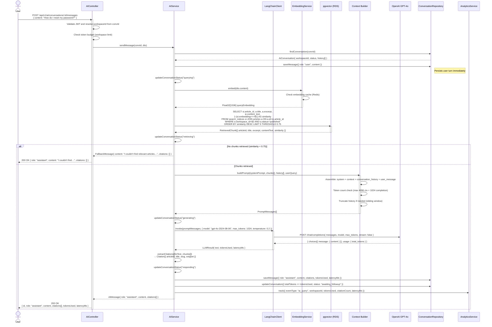
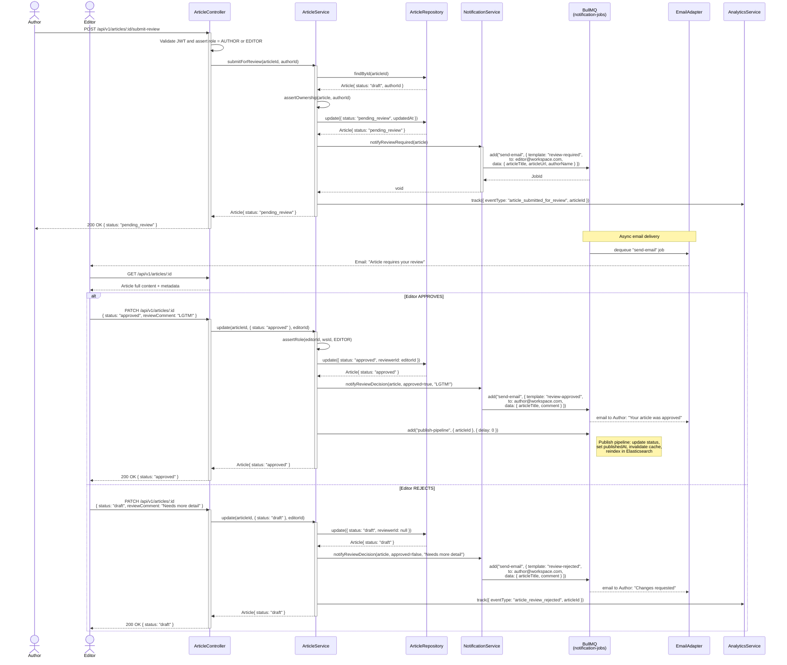

# Sequence Diagrams — Knowledge Base Platform

## 1. Create Article with Auto-Embedding

```mermaid
sequenceDiagram
    actor Author
    participant AC as ArticleController
    participant AS as ArticleService
    participant PG as ArticleRepository<br/>(PostgreSQL)
    participant QP as BullMQ Queue<br/>(embedding-jobs)
    participant EW as EmbeddingWorker
    participant OA as OpenAI API<br/>(text-embedding-3-small)
    participant PV as SearchIndexRepository<br/>(pgvector)
    participant ES as ElasticsearchAdapter<br/>(Amazon OpenSearch)

    Author->>AC: POST /api/v1/articles<br/>{ title, content, collectionId, tags }
    activate AC
    AC->>AC: Validate JWT → extract userId, workspaceId
    AC->>AC: Run class-validator on CreateArticleDto

    AC->>AS: create(dto, authorId)
    activate AS

    AS->>PG: findCollection(collectionId) — verify exists & access
    PG-->>AS: Collection entity

    AS->>PG: save(newArticle{ status: DRAFT })
    PG-->>AS: Article{ id, slug, ... }

    AS->>AS: createSnapshot(article, authorId, "Initial draft")
    AS->>PG: save(ArticleVersion{ versionNumber: 1 })

    AS->>QP: add("embed-article", { articleId, priority: 5 })
    note right of QP: Job enqueued;<br/>worker picks up asynchronously
    QP-->>AS: JobId

    AS-->>AC: Article entity (201)
    deactivate AS

    AC-->>Author: 201 Created<br/>{ id, slug, status: "draft", ... }
    deactivate AC

    %% Async embedding pipeline
    par Async Embedding Pipeline
        QP->>EW: dequeue job { articleId }
        activate EW

        EW->>PG: findArticleById(articleId)
        PG-->>EW: Article{ title, content (TipTap JSON) }

        EW->>EW: extractPlainText(content) → contentText string
        EW->>EW: chunkText(contentText, maxTokens=8191)

        loop For each text chunk
            EW->>OA: POST /embeddings<br/>{ model: "text-embedding-3-small", input: chunk }
            OA-->>EW: { embedding: Float32[1536] }
        end

        EW->>EW: averagePoolChunkEmbeddings() → Float32[1536]

        EW->>PV: upsert SearchIndex{ articleId, contentText, embedding }
        PV-->>EW: SearchIndex saved

        EW->>ES: index("kb-articles", { id, title, excerpt, tags, workspaceId, publishedAt })
        ES-->>EW: { result: "created" }

        EW->>QP: markJobComplete(jobId)
        deactivate EW
    end
```

---

## 2. Semantic Search Query

```mermaid
sequenceDiagram
    actor Reader
    participant SC as SearchController
    participant SS as SearchService
    participant RC as Redis Cache<br/>(ElastiCache)
    participant ES_SVC as EmbeddingService
    participant OA as OpenAI API<br/>(text-embedding-3-small)
    participant PV as pgvector<br/>(RDS PostgreSQL)
    participant ESA as ElasticsearchAdapter<br/>(Amazon OpenSearch)
    participant ANA as AnalyticsService

    Reader->>SC: POST /api/v1/search/semantic<br/>{ q, workspaceId, topK: 10 }
    activate SC

    SC->>SC: Validate JWT / widget API key
    SC->>SS: semanticSearch(dto)
    activate SS

    SS->>SS: cacheKey = sha256(workspaceId + q + topK)
    SS->>RC: GET cache:search:{cacheKey}
    activate RC

    alt Cache HIT (TTL=300s)
        RC-->>SS: Cached SearchResult JSON
        SS-->>SC: SearchResult (from cache)
        SC-->>Reader: 200 OK (X-Cache: HIT)
    else Cache MISS
        RC-->>SS: null
        deactivate RC

        SS->>ES_SVC: embed(q)
        activate ES_SVC
        ES_SVC->>ES_SVC: cacheKey = sha256(q) and check embedding cache
        ES_SVC->>OA: POST /embeddings{ model, input: q }
        OA-->>ES_SVC: { embedding: Float32[1536] }
        ES_SVC-->>SS: Float32[1536] queryEmbedding
        deactivate ES_SVC

        par Execute vector + FTS in parallel
            SS->>PV: SELECT article_id, 1-(embedding<=>$1) AS score<br/>FROM search_indices<br/>WHERE workspace_id=$2<br/>ORDER BY score DESC LIMIT 20
            PV-->>SS: pgvectorHits[{ articleId, score }]
        and
            SS->>ESA: search({ query: { multi_match: { query: q, fields: [title^3, excerpt^2, body] } }, filter: { workspace_id } })
            ESA-->>SS: esHits[{ articleId, score, highlight }]
        end

        SS->>SS: mergeAndRank(pgvectorHits, esHits)<br/>RRF: score = Σ 1/(k+rank_i), k=60

        SS->>PV: fetchArticlesByIds(mergedIds, limit: topK)
        PV-->>SS: Article[] with title, excerpt, slug

        SS->>RC: SETEX cache:search:{cacheKey} 300 <result_json>
        note right of RC: 5-minute TTL; invalidated<br/>on article publish/update

        SS-->>SC: SearchResult{ hits[], total, queryMs }
        deactivate SS

        SC-->>Reader: 200 OK (X-Cache: MISS)<br/>{ hits[], total, pagination }
    end

    SC->>ANA: track({ eventType: "search_query", workspaceId,<br/>sessionId, properties: { q_hash, resultCount } })
    note right of ANA: Fire-and-forget; does not<br/>block response
    deactivate SC
```

---

## 3. AI Q&A with RAG (Retrieval-Augmented Generation)



---

## 4. Article Review and Approval



---

## 5. Widget Context-Aware Suggestion

```mermaid
sequenceDiagram
    participant SDK as Widget SDK<br/>(Browser)
    participant WA as WidgetController
    participant WS as WidgetService
    participant WR as WidgetRepository
    participant SS as SearchService
    participant PG as ArticleRepository
    participant RC as Redis Cache
    participant ANA as AnalyticsService

    SDK->>SDK: User opens widget on<br/>https://app.example.com/settings/billing
    SDK->>WA: GET /api/v1/widgets/:widgetId/suggestions<br/>?url=https%3A%2F%2Fapp.example.com%2Fsettings%2Fbilling<br/>Headers: X-Widget-Key: {apiKey}
    activate WA

    WA->>WA: Validate X-Widget-Key header (rate limit: 100 req/min)
    WA->>WR: findByApiKey(apiKey)
    WR-->>WA: Widget{ id, workspaceId, config, allowedDomains, isActive }

    WA->>WA: validateDomain(widget.allowedDomains, request.origin)

    alt Origin not in allowedDomains
        WA-->>SDK: 403 Forbidden { error: "domain_not_allowed" }
    else Origin allowed
        WA->>WS: getSuggestions(widgetId, url)
        activate WS

        WS->>WS: parseUrlContext(url)<br/>→ { path: "/settings/billing", segments: ["settings","billing"],<br/>   keywords: ["billing", "settings", "payment"] }

        WS->>WS: cacheKey = sha256(widgetId + url)
        WS->>RC: GET widget:suggestions:{cacheKey}
        activate RC

        alt Cache HIT
            RC-->>WS: Cached WidgetSuggestion[]
        else Cache MISS
            RC-->>WS: null
            deactivate RC

            WS->>SS: hybridSearch({ q: "billing settings payment",<br/>workspaceId, limit: 5, type: "hybrid" })
            activate SS
            SS-->>WS: SearchResult{ hits[5] }
            deactivate SS

            WS->>PG: fetchSnippets(articleIds, snippetLength: 200)
            PG-->>WS: Article[{ id, title, slug, excerpt, viewCount }]

            WS->>WS: rankByRelevance(results, urlKeywords)<br/>→ top 3 articles

            WS->>RC: SETEX widget:suggestions:{cacheKey} 120 <json>
            note right of RC: 2-minute TTL;<br/>short to reflect content updates
        end

        WS-->>WA: WidgetSuggestion[3]{ articleId, title, slug, snippet, score }
        deactivate WS

        WA->>ANA: track({ eventType: "widget_suggestion_shown",<br/>widgetId, workspaceId,<br/>properties: { url, suggestionCount: 3 } })
        note right of ANA: fire-and-forget

        WA-->>SDK: 200 OK<br/>{ suggestions: [<br/>  { title, slug, snippet, url },<br/>  { title, slug, snippet, url },<br/>  { title, slug, snippet, url }<br/>] }
        deactivate WA

        SDK->>SDK: Render suggestion cards in widget UI

        opt User clicks a suggestion
            SDK->>WA: POST /api/v1/analytics/events<br/>{ eventType: "widget_suggestion_clicked",<br/>articleId, widgetId, sessionId }
            WA->>ANA: track(event)
            WA-->>SDK: 204 No Content
        end
    end
```

---

## 6. Operational Policy Addendum

### 6.1 Content Governance Policies

- **Review SLA Enforcement**: If an article remains in `pending_review` for more than 5 business days, a BullMQ delayed job fires a second escalation notification to the Workspace Admin. After 14 days, the article is automatically reverted to `draft` with an audit log entry.
- **Concurrent Edit Detection**: `ArticleService.update` uses an optimistic locking check (`version` field on the article entity). If two editors submit concurrent updates, the second receives HTTP 409 Conflict with the current `etag` and must re-fetch before retrying.
- **Approval Audit Trail**: Every state transition (submit → pending_review, approved, rejected) is written to `audit_logs` with `old_values` and `new_values` capturing the status change, reviewer identity, and timestamp.
- **Scheduled Publishing**: `PublishArticleDto.publishedAt` allows scheduling; a BullMQ delayed job executes the publish pipeline at the specified time; cancellation before execution is supported via `DELETE /articles/:id/schedule`.

### 6.2 Reader Data Privacy Policies

- **Widget SDK Consent Gate**: The widget SDK checks `window.kbp_consent` (set by host site's CMP) before calling the suggestions API; absence of consent flag results in the suggestions panel being hidden with a consent prompt shown instead.
- **Session Cookie Lifetime**: `kbp_session` cookie has a 30-minute sliding expiry; after inactivity the session ends and a new session ID is issued, preventing long-term tracking without consent renewal.
- **IP Anonymisation**: Raw IP addresses stored in `analytics_events` and `feedbacks` are auto-anonymised to `/24` prefix via a nightly PostgreSQL function after 30 days.
- **Minor User Protection**: The platform does not knowingly serve AI conversations to users under 13; widget configuration includes a `ageGate: boolean` option that blocks AI chat if enabled.

### 6.3 AI Usage Policies

- **Context Isolation**: Each AI conversation retrieves context only from the workspace it belongs to; cross-workspace vector search is architecturally prevented by the `workspace_id` filter on all pgvector queries.
- **System Prompt Immutability**: The base system prompt injected by `Context Builder` cannot be overridden by user input; client-supplied messages are always appended after the system prompt, never before.
- **Streaming Responses**: For conversations with `config.streaming: true`, `AIService` uses OpenAI streaming API and SSE to push partial tokens to the client; fallback to non-streaming occurs if SSE is unsupported.
- **Conversation Export Restriction**: AI conversation exports are restricted to the originating user and Workspace Admins; Super Admins may access all conversations for compliance investigation with a mandatory audit log entry.

### 6.4 System Availability Policies

- **Embedding Queue Backpressure**: If the `embedding-jobs` BullMQ queue depth exceeds 500, new article saves are still accepted but embedding is deferred; a CloudWatch alarm notifies the ops team at depth > 200.
- **Elasticsearch Circuit Breaker**: `ElasticsearchAdapter` wraps calls in a circuit breaker (5 failures / 30 s window); on circuit open, search falls back to PostgreSQL full-text search and logs `search_fallback` event.
- **Widget Rate Limiting**: Each `api_key` is limited to 100 requests/minute enforced by Redis sliding window counter; throttled requests receive `429 Too Many Requests` with `Retry-After: 60` header.
- **Content Delivery Availability**: Article attachments and images are served via CloudFront with an origin failover configuration (primary: S3, fallback: S3 cross-region replica) achieving 99.99% CDN availability SLA.
