# State Machine Diagrams — Knowledge Base Platform

## 1. Article State Machine

```mermaid
stateDiagram-v2
    [*] --> DRAFT : Author creates article

    DRAFT --> PENDING_REVIEW : submitForReview()\n[guard: content not empty AND title set]\n/action: notify assigned editors

    PENDING_REVIEW --> DRAFT : rejectReview(comment)\n[guard: actor is Editor or Workspace Admin]\n/action: notify author with comment;\nappend audit log entry

    PENDING_REVIEW --> APPROVED : approveReview()\n[guard: actor is Editor or Workspace Admin]\n/action: notify author;\nenqueue publish-pipeline job

    APPROVED --> PUBLISHED : publishArticle(publishedAt?)\n[guard: actor is Editor or Workspace Admin]\n/action: set published_at;\ninvalidate search cache;\nreindex in Elasticsearch;\ntrack analytics event article_published

    APPROVED --> DRAFT : revokeApproval()\n[guard: actor is Workspace Admin]\n/action: clear reviewer_id;\nlog revert in audit_logs

    PUBLISHED --> UNPUBLISHED : unpublishArticle()\n[guard: actor is Editor or Workspace Admin]\n/action: clear published_at;\nremove from search index;\ntrack article_unpublished event

    UNPUBLISHED --> PUBLISHED : republish()\n[guard: actor is Editor or Workspace Admin]\n/action: set new published_at;\nreindex;\ntrack article_republished

    UNPUBLISHED --> DRAFT : revertToDraft()\n[guard: actor is Author or above]\n/action: clear reviewer_id; log in audit_logs

    PUBLISHED --> ARCHIVED : archiveArticle()\n[guard: actor is Workspace Admin]\n/action: set archived_at;\nremove from search;\ntrack article_archived

    UNPUBLISHED --> ARCHIVED : archiveArticle()\n[guard: actor is Workspace Admin]\n/action: set archived_at; log event

    DRAFT --> ARCHIVED : archiveArticle()\n[guard: actor is Workspace Admin AND no edits in 180 days]\n/action: set archived_at; send stale-content digest

    ARCHIVED --> DRAFT : restoreFromArchive()\n[guard: actor is Workspace Admin]\n/action: clear archived_at;\nlog restore event

    ARCHIVED --> [*] : permanentDelete()\n[guard: actor is Super Admin AND no linked feedback]\n/action: cascade delete versions;\nremove embeddings;\nlog deletion

    note right of DRAFT
        Entry actions:
        - Auto-save every 30 s via frontend autosave
        - Draft expires warning at 180 days inactivity
    end note

    note right of PENDING_REVIEW
        SLA: 5 business days
        On timeout: re-notify editor
        On 14-day timeout: auto-revert to DRAFT
    end note

    note right of PUBLISHED
        On update: create new ArticleVersion;
        re-enqueue embedding job;
        invalidate Redis cache keys
    end note
```

### Article State Descriptions

| State | Description | Allowed Actions |
|-------|-------------|-----------------|
| `DRAFT` | Work in progress; only author and editors can view | Edit, Submit for Review, Archive |
| `PENDING_REVIEW` | Awaiting editorial decision; read-only for author | Approve, Reject (Editor+) |
| `APPROVED` | Editorially cleared; scheduled or instant publish | Publish, Revoke Approval |
| `PUBLISHED` | Visible to Readers; indexed for search and AI | Unpublish, Archive, Edit (creates new version) |
| `UNPUBLISHED` | Hidden from Readers; preserved for re-publication | Republish, Revert to Draft, Archive |
| `ARCHIVED` | Long-term storage; excluded from all discovery | Restore, Permanent Delete (Super Admin) |

---

## 2. AI Conversation State Machine

```mermaid
stateDiagram-v2
    [*] --> IDLE : createConversation()\n/action: initialise session;\nset ttl=30min

    IDLE --> QUERYING : sendMessage(userContent)\n[guard: content non-empty AND token budget available]\n/action: persist user message;\nstart latency timer

    QUERYING --> RETRIEVING : embedQuery()\n/action: call EmbeddingService;\nstart vector search

    RETRIEVING --> GENERATING : contextRetrieved(chunks)\n[guard: chunks.length >= 1 OR fallback enabled]\n/action: build prompt with context;\ncall LangChain/GPT-4o

    RETRIEVING --> RESPONDING : noContextFound()\n[guard: fallback message configured]\n/action: use fallback template;\nskip LLM call;\ntrack ai_no_context event

    GENERATING --> RESPONDING : llmResponseReceived(text, tokens)\n/action: extract citations;\npersist assistant message;\nupdate token count

    GENERATING --> ERROR : llmError(err)\n[guard: retry count < 3]\n/action: increment retry counter;\nwait exponential back-off;\nretransition to GENERATING

    GENERATING --> ERROR : llmError(err)\n[guard: retry count >= 3]\n/action: persist error message;\ntrack ai_error event;\nnotify ops via PagerDuty

    ERROR --> IDLE : resetConversation()\n/action: clear error state;\nallow new message

    RESPONDING --> AWAITING_FOLLOWUP : responseDelivered()\n/action: reset latency timer;\nstart idle timeout=10min

    AWAITING_FOLLOWUP --> QUERYING : sendMessage()\n[guard: session not timed out]\n/action: append to history

    AWAITING_FOLLOWUP --> ENDED : idleTimeout()\n[guard: no message in 10 min]\n/action: set status=ended;\npersist final token count;\ntrack conversation_ended

    AWAITING_FOLLOWUP --> ENDED : endConversation()\n[guard: explicit close by user]\n/action: set status=ended;\nfinalise analytics

    IDLE --> ENDED : widgetClosed()\n/action: mark ended without messages

    ENDED --> [*] : Conversation archived after 90 days

    note right of QUERYING
        Budget check:
        workspace token_limit_per_hour
        If exceeded → 429 response
        conversation stays IDLE
    end note

    note right of GENERATING
        Streaming mode: tokens pushed
        via SSE to client while state
        remains GENERATING
    end note

    note right of ERROR
        Error state exposed to caller
        as HTTP 503 with retry-after
        header; non-retriable errors
        (content policy) skip retries
    end note
```

### AI Conversation State Descriptions

| State | Description | Timeout |
|-------|-------------|---------|
| `IDLE` | Conversation opened; awaiting first message | 30 min (then ENDED) |
| `QUERYING` | User message received; embedding in progress | 5 s (then ERROR) |
| `RETRIEVING` | Vector search executing against pgvector | 3 s (then ERROR) |
| `GENERATING` | LLM generating response; streaming if enabled | 30 s (then ERROR after 3 retries) |
| `RESPONDING` | Response being serialised and delivered | n/a |
| `AWAITING_FOLLOWUP` | Response delivered; waiting for next user turn | 10 min idle (then ENDED) |
| `ENDED` | Conversation closed; immutable read-only | — |
| `ERROR` | Transient failure; may recover via retry | 5 s back-off between retries |

---

## 3. User Account State Machine

```mermaid
stateDiagram-v2
    [*] --> INVITED : inviteMember(email, roleId)\n/action: create user stub;\nsend invite email with signed token (TTL=72h);\nlog invite in audit_logs

    INVITED --> PENDING_VERIFICATION : acceptInvite(token)\n[guard: token valid AND not expired]\n/action: set password_hash;\nmark email_verified=false;\nsend verification email

    INVITED --> [*] : inviteExpired()\n[guard: token TTL > 72h]\n/action: delete user stub;\nlog expiry

    INVITED --> INVITED : resendInvite()\n[guard: actor is Workspace Admin]\n/action: rotate invite token;\nresend email

    PENDING_VERIFICATION --> ACTIVE : verifyEmail(token)\n[guard: token valid AND TTL<24h]\n/action: email_verified=true;\nset last_login_at;\ntrack user_activated event

    PENDING_VERIFICATION --> PENDING_VERIFICATION : resendVerification()\n[guard: actor is self]\n/action: rotate verification token;\nresend email

    ACTIVE --> SUSPENDED : suspendUser(reason)\n[guard: actor is Workspace Admin or Super Admin]\n/action: is_active=false;\ninvalidate all JWT refresh tokens;\nlog suspension in audit_logs;\nnotify user via email

    SUSPENDED --> ACTIVE : reinstateUser()\n[guard: actor is Workspace Admin or Super Admin]\n/action: is_active=true;\nlog reinstatement;\nnotify user via email

    ACTIVE --> DEACTIVATED : deactivateUser()\n[guard: actor is self OR Super Admin]\n/action: is_active=false;\nanonymise PII fields;\nnullify FK references;\nenqueue data-erasure job;\nlog in audit_logs

    SUSPENDED --> DEACTIVATED : deactivateUser()\n[guard: actor is Super Admin]\n/action: same as ACTIVE→DEACTIVATED

    DEACTIVATED --> [*] : Account permanently closed

    note right of ACTIVE
        SSO users: password_hash=null;
        sso_provider + sso_subject used
        for authentication.
        MFA enforced on Enterprise plan.
    end note

    note right of SUSPENDED
        Suspended users cannot log in;
        refresh token rotation blocked;
        existing access tokens expire
        within 15 min (JWT TTL)
    end note
```

### User Account State Descriptions

| State | Description | Key Side Effects |
|-------|-------------|-----------------|
| `INVITED` | Email sent; account stub created | Invite token stored (hashed) in Redis with 72h TTL |
| `PENDING_VERIFICATION` | Password set; email not yet confirmed | Can log in but features restricted until verified |
| `ACTIVE` | Full platform access | JWT issued on login; refresh tokens stored in Redis |
| `SUSPENDED` | Access blocked by admin | All active tokens invalidated; user notified by email |
| `DEACTIVATED` | Permanent closure; PII erased | Data export job runs before erasure; 30-day grace period |

---

## 4. Integration Sync State Machine

```mermaid
stateDiagram-v2
    [*] --> DISCONNECTED : createIntegration(provider)\n/action: persist integration record;\nstatus=disconnected

    DISCONNECTED --> CONNECTING : connect(credentials)\n[guard: credentials schema valid]\n/action: encrypt credentials;\nstore in integration_configs;\nenqueue "test-connection" job

    CONNECTING --> CONNECTED : connectionTestPassed()\n/action: status=connected;\nsynced_at=now;\nnotify admin via email;\ntrack integration_connected event

    CONNECTING --> DISCONNECTED : connectionTestFailed(error)\n/action: status=disconnected;\nstore last_error;\nnotify admin;\ntrack integration_failed event

    CONNECTED --> SYNCING : triggerSync()\n[guard: no sync already in progress]\n/action: enqueue "sync-content" BullMQ job;\nsync_status=syncing;\ntrack sync_started event

    SYNCING --> CONNECTED : syncCompleted(stats)\n/action: synced_at=now;\nsync_status=completed;\nlog stats;\ntrack sync_completed event

    SYNCING --> SYNC_FAILED : syncError(error)\n/action: sync_status=sync_failed;\nlast_error=error;\nnotify admin;\ntrack sync_failed event

    SYNC_FAILED --> SYNCING : retrySync()\n[guard: retry_count < 5]\n/action: increment retry_count;\nenqueue retry job with back-off

    SYNC_FAILED --> RECONNECTING : credentialsExpired()\n/action: status=reconnecting;\nprompt admin to re-authenticate

    RECONNECTING --> CONNECTED : reconnect(newCredentials)\n[guard: credentials valid]\n/action: update encrypted credentials;\nreset retry_count;\ntrigger fresh sync

    RECONNECTING --> DISCONNECTED : cancelReconnect()\n[guard: actor is Workspace Admin]\n/action: clear credentials;\nstatus=disconnected

    CONNECTED --> DISCONNECTED : disconnect()\n[guard: actor is Workspace Admin]\n/action: delete encrypted credentials;\nstatus=disconnected;\ntrack integration_disconnected

    note right of SYNCING
        Sync job types:
        - Zendesk: pull ticket articles
        - Confluence: import pages
        - Notion: import databases
        Progress reported via SSE
        /integrations/:id/sync-status
    end note

    note right of SYNC_FAILED
        After 5 failed retries:
        status → DISCONNECTED;
        PagerDuty alert if Enterprise plan
    end note
```

---

## 5. Widget Session State Machine

```mermaid
stateDiagram-v2
    [*] --> LOADING : widgetScriptLoaded()\n/action: initialise SDK;\nresolve widgetId from script tag;\nvalidate allowed domain

    LOADING --> IDLE : configLoaded(widgetConfig)\n[guard: domain allowed AND widget active]\n/action: render widget button;\nstart session timer;\ngenerate sessionId

    LOADING --> [*] : loadFailed()\n[guard: domain not allowed OR widget inactive]\n/action: log error to console;\ndo not render

    IDLE --> SEARCHING : userOpenedWidget()\n/action: parse current page URL;\ncall GET /widgets/:id/suggestions?url=;\nshow suggestion cards

    IDLE --> CHATTING : userClickedChat()\n/action: call POST /ai/conversations;\nshow chat interface

    SEARCHING --> IDLE : userClosedWidget()\n/action: clear suggestion state;\ntrack widget_closed event

    SEARCHING --> CHATTING : userClickedAskAI()\n/action: transition to chat mode;\ncreate AI conversation

    SEARCHING --> DEFLECTED : userClickedSuggestion(articleId)\n/action: open article in new tab or overlay;\ntrack widget_deflected event (viewed article without ticket)

    DEFLECTED --> IDLE : userReturnedToWidget()\n/action: show "Did this help?" prompt

    DEFLECTED --> CLOSED : userMarkedHelpful()\n/action: track deflection_success;\nclose widget

    DEFLECTED --> ESCALATED : userMarkedNotHelpful()\n/action: show escalation options (email, live chat);\ntrack deflection_failed

    CHATTING --> SEARCHING : userClickedBack()\n/action: end AI conversation;\nreturn to suggestion view

    CHATTING --> ESCALATED : aiResponseContainsEscalationHint()\n[guard: response confidence < threshold OR explicit escalation trigger]\n/action: show "Connect with Support" CTA;\ntrack escalation_suggested

    CHATTING --> CLOSED : userClosedChat()\n/action: end AI conversation;\ntrack session_ended

    ESCALATED --> CLOSED : userSubmittedTicket()\n/action: POST to configured CRM integration;\ntrack ticket_created;\nclose widget

    ESCALATED --> CHATTING : userContinuedChat()\n/action: dismiss escalation banner;\nresume chat

    ESCALATED --> CLOSED : userDismissedEscalation()\n/action: track escalation_dismissed;\nclose widget

    CLOSED --> [*] : Widget session ended

    note right of DEFLECTED
        Deflection = user found answer
        in KB without opening a ticket.
        Key metric for ROI reporting.
    end note

    note right of ESCALATED
        Escalation targets (configured
        per widget):
        - Email form
        - Zendesk ticket
        - LiveChat handoff
        - Custom webhook
    end note
```



### Widget Session State Descriptions

| State | Description | Duration |
|-------|-------------|----------|
| `LOADING` | SDK initialising; validating domain and widget config | < 500 ms |
| `IDLE` | Widget minimised; user has not interacted | Until interaction or 30-min page unload |
| `SEARCHING` | Suggestion cards visible; user browsing articles | Unbounded |
| `CHATTING` | AI conversation active; user exchanging messages | Session TTL = AI conversation TTL |
| `DEFLECTED` | User viewed a suggested article | Max 5 min before prompt |
| `ESCALATED` | AI could not resolve; human support offered | Until ticket submitted or dismissed |
| `CLOSED` | Widget session complete | Terminal |

---

## 6. Operational Policy Addendum

### 6.1 Content Governance Policies

- **Auto-Archive Trigger**: A scheduled cron job (daily at 03:00 UTC) scans `articles` WHERE `status = 'draft' AND updated_at < NOW() - INTERVAL '180 days'`; matching articles transition to `ARCHIVED` with a system-generated audit log entry and an email to the original author.
- **Stale Published Content**: Articles in `PUBLISHED` state with `published_at < NOW() - INTERVAL '365 days'` AND `updated_at < NOW() - INTERVAL '180 days'` are flagged with a `needs_review` boolean; this flag surfaces in the workspace dashboard "Content Health" panel.
- **State Transition Logging**: Every article state transition writes to `audit_logs` with `action = "article_status_changed"`, capturing `old_values.status`, `new_values.status`, and the acting user's `id` and `ip_address`.
- **Scheduled Publish Guard**: If a scheduled publish job fires and the article is no longer in `APPROVED` state (e.g., manually reverted), the job exits without error and logs `publish_skipped` to `audit_logs`.

### 6.2 Reader Data Privacy Policies

- **Widget Session Purge**: Widget sessions in `CLOSED` state with no associated AI conversation are purged from Redis after 24 hours; sessions with AI conversations follow the 90-day conversation retention policy.
- **Anonymous Sessions**: Sessions without an authenticated `user_id` must not have their `sessionId` stored in `analytics_events.properties` in plaintext; only a one-way hash (SHA-256 + workspace salt) is stored.
- **Escalation Data Minimisation**: When a widget escalation creates a Zendesk ticket, only the conversation summary and last 3 AI messages are included; raw full conversation history is not transmitted to the integration.
- **Cookie Expiry Enforcement**: The `kbp_session` cookie `max-age` is enforced server-side; the API returns `401` for requests bearing an expired session token and clears the cookie via `Set-Cookie: kbp_session=; Max-Age=0`.

### 6.3 AI Usage Policies

- **Confidence Threshold for Escalation**: `AIService` computes a confidence score based on the maximum cosine similarity of retrieved chunks; if `max_similarity < 0.65`, the response includes an `escalation_hint: true` flag that triggers the `CHATTING → ESCALATED` widget transition.
- **Prohibited Topics Override**: Workspace admins can define a custom blocklist of regex patterns in `workspace.settings.ai.blockedPatterns`; queries matching any pattern are refused with a configured decline message before reaching GPT-4o.
- **Conversation Pruning**: The daily maintenance job purges `ai_messages` and `ai_conversations` older than the workspace's retention setting; pruning is logged in `audit_logs` with `action = "ai_conversation_purged"` and a count of deleted records.
- **AI Feature Toggle**: Each workspace can disable AI features entirely via `workspace.settings.ai.enabled = false`; this blocks all endpoints under `/ai/*` for that workspace and hides AI UI elements in the frontend.

### 6.4 System Availability Policies

- **State Persistence on Crash**: Article and user account state is the authoritative source of truth in PostgreSQL; in-memory NestJS state (e.g., active conversation status) is re-hydrated from the database on ECS task restart.
- **BullMQ Job Deduplication**: Embedding jobs are deduplicated by `articleId` using BullMQ's `jobId` feature; submitting the same article twice before the first job completes replaces the earlier job, preventing duplicate embeddings.
- **Integration Sync Isolation**: Sync jobs run in a dedicated ECS Fargate task group separate from the API server; a stuck sync job cannot consume resources from the API worker pool. Sync tasks have a maximum runtime of 30 minutes before forced termination.
- **Partition Creation Automation**: `pg_partman` creates new `analytics_events_YYYY_MM` partitions 2 months in advance; a CloudWatch alarm fires if the next month's partition is missing on the 25th of the current month.
