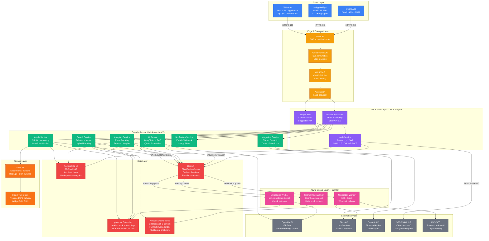
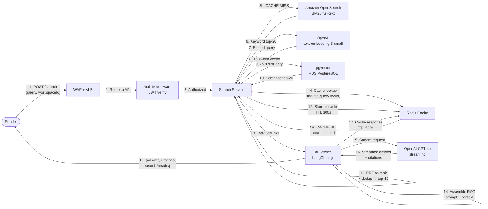

# Architecture Diagram — Knowledge Base Platform

## 1. Executive Summary

The **Knowledge Base Platform** is a cloud-native, multi-tenant SaaS product designed to help
organizations create, organize, and intelligently surface institutional knowledge to both internal
teams and external customers. The platform provides rich-text article authoring via **TipTap**,
hybrid full-text and semantic search via **Amazon OpenSearch + pgvector**, and AI-powered Q&A via
**OpenAI GPT-4o** orchestrated through **LangChain.js** using Retrieval-Augmented Generation (RAG).

The backend is a **NestJS modular monolith** running on **Node.js 20**, deployed on **AWS ECS
Fargate**. The frontend is a **Next.js 14** application using the App Router for per-route
rendering: SSG for public knowledge bases, SSR for personalized dashboards, and CSR for the
authoring studio. An embeddable **JavaScript Widget SDK** (< 12 KB gzipped) enables knowledge
surfacing inside third-party products without requiring host applications to integrate a full SDK.

All infrastructure runs on AWS: **RDS PostgreSQL 15** (Multi-AZ) for relational data and pgvector
embeddings, **ElastiCache Redis 7** for caching and job queues, **Amazon OpenSearch Service** for
full-text indexing, **S3 + CloudFront** for binary assets and edge delivery, and **WAF + Route 53**
for edge security and DNS. Asynchronous workloads — embedding generation, search indexing, and
notification delivery — are processed by **BullMQ** workers backed by Redis.

Five roles govern platform access: **Super Admin** (platform-wide), **Workspace Admin**
(tenant-level), **Editor** (content approval), **Author** (content creation), and **Reader**
(content consumption). Every content mutation emits a domain event consumed by async workers,
ensuring decoupled, auditable processing pipelines.

---

## 2. Architecture Principles

| # | Principle | Application to This System |
|---|-----------|---------------------------|
| 1 | **12-Factor App** | Config via environment variables; stateless Fargate containers; disposable workers; dev/prod parity through Docker Compose and ECS task definitions. |
| 2 | **Domain-Driven Design** | Business logic organized into six bounded contexts: Content, Search, AI, Identity, Analytics, Integration. Each NestJS module owns its entities, services, and repositories. |
| 3 | **Event-Driven Architecture** | State changes emit domain events (`article.published`, `user.joined`) written to a PostgreSQL outbox and reliably delivered to BullMQ workers. No direct synchronous coupling between domains. |
| 4 | **API-First Design** | OpenAPI 3.1 contract defined before any UI implementation. All capabilities accessible via versioned REST (`/api/v1/`) or GraphQL. Widget SDK is a thin consumer of the Widget BFF API. |
| 5 | **Defense in Depth** | WAF OWASP rules → ALB rate limiting → JWT authentication → RBAC authorization → row-level workspace isolation. No single layer is the sole security boundary. |
| 6 | **Observability by Default** | Structured JSON logs (Pino), distributed traces (OpenTelemetry → AWS X-Ray), custom CloudWatch metrics, Bull Board for queue monitoring. |
| 7 | **Zero-Trust Networking** | All services communicate over private VPC subnets. Inter-service calls require JWT validation. RDS and ElastiCache are unreachable from the public internet. |
| 8 | **Graceful Degradation** | AI features circuit-break to standard keyword search on OpenAI timeout. Redis failure falls back to direct DB reads. OpenSearch failure falls back to PostgreSQL `tsvector`. |
| 9 | **Horizontal Scalability** | Stateless API containers auto-scale behind ALB on CPU/memory thresholds. BullMQ workers scale independently per queue depth via ECS Service auto-scaling. |
| 10 | **Least-Privilege IAM** | Each ECS task role is scoped to only the S3 bucket prefixes, RDS Proxy endpoints, and SSM Parameter Store paths it specifically requires. No wildcard ARNs in production. |

---

## 3. High-Level Architecture Diagram

---

## 4. Component Interaction: Article Search with AI (Request Flow)

The following diagram traces a Reader's AI-enhanced search request from the browser through all
platform components, illustrating both the synchronous request path and the lazy-evaluation caching
strategy used to avoid redundant OpenAI API calls.

---

## 5. Architecture Decision Records

| ADR | Title | Status | Decision | Rationale |
|-----|-------|--------|----------|-----------|
| ADR-001 | Backend Framework | Accepted | **NestJS** over Express.js | NestJS provides built-in dependency injection, modular architecture, OpenAPI decorator support, and TypeScript-first design. A bare Express server would require substantial bespoke scaffolding to reach equivalent structure and consistency. |
| ADR-002 | Vector Store | Accepted | **pgvector on RDS** over Pinecone | Co-locating vectors with relational data eliminates cross-service joins, simplifies transactional writes, and avoids third-party data egress. Performant up to ~10M embeddings on `db.r6g.xlarge`. Pinecone adds cost and a network hop per query. |
| ADR-003 | Job Queue | Accepted | **BullMQ** over AWS SQS | BullMQ provides priority queues, delayed/repeatable jobs, per-job retry with backoff, and Bull Board UI — all on existing Redis infrastructure. SQS adds a managed-service cost and provides less expressive job semantics. |
| ADR-004 | Rich Text Editor | Accepted | **TipTap** over raw ProseMirror | TipTap wraps ProseMirror with a React-friendly API, a maintained extension ecosystem (tables, mentions, code blocks, math), and headless Tailwind-compatible rendering. Raw ProseMirror requires significantly more integration work. |
| ADR-005 | Search Backend | Accepted | **Amazon OpenSearch** over Algolia | OpenSearch runs inside the VPC keeping article content private. Algolia exfiltrates content to a third party. OpenSearch supports custom ICU analyzers for multilingual workspaces and carries no per-operation search pricing at scale. |
| ADR-006 | AI Orchestration | Accepted | **LangChain.js** over raw OpenAI SDK | LangChain provides retrieval chains, streaming, memory management, and prompt templates out of the box. Reduces prompt-injection risk. Vercel AI SDK was evaluated but lacked mature RAG pipeline abstractions at the time of selection. |
| ADR-007 | Auth Strategy | Accepted | **JWT + Refresh Token Rotation** over server sessions | Short-lived access JWTs (15 min) enable stateless horizontal scaling. Refresh token rotation with Redis revocation list prevents replay attacks without full statefulness. httpOnly SameSite=Strict cookies mitigate XSS token theft. |
| ADR-008 | Frontend Rendering | Accepted | **Next.js App Router** (RSC + hybrid rendering) | Public knowledge bases require SEO-optimized server-rendered HTML. The App Router enables per-route strategies: SSG for public articles, ISR for semi-static pages, SSR for personalized dashboards, CSR for the authoring studio. |

---

## 6. Operational Policy Addendum

### 6.1 Content Governance Policies

The platform enforces a structured content lifecycle to ensure all published knowledge is accurate,
reviewed, and fully auditable.

- **Approval Workflow**: Articles created by `Author`-role users require review and approval from an
  `Editor` or `Workspace Admin` before transitioning from `IN_REVIEW` to `PUBLISHED`. Editors and
  Workspace Admins may self-publish. Super Admins can override the workflow for any workspace in an
  emergency via a documented admin action logged to the audit trail.
- **Version Retention**: Every save event creates an immutable `ArticleVersion` record in
  PostgreSQL. Each workspace retains a minimum of 50 versions per article. Versions older than 24
  months are archived to S3 Glacier Deep Archive but remain accessible via the version history API.
- **Content Expiry**: Workspace Admins may configure an expiry date on any article. On expiry, the
  article automatically transitions to `REVIEW_REQUIRED` and a notification is dispatched to the
  author and all workspace Editors within 15 minutes via the Notification Worker.
- **Deletion and Purge**: Delete operations are soft-deletes (`deletedAt` timestamp). Records are
  physically purged from PostgreSQL after 90 days, unless a legal hold is active. Linked S3
  attachments are purged via a matching lifecycle rule triggered by a PostgreSQL cleanup job.
- **Prohibited Content**: Articles may not contain executable scripts or malware payloads. S3
  attachments are scanned by Amazon Macie on upload; flagged files are quarantined and the uploading
  user notified with a remediation instruction.

### 6.2 Reader Data Privacy Policies

- **Consent Framework**: Analytics collection is governed by workspace-level consent settings. In
  GDPR-regulated jurisdictions all analytics are disabled until explicit consent is obtained via the
  platform consent banner rendered by the Widget SDK or the Web App.
- **IP Anonymization**: Analytics events store anonymized IP addresses by default (last octet zeroed
  for IPv4; last 80 bits zeroed for IPv6). Full IP retention requires Workspace Admin opt-in and is
  subject to a Data Processing Agreement review cycle.
- **Data Subject Rights**: Readers may submit erasure requests via the workspace privacy portal.
  Deletion is processed within 30 days, covering PostgreSQL user records, Elasticsearch analytics
  documents, Redis session data, and S3 export files. Redis TTL-based cache expiry handles transient
  data automatically.
- **Data Residency**: All workspace data is stored in the AWS region selected at workspace creation.
  Cross-region replication is disabled by default and requires explicit Workspace Admin activation
  with acknowledgment of cross-border data transfer implications.
- **Third-Party Isolation**: Reader PII (email, name, IP) is never transmitted to external
  integrations (Slack, Zendesk, Salesforce) without explicit Workspace Admin configuration. All
  integration payloads are logged with a 2-year retention period for compliance auditing.

### 6.3 AI Usage Policies

- **Prompt Content Boundaries**: Only article text chunks (up to 8,192 tokens per context window)
  and anonymized query strings are transmitted to the OpenAI API. No user identifiers, workspace
  metadata, or internal system details are included in prompts under any circumstances.
- **RAG-Only Responses**: GPT-4o is instructed via system prompt to answer exclusively from
  retrieved context and to cite source article IDs. Queries for which no relevant context is
  retrieved return a deterministic "insufficient information" fallback — not a hallucinated answer.
- **Moderation Pipeline**: All LLM responses are evaluated by the OpenAI Moderation API before
  delivery. Flagged responses are blocked and replaced with a safe fallback message. All moderation
  events are logged to PostgreSQL for Workspace Admin review.
- **AI Feature Opt-Out**: Workspace Admins may independently disable AI Q&A, AI summarization, and
  AI-powered ranking per workspace. Users may opt out of query logging used for AI personalization
  via their profile settings without losing access to core search features.
- **Model Governance**: Changes to the OpenAI model version require an engineering review, a
  regression run against the RAG evaluation suite (target ≥ 85% relevance score), and a staged
  rollout (10% → 50% → 100%) with automated rollback triggered on error-rate thresholds exceeding
  2% above the prior model baseline.

### 6.4 System Availability Policies

- **SLA Commitment**: The platform targets **99.9% monthly uptime** for the API and Web App tiers.
  The Widget SDK, served via CloudFront, targets 99.99%. Uptime is measured by Route 53 health
  checks at 60-second intervals from three geographic probe locations.
- **Maintenance Windows**: Planned maintenance is capped at 30 minutes per event, announced to
  Workspace Admins via email and in-app banner at least 72 hours in advance. Emergency patches may
  bypass this window with post-hoc communication dispatched within 2 hours of patch deployment.
- **Disaster Recovery Targets**: RTO ≤ 4 hours; RPO ≤ 1 hour. RDS automated backups run hourly.
  Daily snapshots replicate to a secondary AWS region. ElastiCache snapshots run every 6 hours.
  Amazon OpenSearch automated snapshots run daily to a dedicated S3 backup bucket.
- **Incident Response**: P1 (full outage) triggers PagerDuty with a 5-minute acknowledgement SLA
  and a 30-minute resolution target. P2 (degraded service) has a 15-minute acknowledgement SLA.
  Blameless post-mortems are published internally within 5 business days and shared with affected
  Workspace Admins on request.
- **Capacity Management**: ECS Fargate auto-scales at 70% CPU or memory. BullMQ worker concurrency
  is capped at 10 concurrent jobs per worker to respect OpenAI's 10,000 RPM embedding rate limit.
  Redis memory alerts trigger at 75% of cluster capacity, prompting engineering review of the
  eviction policy and potential cluster expansion.
