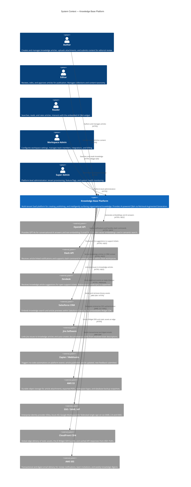

# C4 Context & Container Diagrams — Knowledge Base Platform

## Overview

This document presents the **Level 1 (System Context)** and **Level 2 (Container)** architectural
views of the Knowledge Base Platform using the C4 model. The context diagram establishes the
system's external boundaries, actors, and integration points. The container diagram decomposes the
platform into its independently deployable units, their technologies, responsibilities, and
inter-container communication patterns.

---

## Level 1: System Context Diagram

The context diagram positions the Knowledge Base Platform as a single system and shows all human
actors who interact with it, plus all external systems it depends upon or integrates with.

---

## Level 2: Container Diagram

The container diagram decomposes the Knowledge Base Platform into its independently deployable
containers, detailing technology choices, core responsibilities, and communication protocols.

```mermaid
C4Container
    title Container Diagram — Knowledge Base Platform

    Person(user, "Platform Users", "Authors, Editors, Readers, and Admins interacting via the web application or embedded widget.")

    System_Boundary(kbp, "Knowledge Base Platform") {
        Container(webapp, "Web Application", "Next.js 14 / React 18 / Tailwind CSS", "Server-rendered knowledge portal and TipTap-powered authoring studio. SSG for public docs, SSR for dashboards, CSR for the editor. Deployed on ECS Fargate behind CloudFront.")

        Container(api, "API Server", "NestJS / Node.js 20 / TypeORM", "Core business logic and REST + GraphQL API (OpenAPI 3.1). Hosts all domain modules: Article, Search, AI, Analytics, Integration, and Notification. Deployed on ECS Fargate behind ALB.")

        Container(authsvc, "Auth Service", "NestJS / Passport.js / jsonwebtoken", "Issues and validates JWTs with 15-min expiry. Manages refresh token rotation with Redis revocation. Implements SAML 2.0 SP and OAuth2 PKCE. Enforces RBAC on every request.")

        Container(searchsvc, "Search Service", "NestJS Module / OpenSearch Client", "Hybrid search: BM25 full-text via OpenSearch, kNN vector search via pgvector, Reciprocal Rank Fusion re-ranking, and Redis result caching with 5-minute TTL.")

        Container(aisvc, "AI Service", "NestJS / LangChain.js / OpenAI SDK", "RAG pipeline orchestration, AI Q&A, article summarization, and related-article recommendations. Streams GPT-4o responses via SSE. Passes all LLM output through the Moderation API.")

        Container(widgetapi, "Widget BFF", "NestJS / Express", "Back-end-for-frontend serving the embeddable JS Widget SDK. Provides context-aware article suggestions and AI Q&A without requiring full browser-level user authentication.")

        Container(workers, "Background Workers", "BullMQ / Node.js 20", "Three dedicated worker processes: Embedding Worker (batches chunks through text-embedding-3-small), Search Index Worker (upserts documents to OpenSearch), Notification Worker (SES email, Slack, outbound webhooks).")

        Container(widgetsdk, "Widget JS SDK", "Vanilla JS / Shadow DOM / CDN", "Embeddable script under 12 KB gzipped. Loaded via a single script tag. Renders search and AI Q&A UI as an isolated shadow DOM in the host page. Communicates exclusively with the Widget BFF.")
    }

    ContainerDb(postgres, "PostgreSQL 15", "AWS RDS Multi-AZ — db.r6g.xlarge", "Primary relational store: workspaces, articles, article_versions, users, workspace_members, collections, tags, attachments, feedback, analytics_events, ai_conversations, and the domain_events outbox table.")

    ContainerDb(pgvec, "pgvector", "PostgreSQL 15 Extension (pgvector 0.7)", "Stores 1536-dim float32 article chunk embeddings for kNN cosine similarity search. Co-located with PostgreSQL — same RDS instance, same transaction boundary, no extra network hop.")

    ContainerDb(redis, "Redis 7", "AWS ElastiCache Cluster Mode — cache.r6g.large", "Search result cache (TTL 300 s), AI response cache (TTL 600 s), user session store, BullMQ job queues (3 named queues), per-user and per-workspace rate-limit token buckets.")

    ContainerDb(opensearch, "Elasticsearch 8", "Amazon OpenSearch Service — r6g.large.search x3", "Full-text inverted index with BM25 scoring. ICU multilingual analysis plugin. Stores per-workspace article documents: title, body, excerpt, tags, status, and updatedAt timestamps.")

    ContainerDb(s3store, "AWS S3", "S3 Standard + S3 Glacier Deep Archive", "Article attachments, exported PDFs, workspace logos, RDS automated backup snapshots, and OpenSearch manual snapshots. Lifecycle policy: Standard to Glacier after 90 days.")

    System_Ext(openai, "OpenAI API", "text-embedding-3-small + GPT-4o + Moderation API")
    System_Ext(sso, "SSO / SAML IdP", "Okta / Azure AD / Google Workspace")
    System_Ext(ses, "AWS SES", "Transactional and digest email delivery")
    System_Ext(cdn, "CloudFront CDN", "Edge delivery for static assets and Widget SDK")
    System_Ext(slack, "Slack API", "Team notifications and slash commands")

    Rel(user, webapp, "Reads, authors, and manages content", "HTTPS 443")
    Rel(user, widgetsdk, "Uses embedded search and AI Q&A", "HTTPS 443")

    Rel(webapp, api, "REST and GraphQL API calls", "HTTPS 443")
    Rel(widgetsdk, widgetapi, "Widget API requests", "HTTPS 443")

    Rel(widgetapi, searchsvc, "Delegate search queries", "Internal TCP")
    Rel(widgetapi, aisvc, "Delegate AI Q&A requests", "Internal TCP")

    Rel(api, authsvc, "Validate tokens and enforce permissions", "Internal TCP")
    Rel(api, searchsvc, "Delegate search requests", "Internal TCP")
    Rel(api, aisvc, "Delegate AI requests", "Internal TCP")
    Rel(api, postgres, "CRUD via TypeORM", "TCP 5432 / TLS")
    Rel(api, redis, "Cache reads/writes and session management", "TCP 6379 / TLS")
    Rel(api, s3store, "Upload and retrieve binary assets", "HTTPS / AWS SDK")

    Rel(authsvc, postgres, "Persist users, sessions, and API keys", "TCP 5432 / TLS")
    Rel(authsvc, redis, "Token blacklist and rate-limit counters", "TCP 6379 / TLS")
    Rel(authsvc, sso, "SAML assertion exchange", "SAML 2.0 / HTTPS")

    Rel(searchsvc, opensearch, "Full-text BM25 query execution", "HTTPS 9200")
    Rel(searchsvc, pgvec, "kNN vector similarity query", "TCP 5432 / TLS")
    Rel(searchsvc, redis, "Cache and retrieve search results", "TCP 6379 / TLS")

    Rel(aisvc, pgvec, "Retrieve top-k context chunks for RAG", "TCP 5432 / TLS")
    Rel(aisvc, redis, "Cache AI responses and deduplicate requests", "TCP 6379 / TLS")
    Rel(aisvc, openai, "Embeddings, chat completions, and moderation", "HTTPS 443")

    Rel(workers, postgres, "Write embeddings and mark job complete", "TCP 5432 / TLS")
    Rel(workers, opensearch, "Upsert article index documents", "HTTPS 9200")
    Rel(workers, redis, "Consume BullMQ job queues", "TCP 6379 / TLS")
    Rel(workers, openai, "Generate text embeddings in batches", "HTTPS 443")
    Rel(workers, ses, "Send transactional and digest emails", "AWS SDK")
    Rel(workers, slack, "Dispatch Slack notification messages", "HTTPS 443")

    Rel(s3store, cdn, "S3 as CloudFront origin for assets", "HTTPS")
    Rel(cdn, widgetsdk, "Serve versioned Widget SDK bundle globally", "HTTPS")
```

---

## 3. Container Responsibility Reference

| Container | Technology | Primary Responsibility | Inbound Port / Protocol |
|-----------|------------|----------------------|------------------------|
| **Web Application** | Next.js 14, React 18, TipTap, Tailwind | SSR/SSG knowledge portal, authoring studio, admin UI | 443 HTTPS via CloudFront |
| **API Server** | NestJS, Node.js 20, TypeORM | REST + GraphQL API, all domain service modules | 3000 TCP internal via ALB |
| **Auth Service** | NestJS, Passport.js, jsonwebtoken | JWT issuance, SAML SP, OAuth2 PKCE, RBAC | 3001 TCP internal |
| **Search Service** | NestJS module, `@opensearch-project/opensearch` | Hybrid full-text + vector search, result caching | Internal NestJS module |
| **AI Service** | NestJS, LangChain.js, OpenAI SDK | RAG pipeline, Q&A, summarization, SSE streaming | Internal NestJS module |
| **Widget BFF** | NestJS, Express | Lightweight context-aware API for Widget SDK | 3002 TCP internal via ALB |
| **Background Workers** | BullMQ, Node.js 20 | Embedding generation, search indexing, notifications | No inbound; consumes Redis 6379 |
| **Widget JS SDK** | Vanilla JS, Shadow DOM | Embeddable search and AI Q&A component | CDN-served, 443 HTTPS |
| **PostgreSQL 15** | AWS RDS Multi-AZ | Primary relational datastore plus pgvector index | 5432 TCP private subnet |
| **Redis 7** | AWS ElastiCache Cluster Mode | Cache, sessions, rate limits, BullMQ job queues | 6379 TCP private subnet |
| **Elasticsearch 8** | Amazon OpenSearch Service | Full-text inverted index with BM25 ranking | 9200 HTTPS private subnet |
| **AWS S3** | S3 Standard + S3 Glacier | Binary assets, exports, and backup snapshots | HTTPS via AWS SDK / presigned URL |

---

## 4. Container Interaction Narrative

### Read Path — Search Request

A Reader types a query in the Web Application. Next.js calls the NestJS API at
`POST /api/v1/search`. The Auth Service validates the JWT. The API delegates to the Search Service,
which checks Redis for a cached result keyed by `sha256(query + workspaceId)`. On a cache miss,
the Search Service fans out two parallel queries: a BM25 multi-field query to OpenSearch and a kNN
cosine query to pgvector (using a freshly-embedded query vector from OpenAI). Both result sets are
merged with Reciprocal Rank Fusion, cached in Redis for 5 minutes, and returned to the browser as
an enriched ranked list.

### Read Path — AI Q&A

A Reader asks a question via the Widget SDK. The Widget BFF delegates to the AI Service, which
embeds the query via OpenAI's text-embedding-3-small, retrieves the top-10 most relevant article
chunks from pgvector, assembles a LangChain retrieval chain with a workspace-scoped system prompt,
and streams GPT-4o's response back via SSE. All output passes through the OpenAI Moderation API
before reaching the client. Responses are cached in Redis for 10 minutes to absorb duplicate
queries.

### Write Path — Article Publish

An Editor approves an article. The API Server's Article Service transitions `status` to `PUBLISHED`
and inserts an `ArticlePublished` event into the PostgreSQL `domain_events` outbox table — both
operations occur in a single database transaction. The Outbox Worker reads the event and enqueues
three BullMQ jobs: the Embedding Worker calls OpenAI to embed all article chunks and writes vectors
to pgvector; the Indexing Worker upserts the full article document to OpenSearch; the Notification
Worker dispatches email via SES and a Slack message to all workspace subscribers.

### Auth Path — SSO Login

A user initiates SSO login. The Auth Service generates a SAML AuthnRequest and redirects the
browser to the configured Identity Provider. The IdP authenticates the user and posts a signed SAML
Assertion back to the Auth Service's assertion consumer endpoint. The Auth Service validates the
IdP certificate, maps IdP attributes to a platform User record (creating one on first login), issues
a short-lived JWT (15 min) and a refresh token stored in Redis, and sets httpOnly SameSite=Strict
cookies before redirecting to the workspace dashboard.

---

## 5. Deployment Mapping

| Container | AWS Service | Compute / Tier | Scaling Strategy |
|-----------|-------------|----------------|-----------------|
| Web Application | ECS Fargate + CloudFront | 0.5 vCPU / 1 GB RAM, min 2 tasks | CloudFront caches SSG at edge; Fargate scales on CPU > 70% |
| API Server | ECS Fargate behind ALB | 1 vCPU / 2 GB RAM, min 2 tasks | Auto-scales to 20 tasks at 70% CPU or P99 > 1 s |
| Auth Service | ECS Fargate sidecar | 0.25 vCPU / 512 MB RAM | Co-deployed in API Server task definition |
| Widget BFF | ECS Fargate | 0.5 vCPU / 1 GB RAM, min 2 tasks | Separate ALB listener rule on `/widget/*` path |
| Background Workers | ECS Fargate per worker type | 0.5 vCPU / 1 GB RAM | Scales on BullMQ queue-depth CloudWatch metric |
| Widget JS SDK | S3 + CloudFront | Static file, semver-keyed in S3 | No compute; globally distributed via CDN |
| PostgreSQL 15 | RDS Multi-AZ | `db.r6g.xlarge` (4 vCPU / 32 GB) | Read replica for analytics queries |
| Redis 7 | ElastiCache Cluster Mode | `cache.r6g.large` (2 shards × 2 replicas) | In-transit and at-rest encryption via KMS |
| Elasticsearch 8 | Amazon OpenSearch Service | `r6g.large.search` × 3 data nodes | 3 dedicated master nodes for HA; 1 UltraWarm node |
| AWS S3 | S3 Standard + S3 Glacier | Managed | Versioning enabled; lifecycle to Glacier at 90 days |
| CloudFront | CloudFront Distribution | 450+ edge PoPs | ACM-managed SSL cert; custom domain via Route 53 |
| DNS | Route 53 | Latency routing + health checks | Failover record configured for DR region |

---

## 6. Operational Policy Addendum

### 6.1 Content Governance Policies

- **Container-Level Access Control**: Each ECS task IAM role is granted access only to the specific
  S3 bucket prefixes, RDS Proxy endpoints, and SSM Parameter Store paths required by that container.
  No container holds cross-workspace or wildcard database permissions. IAM roles are reviewed
  quarterly through automated policy analysis.
- **Article State Machine Enforcement**: The Article Service enforces a strict state machine
  (`DRAFT` → `IN_REVIEW` → `PUBLISHED` / `REJECTED` → `ARCHIVED`). State transitions are validated
  in the NestJS domain service layer — not in controllers — ensuring enforcement regardless of the
  API call path (REST, GraphQL, or internal service call).
- **Attachment Governance**: File uploads are validated for MIME type (allowlist: PDF, DOCX, PNG,
  JPG, WEBP, MP4, CSV), file size (≤ 50 MB per file; ≤ 500 MB per article total), and ClamAV virus
  signatures before the S3 presigned URL is returned to the client.
- **Bulk Operation Audit**: Bulk article actions (mass delete, mass publish, mass archive) require
  two-factor confirmation from a Workspace Admin and generate immutable PostgreSQL audit records
  containing actor ID, timestamp, action type, and the full list of affected article IDs.

### 6.2 Reader Data Privacy Policies

- **Session Namespace Isolation**: Redis session keys are namespaced as
  `session:{workspaceId}:{userId}` to prevent cross-tenant session leakage. Session data is
  encrypted at rest using ElastiCache KMS-managed keys and in transit via TLS 1.2+.
- **Widget Telemetry Scope**: The Widget SDK collects only anonymized interaction events
  (`article_view`, `search_query`, `ai_query_sent`). No personal identifiers are embedded in widget
  telemetry payloads unless the Workspace Admin has explicitly configured full-identity analytics
  with user consent collection.
- **Right to Erasure Implementation**: When a Reader deletion request is processed, the platform
  removes: PostgreSQL user records (anonymized within 30 days), Elasticsearch analytics documents,
  Redis session data (immediate TTL flush via DEL), S3 export files, and pgvector embeddings linked
  to the user's AI conversations. A deletion completion receipt is issued to the requestor.
- **Audit Log Exclusion**: Audit logs are retained for 2 years in PostgreSQL and exported monthly to
  S3 Standard-IA. They are explicitly excluded from Reader data deletion requests as they constitute
  legally required compliance records under applicable regulations.

### 6.3 AI Usage Policies

- **Workspace Embedding Isolation**: pgvector chunk embeddings are stored with a mandatory
  `workspace_id` column covered by a PostgreSQL row-level security policy. All kNN queries include
  `WHERE workspace_id = $1` enforced at the database level, independent of application code.
- **Token Budget Enforcement**: The AI Service enforces a configurable per-request context window
  (default 6,000 tokens). Requests exceeding the budget truncate lowest-ranked context chunks.
  Per-workspace monthly token budgets trigger alerts at 80% and hard cutoffs at 100%.
- **Rate Limiting**: AI Q&A requests are rate-limited per user (20 req/hour) and per workspace
  (200 req/hour) via Redis token buckets. Limit breaches return HTTP 429 with a `Retry-After`
  header computed from the bucket reset time.
- **AI Interaction Audit**: Every AI Q&A interaction — query text, context chunk IDs, response text,
  citation article IDs, and token counts — is logged to PostgreSQL `ai_messages` with a 90-day
  default TTL, extendable to 1 year on Pro+ plans for compliance use cases.

### 6.4 System Availability Policies

- **Multi-AZ Deployment**: All stateful infrastructure (RDS, ElastiCache, OpenSearch) is deployed
  across a minimum of two Availability Zones. ECS Fargate tasks use `SPREAD` task placement
  constraints to distribute across AZs automatically.
- **Health Check Configuration**: ALB health checks probe `GET /health` every 30 seconds. A
  container is marked unhealthy after 3 consecutive failures and replaced within 60 seconds via ECS
  connection draining and task replacement without traffic interruption.
- **Database Connection Pooling**: The API Server connects to PostgreSQL via RDS Proxy (max 100
  connections per Fargate task). TypeORM pool size is set to 10 connections per task. This prevents
  RDS connection exhaustion during traffic spikes without requiring application-level connection
  management.
- **Redis Failover Behavior**: ElastiCache is configured with Multi-AZ replication and automatic
  failover. A replica is promoted to primary within 60 seconds. The API Server implements retry with
  exponential backoff (3 retries, 100 ms base delay) and degrades gracefully to direct DB reads on
  persistent Redis unavailability.
