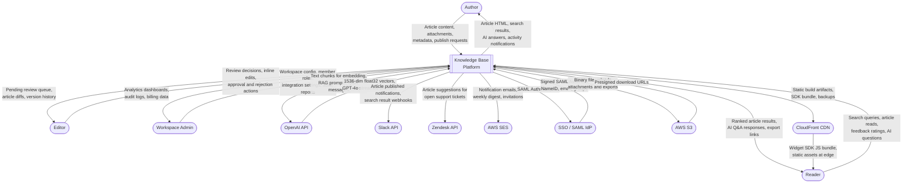
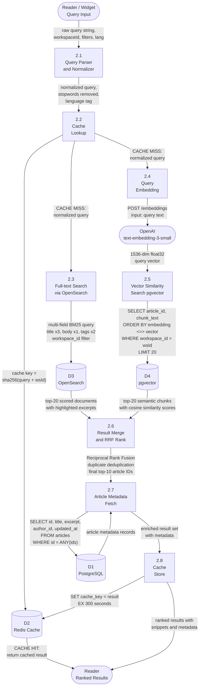
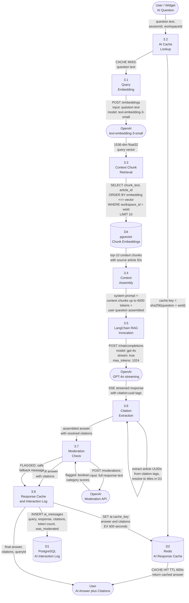

# Data Flow Diagrams — Knowledge Base Platform

## Overview

This document presents the data flows of the Knowledge Base Platform at three levels of
abstraction. **Level 0** (Context DFD) treats the platform as a single process and labels all
external data flows. **Level 1** decomposes the platform into six major processes. **Level 2**
provides detailed sub-process breakdowns for the two highest-complexity domains: Search & Retrieval
and AI Processing. Data stores are labelled D1–D5 consistently across all levels.

---

## DFD Level 0 — Context Diagram

---

## DFD Level 1 — Major Processes

```mermaid
flowchart TD
    subgraph ACTORS["External Actors"]
        AUTHOR(["Author"])
        READER(["Reader"])
        ADMIN(["Workspace Admin"])
        OPENAI_A(["OpenAI API"])
        SSO_A(["SSO / SAML IdP"])
        NOTIF_A(["Email / Slack / Webhook"])
        S3_A(["AWS S3"])
    end

    subgraph PROC["Core Processes"]
        P1["1.0\nArticle\nManagement"]
        P2["2.0\nSearch and\nRetrieval"]
        P3["3.0\nAI\nProcessing"]
        P4["4.0\nUser and\nAuth"]
        P5["5.0\nAnalytics"]
        P6["6.0\nWidget\nService"]
    end

    subgraph DS["Data Stores"]
        D1[("D1\nPostgreSQL\nArticles and Users")]
        D2[("D2\nRedis\nCache and Sessions")]
        D3[("D3\nOpenSearch\nFull-text Index")]
        D4[("D4\npgvector\nEmbeddings")]
        D5[("D5\nAWS S3\nAttachments")]
    end

    AUTHOR -->|"Draft content and metadata"| P1
    P1 -->|"Persist article record\nand version snapshot"| D1
    P1 -->|"Upload binary asset"| D5
    P1 -->|"Enqueue article.published\nevent to BullMQ"| D2
    P1 -->|"Upsert search document"| D3
    P1 -->|"Write chunk embeddings"| D4
    P1 -->|"Dispatch publish notification"| NOTIF_A

    READER -->|"Search query string,\nfilters and language"| P2
    P2 -->|"BM25 full-text query"| D3
    P2 -->|"kNN vector similarity query"| D4
    P2 -->|"Cache lookup and store"| D2
    P2 -->|"Fetch article metadata\nfor result enrichment"| D1
    P2 -->|"Ranked article list"| READER

    READER -->|"Natural language AI question"| P3
    P3 -->|"Retrieve top-k\ncontext chunks"| D4
    P3 -->|"Cache AI response"| D2
    P3 -->|"Log AI interaction\nand token usage"| D1
    P3 <-->|"Embeddings and GPT-4o chat"| OPENAI_A
    P3 -->|"Streamed AI answer\nwith citations"| READER

    AUTHOR -->|"Login and SSO initiation"| P4
    READER -->|"Register and login"| P4
    ADMIN -->|"Invite and manage members"| P4
    P4 <-->|"SAML assertion exchange"| SSO_A
    P4 -->|"Persist user record\nand session"| D1
    P4 -->|"Store session and\nrefresh token"| D2
    P4 -->|"JWT access token"| AUTHOR
    P4 -->|"JWT access token"| READER

    READER -->|"Page view, article read,\nfeedback event"| P5
    P5 -->|"Persist analytics event record"| D1
    P5 -->|"Increment aggregated\ncounters in cache"| D2
    P5 -->|"Aggregated report\nand insights"| ADMIN

    READER -->|"Widget load,\nwidget search query"| P6
    P6 -->|"Delegate to Search Service"| P2
    P6 -->|"Delegate to AI Service"| P3
    P6 -->|"Serve SDK bundle"| S3_A
    P6 -->|"Contextual article suggestions"| READER
```

---

## DFD Level 2 — Search & Retrieval (Process 2.0)

---

## DFD Level 2 — AI Processing (Process 3.0)

---

## 5. Data Store Reference

| ID | Store | Technology | Hosted Content | Primary Access Pattern |
|----|-------|------------|----------------|----------------------|
| D1 | PostgreSQL | AWS RDS 15 Multi-AZ | Articles, ArticleVersions, Users, WorkspaceMembers, Collections, Tags, Attachments, Feedback, AnalyticsEvents, AIConversations, AIMessages, domain_events outbox | Transactional CRUD writes; read replica for analytics aggregations |
| D2 | Redis | ElastiCache 7 Cluster | Search result cache (TTL 300 s), AI response cache (TTL 600 s), session store, BullMQ job queues, rate-limit token buckets, pub/sub channels | High-frequency reads/writes; TTL-based LRU eviction |
| D3 | Elasticsearch | Amazon OpenSearch 8 | Article documents: id, workspaceId, title, body, excerpt, tags, status, updatedAt; ICU multilingual analyzer mappings | Full-text BM25 multi-field queries; bulk upsert from Index Worker |
| D4 | pgvector | PostgreSQL 15 extension | Article chunk embeddings: 1536-dim float32 vectors, chunkIndex, chunkText, articleId, workspaceId, embeddedAt, embeddingOutdated flag | kNN cosine similarity `<=>` queries; batch INSERT with ON CONFLICT UPDATE |
| D5 | AWS S3 | S3 Standard + Glacier | Article attachments, exported PDFs, workspace logos, RDS automated backups, OpenSearch snapshots | Presigned URL uploads and downloads; lifecycle rule to Glacier after 90 days |

---

## 6. Data Flow Descriptions

| Flow ID | Source | Destination | Data Content | Protocol | Notes |
|---------|--------|-------------|--------------|----------|-------|
| DF-001 | Author (Web App) | Article Service | TipTap JSON content, title, tags, collectionId | HTTPS / REST | Max 2 MB per request; JSON schema validated server-side |
| DF-002 | Article Service | PostgreSQL D1 | Article record, ArticleVersion snapshot | TLS / TCP 5432 | Single transaction; version number auto-incremented |
| DF-003 | Article Service | BullMQ via Redis D2 | `article.published` event: articleId, workspaceId, chunkCount | Redis RPUSH | Outbox pattern: event written in same DB transaction as article update |
| DF-004 | Embedding Worker | OpenAI API | Article text chunks ≤ 512 tokens each, 20 chunks per batch | HTTPS / REST | Retry on HTTP 429 with exponential backoff; max 5 retries |
| DF-005 | Embedding Worker | pgvector D4 | 1536-dim float32 vectors, chunkIndex, articleId, workspaceId | TLS / TCP 5432 | Bulk INSERT with ON CONFLICT DO UPDATE SET embedding, embeddedAt |
| DF-006 | Indexing Worker | OpenSearch D3 | Article document JSON: title, body, tags, status, workspaceId | HTTPS / 9200 | Upsert by articleId; ICU analyzer applied at index time |
| DF-007 | Reader | Search Service | Search query string, workspaceId, language code, filters | HTTPS / REST | Query normalized; stopwords removed; language auto-detected |
| DF-008 | Search Service | Redis D2 | Cache key to ranked result JSON | TLS / 6379 | TTL 300 s; cache key invalidated on article update event |
| DF-009 | Search Service | OpenSearch D3 | BM25 multi-field query with workspace_id filter | HTTPS / 9200 | Field boosts: title^3, body^1, tags^2 |
| DF-010 | Search Service | OpenAI API | Query text for single embedding request | HTTPS / REST | Result cached in Redis to avoid repeat embedding cost per cache miss |
| DF-011 | Search Service | pgvector D4 | kNN cosine query vector plus workspace filter, LIMIT 20 | TLS / TCP 5432 | `ORDER BY embedding <=> $1 WHERE workspace_id = $2 LIMIT 20` |
| DF-012 | AI Service | pgvector D4 | kNN query for top-10 context chunks filtered by workspaceId | TLS / TCP 5432 | chunk_text and article_id included in SELECT for context assembly |
| DF-013 | AI Service | OpenAI GPT-4o | RAG prompt: system + context + question, max 6000 tokens | HTTPS REST / SSE | Streamed; prompt and completion tokens logged on finish event |
| DF-014 | AI Service | OpenAI Moderation | Full LLM response text for safety classification | HTTPS / REST | Synchronous; blocks delivery until result received |
| DF-015 | Notification Worker | AWS SES | HTML email payload using workspace-branded template | AWS SDK | Bounce handling via SNS topic to SQS dead-letter queue |
| DF-016 | Auth Service | SSO / SAML IdP | SAML AuthnRequest XML signed with SP certificate | HTTPS redirect | SP-initiated SSO; RelayState contains post-login redirect path |
| DF-017 | SSO / SAML IdP | Auth Service | SAML Assertion XML signed with IdP certificate | HTTPS POST | Signature verified using IdP metadata; NameID mapped to User.email |

---

## 7. Operational Policy Addendum

### 7.1 Content Governance Policies

- **Outbox Pattern for Event Durability**: Domain events emitted during article state transitions
  (DF-003) are written to a `domain_events` PostgreSQL table in the same database transaction as the
  article mutation. A dedicated outbox polling worker reads unprocessed events and enqueues them to
  BullMQ. This guarantees zero event loss even if Redis is temporarily unavailable at the moment of
  article publication.
- **Attachment Pre-screening**: All file uploads traversing DF-001 are validated server-side for
  MIME type against a strict allowlist, file size limits, and ClamAV virus signatures before an S3
  presigned URL is returned to the client. Files failing any check are rejected with a 422 response
  and the rejection is logged.
- **Search Index Consistency**: OpenSearch indices (D3) are treated as read-only projections of the
  PostgreSQL source of truth (D1). A nightly reconciliation job compares `articles.updated_at`
  against `search_indices.last_indexed_at` and requeues any stale or missing index documents for the
  Indexing Worker to process.
- **Version Snapshot Integrity**: Every DF-002 write creates both an article record update and an
  ArticleVersion insert in the same transaction. The `article_versions` table is protected by a
  PostgreSQL trigger that raises an exception on any UPDATE or DELETE, enforcing immutability at the
  database layer.

### 7.2 Reader Data Privacy Policies

- **Query Anonymization**: Raw search query strings (DF-007) are hashed with SHA-256 before storage
  in analytics events. The raw query text is retained only in Redis with a 24-hour TTL for live
  debugging and is automatically discarded thereafter. Analytics dashboards never expose raw user
  queries.
- **Cross-Tenant Query Isolation**: All data flows from DF-008 through DF-014 include mandatory
  `workspace_id` predicates enforced at the ORM layer via TypeORM entity subscribers that intercept
  every `find` call. This prevents cross-tenant data access regardless of how a query is
  constructed.
- **AI Interaction Privacy**: AI conversation data stored via DF-013 logging contains the question
  and response text, but does not link the user's persistent identity to specific queries in the
  default configuration. Identity linking is an opt-in Workspace Admin setting subject to
  privacy policy requirements and informed user consent.
- **Consent-Gated Analytics**: The analytics pipeline (Process 5.0) only activates for Reader
  sessions where explicit consent has been collected. Non-consented sessions generate no analytics
  events — including anonymized ones — in GDPR-regulated workspace regions.

### 7.3 AI Usage Policies

- **Token Accounting**: Every execution of DF-013 logs prompt token count and completion token count
  to PostgreSQL `ai_messages` for workspace-level usage reporting. Workspaces with configured
  monthly token budgets receive automated alerts at 80% consumption and have API access hard-stopped
  at 100% until the next billing period.
- **Chunk Selection Transparency**: The context chunks transmitted via DF-012 to DF-013 are stored
  in the `ai_messages.context_chunks` JSONB column alongside their cosine similarity scores.
  Workspace Admins can audit which specific article content contributed to any AI answer, enabling
  identification of stale or misleading source material.
- **Embedding Freshness**: Article embeddings in D4 are flagged `embedding_outdated = true` when
  the source article content changes by more than a 5% character-level diff. Outdated embeddings
  are excluded from DF-012 kNN queries via a `WHERE embedding_outdated = false` predicate until the
  Embedding Worker regenerates them.
- **No Training Data Transmission**: All OpenAI API calls (DF-004, DF-010, DF-013, DF-014) are
  made with organization-level API keys configured for zero data retention under OpenAI's Enterprise
  Data Protection policy. No article content is used for model training.

### 7.4 System Availability Policies

- **Cache Stampede Mitigation**: The Search Service implements a Redis `SETNX`-based single-flight
  mutex for concurrent cache-miss scenarios on DF-008. Only one upstream query executes per cache
  key at a time; concurrent requests wait on the mutex and receive the stored result upon cache
  write, avoiding thundering-herd spikes on OpenSearch and pgvector.
- **OpenSearch Degradation Path**: If OpenSearch (D3) is unreachable during DF-009, the Search
  Service automatically falls back to PostgreSQL `tsvector` full-text search against D1. A
  degradation metric is emitted to CloudWatch and appears on the operational dashboard. No error is
  surfaced to the end user.
- **pgvector Timeout Circuit Breaker**: If the pgvector kNN query (DF-011 or DF-012) exceeds
  500 ms, the AI Service proceeds with only full-text keyword results as RAG context, emitting a
  `vector_search_timeout` metric. This prevents slow index scans from blocking all AI responses
  under heavy concurrent load.
- **BullMQ Queue Overflow Protection**: CloudWatch alarms monitor BullMQ queue depths as custom
  metrics. If the embedding queue depth exceeds 10,000 jobs, an ECS Service auto-scaling policy
  launches additional Embedding Worker tasks up to a maximum of 10 workers, staying within OpenAI's
  10,000 RPM embedding rate limit.
