# Domain Model — Knowledge Base Platform

## Overview

The Knowledge Base Platform is modelled using **Domain-Driven Design (DDD)** principles. The
domain is partitioned into six **Bounded Contexts**, each owning its entities, language, invariants,
and data. Cross-context communication occurs exclusively through domain events and well-defined
anti-corruption layers — never through direct entity sharing.

---

## 1. Bounded Contexts

| Bounded Context | Core Responsibility | Aggregate Roots | Data Owned |
|-----------------|--------------------|--------------------|-----------|
| **Content Domain** | Article lifecycle: creation, versioning, publishing, archival, expiry | `Workspace`, `Article`, `Collection` | articles, article_versions, collections, attachments, tags, feedback |
| **Search Domain** | Indexing, full-text search, vector similarity search, result ranking | `SearchIndex` | OpenSearch documents, pgvector chunk embeddings, search query logs |
| **AI Domain** | RAG pipeline, conversational Q&A, summarization, citation extraction | `AIConversation` | ai_conversations, ai_messages, token usage records |
| **Identity Domain** | Users, workspace membership, roles, permissions, authentication tokens | `User`, `WorkspaceMember` | users, workspace_members, sessions, api_keys, invitations |
| **Analytics Domain** | Event tracking, article performance metrics, workspace usage reports | `AnalyticsEvent` | analytics_events, aggregated report snapshots |
| **Integration Domain** | External system connectors, webhook delivery, OAuth token management | `Integration` | integrations, webhook_deliveries, external_link_registry |

---

## 2. Domain Entity Class Diagram

```mermaid
classDiagram
    direction TB

    class Workspace {
        +UUID id
        +String name
        +String slug
        +String plan
        +String region
        +WorkspaceSettings settings
        +DateTime createdAt
        +DateTime updatedAt
        +DateTime deletedAt
        +createCollection(name, parentId) Collection
        +addMember(userId, role) WorkspaceMember
        +updateSettings(settings) void
        +suspend() void
    }

    class WorkspaceMember {
        +UUID id
        +UUID workspaceId
        +UUID userId
        +Role role
        +Boolean isActive
        +DateTime joinedAt
        +DateTime updatedAt
        +changeRole(newRole) void
        +deactivate() void
    }

    class Role {
        <<enumeration>>
        SUPER_ADMIN
        WORKSPACE_ADMIN
        EDITOR
        AUTHOR
        READER
    }

    class User {
        +UUID id
        +String email
        +String name
        +String avatarUrl
        +AuthProvider provider
        +String providerId
        +Boolean emailVerified
        +DateTime lastLoginAt
        +DateTime createdAt
        +DateTime deletedAt
        +updateProfile(name, avatar) void
        +verifyEmail() void
        +anonymize() void
    }

    class AuthProvider {
        <<enumeration>>
        LOCAL
        GOOGLE
        SAML
        GITHUB
    }

    class Collection {
        +UUID id
        +UUID workspaceId
        +UUID parentId
        +String name
        +String description
        +String slug
        +Int sortOrder
        +CollectionPermissions permissions
        +DateTime createdAt
        +DateTime updatedAt
        +DateTime deletedAt
        +addArticle(articleId) void
        +reorder(sortOrder) void
        +updatePermissions(perms) void
    }

    class CollectionPermissions {
        <<valueObject>>
        +Boolean isPublic
        +List~Role~ canView
        +List~Role~ canEdit
        +List~Role~ canPublish
    }

    class Article {
        +UUID id
        +UUID workspaceId
        +UUID collectionId
        +UUID authorId
        +String title
        +String slug
        +String excerpt
        +JSON content
        +ArticleStatus status
        +Int currentVersion
        +DateTime publishedAt
        +DateTime expiresAt
        +DateTime createdAt
        +DateTime updatedAt
        +DateTime deletedAt
        +publish(editorId) void
        +archive() void
        +expire() void
        +requestReview() void
        +saveVersion(note) ArticleVersion
        +restore(versionId) void
    }

    class ArticleStatus {
        <<enumeration>>
        DRAFT
        IN_REVIEW
        PUBLISHED
        ARCHIVED
        EXPIRED
        REVIEW_REQUIRED
    }

    class ArticleVersion {
        +UUID id
        +UUID articleId
        +Int versionNumber
        +JSON content
        +String title
        +UUID savedById
        +String changeNote
        +DateTime createdAt
        +diff(otherId) VersionDiff
        +restore() Article
    }

    class Tag {
        +UUID id
        +UUID workspaceId
        +String name
        +String slug
        +String colorHex
        +DateTime createdAt
    }

    class ArticleTag {
        +UUID articleId
        +UUID tagId
        +DateTime taggedAt
    }

    class Attachment {
        +UUID id
        +UUID articleId
        +UUID uploadedById
        +String filename
        +String mimeType
        +Int fileSizeBytes
        +String s3Key
        +String cdnUrl
        +ScanStatus scanStatus
        +DateTime createdAt
        +generatePresignedUrl(ttlSeconds) String
        +quarantine() void
    }

    class ScanStatus {
        <<enumeration>>
        PENDING
        CLEAN
        QUARANTINED
    }

    class Feedback {
        +UUID id
        +UUID articleId
        +UUID userId
        +FeedbackType type
        +String comment
        +Boolean isAnonymized
        +DateTime createdAt
    }

    class FeedbackType {
        <<enumeration>>
        HELPFUL
        NOT_HELPFUL
        OUTDATED
        INACCURATE
    }

    class SearchIndex {
        +UUID id
        +UUID articleId
        +UUID workspaceId
        +String elasticsearchDocId
        +Boolean isIndexed
        +DateTime indexedAt
        +Int chunkIndex
        +String chunkText
        +Float~1536~ embedding
        +String embeddingModelVersion
        +Boolean embeddingOutdated
        +DateTime embeddedAt
        +reindex() void
        +regenerateEmbedding() void
        +markOutdated() void
    }

    class AIConversation {
        +UUID id
        +UUID workspaceId
        +UUID userId
        +String sessionId
        +ConversationContext context
        +Int totalTokensUsed
        +Boolean isClosed
        +DateTime createdAt
        +DateTime lastMessageAt
        +addMessage(role, content, citations) AIMessage
        +close() void
    }

    class ConversationContext {
        <<valueObject>>
        +String initialQuery
        +List~UUID~ seedArticleIds
        +String languageCode
    }

    class AIMessage {
        +UUID id
        +UUID conversationId
        +MessageRole role
        +String content
        +List~UUID~ citedArticleIds
        +JSON contextChunks
        +Int promptTokens
        +Int completionTokens
        +Boolean wasModerated
        +DateTime createdAt
    }

    class MessageRole {
        <<enumeration>>
        USER
        ASSISTANT
        SYSTEM
    }

    class Widget {
        +UUID id
        +UUID workspaceId
        +String name
        +String apiKey
        +WidgetConfig config
        +List~String~ allowedDomains
        +Boolean isActive
        +DateTime createdAt
        +DateTime updatedAt
        +regenerateApiKey() String
        +updateConfig(config) void
        +addAllowedDomain(domain) void
    }

    class WidgetConfig {
        <<valueObject>>
        +String primaryColor
        +String position
        +String placeholder
        +Boolean enableAI
        +Boolean enableFeedback
        +List~String~ contextTags
    }

    class AnalyticsEvent {
        +UUID id
        +UUID workspaceId
        +UUID articleId
        +String sessionId
        +AnalyticsEventType eventType
        +JSON properties
        +String languageCode
        +String countryCode
        +DateTime occurredAt
    }

    class AnalyticsEventType {
        <<enumeration>>
        ARTICLE_VIEW
        SEARCH_QUERY
        AI_QUERY_SENT
        FEEDBACK_GIVEN
        WIDGET_OPENED
        ARTICLE_EXPORTED
        ARTICLE_NOT_FOUND
    }

    class Integration {
        +UUID id
        +UUID workspaceId
        +IntegrationType type
        +JSON encryptedCredentials
        +JSON config
        +Boolean isActive
        +DateTime lastSyncAt
        +DateTime createdAt
        +sync() SyncResult
        +test() Boolean
        +revoke() void
    }

    class IntegrationType {
        <<enumeration>>
        SLACK
        ZENDESK
        SALESFORCE
        JIRA
        ZAPIER
        WEBHOOK
    }

    Workspace "1" --> "many" WorkspaceMember : has members
    Workspace "1" --> "many" Collection : contains
    Workspace "1" --> "many" Widget : owns
    Workspace "1" --> "many" AnalyticsEvent : tracks
    Workspace "1" --> "many" Integration : configures
    Workspace "1" --> "many" AIConversation : scopes

    User "1" --> "many" WorkspaceMember : participates via
    WorkspaceMember --> Role : assigned

    Collection "1" --> "many" Article : groups
    Collection "0..1" --> "0..many" Collection : nests
    Collection --> CollectionPermissions : governed by

    Article "1" --> "many" ArticleVersion : versioned by
    Article "1" --> "many" Attachment : has
    Article "1" --> "many" Feedback : receives
    Article "1" --> "many" SearchIndex : indexed as
    Article --> ArticleStatus : current status

    ArticleTag --> Article : tags
    ArticleTag --> Tag : uses
    Tag "many" --> "many" Article : applied to

    ArticleVersion --> Article : snapshot of
    Attachment --> ScanStatus : scan result
    Feedback --> FeedbackType : type of

    SearchIndex --> Article : projection of

    AIConversation "1" --> "many" AIMessage : contains
    AIConversation --> ConversationContext : initialized with
    AIMessage --> MessageRole : played by

    Widget --> Workspace : belongs to
    Widget --> WidgetConfig : configured with

    AnalyticsEvent --> AnalyticsEventType : of type
    Integration --> IntegrationType : of type
    User --> AuthProvider : authenticated via
```

---

## 3. Aggregate Roots, Value Objects, and Domain Events

### Content Domain

| Type | Name | Description |
|------|------|-------------|
| **Aggregate Root** | `Workspace` | Top-level tenant boundary. All content, members, and settings are scoped to a workspace. |
| **Aggregate Root** | `Article` | Central content aggregate. Owns versions, attachments, and feedback. Enforces the publish workflow. |
| **Aggregate Root** | `Collection` | Hierarchical container for articles. Owns permission rules and sort order. |
| **Value Object** | `CollectionPermissions` | Immutable permission descriptor: which roles can view, edit, or publish within the collection. |
| **Value Object** | `ArticleStatus` | State machine value enforced by the Article aggregate. |
| **Domain Event** | `ArticlePublished` | Emitted when `Article.publish()` succeeds. Triggers Embedding Worker, Indexing Worker, and Notification Worker. |
| **Domain Event** | `ArticleArchived` | Emitted when an article is archived or expires. Triggers OpenSearch document deactivation. |
| **Domain Event** | `ArticleVersionCreated` | Emitted on every content save. Triggers diff computation for the activity feed. |
| **Domain Event** | `FeedbackReceived` | Emitted when Feedback is created. Triggers author notification via Notification Worker. |
| **Domain Event** | `ArticleExpired` | Emitted when an article passes its `expiresAt` date. Transitions status to `REVIEW_REQUIRED`. |

### Identity Domain

| Type | Name | Description |
|------|------|-------------|
| **Aggregate Root** | `User` | Platform-wide identity. Authentication credentials and profile data owned here. |
| **Aggregate Root** | `WorkspaceMember` | Ties a User to a Workspace with a specific Role. The join entity that governs access. |
| **Value Object** | `Role` | Immutable enum: `SUPER_ADMIN`, `WORKSPACE_ADMIN`, `EDITOR`, `AUTHOR`, `READER`. |
| **Domain Event** | `UserJoinedWorkspace` | Emitted when a WorkspaceMember is created. Triggers welcome email via Notification Worker. |
| **Domain Event** | `UserRoleChanged` | Emitted when `WorkspaceMember.role` changes. Triggers permission cache invalidation in Redis. |
| **Domain Event** | `SSOLoginSucceeded` | Emitted after successful SAML assertion validation. Triggers session creation and audit log entry. |

### AI Domain

| Type | Name | Description |
|------|------|-------------|
| **Aggregate Root** | `AIConversation` | Owns the complete message history for a Q&A session scoped to a workspace. |
| **Value Object** | `ConversationContext` | Immutable snapshot of the seed query and article IDs used to initialize the conversation. |
| **Domain Event** | `AIAnswerGenerated` | Emitted when an AI response is finalized. Logged for analytics and token-usage accounting. |
| **Domain Event** | `AIResponseModerated` | Emitted when the Moderation API flags a response. Triggers workspace admin alert. |

### Search Domain

| Type | Name | Description |
|------|------|-------------|
| **Aggregate Root** | `SearchIndex` | Projection of an Article into the search systems (OpenSearch document + pgvector chunks). |
| **Domain Event** | `EmbeddingGenerated` | Emitted when chunk embeddings are written to pgvector. Marks `SearchIndex.embeddingOutdated = false`. |
| **Domain Event** | `SearchIndexUpdated` | Emitted when an OpenSearch document is upserted. Updates `SearchIndex.indexedAt`. |

---

## 4. Domain Glossary

| Term | Bounded Context | Definition |
|------|----------------|------------|
| **Workspace** | Content, Identity | A tenant-level container grouping all content, members, and settings for one organization. |
| **Collection** | Content | A hierarchical folder grouping related articles. Can be nested (parent/child). Carries its own permissions. |
| **Article** | Content | The primary knowledge unit. Contains rich-text content authored in TipTap, serialized as Tiptap JSON. |
| **Article Version** | Content | An immutable, insert-only snapshot of article content captured on every save event. |
| **Slug** | Content | A URL-safe, human-readable identifier derived from the article or collection title; unique per workspace. |
| **Embedding** | Search, AI | A 1536-dimensional float32 vector representation of article text, produced by OpenAI text-embedding-3-small. |
| **Chunk** | Search, AI | A fixed-size segment (≤ 512 tokens) of an article used as the unit of embedding and context retrieval in RAG. |
| **RAG** | AI | Retrieval-Augmented Generation: relevant document chunks are retrieved and injected into the LLM prompt to ground AI answers in factual source material. |
| **Citation** | AI | An article ID referenced inside an AI response using a `<citation:uuid>` tag, indicating the answer is supported by that article's content. |
| **Widget** | Integration | The embeddable JS SDK (< 12 KB) that surfaces knowledge search and AI Q&A inside third-party web applications. |
| **Integration** | Integration | A configured connection to an external system (Slack, Zendesk, Jira, etc.) storing credentials and sync state. |
| **Feedback** | Content | A Reader's qualitative signal attached to an article: helpful, not helpful, outdated, or inaccurate. |
| **Workspace Admin** | Identity | A WorkspaceMember role with full control over workspace settings, member management, integrations, and content policies. |
| **Role** | Identity | A named permission level assigned to a WorkspaceMember that governs which platform actions they may perform. |
| **Outbox Event** | Infrastructure | A domain event written to the `domain_events` PostgreSQL table in the same transaction as the triggering aggregate mutation, ensuring reliable delivery to BullMQ workers. |
| **BullMQ Job** | Infrastructure | An asynchronous task (embedding generation, indexing, notification) enqueued to a named Redis queue and processed by a dedicated BullMQ worker process. |
| **SearchIndex** | Search | The domain aggregate representing the indexed state of one Article chunk across both OpenSearch and pgvector. |
| **RRF** | Search | Reciprocal Rank Fusion — a rank merging algorithm that combines full-text BM25 scores and kNN cosine similarity scores into a single unified ranking without requiring score normalization. |

---

## 5. Anti-Corruption Layer Notes

The **Integration Domain** acts as the anti-corruption layer between the platform's core domain
model and all external systems. The following ACL patterns are applied per integration:

| External System | ACL Strategy | Implementation Notes |
|-----------------|-------------|---------------------|
| **OpenAI API** | Adapter + Translator | `EmbeddingAdapter` translates internal `ArticleChunk` objects to OpenAI request format. LLM responses are translated to `AIMessage` domain objects. Citation tags are extracted and resolved to internal `Article` references before leaving the AI Domain boundary. |
| **Amazon OpenSearch** | Repository + Projection | `SearchIndexRepository` maps `Article` domain objects to the OpenSearch document schema. The Search Domain maintains its own document structure independent of the PostgreSQL table schema. Index updates are eventual — the Article aggregate is always the source of truth. |
| **Slack API** | Event-Driven Adapter | The Integration Service subscribes to domain events (`ArticlePublished`, `FeedbackReceived`) and translates them to Slack Block Kit message payloads. Slack's channel and user model never leaks into the core domain model. |
| **Zendesk API** | Gateway + Cache | The Integration Service polls Zendesk for new tickets and uses a workspace-specific mapping table to suggest relevant articles. The Zendesk ticket model is never imported into the core domain; only article IDs cross the boundary. |
| **SAML IdP** | Identity Mapper | The Auth Service validates SAML assertions and maps IdP-specific attributes (NameID, email, groups) to platform `User` and `WorkspaceMember` entities using a configurable attribute mapping table stored per workspace. |
| **Jira Software** | Link Registry | Jira issue references are stored by external ID in the `article_external_links` table. No Jira data structures are imported into the domain. The integration creates Article drafts from Jira descriptions using a transformation template that strips Jira-specific markup. |
| **Zapier / Webhooks** | Event Publisher | The Integration Service publishes normalized event payloads (article slug, title, workspace slug) to registered webhook URLs. Internal aggregate IDs (UUIDs) are replaced with human-readable slugs in all outbound webhook payloads to prevent internal ID leakage. |

---

## 6. Operational Policy Addendum

### 6.1 Content Governance Policies

- **Aggregate Invariant Enforcement**: The `Article` aggregate enforces that `publish()` may only
  be called when `status === DRAFT` or `IN_REVIEW`, and only by a caller whose WorkspaceMember role
  is `EDITOR` or `WORKSPACE_ADMIN` in the same workspace. These invariants are tested in domain
  unit tests independent of any NestJS module or database dependency.
- **Version Immutability**: `ArticleVersion` entities are insert-only in the database. A PostgreSQL
  trigger raises an exception on any UPDATE or DELETE to the `article_versions` table, enforcing
  immutability regardless of whether the application ORM or a direct SQL client is used.
- **Soft Delete Pattern**: All top-level aggregate roots (`Workspace`, `Collection`, `Article`,
  `User`) implement soft delete via `deletedAt: DateTime`. A TypeORM global subscriber intercepts
  all `find` calls and appends `WHERE deleted_at IS NULL`, preventing accidental exposure of
  deleted records.
- **Slug Uniqueness**: Article and Collection slugs are unique per workspace, enforced by a partial
  unique index: `UNIQUE (workspace_id, slug) WHERE deleted_at IS NULL`. The application uses a
  sanitize-then-increment strategy (e.g., `my-article`, `my-article-2`) to handle slug collisions
  without failing the request.

### 6.2 Reader Data Privacy Policies

- **Reader PII Scope**: The `User` entity stores only name and email. `AnalyticsEvent` records
  reference users by anonymized `sessionId` — a daily-resettable SHA-256 hash of
  `(userId + date + salt)` — preventing long-term behavioural tracking while still supporting
  same-session event correlation.
- **Feedback Anonymization**: `Feedback` entities store `userId` for workspace admin moderation
  purposes. Readers may request anonymization of their feedback within 30 days of submission. On
  approval, `userId` is replaced with a workspace-level ghost user UUID and the `isAnonymized`
  flag is set to `true`.
- **AI Conversation Ownership**: `AIConversation` records are owned by the creating user. If the
  user deletes their account, all associated `AIConversation` and `AIMessage` records are
  anonymized within 30 days: `userId` is replaced with a workspace-level deleted-user UUID and the
  original email reference is removed.
- **GDPR Data Portability**: The platform exposes a `GET /users/me/export` endpoint that compiles
  all user-owned data — articles authored, feedback given, AI conversations — into a downloadable
  JSON archive, fulfilling Article 20 GDPR data portability rights.

### 6.3 AI Usage Policies

- **Article Chunk Ownership**: `SearchIndex` rows (pgvector chunks) carry a mandatory `workspace_id`
  column covered by a PostgreSQL row-level security policy. All kNN queries are scoped by
  `workspace_id` at the database level, independent of application code, preventing any
  cross-workspace context leakage in AI responses.
- **Embedding Version Tracking**: Each `SearchIndex` record stores the `embeddingModelVersion` used
  to produce it (e.g., `text-embedding-3-small-v1`). When the embedding model is upgraded, a
  background migration job regenerates all embeddings for active articles, marking old embeddings
  `embeddingOutdated = true` until regeneration completes.
- **AI Conversation Retention**: `AIConversation` and `AIMessage` records have a default 90-day
  TTL enforced by a scheduled PostgreSQL cleanup job. Workspaces on Pro+ plans may extend retention
  to 1 year via workspace settings for compliance and audit purposes.
- **Citation Validation**: Before returning any AI response, the AI Service resolves all
  `<citation:uuid>` tags against the PostgreSQL `articles` table to verify each cited article
  exists, has `status = PUBLISHED`, and belongs to the requesting workspace. Invalid citations are
  stripped from the response before it reaches the client.

### 6.4 System Availability Policies

- **Domain Event Durability**: Domain events (e.g., `ArticlePublished`) are written to the
  `domain_events` outbox table in the same PostgreSQL transaction as the aggregate mutation. A
  dedicated outbox worker reliably delivers events to BullMQ. This guarantees that no event is
  ever silently lost due to Redis unavailability at the moment of article publish.
- **Read Replica for Analytics**: The Analytics Service queries exclusively against an RDS read
  replica to avoid impacting primary write performance. The replica maintains a maximum 1-second
  replication lag under normal load. Analytics data is designed to be eventually consistent by
  definition.
- **Optimistic Locking on Article Edits**: The Article Service uses PostgreSQL advisory locks
  (`SELECT ... FOR UPDATE`) when processing concurrent edit requests. The API returns HTTP 409
  Conflict when a concurrent edit is detected, including the latest article version in the response
  body so the client can display a merge-conflict UI.
- **Index Consistency Guarantee**: OpenSearch documents are projections with an eventual consistency
  guarantee. The platform maintains `last_indexed_at` on each `SearchIndex` row. A nightly
  reconciliation job compares `articles.updated_at` against `search_indices.last_indexed_at` and
  requeues any stale documents for the Indexing Worker to process.
