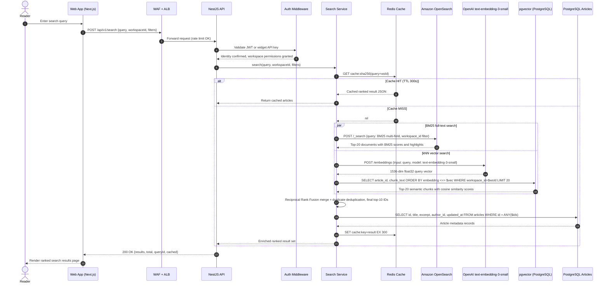
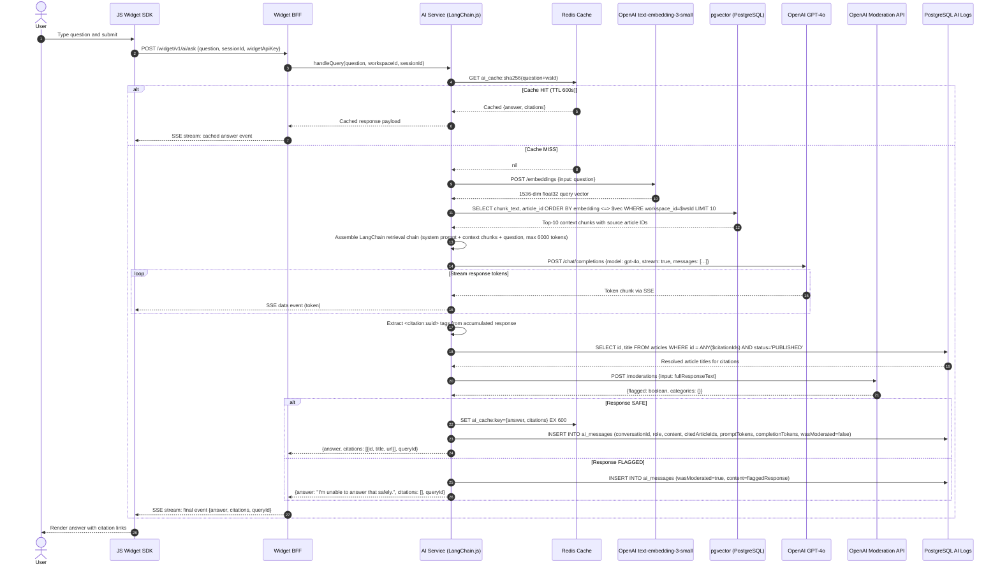
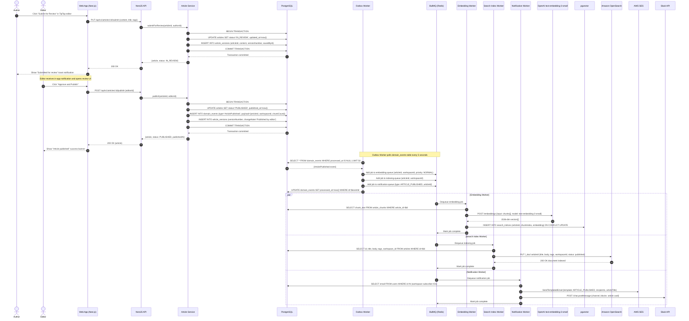
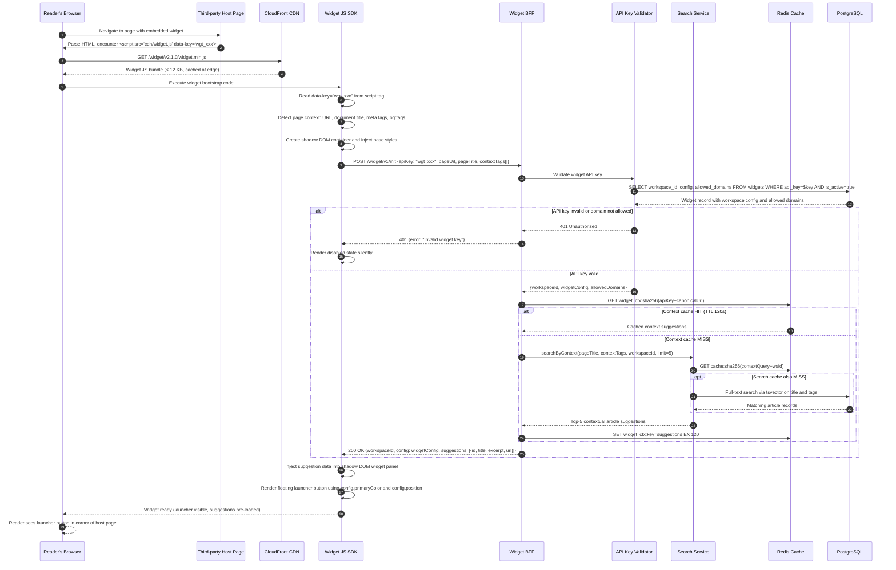

# System Sequence Diagrams — Knowledge Base Platform

## Overview

This document presents five **system-level sequence diagrams** covering the principal interaction
flows of the Knowledge Base Platform. Each diagram uses UML Sequence Diagram notation in Mermaid
syntax with activation bars, `alt`/`opt`/`loop`/`par` blocks, and `autonumber` step labels. Each
sequence is preceded by a narrative describing the scenario and followed by key design notes.

---

## Sequence 1: Article Search Flow

### Scenario
A Reader submits a search query from the web application or embedded widget. The platform performs
hybrid full-text and semantic search with Redis caching, then returns a ranked article list. If the
result is not cached, the Search Service fans out to OpenSearch (BM25) and pgvector (kNN) in
parallel, merges results using Reciprocal Rank Fusion, caches the merged set, and enriches it with
article metadata before returning the response.

### Key Design Notes
- Cache key is `sha256(normalizedQuery + workspaceId)` to ensure workspace isolation.
- BM25 and kNN queries execute in parallel to minimize latency.
- The query embedding itself is cached separately in Redis so repeat queries within the TTL window
  do not incur a second OpenAI API call.
- Article metadata is fetched from the PostgreSQL read replica to avoid write-path contention.



---

## Sequence 2: AI Q&A Flow

### Scenario
A Reader uses the embedded Widget SDK to submit a natural-language question. The AI Service
embeds the query, retrieves the top-10 most relevant article chunks from pgvector, assembles a
LangChain RAG prompt, and streams GPT-4o's response back via Server-Sent Events. The response is
passed through the OpenAI Moderation API before delivery. Citation tags are extracted and resolved
to article titles. The interaction is logged and cached.

### Key Design Notes
- The entire response is streamed token-by-token to the Widget via SSE, enabling progressive
  rendering with low time-to-first-byte.
- Citation extraction runs on the accumulated response after streaming completes before the final
  SSE `[DONE]` event is emitted.
- Moderated responses are replaced with a safe fallback message; the original flagged content is
  never transmitted to the client.
- AI responses are cached at the workspace + question level (TTL 10 min) to absorb repeated
  identical queries without redundant LLM invocations.



---

## Sequence 3: Article Publish Flow

### Scenario
An Author completes an article in the TipTap editor and submits it for review. A workspace Editor
reviews and approves it, triggering publication. The Article Service transitions the article status,
writes a domain event to the PostgreSQL outbox within the same transaction, and returns immediately.
Asynchronously, the Outbox Worker reads the event and dispatches three BullMQ jobs: embedding
generation, search indexing, and notification delivery.

### Key Design Notes
- The synchronous API response (step 14) completes before any async work starts, ensuring low
  publish latency from the Author's perspective.
- The outbox pattern (steps 11–12) guarantees that even a Redis outage at publish time will not
  lose the embedding or indexing jobs — they will be enqueued once Redis recovers.
- Embedding, indexing, and notification are three independent BullMQ jobs that can execute in
  parallel across separate worker processes.



---

## Sequence 4: Widget Initialization Flow

### Scenario
A Reader's browser loads a third-party web page (e.g., a SaaS product's help page) that has the
Knowledge Base Widget SDK installed via a `<script>` tag. The SDK bootstraps, validates its API
key against the Widget BFF, detects the current page context (URL, title, page tags), and fetches
contextually relevant article suggestions to pre-populate the widget before it is opened by the
user.

### Key Design Notes
- The Widget SDK is loaded asynchronously from CloudFront so it never blocks the host page's
  critical rendering path.
- The Widget BFF uses a workspace-specific API key (not a user JWT) to authenticate SDK requests,
  since Readers may not be logged in on the host page.
- Context-based suggestions are cached in Redis keyed by `sha256(widgetApiKey + canonicalUrl)` to
  avoid redundant search calls across multiple page loads.
- The Widget renders in a shadow DOM to avoid CSS leakage with the host page.



---

## Sequence 5: SSO Login Flow

### Scenario
A Workspace Admin has configured SAML SSO for their workspace using Okta as the Identity Provider.
A workspace member navigates to the login page and chooses "Sign in with SSO". The Auth Service
initiates an SP-initiated SAML flow, the IdP authenticates the user, and the Auth Service validates
the SAML assertion, creates or updates the user record, issues a short-lived JWT plus a refresh
token, and establishes a secure session.

### Key Design Notes
- The SAML AuthnRequest is signed with the platform's SP certificate to prevent assertion spoofing.
- On first SSO login, a new `User` record and `WorkspaceMember` record are created automatically
  (JIT provisioning).
- The JWT access token (15 min expiry) is set as an httpOnly SameSite=Strict cookie to prevent XSS
  token theft. The refresh token (7 days) is stored in Redis with the user ID as part of the key
  for fast revocation.
- A `SSOLoginSucceeded` domain event is emitted after session creation for audit logging.

```mermaid
sequenceDiagram
    autonumber
    actor User
    participant Browser as Browser
    participant WebApp as Web App (Next.js)
    participant API as NestJS API
    participant AuthSvc as Auth Service
    participant PG as PostgreSQL
    participant Redis as Redis Session Store
    participant IdP as SAML IdP (Okta / Azure AD)

    User->>Browser: Navigate to knowledge base login page
    Browser->>WebApp: GET /login?workspace=acme
    WebApp-->>Browser: Render login page with "Sign in with SSO" button
    User->>Browser: Click "Sign in with SSO"

    Browser->>API: POST /api/v1/auth/sso/initiate {workspaceSlug: "acme"}
    API->>AuthSvc: initiateSAML(workspaceSlug)
    AuthSvc->>PG: SELECT saml_config, idp_metadata FROM workspaces WHERE slug='acme'
    PG-->>AuthSvc: {entityId, ssoUrl, certificate, attributeMapping}

    AuthSvc->>AuthSvc: Generate SAML AuthnRequest XML
    AuthSvc->>AuthSvc: Sign AuthnRequest with SP private key
    AuthSvc->>Redis: SET saml_relay:{relayState} = {workspaceId, redirectUrl} EX 300
    AuthSvc-->>API: {redirectUrl: idpSSOUrl + encoded AuthnRequest + RelayState}
    API-->>Browser: 302 Redirect to IdP SSO URL

    Browser->>IdP: GET {idpSSOUrl}?SAMLRequest=...&RelayState=...
    IdP-->>Browser: Render IdP login form

    User->>IdP: Submit credentials (username and password or MFA)
    IdP->>IdP: Authenticate user and generate SAML Response

    IdP-->>Browser: HTTP POST to /api/v1/auth/sso/callback with SAMLResponse + RelayState
    Browser->>API: POST /api/v1/auth/sso/callback {SAMLResponse, RelayState}
    API->>AuthSvc: processSAMLCallback(SAMLResponse, RelayState)

    AuthSvc->>Redis: GET saml_relay:{relayState}
    Redis-->>AuthSvc: {workspaceId, redirectUrl}

    AuthSvc->>AuthSvc: Parse and validate SAML Assertion (signature, NotOnOrAfter, Audience)
    AuthSvc->>PG: SELECT saml_config FROM workspaces WHERE id=$workspaceId
    PG-->>AuthSvc: IdP certificate for signature verification

    alt Assertion INVALID (expired, wrong audience, bad signature)
        AuthSvc-->>API: AuthenticationError
        API-->>Browser: 302 Redirect to /login?error=sso_failed
        Browser-->>User: Show "SSO authentication failed" error message
    else Assertion VALID
        AuthSvc->>AuthSvc: Extract NameID (email), groups, display name via attribute mapping

        AuthSvc->>PG: SELECT id FROM users WHERE email=$email
        PG-->>AuthSvc: User record or nil

        alt First SSO login — JIT provisioning
            AuthSvc->>PG: INSERT INTO users (email, name, provider=SAML, providerId, emailVerified=true)
            PG-->>AuthSvc: New user ID
            AuthSvc->>PG: INSERT INTO workspace_members (workspaceId, userId, role=READER, isActive=true)
        else Existing user
            AuthSvc->>PG: UPDATE users SET last_login_at=now(), name=$name WHERE id=$userId
        end

        AuthSvc->>AuthSvc: Sign JWT {sub: userId, wsId: workspaceId, role, exp: now+15min}
        AuthSvc->>AuthSvc: Generate cryptographically random refresh token

        AuthSvc->>Redis: SET refresh:{workspaceId}:{userId}:{tokenHash} = {issuedAt, userAgent} EX 604800
        AuthSvc->>PG: INSERT INTO domain_events (type='SSOLoginSucceeded', payload={userId, workspaceId, provider: SAML})

        AuthSvc-->>API: {accessToken, refreshToken, user, workspace}
        API-->>Browser: 302 Redirect to workspace dashboard
        Note right of Browser: Set-Cookie: access_token=JWT; HttpOnly; SameSite=Strict; Secure; Max-Age=900
        Note right of Browser: Set-Cookie: refresh_token=...; HttpOnly; SameSite=Strict; Secure; Path=/api/v1/auth/refresh
        Browser-->>User: Redirect to workspace dashboard (authenticated)
    end
```

---

## 6. Operational Policy Addendum

### 6.1 Content Governance Policies

- **Search Result Scope**: The Search Service (Sequence 1) enforces workspace isolation at every
  layer: the OpenSearch query includes a `workspace_id` term filter, the pgvector kNN query includes
  `WHERE workspace_id = $wsId`, and the Redis cache key incorporates the workspace ID. No search
  result can leak across workspace boundaries at any step in the flow.
- **Publish Authorization Check**: The Article Service (Sequence 3) validates that the calling user
  holds `EDITOR` or `WORKSPACE_ADMIN` role in the target workspace before invoking `publish()`.
  This check occurs in the domain service layer, not the controller, ensuring enforcement even when
  the service is called internally from other modules.
- **Widget Domain Allowlist**: During Widget Initialization (Sequence 4), the Auth Service validates
  that the request's `Origin` header matches the widget's configured `allowedDomains` list. Requests
  from unlisted domains receive a 403 response, preventing unauthorized embedding of the widget on
  third-party sites that have not been explicitly authorized by the Workspace Admin.
- **SSO JIT Provisioning Scope**: Automatically provisioned users during SSO Login (Sequence 5) are
  assigned the `READER` role by default. Workspace Admins may configure group-to-role mappings in
  the SAML attribute mapping table to automatically grant higher roles based on IdP group membership.

### 6.2 Reader Data Privacy Policies

- **Search Query Non-persistence**: In Sequence 1, raw search query strings are never written to
  PostgreSQL. Only a SHA-256 hash of the query is stored in analytics events. Redis holds the raw
  query as part of the cache key with a 5-minute TTL that auto-expires. Workspace Admins cannot
  access individual Reader queries.
- **AI Conversation Anonymization**: In Sequence 2, the AI Service creates `AIMessage` records
  linked to a `sessionId` — not a persistent user identity — unless the Reader is authenticated and
  has not opted out of query history. Anonymous widget sessions are never linked to user accounts.
- **Widget Analytics Isolation**: The Widget BFF (Sequence 4) records `WIDGET_OPENED` and
  `SEARCH_QUERY` analytics events using an anonymized session token derived from the widget API key
  and a per-session random nonce. These events cannot be traced back to individual Readers without
  explicit user-level consent.
- **SSO Session Data Minimization**: During Sequence 5, the SAML Assertion XML is parsed, used for
  user provisioning, and then discarded. It is never stored in PostgreSQL or Redis. Only the
  extracted attributes (email, name, role mapping) are persisted, in accordance with the principle
  of data minimization.

### 6.3 AI Usage Policies

- **Context Window Enforcement**: In Sequence 2, the AI Service assembles the RAG prompt with a
  hard token budget cap (default 6,000 tokens). Context chunks are included in descending order of
  cosine similarity score and truncated at the budget boundary. The final prompt token count is
  logged before the GPT-4o call is dispatched.
- **Streaming Response Safety**: GPT-4o responses are streamed to the client token-by-token
  (Sequence 2, loop block). The Moderation API check runs on the complete accumulated response
  after the stream closes. If the response is flagged, a replacement fallback message is emitted as
  a final SSE event. The Widget SDK replaces any already-rendered streamed tokens with the safe
  fallback before the user can read the flagged content.
- **Widget AI Opt-Out Enforcement**: If the Workspace Admin has disabled AI features for the
  workspace, the Widget BFF (Sequence 4) returns `config.enableAI: false` in the init response.
  The Widget SDK does not render the AI Q&A input when this flag is false. The Widget BFF also
  rejects any requests to `/widget/v1/ai/ask` from that workspace with HTTP 403.
- **Embedding Generation Rate Control**: In Sequence 3, the Embedding Worker processes article
  chunks in batches of 20 and enforces a minimum 100 ms delay between batches to remain within
  OpenAI's rate limit of 10,000 RPM per organization. A BullMQ job-level retry with exponential
  backoff handles transient HTTP 429 responses from the OpenAI Embeddings API.

### 6.4 System Availability Policies

- **Search Graceful Degradation**: If OpenSearch is unavailable during Sequence 1, the Search
  Service falls back to PostgreSQL `tsvector` full-text search using the `articles.tsv` generated
  column. The fallback path does not include vector ranking, so result quality is reduced, but the
  search endpoint remains functional and returns HTTP 200 with a `degraded: true` flag in the
  response metadata.
- **AI Circuit Breaker**: In Sequence 2, the AI Service wraps the OpenAI API call in a circuit
  breaker (half-open state after 30 s, open after 5 consecutive failures). When the circuit is
  open, the AI Service returns the top-5 full-text search results with a message informing the user
  that AI answers are temporarily unavailable. This prevents OpenAI timeouts from cascading into
  widget failures.
- **Widget Offline Resilience**: The Widget SDK (Sequence 4) stores the most recently fetched
  context suggestions in `sessionStorage`. If the Widget BFF is unreachable on a page reload, the
  SDK renders the cached suggestions from the previous successful init call, ensuring the widget
  remains functional during brief backend disruptions.
- **SAML Session Race Condition Protection**: In Sequence 5, the `saml_relay:{relayState}` key is
  written to Redis with a 5-minute TTL and deleted atomically after first use via a Lua script
  (`GET` + `DEL` in a single operation). This prevents replay attacks where an intercepted SAML
  callback URL is submitted a second time to create a duplicate session.
