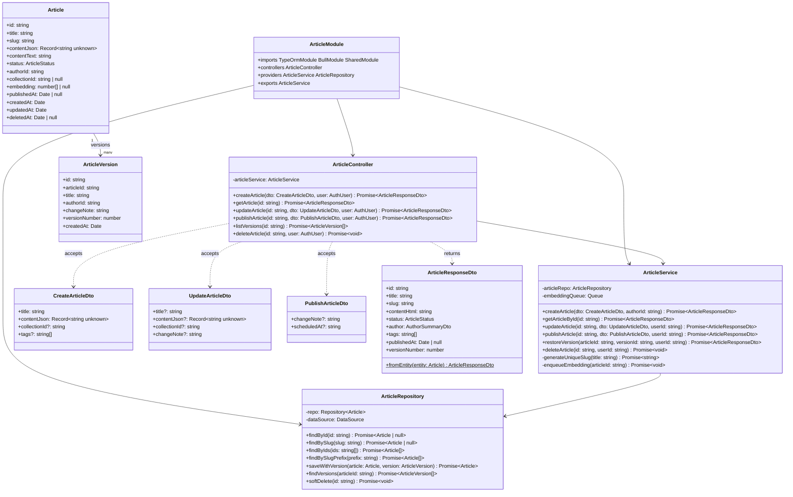
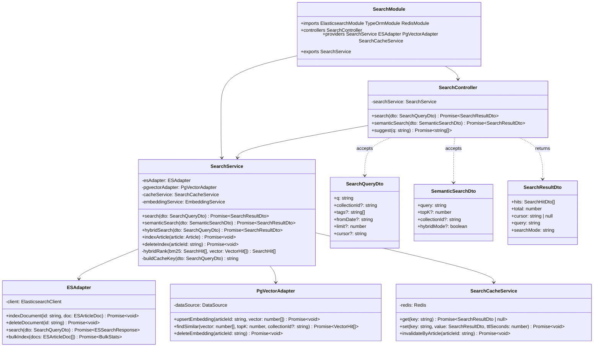
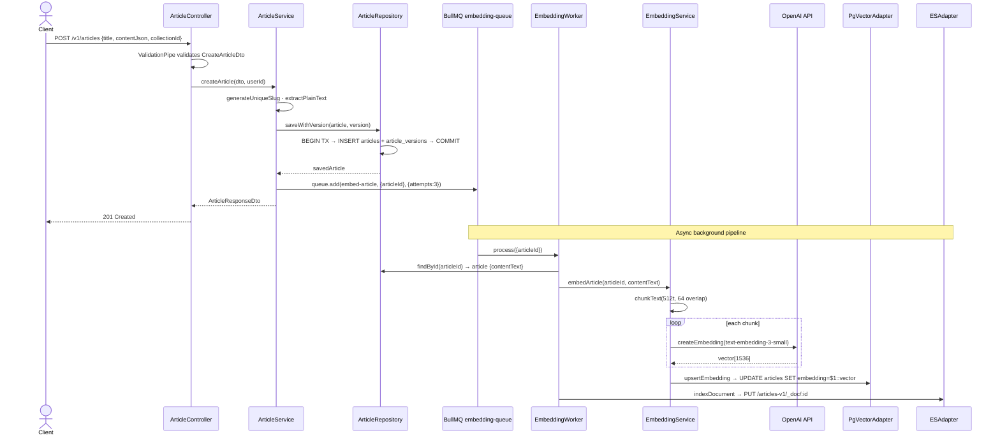

# Knowledge Base Platform — C4 Level 4: Code Diagrams

## 1. Introduction

C4 Level 4 (Code) diagrams show internal class structure, method signatures, entity relationships,
and data flow at implementation level. They correspond directly to TypeScript classes in the codebase
and are used during implementation, code review, and onboarding.

**Conventions:** `Promise~T~` denotes `Promise<T>` (Mermaid escaping). TypeORM decorators not
expressible in Mermaid are noted as `%% @Decorator` comments. `-->` = composition/ownership;
`..>` = usage/parameter; `"1" --> "many"` = entity cardinality.

---

## 2. Article Module — Class Diagram



---

## 3. Search Module — Class Diagram



---

## 4. AI Module — Class Diagram

```mermaid
classDiagram
    direction TB

    class AIModule {
        +imports TypeOrmModule RedisModule BullModule
        +controllers AIController
        +providers AIService LangChainService EmbeddingService ConversationService
        +exports EmbeddingService
    }

    class AIController {
        -aiService: AIService
        +query(dto: AIQueryDto, user: AuthUser, res: Response) Promise~void~
        +getConversation(conversationId: string, user: AuthUser) Promise~AIConversation~
        +deleteConversation(conversationId: string, user: AuthUser) Promise~void~
    }
    class AIService {
        -langChainService: LangChainService
        -conversationService: ConversationService
        -rateLimiter: RateLimiterRedis
        +query(dto: AIQueryDto, userId: string, res: Response) Promise~void~
        -buildHistory(conversationId: string) Promise~BaseMessage[]~
        -handleFallback(query: string, res: Response) Promise~void~
    }
    class LangChainService {
        -openai: ChatOpenAI
        -vectorStore: PGVectorStore
        +buildRAGChain(history: BaseMessage[]) RunnableSequence
        +retrieveContext(query: string, topK: number) Promise~Document[]~
    }
    class EmbeddingService {
        -openai: OpenAI
        -pgvectorAdapter: PgVectorAdapter
        +embedArticle(articleId: string, contentText: string) Promise~void~
        +embedQuery(query: string) Promise~number[]~
        +chunkText(text: string, size: number, overlap: number) string[]
        -averagePool(vectors: number[][]) number[]
    }
    class ConversationService {
        -convRepo: Repository~AIConversation~
        -msgRepo: Repository~AIMessage~
        +findOrCreate(userId: string, conversationId?: string) Promise~AIConversation~
        +appendMessage(convId: string, role: MessageRole, content: string, sources: string[]) Promise~AIMessage~
        +getHistory(convId: string, limit: number) Promise~AIMessage[]~
        +deleteConversation(convId: string, userId: string) Promise~void~
    }
        %% @Entity ai_conversations  @Index userId
        +id: string
        +userId: string
        +title: string
        +createdAt: Date
        +messages: Promise~AIMessage[]~
    }
    class AIMessage {
        %% @Entity ai_messages  @Index conversationId
        +id: string
        +conversationId: string
        +role: MessageRole
        +content: string
        +sourceArticleIds: string[]
        +createdAt: Date
    }
    class AIQueryDto {
        +query: string
        +conversationId?: string
        +topK?: number
    }
    class AIResponseDto {
        +conversationId: string
        +content: string
        +sources: SourceCitationDto[]
        +tokenCount: number
        +model: string
    }

    AIModule --> AIController
    AIModule --> AIService
    AIModule --> LangChainService
    AIModule --> EmbeddingService
    AIModule --> ConversationService
    AIController --> AIService
    AIService --> LangChainService
    AIService --> ConversationService
    LangChainService --> EmbeddingService
    ConversationService --> AIConversation
    AIConversation "1" --> "many" AIMessage : messages
    AIController ..> AIQueryDto : accepts
    AIController ..> AIResponseDto : returns
```

---

## 5. Article Creation — Code-Level Sequence Diagram



---

## 6. Key TypeScript Code Snippets

### 6.1 Article Entity with TypeORM Decorators and pgvector Column

```typescript
import {
  Column, CreateDateColumn, DeleteDateColumn, Entity, Index,
  ManyToOne, OneToMany, PrimaryGeneratedColumn, UpdateDateColumn,
} from 'typeorm';

export enum ArticleStatus {
  DRAFT = 'draft', REVIEW = 'review', PUBLISHED = 'published', ARCHIVED = 'archived',
}

@Entity('articles')
@Index(['slug'], { unique: true })
@Index(['status', 'collectionId'])
@Index(['authorId'])
export class Article {
  @PrimaryGeneratedColumn('uuid') id: string;
  @Column({ type: 'varchar', length: 500 }) title: string;
  @Column({ type: 'varchar', length: 600, unique: true }) slug: string;
  @Column({ type: 'jsonb' }) contentJson: Record<string, unknown>;
  @Column({ type: 'text' }) contentText: string;
  @Column({ type: 'enum', enum: ArticleStatus, default: ArticleStatus.DRAFT }) status: ArticleStatus;
  @Column({ type: 'uuid' }) authorId: string;
  @Column({ type: 'uuid', nullable: true }) collectionId: string | null;

  // pgvector column — requires pgvector extension; TypeORM has no native vector type.
  @Column({
    type: 'text', nullable: true,
    transformer: {
      to: (v: number[] | null): string | null => (v ? `[${v.join(',')}]` : null),
      from: (v: string | null): number[] | null => (v ? (JSON.parse(v) as number[]) : null),
    },
  })
  embedding: number[] | null;

  @Column({ type: 'int', default: 0 }) viewCount: number;
  @Column({ type: 'timestamptz', nullable: true }) publishedAt: Date | null;
  @CreateDateColumn({ type: 'timestamptz' }) createdAt: Date;
  @UpdateDateColumn({ type: 'timestamptz' }) updatedAt: Date;
  @DeleteDateColumn({ type: 'timestamptz' }) deletedAt: Date | null;

  @ManyToOne('User', { lazy: true }) author: Promise<unknown>;
  @ManyToOne('Collection', { lazy: true, nullable: true }) collection: Promise<unknown>;
  @OneToMany('ArticleVersion', 'article', { cascade: ['insert'], lazy: true }) versions: Promise<unknown[]>;
}
```

### 6.2 ArticleService.createArticle

```typescript
@Injectable()
export class ArticleService {
  private readonly logger = new Logger(ArticleService.name);

  constructor(
    private readonly articleRepo: ArticleRepository,
    @InjectQueue(EMBEDDING_QUEUE) private readonly embeddingQueue: Queue,
  ) {}

  async createArticle(dto: CreateArticleDto, authorId: string): Promise<ArticleResponseDto> {
    const slug = await this.generateUniqueSlug(dto.title);
    const contentText = this.extractPlainText(dto.contentJson);

    const article = this.articleRepo.create({
      title: dto.title, slug, contentJson: dto.contentJson, contentText,
      status: ArticleStatus.DRAFT, authorId, collectionId: dto.collectionId ?? null,
    });
    const version: Partial<ArticleVersion> = {
      contentJson: dto.contentJson, contentText, title: dto.title,
      authorId, versionNumber: 1, changeNote: 'Initial draft',
    };

    const saved = await this.articleRepo.saveWithVersion(article as Article, version as ArticleVersion);

    // Fire-and-forget — article is usable before embedding completes
    await this.embeddingQueue.add(
      EMBED_ARTICLE_JOB,
      { articleId: saved.id },
      { attempts: 3, backoff: { type: 'exponential', delay: 5_000 } },
    );

    this.logger.log({ message: 'Article created', articleId: saved.id, authorId });
    return ArticleResponseDto.fromEntity(saved);
  }

  private async generateUniqueSlug(title: string): Promise<string> {
    const base = slugify(title, { lower: true, strict: true });
    const existing = await this.articleRepo.findBySlugPrefix(base);
    return existing.length === 0 ? base : `${base}-${Date.now()}`;
  }
}
```

### 6.3 SearchService.semanticSearch with pgvector

```typescript
async semanticSearch(dto: SemanticSearchDto): Promise<SearchResultDto> {
  const cacheKey = `semantic:${createHash('sha256').update(JSON.stringify(dto)).digest('hex')}`;
  const cached = await this.cacheService.get(cacheKey);
  if (cached) return cached;

  const queryVector = await this.embeddingService.embedQuery(dto.query);

  // Raw SQL: TypeORM QueryBuilder has no native pgvector <=> operator support.
  const rows = await this.dataSource.query<Array<{ id: string; similarity: number }>>(
    `SELECT a.id, 1 - (a.embedding <=> $1::vector) AS similarity
     FROM   articles a
     WHERE  a.status = 'published' AND a.embedding IS NOT NULL
       AND  ($3::uuid IS NULL OR a.collection_id = $3)
     ORDER  BY a.embedding <=> $1::vector
     LIMIT  $2`,
    [(`[${queryVector.join(',')}]`), dto.topK ?? 10, dto.collectionId ?? null],
  );

  const articleMap = new Map(
    (await this.articleRepo.findByIds(rows.map((r) => r.id))).map((a) => [a.id, a]),
  );

  const hits: SearchHitDto[] = rows
    .filter((r) => articleMap.has(r.id))
    .map((r) => {
      const a = articleMap.get(r.id)!;
      return { id: a.id, title: a.title, slug: a.slug,
               snippet: a.contentText.slice(0, 240) + '…', score: r.similarity };
    });

  const result: SearchResultDto = { hits, total: hits.length, cursor: null,
                                    took: 0, query: dto.query, searchMode: 'semantic' };
  await this.cacheService.set(cacheKey, result, 60);
  return result;
}
```

### 6.4 AIService.query with LangChain RAG Chain

```typescript
async query(dto: AIQueryDto, userId: string, res: Response): Promise<void> {
  try { await this.rateLimiter.consume(userId, 1); }
  catch { res.status(429).json({ error: 'Rate limit exceeded.' }); return; }

  const conversation = await this.conversationService.findOrCreate(userId, dto.conversationId);
  const history = await this.conversationService.getHistory(conversation.id, 10);
  const langChainHistory: BaseMessage[] = history.map((m) =>
    m.role === 'user' ? new HumanMessage(m.content) : new AIMessage(m.content),
  );

  const chain = this.langChainService.buildRAGChain(langChainHistory);
  res.setHeader('Content-Type', 'text/event-stream');
  res.setHeader('Cache-Control', 'no-cache');
  res.flushHeaders();

  let fullResponse = '';
  const collectedSources: Document[] = [];

  try {
    for await (const chunk of await chain.stream({ question: dto.query })) {
      if (typeof chunk === 'string') {
        fullResponse += chunk;
        res.write(`data: ${JSON.stringify({ content: chunk })}\n\n`);
      } else if (chunk && typeof chunk === 'object' && 'sourceDocuments' in chunk) {
        collectedSources.push(...(chunk.sourceDocuments as Document[]));
      }
    }
  } catch (err) {
    this.logger.error({ message: 'RAG stream error', error: (err as Error).message });
    await this.handleFallback(dto.query, res);
    return;
  }

  const sourceIds = [...new Set(collectedSources.map((d) => String(d.metadata['articleId'])))];
  await this.conversationService.appendMessage(conversation.id, 'user', dto.query, []);
  await this.conversationService.appendMessage(conversation.id, 'assistant', fullResponse, sourceIds);
  res.write(`data: ${JSON.stringify({ done: true, conversationId: conversation.id, sources: sourceIds })}\n\n`);
  res.end();
}
```

### 6.5 EmbeddingWorker — BullMQ Processor

```typescript
@Processor(EMBEDDING_QUEUE, { concurrency: 5, limiter: { max: 50, duration: 60_000 } })
export class EmbeddingWorker extends WorkerHost {
  private readonly logger = new Logger(EmbeddingWorker.name);

  constructor(
    private readonly embeddingService: EmbeddingService,
    private readonly articleRepo: ArticleRepository,
    private readonly esAdapter: ESAdapter,
  ) { super(); }

  async process(job: Job<{ articleId: string }>): Promise<void> {
    const { articleId } = job.data;
    const article = await this.articleRepo.findById(articleId);
    if (!article || !article.contentText.trim()) {
      this.logger.warn({ message: 'Skipping embedding — article absent or empty', articleId });
      return;
    }

    await job.updateProgress(10);
    // Step 1: chunk → embed → average-pool → upsert pgvector column
    await this.embeddingService.embedArticle(articleId, article.contentText);
    await job.updateProgress(60);

    // Step 2: index full-text document in Elasticsearch
    await this.esAdapter.indexDocument(articleId, {
      id: articleId, title: article.title, contentText: article.contentText,
      slug: article.slug, authorId: article.authorId, collectionId: article.collectionId,
      status: article.status, publishedAt: article.publishedAt?.toISOString() ?? null,
    });

    await job.updateProgress(100);
    this.logger.log({ message: 'Embedding job completed', articleId, jobId: job.id });
  }
}
```

---

## 7. Operational Policy Addendum

### 7.1 Content Governance Policies

`ArticleService.publishArticle` is the **sole authorized entry point** for the `PUBLISHED` state
transition. It must validate non-empty `title`, non-empty `contentText`, and non-null `collectionId`
before allowing the transition. Direct database writes that bypass this method are a policy violation.
Modifications to `ArticleStatus` require joint Product and Engineering review, as changes propagate
to the state machine, API, and BullMQ pipeline simultaneously.

### 7.2 Reader Data Privacy Policies

The `embedding` column is a mathematical vector and contains no reader PII — it is not subject to
GDPR erasure. However, `AIConversation` and `AIMessage` entities contain user query text and are
subject to Art. 17 erasure. `ConversationService.deleteConversation` must hard-delete (not
soft-delete) all `AIMessage` rows and the parent `AIConversation` within a single transaction.
`EmbeddingWorker` must never log `contentText` — only `articleId` and job metadata.

### 7.3 AI Usage Policies

The RAG system prompt is stored at `apps/api/src/modules/ai/prompts/rag-system.prompt.ts` under
version control. Modifications require a PR approved by a Backend Lead and an AI/ML reviewer.
The prompt must always instruct the model to acknowledge insufficient context and must never claim
certainty beyond retrieved content. `sourceArticleIds` must always be persisted to `AIMessage` —
omitting citations is a policy violation that breaks the AI answer audit trail.

### 7.4 System Availability Policies

`EmbeddingWorker` failure must never degrade the article creation API. `enqueueEmbedding` is
fire-and-forget; a queue unavailability error is caught and logged without re-throwing, leaving
`embedding` as `null` until the retry succeeds. Both `ESAdapter` and `PgVectorAdapter` are wrapped
in `opossum` circuit breakers; when a circuit is open the corresponding step is skipped and the
job is re-queued after the circuit closes. Search endpoints degrade gracefully to keyword-only
results when the vector adapter circuit is open.
