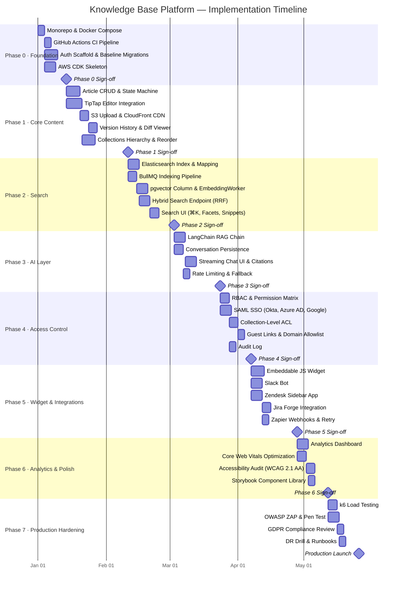

# Knowledge Base Platform — Implementation Playbook

## 1. Project Overview

The Knowledge Base Platform (KBP) is a modern, AI-powered documentation and self-service support
system designed to reduce support-ticket volume, accelerate team onboarding, and surface
institutional knowledge at scale. It combines structured article management with hybrid semantic
search, a RAG-based AI assistant, and deep integrations with the existing toolchain (Slack,
Zendesk, Jira, Zapier).

### Implementation Philosophy

| Principle | Description |
|-----------|-------------|
| **Monorepo-first** | All services (API, web, workers, shared libs) live in one Turborepo monorepo for unified CI and dependency management. |
| **Schema-first** | TypeScript interfaces and OpenAPI specs are authored before implementation code. |
| **Test-in-phase** | Every phase ships with ≥ 80% unit-test coverage and passing e2e smoke tests before the next phase begins. |
| **Feature flags** | All new capabilities are gated behind LaunchDarkly flags so incomplete features never reach production. |
| **Observability-first** | Structured logs (Pino), distributed traces (OpenTelemetry → Datadog), and RED metrics ship on day 1 of each phase. |
| **Zero-downtime deploys** | All schema changes are backward-compatible; multi-step migrations are used for any breaking change. |
| **Security by default** | OWASP Top 10 controls, WAF rules, and secrets management are configured from Phase 0, not retrofitted. |

---

## 2. Phase-by-Phase Implementation Plan

### Phase 0: Foundation (Weeks 1–2)

**Goal:** Establish the development environment, CI/CD pipeline, and skeleton services that every
subsequent phase builds upon.

**Deliverables:**
- Turborepo monorepo with `apps/api`, `apps/web`, `packages/shared`, `packages/ui`, `packages/config`
- Docker Compose stack: PostgreSQL 15, Redis 7, Elasticsearch 8, MinIO (S3-compatible local), pgvector extension enabled
- GitHub Actions CI: lint → type-check → unit-test → build on every PR; deploy to staging on merge to `main`
- AWS CDK skeleton: VPC, ECS clusters, RDS Multi-AZ, ElastiCache, S3 buckets, CloudFront distributions, Route 53
- Baseline TypeORM migrations: `users`, `refresh_tokens`, `collections`, `tags` tables
- Auth scaffold: JWT access tokens (15-min TTL), refresh tokens (7-day TTL), bcrypt password hashing, `POST /auth/login`, `POST /auth/refresh`, `POST /auth/logout`
- ESLint + Prettier + Husky pre-commit hooks; Conventional Commits enforced via `commitlint`

**Acceptance Criteria:**
- `docker-compose up` starts all services with zero errors within 60 seconds
- CI pipeline completes in < 5 minutes on a clean PR
- `POST /auth/login` returns a signed JWT; `POST /auth/refresh` rotates the refresh token
- A new developer can clone, install, and run the full stack in < 15 minutes (documented and verified)

**Team Assignments:** Platform Lead (infra/CI), Backend Lead (auth scaffold, migrations), DevOps (CDK skeleton)

**Dependencies:** AWS account provisioned; GitHub org and repo created; domain registered in Route 53

---

### Phase 1: Core Content (Weeks 3–6)

**Goal:** Build the full Article CRUD lifecycle, TipTap-powered rich-text editor, S3 file storage,
version history, and collections hierarchy.

**Deliverables:**
- Article entity with CRUD endpoints (`/v1/articles`, `/v1/articles/:id`)
- TipTap editor in Next.js with extensions: StarterKit, Image, Link, CodeBlockLowlight, Table, Placeholder, CharacterCount
- Image/file upload endpoint → AWS S3 presigned URLs for direct client-side uploads; ClamAV scan on completion
- CloudFront CDN in front of S3 for fast global asset delivery
- `ArticleVersion` entity capturing full TipTap JSON on every save; diff viewer UI with restored version preview
- Collections (folders) with adjacency-list hierarchy, drag-and-drop reorder (dnd-kit), and breadcrumb navigation
- Article publication state machine: `Draft → Review → Published → Archived`
- Slug auto-generation from title with uniqueness enforcement (append timestamp on conflict)

**Acceptance Criteria:**
- Create, edit, and delete articles with rich text; saved content renders identically on read
- Upload a 10 MB image; it appears in the editor within 3 seconds via CloudFront URL
- Restore any previous version within 2 clicks; current version updates immediately
- Collections nest to at least 5 levels; reorder persists after full page refresh

**Team Assignments:** Backend Engineer (Article/Collection APIs), Frontend Engineer (TipTap, collection tree UI), QA Engineer

**Dependencies:** Phase 0 complete; S3 bucket and CloudFront distribution provisioned

---

### Phase 2: Search (Weeks 7–9)

**Goal:** Deliver fast, relevant full-text search via Elasticsearch and semantic (vector) search via
pgvector, combined through Reciprocal Rank Fusion into a single hybrid search endpoint.

**Deliverables:**
- BullMQ indexing pipeline: on article publish, enqueue `embed-article` job → extract plain text → upsert Elasticsearch document
- Elasticsearch index mapping: `title` (boost ×3), `contentText`, `tags`, `collectionPath`, `authorName`
- pgvector column on `articles`; `text-embedding-3-small` embeddings generated per article via `EmbeddingWorker`
- Hybrid search endpoint (`GET /v1/search`): BM25 (ES) score + cosine similarity (pgvector) fused with RRF
- Search UI: instant search bar with keyboard navigation (⌘K), faceted filters (collection, author, date, tags), highlighted snippets
- Search analytics: query text, result count, and click-through logged to `search_events` table for analysis

**Acceptance Criteria:**
- p95 search latency < 200 ms for full-text queries on a 50,000-article corpus
- Semantic search surfaces relevant articles even when the exact keyword is absent (validated with 20 benchmark queries)
- Zero-result rate < 5% for a curated 100-query test set
- Full re-index of all articles completes in < 30 minutes via a bulk BullMQ job

**Team Assignments:** Backend Engineer (Elasticsearch, pgvector, BullMQ pipeline), Frontend Engineer (search UI), ML Engineer (embedding tuning)

**Dependencies:** Phase 1 complete; Elasticsearch cluster running; OpenAI API key configured

---

### Phase 3: AI Layer (Weeks 10–12)

**Goal:** Integrate GPT-4o via LangChain.js to power a streaming AI Q&A assistant with cited
answers grounded in knowledge-base content.

**Deliverables:**
- `EmbeddingService` using `text-embedding-3-small` for chunked article content (512-token chunks, 64-token overlap, average pooling)
- LangChain.js RAG chain: embed query → pgvector top-k retrieval → prompt assembly → GPT-4o streaming → SSE response
- `AIConversation` and `AIMessage` entities persisting the last 10 conversation turns as context
- Citation rendering: assistant responses include `[source: Article Title]` inline; UI renders clickable source chips
- AI Q&A widget embedded on article pages and as a standalone `/ask` route
- Rate limiting: 20 AI queries/user/minute via Redis token bucket (`rate-limiter-flexible`)
- Automatic fallback to keyword search results when the OpenAI API is unavailable (circuit breaker with `opossum`)

**Acceptance Criteria:**
- AI answers include ≥ 1 cited source article for 90% of queries against the test corpus
- Streaming response begins within 2 seconds TTFB on a production-equivalent environment
- Conversation history persists across page navigations for authenticated users
- Fallback activates within 500 ms of OpenAI API timeout; users see a degraded-mode banner

**Team Assignments:** ML Engineer (LangChain RAG, embedding pipeline), Backend Engineer (conversation persistence, rate limiting), Frontend Engineer (streaming chat UI, citation chips)

**Dependencies:** Phase 2 complete (pgvector populated with article embeddings); GPT-4o API access confirmed

---

### Phase 4: Access Control (Weeks 13–14)

**Goal:** Implement fine-grained RBAC, SSO/SAML for enterprise customers, collection-level
permissions, guest share links, and domain allowlisting.

**Deliverables:**
- Roles: `Owner`, `Admin`, `Editor`, `Viewer`, `Guest`; permission matrix enforced at the service layer
- Passport.js SAML2 strategy; integration-tested with Okta, Azure AD, and Google Workspace
- Collection-level ACL: assign roles per collection; permissions inherit from parent with explicit override capability
- Guest share links: HMAC-signed JWT with configurable expiry, view-only access, no authentication required
- Domain allowlist: restrict workspace access to `@company.com` email domains configured per workspace
- Append-only audit log: every permission change, article publish, and role assignment recorded with actor, timestamp, and IP subnet

**Acceptance Criteria:**
- A `Viewer` cannot create or edit articles — enforced at API level, verified with e2e tests
- SAML login round-trip works with all three IdPs in a staging environment
- An expired guest link returns 403 with no content leakage; verified with integration tests
- Audit log entries appear within 10 seconds of the triggering event; queryable by Admin role

**Team Assignments:** Backend Lead (RBAC, SAML), Security Engineer (audit log, ACL review), Frontend Engineer (permissions UI, guest link management)

**Dependencies:** Phase 1 complete; SAML IdP test tenants provisioned in Okta and Azure AD

---

### Phase 5: Widget & Integrations (Weeks 15–17)

**Goal:** Extend platform reach through an embeddable JS widget and native integrations with Slack,
Zendesk, Jira, and Zapier.

**Deliverables:**
- Embeddable widget: single `<script>` tag loads an isolated Shadow DOM widget supporting search and AI Q&A; theming via CSS custom properties
- Slack bot: `/kb search <query>` returns top-3 results; `@KB ask <question>` triggers AI answer in-thread
- Zendesk app: sidebar panel shows article suggestions based on ticket subject/description; one-click link-to-ticket
- Jira integration: link KB articles to Jira issues; display linked articles in the Jira issue panel via Forge
- Zapier webhook triggers: `article.published`, `article.updated`, `article.archived`
- Webhook delivery with HMAC-SHA256 request signing and exponential backoff retry (max 5 attempts, DLQ after exhaustion)

**Acceptance Criteria:**
- Widget loads in < 1 second (cold) and < 300 ms (cached) on a page with no other KB scripts
- Slack bot responds within 3 seconds for search queries; AI answer streaming begins within 3 seconds
- Zendesk app shows ≥ 1 relevant suggestion for 80% of a 50-ticket test set
- Webhooks deliver within 5 seconds; retry mechanism verified with simulated 500-error receiver

**Team Assignments:** Frontend Engineer (widget), Backend Engineer (Slack bot, webhooks), Integration Engineer (Zendesk, Jira, Zapier)

**Dependencies:** Phase 3 complete (AI Q&A required for widget); Slack, Zendesk, Jira dev accounts provisioned

---

### Phase 6: Analytics & Polish (Weeks 18–19)

**Goal:** Deliver an analytics dashboard, deflection metrics, Core Web Vitals optimization, and a
full WCAG 2.1 AA accessibility audit.

**Deliverables:**
- Analytics dashboard: page views, unique readers, search queries, AI usage, and deflection rate (searches not followed by ticket creation)
- Article-level analytics: views, average time-on-page, helpful/not-helpful votes, search CTR
- Performance: Lighthouse score ≥ 90 on all key public pages; all Core Web Vitals in "Good" range
- Accessibility: WCAG 2.1 AA compliance verified with `axe-core` automated CI check plus manual screen-reader testing (VoiceOver, NVDA)
- Storybook component library for all shared UI components with `@storybook/addon-a11y`

**Acceptance Criteria:**
- Dashboard loads in < 2 seconds with 90-day rolling data on production-sized dataset
- Deflection rate metric is clearly defined, documented, and matches manual calculation on sample data
- Zero Critical axe-core violations on all public-facing pages (enforced in CI)
- All interactive components are fully keyboard-navigable (tab order, focus indicators, ARIA labels)

**Team Assignments:** Frontend Engineer (dashboard, accessibility), Data Engineer (analytics pipeline), QA Engineer (a11y audit)

**Dependencies:** Phase 5 complete; at least 2 weeks of production analytics data available

---

### Phase 7: Production Hardening (Weeks 20–21)

**Goal:** Stress-test, secure, and document the platform for production launch.

**Deliverables:**
- k6 load test suite: 1,000 concurrent readers; 500 concurrent search queries; 100 concurrent AI queries; ramp-up and soak scenarios
- OWASP ZAP automated scan + manual penetration test; all Critical and High findings remediated before launch
- GDPR compliance review: data inventory, consent flows, right-to-erasure endpoint (`DELETE /v1/me`), data retention cron jobs
- Runbooks: incident response, RDS failover, Elasticsearch re-indexing, full rollback procedure
- DR drill: RDS point-in-time restore tested end-to-end; RTO < 4 hours, RPO < 1 hour documented

**Acceptance Criteria:**
- p99 article-read latency < 500 ms under 1,000 concurrent users sustained for 10 minutes
- Zero Critical, zero High CVEs in final OWASP ZAP scan report
- `DELETE /v1/me` removes or anonymizes all PII within 30 calendar days (GDPR Art. 17 compliant)
- DR drill completed with actual measured timings documented in the runbook

**Team Assignments:** DevOps (k6, DR drill), Security Engineer (pen test, GDPR), Tech Lead (runbooks), QA Engineer

**Dependencies:** Phase 6 complete; production AWS environment fully provisioned and warmed

---

## 3. Implementation Timeline (Gantt Chart)

---

## 4. Risk Register

| Risk | Likelihood | Impact | Mitigation |
|------|-----------|--------|------------|
| OpenAI API rate limits exceeded during peak embedding indexing | Medium | High | Exponential backoff with jitter; embedding result cache (Redis, 24 h TTL); negotiate higher tier quota before Phase 3 |
| Elasticsearch OOM on 100 k+ article corpus | Low | High | Right-size nodes before Phase 2; enable ILM (index lifecycle management); monitor heap usage with alerting |
| SAML integration fails with customer IdP edge cases | High | Medium | Maintain IdP-specific integration test suite (Okta, Azure AD, Google); document known-good XML configurations |
| pgvector query performance degrades beyond 500 k vectors | Medium | High | Partition vectors by `collectionId`; use HNSW index with tuned `m=16`, `ef_construction=128`; benchmark before Phase 3 |
| TipTap custom extension conflicts on library upgrade | Low | Medium | Pin TipTap to a minor version; run editor integration tests on every upgrade PR before merging |
| S3 presigned URL abuse (unauthorized uploads) | Low | High | Validate `Content-Type`, max size (20 MB), and `Origin` in Lambda@Edge; ClamAV scan all uploads asynchronously |
| Phase slippage due to SAML complexity | High | Medium | Time-box SAML implementation to 5 days; defer edge-case IdPs to post-launch; ship with Okta + Azure AD only |
| GDPR right-to-erasure conflicts with immutable version history | Medium | High | Anonymize `authorId` in old versions on erasure; never store reader PII in article content |
| k6 load test reveals DB connection pool exhaustion | Medium | High | Pre-tune PgBouncer pool sizes and `max_connections` in Phase 0; add pool-saturation metric to dashboards |
| Third-party webhook receivers fail repeatedly | Low | Low | Dead-letter queue after 5 retries; DLQ depth alert at threshold 10; expose retry UI for workspace admins |

---

## 5. Definition of Done

A feature, story, or phase is **Done** when ALL of the following criteria are met:

- [ ] Code merged to `main` via an approved PR with ≥ 2 reviewer approvals
- [ ] All automated tests pass: unit, integration, and e2e suites
- [ ] Test coverage ≥ 80% for new and modified code paths (enforced in CI)
- [ ] TypeScript compiles with zero errors in strict mode
- [ ] No Critical or High ESLint violations (zero `error`-level rule failures)
- [ ] API changes reflected in `docs/openapi.yaml` and validated with `swagger-parser`
- [ ] Migration is idempotent and reversible — tested with `migration:run` followed by `migration:revert`
- [ ] Feature flag configured in LaunchDarkly; flag documented in `docs/feature-flags.md`
- [ ] Structured logs include `correlationId`; no PII fields in any log statement
- [ ] No new N+1 queries — verified with `EXPLAIN ANALYZE` in development
- [ ] No new `any` types; no raw SQL without parameterization and a justification comment
- [ ] Accessibility: zero new Critical axe-core violations on affected pages
- [ ] Monitoring: Datadog dashboard updated; alerts configured for new error types
- [ ] Runbook updated for any new operational procedure introduced

---

## 6. Launch Readiness Checklist

- [ ] All Phase 0–7 acceptance criteria signed off by Tech Lead and Product Owner
- [ ] RDS instance in Multi-AZ configuration with automated backups (7-day retention)
- [ ] ElastiCache Redis cluster in Multi-AZ with automatic failover enabled
- [ ] ECS task auto-scaling policies: scale out at CPU ≥ 70%; scale in at CPU ≤ 30%
- [ ] CloudFront distribution has WAF rules: AWS Managed Rules (Core, SQL injection, XSS); rate-limit rule (2,000 req/5 min per IP)
- [ ] Route 53 health checks configured for API origin and web origin; failover routing active
- [ ] ACM TLS certificates installed on all domains; HSTS header set (`max-age=31536000; includeSubDomains`)
- [ ] All secrets stored in AWS Secrets Manager; zero secrets in environment variables, code, or CI variables
- [ ] RDS uses IAM authentication; no static database passwords in application config
- [ ] S3 buckets: public access fully blocked; bucket policy restricts access to CloudFront OAC only
- [ ] OpenAI API key has a monthly spend limit configured in the OpenAI dashboard
- [ ] BullMQ dead-letter queues configured; DLQ depth alert fires at threshold ≥ 10 jobs
- [ ] Elasticsearch index aliases used for all indices (enables zero-downtime re-indexing)
- [ ] RDS automated backup restoration validated within the last 7 days (restore tested to a separate instance)
- [ ] `cdk diff` run against production account; zero unexpected resource drift
- [ ] All third-party OAuth apps audited for minimum required scopes; excess scopes removed
- [ ] GDPR data-processing addendum signed with all sub-processors (AWS, OpenAI, Datadog, etc.)
- [ ] Privacy policy and terms of service published and linked from all authentication pages
- [ ] On-call rotation defined in PagerDuty; escalation policy documented and tested
- [ ] Rollback procedure rehearsed end-to-end; measured rollback time < 10 minutes
- [ ] Smoke test suite executes successfully against the production environment (not staging)
- [ ] Launch communication distributed to stakeholders; support team briefed and demo'd

---

## 7. Operational Policy Addendum

### 7.1 Content Governance Policies

All articles must pass a **publication review** by at least one Editor or Admin before transitioning
from `Draft` to `Published`. Automated publishing without human review is disabled by default and
can only be enabled by an Owner role for specific integration use cases (e.g., docs-as-code
pipelines), with a mandatory audit log entry for each automated publish event.

**Prohibited content categories**: personally identifiable information of customers or employees,
unpublished financial data, credentials or secrets of any kind, and legally privileged
communications. Articles flagged by the automated PII scanner (regex patterns + Amazon Comprehend)
must be reviewed before publication; flagging does not block the save but does block the publish
transition.

Articles not viewed in 180 days and not updated in 90 days are automatically surfaced in the
**Stale Content Dashboard**. Authors receive an email notification with a 14-day deadline to update
or archive the article. After the deadline, the article is automatically demoted to `Archived`.
Admins may override this policy on a per-article basis.

**Version retention**: article versions older than 2 years that are not the current published
version may be purged during scheduled maintenance windows, subject to active legal hold exceptions.
Legal holds are managed by the Admin role and prevent automated deletion system-wide.

### 7.2 Reader Data Privacy Policies

**Analytics data collected**: page URL (path only, no query strings), session duration, scroll depth,
search query text (anonymized — not linked to identity in analytics storage), and article votes.
IP addresses are anonymized to /24 subnet before storage and are never persisted in analytics tables.

Search query logs are retained for **90 days**. Anonymized aggregate analytics are retained for
**24 months**. AI conversation history is stored per authenticated user for session continuity and
retained for **12 months** of inactivity, after which it is automatically deleted. Unauthenticated
widget sessions are never persisted.

Access via guest share links is logged (timestamp, article ID, anonymized IP) for security audit
purposes only, retained for 30 days, and never used for marketing analytics.

Upon a verified GDPR Art. 17 right-to-erasure request, all PII associated with the requesting user
(profile data, conversation history, audit log actor references, vote attribution) is deleted or
anonymized within **30 calendar days** of request verification.

### 7.3 AI Usage Policies

The AI assistant is a **retrieval-augmented generation** system grounded solely in the organization's
published knowledge-base content. It will not answer questions outside the scope of indexed articles
and will explicitly state this limitation when no relevant sources are found. The system prompt
prohibits the model from expressing opinions, making promises, or providing advice on medical, legal,
or financial matters.

All AI responses are marked with a **"Generated by AI"** disclosure label visible to end users. This
label must not be removed or obscured in any embeddable widget deployment. Third-party widget
embedders must include this disclosure in their widget configuration.

**Prohibited AI use cases**: generating new articles autonomously without human review, making
access-control decisions, processing personally identifiable information beyond what is provided in
the article context, or answering questions about specific named individuals.

AI model outputs (query text, retrieved context chunk IDs, response text) are logged for a rolling
**30-day window** to support quality review and abuse detection. These logs are access-controlled
to the Admin role only and are not used for model fine-tuning without explicit organizational consent.

### 7.4 System Availability Policies

**SLA target**: 99.9% monthly uptime for the reader-facing web application and public API, excluding
scheduled maintenance windows. The AI Q&A service has a separate 99.5% SLA due to external API
dependency.

**Scheduled maintenance window**: Sundays 02:00–04:00 UTC. Changes requiring downtime must be
scheduled during this window with ≥ 72 hours advance notice to stakeholders via the status page
(status.kbp.io).

**Incident severity levels**:
- **P1** (complete outage or data loss, ≥ 15 min): 15-minute engineer response SLA; war-room
  bridge opened immediately; Exec notified within 30 minutes.
- **P2** (partial outage or p99 latency > 500 ms): 1-hour response SLA; incident channel opened.
- **P3** (non-critical bug or cosmetic issue): next business-day response.

**RTO/RPO targets**: RTO < 4 hours, RPO < 1 hour for RDS failures. Elasticsearch data is
considered ephemeral — index loss is recoverable via re-indexing from source within the RTO window.
pgvector embeddings are regenerated from article content as part of the DR procedure.

**Capacity review**: ECS task sizing and RDS instance class reviewed quarterly. Auto-scaling
thresholds reviewed after any incident where CPU or memory exceeded 80% for > 5 consecutive minutes.
OpenAI API spend cap reviewed monthly; the cap must never be set below 120% of the previous month's
peak usage.
