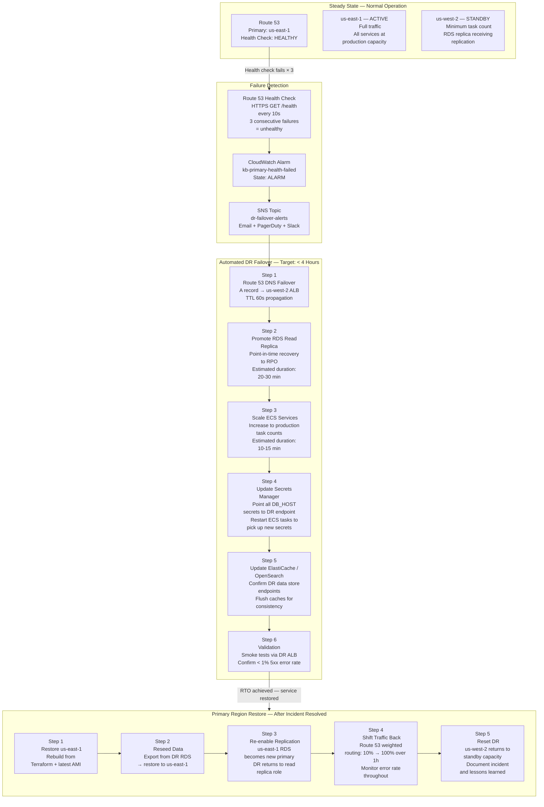

# Knowledge Base Platform — Cloud Architecture

## Overview

This document provides the full AWS cloud architecture for the Knowledge Base Platform evaluated against
the AWS Well-Architected Framework. It covers the six architecture pillars, the primary and disaster
recovery infrastructure diagrams, auto-scaling policies, cost estimates, security controls, backup
retention schedules, and observability design.

---

## 1. AWS Well-Architected Framework Review

### 1.1 Operational Excellence

The platform is designed for automated, observable, and continuously improving operations.

- **Infrastructure as Code:** All AWS resources are provisioned via Terraform with remote state stored in
  S3 with DynamoDB state locking. No manual console changes permitted in production; enforced via IAM
  deny policy on all human roles for `ec2:RunInstances`, `rds:CreateDBInstance`, etc.
- **CI/CD Automation:** GitHub Actions pipelines handle build, vulnerability scanning, and ECS blue/green
  deployment via AWS CodeDeploy. Every deployment is traceable to a git SHA. Auto-rollback triggers on
  CloudWatch alarm breach within the CodeDeploy bake window.
- **Runbooks:** All operational procedures are documented, version-controlled in this repository, and
  linked directly from PagerDuty alert definitions. Runbooks are tested during quarterly DR drills.
- **Observability:** Centralized structured logging in CloudWatch Logs (JSON format, 30-day live
  retention), distributed tracing via AWS X-Ray with service maps, and per-service CloudWatch dashboards
  with RED metrics (Rate, Errors, Duration).
- **Change Management:** All infrastructure changes require a pull request with at least one peer review.
  Emergency changes use a break-glass IAM role with full audit logging in CloudTrail and automatic
  PagerDuty notification on use.
- **Continuous Improvement:** Monthly operational reviews examine CloudWatch Insights queries, X-Ray
  anomaly patterns, and cost anomalies. Action items are tracked in Jira `INFRA` project.

### 1.2 Security

Security is enforced at every architectural layer using defense-in-depth principles.

- **Network Isolation:** All compute (ECS Fargate) and data resources (RDS, ElastiCache, OpenSearch) are
  in private subnets with no direct inbound internet access. Internet traffic reaches the platform only
  via CloudFront and the Application Load Balancer in public subnets.
- **WAF Protection:** AWS WAF v2 with managed rule groups (AWSManagedRulesCommonRuleSet,
  AWSManagedRulesKnownBadInputsRuleSet, AWSManagedRulesSQLiRuleSet) deployed on both CloudFront and ALB.
  Custom rate-limiting rule: block source IPs exceeding 10,000 requests per 5-minute window.
- **Identity and Access Management:** IAM roles with least-privilege scope per ECS service. No long-lived
  access keys. All secrets stored exclusively in AWS Secrets Manager with automatic rotation every 30 days.
- **Encryption:** Data encrypted in transit with TLS 1.2 minimum (TLSv1.2_2021 security policy at
  CloudFront and ALB). Data at rest encrypted with AES-256 using AWS KMS Customer Managed Keys (CMKs)
  for RDS, S3 (article-attachments and backups buckets), ElastiCache (in-transit and at-rest), and
  Secrets Manager.
- **Threat Detection:** AWS GuardDuty enabled for all accounts. Findings forwarded to AWS Security Hub.
  Security Hub runs CIS AWS Foundations Benchmark compliance checks continuously.
- **Vulnerability Management:** Container images scanned with Trivy on every GitHub Actions build
  (blocks on CRITICAL severity). ECR image scanning enabled for every push. OS-level patching of
  underlying Fargate infrastructure is managed by AWS.
- **Audit Trail:** AWS CloudTrail enabled for all API calls, stored in S3 with 90-day retention and
  forwarded to CloudWatch Logs. VPC Flow Logs capture all network traffic for 30 days. S3 server-access
  logging enabled for all buckets.

### 1.3 Reliability

The architecture tolerates AZ-level failures without service interruption and region-level failures
within a 4-hour RTO.

- **Multi-AZ Deployment:** ECS tasks distributed across 3 AZs by ECS scheduler. RDS Multi-AZ with
  synchronous standby replication (automatic failover < 60 seconds). ElastiCache Redis cluster mode with
  3 shards each with 1 read replica, distributed across 3 AZs. OpenSearch 3-node cluster across 3 AZs.
- **Load Balancer Health Checks:** ALB checks `/health` every 30 seconds. Unhealthy targets deregistered
  after 2 consecutive failures (60-second deregistration delay). ECS service requires minimum 2 healthy
  tasks per service at all times.
- **Circuit Breakers:** ECS Deployment Circuit Breaker enabled on all services — rolls back deployment
  automatically if > 50% of new task set fails to reach RUNNING state within 10 minutes.
- **Retry and Backoff:** All inter-service HTTP calls implement exponential backoff with jitter:
  initial delay 100ms, max delay 5s, max 3 retries. SQS messages for `worker-service` retry 3 times
  with a dead-letter queue for messages failing all retries.
- **DR Posture:** Active-passive disaster recovery to us-west-2. RDS cross-region read replica updated
  continuously (lag target < 5 minutes). S3 Cross-Region Replication for all buckets. Route 53 health
  checks with failover routing policy. RPO 1 hour, RTO 4 hours.

### 1.4 Performance Efficiency

Services are right-sized with dedicated caching and CDN layers that minimize latency at every tier.

- **CDN Layer:** CloudFront serves static widget assets from S3 with < 50 ms edge latency globally.
  CloudFront is not used to cache API responses (authenticated requests bypass cache).
- **Application Cache:** Multi-layer caching strategy. L1: in-process LRU cache per ECS task (5-second
  TTL, capped at 1,000 entries). L2: ElastiCache Redis cluster (300-second TTL for article content,
  60-second TTL for search results). Target cache hit rate: > 85% for article reads.
- **Search Performance:** Amazon OpenSearch with k-NN plugin for semantic vector search. Index
  optimizations: `refresh_interval: 30s`, `number_of_replicas: 1`, custom analyzer with edge-n-gram
  tokenizer for prefix search. Target P99 search latency: < 100 ms.
- **Database Performance:** RDS PostgreSQL 15 with `pg_stat_statements` extension enabled. Slow query
  logging for queries > 100 ms. PgBouncer connection pooling (transaction mode, pool size 50 per
  service). Read replica auto-scaling for heavy analytics workloads.
- **ECS Right-Sizing:** Task sizes reviewed monthly using AWS Compute Optimizer. Current sizes validated
  at observed average CPU of 45–55% under normal load and < 70% at 2× peak.

### 1.5 Cost Optimization

Costs are controlled through right-sizing, reserved capacity commitments, intelligent storage tiering,
and aggressive cache optimization to minimize expensive origin calls.

- **Compute Savings Plans:** 1-year Compute Savings Plan covers 60% of ECS Fargate baseline compute
  capacity, estimated 30% saving versus on-demand pricing.
- **RDS Reserved Instances:** 1-year reserved instance for RDS primary instance (db.r6g.2xlarge),
  estimated 40% saving versus on-demand.
- **ElastiCache Reserved Nodes:** 1-year reserved nodes for all ElastiCache cluster baseline nodes,
  estimated 35% saving.
- **S3 Intelligent-Tiering:** All S3 buckets use S3 Intelligent-Tiering to automatically move objects
  not accessed for 30 days to the Infrequent Access tier and after 90 days to Archive Instant Access.
- **CloudFront Cache Optimization:** Cache-hit ratio target > 80% for widget assets. Each 1% improvement
  in cache-hit ratio reduces origin data transfer and request costs by approximately 1%.
- **Cost Governance:** AWS Budgets alerts at 80% and 100% of monthly budget. Cost anomaly detection
  enabled with 10% threshold alert. Monthly FinOps review using AWS Cost Explorer with service-level
  cost allocation tags.

### 1.6 Sustainability

The infrastructure minimizes energy consumption and carbon footprint while meeting performance targets.

- **AWS Graviton2 Instances:** RDS (db.r6g series), ElastiCache (cache.r6g series), and OpenSearch
  (r6g.search series) all use AWS Graviton2 ARM processors, delivering approximately 20% better
  performance-per-watt compared to equivalent x86 instances.
- **Fargate Efficiency:** ECS Fargate eliminates idle EC2 host capacity. Tasks scale dynamically to
  minimum task counts during off-peak hours (02:00–08:00 UTC), reducing average active compute by
  approximately 35% versus fixed provisioning.
- **S3 Lifecycle Policies:** Backup data automatically transitions to S3 Glacier Deep Archive after 90
  days, reducing active storage energy consumption for cold data.
- **Right-Sizing Cadence:** Monthly review of AWS Compute Optimizer recommendations. Over-provisioned
  resources are right-sized within 30 days of recommendation.
- **Region Selection:** us-east-1 (Northern Virginia) is one of the AWS regions with the highest
  renewable energy usage. AWS targets 100% renewable energy for all global regions.

---

## 2. Full AWS Architecture Diagram

```mermaid
flowchart TD
    subgraph GLOBAL["AWS Global — Edge Services"]
        R53["Route 53
        Hosted Zone: knowledgebase.io
        Health Checks + Failover Routing"]
        CF["CloudFront
        Global CDN Distribution
        HTTPS-Only + OAC for S3"]
        WAF["AWS WAF v2
        Managed Rule Groups
        Rate Limiting + Geo Block"]
        ACM_E["ACM — us-east-1
        *.knowledgebase.io
        TLS 1.2 minimum"]
    end

    subgraph PRIMARY["AWS us-east-1 — Primary Region"]
        subgraph VPC_P["VPC 10.0.0.0/16"]
            subgraph PUB_P["Public Subnets — 3 AZs"]
                ALB_P["Application Load Balancer
                HTTPS :443
                WAF ACL attached"]
                NAT_P["NAT Gateways × 3
                One per AZ"]
                IGW_P(["Internet Gateway"])
            end
            subgraph APP_P["Private App Subnets — 3 AZs — 10.0.10-12.0/24"]
                API_P["ECS Fargate
                api-service
                4 vCPU / 8 GB"]
                WRK_P["ECS Fargate
                worker-service
                2 vCPU / 4 GB"]
                WGT_P["ECS Fargate
                widget-service
                1 vCPU / 2 GB"]
            end
            subgraph DATA_P["Private Data Subnets — 3 AZs — 10.0.20-22.0/24"]
                RDS_PP[("RDS PostgreSQL 15
                Primary Multi-AZ
                db.r6g.2xlarge")]
                EC_P[("ElastiCache Redis 7
                Cluster Mode — 3 Shards
                cache.r6g.large × 6")]
                OS_P["OpenSearch 2.x
                3-Node Cluster
                r6g.large.search"]
            end
            subgraph ENDPTS_P["VPC Endpoints"]
                VEP_S3["S3 Gateway"]
                VEP_SM["Secrets Manager"]
                VEP_ECR["ECR API + DKR"]
                VEP_CW["CloudWatch + Logs"]
            end
        end
        ECR_P["Amazon ECR
        Private Registry
        Image Scanning On"]
        SM_P["Secrets Manager
        DB / JWT / API Keys
        Auto-Rotation 30d"]
        SES_P["Amazon SES
        Email Notifications
        Verified Domain"]
        CW_P["CloudWatch
        Logs + Metrics + Alarms
        Dashboards + Insights"]
        XR_P["AWS X-Ray
        Service Map + Traces
        5% Sampling Rate"]
        S3_PRIMARY[("S3 Buckets
        article-attachments
        widget-assets
        backups")]
        SQS_P["Amazon SQS
        worker-jobs-queue
        DLQ: worker-jobs-dlq"]
    end

    subgraph DR_REGION["AWS us-west-2 — Disaster Recovery Region"]
        subgraph VPC_DR["VPC 10.1.0.0/16"]
            ALB_DR["ALB
            us-west-2
            Standby"]
            ECS_DR["ECS Fargate
            All Services
            Min Capacity — Standby"]
            RDSS_DR[("RDS PostgreSQL 15
            Cross-Region Read Replica
            Promotable in RTO")]
        end
        S3_DR[("S3 Buckets
        us-west-2
        CRR from us-east-1")]
        SM_DR["Secrets Manager
        us-west-2 Replica
        Automatic sync"]
    end

    R53 -->|"Primary A record"| CF
    R53 -->|"Failover routing"| ALB_DR
    CF --> WAF
    CF -->|"Origin: ALB"| ALB_P
    CF -->|"Origin: S3 OAC"| S3_PRIMARY
    ACM_E -.->|"Certificate"| CF
    ALB_P -->|"Target: api-service"| API_P
    ALB_P -->|"Target: widget-service"| WGT_P
    API_P -->|"Queue async jobs"| SQS_P
    SQS_P -->|"Consume jobs"| WRK_P
    API_P -->|"Read / Write"| RDS_PP
    API_P -->|"Cache tier"| EC_P
    API_P -->|"Full-text search"| OS_P
    API_P -->|"File storage"| S3_PRIMARY
    WRK_P -->|"DB writes"| RDS_PP
    WRK_P -->|"File processing"| S3_PRIMARY
    WRK_P -->|"Transactional email"| SES_P
    API_P & WRK_P & WGT_P -->|"Fetch secrets"| SM_P
    ECR_P -->|"Pull image"| API_P
    ECR_P -->|"Pull image"| WRK_P
    ECR_P -->|"Pull image"| WGT_P
    API_P & WRK_P & WGT_P -->|"Logs and metrics"| CW_P
    API_P & WRK_P -->|"Trace segments"| XR_P
    APP_P -.->|"Outbound traffic"| NAT_P
    NAT_P --> IGW_P
    RDS_PP -.->|"Async cross-region replication"| RDSS_DR
    S3_PRIMARY -.->|"Cross-Region Replication"| S3_DR
    SM_P -.->|"Secret replica"| SM_DR
    ECS_DR -->|"Reads from DR replica"| RDSS_DR
    SM_P <-.-> VEP_SM
    S3_PRIMARY <-.-> VEP_S3
    ECR_P <-.-> VEP_ECR
    CW_P <-.-> VEP_CW
```

---

## 3. Disaster Recovery Architecture

**Strategy:** Active-Passive with Route 53 health-check-driven automated DNS failover.  
**RPO (Recovery Point Objective):** 1 hour — RDS cross-region replication lag target < 5 minutes; S3 CRR
replication lag < 15 minutes for objects under 1 GB.  
**RTO (Recovery Time Objective):** 4 hours — includes RDS replica promotion (< 30 min), ECS scale-up
(< 15 min), DNS propagation (< 5 min), and smoke test validation (< 30 min).

---

## 4. Auto-Scaling Policies

### ECS Service Scaling

| Service | Metric | Scale-Out Threshold | Scale-In Threshold | Scale-Out Cooldown | Scale-In Cooldown | Min Tasks | Max Tasks |
|---|---|---|---|---|---|---|---|
| api-service | ECS CPU Utilization | > 70% | < 40% | 60 s | 300 s | 3 | 20 |
| api-service | ALB RequestCountPerTarget | > 1,000 req/min | < 400 req/min | 60 s | 300 s | 3 | 20 |
| worker-service | SQS ApproximateNumberOfMessages | > 500 messages | < 50 messages | 60 s | 300 s | 2 | 10 |
| widget-service | ECS CPU Utilization | > 70% | < 40% | 60 s | 300 s | 2 | 8 |

Scaling policy type: **Target Tracking** for CPU-based metrics.  
Scaling policy type: **Step Scaling** for SQS queue depth (1 task per 100 messages above threshold).  
Scale-out protection: New tasks must pass 2/2 ALB health checks before receiving traffic.

### RDS Read Replica Scaling

Read replicas are added and removed via a CloudWatch Alarm → Lambda → RDS API automation:

- **Add replica trigger:** `DatabaseConnections > 800` OR `ReadIOPS > 5,000` sustained for 10 minutes
- **Remove replica trigger:** `DatabaseConnections < 200` for 30 consecutive minutes
- **Maximum read replicas:** 5 (enforced by Lambda guard)
- **Read routing:** PgBouncer in read-only mode with `target_session_attrs=read-only` routes analytics
  and reporting queries to read replicas, protecting the primary from heavy scan workloads.

### CloudFront Cache Behaviors

| Path Pattern | Cache TTL | Cache Policy | Compress | Origin Shield |
|---|---|---|---|---|
| `/widget-assets/*` | 86,400 s (24 h) | CachingOptimized | Yes | Enabled (us-east-1) |
| `/api/*` | 0 (disabled) | CachingDisabled | No | Disabled |
| `/health` | 10 s | Custom (10 s min/max TTL) | No | Disabled |
| `/*` (default) | 3,600 s (1 h) | CachingOptimized | Yes | Enabled (us-east-1) |

---

## 5. Cost Estimation Table

| Service | Tier / Configuration | Est. Monthly Cost (USD) |
|---|---|---|
| ECS Fargate — api-service | 4 vCPU × 8 GB × 5 avg tasks × 730 h — Compute SP | $730 |
| ECS Fargate — worker-service | 2 vCPU × 4 GB × 3 avg tasks × 730 h — Compute SP | $220 |
| ECS Fargate — widget-service | 1 vCPU × 2 GB × 3 avg tasks × 730 h — Compute SP | $110 |
| RDS PostgreSQL 15 | db.r6g.2xlarge Multi-AZ — 1-year Reserved Instance | $480 |
| RDS Storage | 500 GB gp3 + automated backup storage | $80 |
| ElastiCache Redis 7 | cache.r6g.large × 6 nodes (3 shards × 2) — 1-year RI | $380 |
| Amazon OpenSearch 2.x | r6g.large.search × 3 nodes | $320 |
| Application Load Balancer | ~500 LCU/hr average + data processing | $160 |
| CloudFront | 500 GB/month transfer + 50M requests/month | $120 |
| Amazon SQS | 10M requests/month (worker queue) | $4 |
| S3 — all buckets | 1 TB total storage — Intelligent-Tiering | $50 |
| NAT Gateways × 3 | ~100 GB/month processed data | $110 |
| AWS WAF | 3 Web ACLs + 15 rules + 5M req/month | $60 |
| Amazon ECR | 20 GB image storage + data transfer | $20 |
| AWS Secrets Manager | 20 secrets × $0.40/month + API calls | $12 |
| Amazon Route 53 | 2 hosted zones + 6 health checks | $12 |
| Amazon SES | 100,000 emails/month | $10 |
| AWS X-Ray | 1M traces/month + 5M trace segments | $8 |
| CloudWatch | 50 GB logs + custom metrics + 30 alarms + dashboards | $90 |
| AWS CloudTrail | 1 trail + S3 storage | $15 |
| AWS KMS | 5 CMKs + 500K API calls/month | $18 |
| AWS GuardDuty | Per GB analyzed (estimated) | $25 |
| AWS ACM | Public certificates | $0 |
| **Total Estimated** | **All services combined** | **~$3,034 / month** |

*Estimates use us-east-1 on-demand pricing with applicable Savings Plan and Reserved Instance discounts.
Actual costs vary with traffic, storage growth, and data transfer patterns.*

---

## 6. Security Controls

| Control | Category | Description |
|---|---|---|
| WAF — AWSManagedRulesCommonRuleSet | WAF | OWASP Top 10 including XSS and SQLi protection on all requests |
| WAF — AWSManagedRulesKnownBadInputsRuleSet | WAF | Block known exploit patterns and bad user agents |
| WAF — AWSManagedRulesSQLiRuleSet | WAF | Additional SQL injection protection layer |
| WAF — Rate Limit Rule | WAF | Block source IPs exceeding 10,000 requests per 5-minute window |
| WAF — Bot Control | WAF | Managed bot protection; allow verified legitimate crawlers |
| WAF — Geo Restriction | WAF | Configurable country blocklist (default: empty, applied on demand) |
| ALB Security Group | Security Group | Inbound: TCP 443 from 0.0.0.0/0. Outbound: TCP 8080 to ECS SG only |
| ECS Security Group | Security Group | Inbound: TCP 8080 from ALB SG only. Outbound: Data SG + VPC Endpoints |
| RDS Security Group | Security Group | Inbound: TCP 5432 from ECS SG only. No internet egress |
| ElastiCache Security Group | Security Group | Inbound: TCP 6379 from ECS SG only |
| OpenSearch Security Group | Security Group | Inbound: TCP 443 and 9200 from ECS SG only |
| VPC Endpoint Policy — S3 | IAM Resource Policy | Restrict bucket access to `kb-platform` prefixes only |
| VPC Endpoint Policy — Secrets Manager | IAM Resource Policy | Restrict to secrets with `kb-platform/` path prefix |
| IAM — ECS Task Execution Role | IAM Role | ECR pull, CloudWatch log stream, Secrets Manager read. No `*` resources |
| IAM — ECS API Task Role | IAM Role | S3 read/write on article-attachments, SES send, X-Ray, CloudWatch metrics |
| IAM — ECS Worker Task Role | IAM Role | S3 read/write, SQS receive/delete, SES send, OpenSearch index write |
| Secrets Manager Auto-Rotation | Secrets | DB passwords, JWT signing keys rotated every 30 days via Lambda rotator |
| S3 Block Public Access | S3 | All buckets have `BlockPublicAcls`, `BlockPublicPolicy`, `IgnorePublicAcls` enabled |
| S3 CloudFront OAC | S3 | widget-assets bucket accessible only via CloudFront Origin Access Control |
| KMS CMK — RDS | Encryption | Dedicated CMK for RDS storage encryption. Key policy: ECS roles only |
| KMS CMK — S3 Sensitive | Encryption | Dedicated CMK for article-attachments and backups buckets |
| KMS CMK — Secrets Manager | Encryption | Dedicated CMK for all Secrets Manager secrets |
| CloudTrail | Audit | All-region trail. S3 storage + CloudWatch Logs forwarding. 90-day retention |
| VPC Flow Logs | Audit | All VPC interfaces. CloudWatch Logs. 30-day retention. REJECT events alerting |
| AWS GuardDuty | Threat Detection | Enabled. Findings forwarded to Security Hub. P1 findings trigger PagerDuty |
| AWS Security Hub | CSPM | CIS AWS Foundations Benchmark + AWS Foundational Security Best Practices |
| TLS Policy — CloudFront | TLS | Security policy: TLSv1.2_2021. Minimum TLS 1.2. Supports TLS 1.3 |
| TLS Policy — ALB | TLS | Security policy: ELBSecurityPolicy-TLS13-1-2-2021-06. TLS 1.2 minimum |
| HSTS | HTTP Header | `Strict-Transport-Security: max-age=31536000; includeSubDomains; preload` |

---

## 7. Backup and Retention Policy

| Data Source | Backup Method | Frequency | Retention Period | Storage Location | Encryption |
|---|---|---|---|---|---|
| RDS PostgreSQL — primary | Automated snapshots | Daily (02:00 UTC) | 35 days | AWS-managed S3 | AES-256 KMS CMK |
| RDS PostgreSQL — pre-deploy | Manual snapshot | Every production deployment | 7 days | AWS-managed S3 | AES-256 KMS CMK |
| RDS PostgreSQL — cross-region | Automated cross-region copy | Daily | 7 days | us-west-2 AWS-managed S3 | AES-256 KMS |
| RDS Transaction Logs | Continuous automated backup | Continuous (5-min intervals) | 35 days (PITR window) | AWS-managed S3 | AES-256 KMS |
| S3 — article-attachments | S3 Versioning + CRR | Continuous (on every write) | 90 days (version history) | us-west-2 CRR | SSE-KMS CMK |
| S3 — backups | S3 Versioning + Lifecycle | Continuous | 90 days active → Glacier Deep Archive 7 years | us-east-1 + Glacier | SSE-KMS CMK |
| ElastiCache Redis | Automated daily backup (RDB snapshot) | Daily | 7 days | AWS-managed S3 | AES-256 |
| OpenSearch — snapshots | Automated to S3 snapshot repository | Hourly | 14 days | S3 — kb-opensearch-snapshots | SSE-KMS |
| CloudWatch Logs | Log group retention + S3 export | Continuous (live); daily export | 30 days live; 1 year S3 archive | CloudWatch + S3 | SSE managed |
| Secrets Manager | Cross-region replication | Continuous | Current version + 30-day rotation history | us-west-2 replica | AES-256 KMS |
| Terraform State | S3 versioning + DynamoDB lock | On every `terraform apply` | Unlimited (versioned) | S3 — kb-tf-state | SSE-KMS |

---

## 8. Monitoring and Alerting

### Critical CloudWatch Alarms

| Alarm Name | Metric Namespace | Metric | Threshold | Evaluation | Action |
|---|---|---|---|---|---|
| kb-api-5xx-rate | AWS/ApplicationELB | HTTPCode_Target_5XX_Count | > 1% of total requests | 2 of 2 min | PagerDuty P1 + Slack |
| kb-api-p99-latency | AWS/ApplicationELB | TargetResponseTime (p99) | > 1,000 ms | 3 of 5 min | PagerDuty P2 + Slack |
| kb-api-cpu-high | AWS/ECS | CPUUtilization (api-service) | > 85% | 3 of 5 min | Scale-out trigger + Slack |
| kb-worker-dlq-depth | AWS/SQS | ApproximateNumberOfMessagesNotVisible (DLQ) | > 10 | 1 of 1 min | PagerDuty P2 + Slack |
| kb-rds-cpu | AWS/RDS | CPUUtilization | > 80% | 2 of 3 min | PagerDuty P2 + Slack |
| kb-rds-connections | AWS/RDS | DatabaseConnections | > 900 | 2 of 2 min | Slack alert + add read replica |
| kb-rds-free-storage | AWS/RDS | FreeStorageSpace | < 20 GB | 1 of 1 min | PagerDuty P1 |
| kb-rds-failover | AWS/RDS | MultiAZFailover | Any change detected | Immediately | PagerDuty P1 + Slack |
| kb-redis-cpu | AWS/ElastiCache | CPUUtilization | > 70% | 3 of 5 min | Slack alert |
| kb-redis-evictions | AWS/ElastiCache | Evictions | > 100 per min | 2 of 2 min | Slack alert (cache capacity) |
| kb-opensearch-red | AWS/ES | ClusterStatus.red | ≥ 1 | 1 of 1 min | PagerDuty P1 |
| kb-opensearch-cpu | AWS/ES | CPUUtilization | > 80% | 3 of 5 min | Slack alert |
| kb-vpc-reject-spike | VPCFlowLogs (custom metric) | REJECT events | > 500 per min | 2 of 2 min | Security team alert |
| kb-budget-80pct | AWS/Billing | EstimatedCharges | > 80% of monthly budget | Daily | Email + Slack |
| kb-primary-health-failed | Route53 | HealthCheckStatus | < 1 (unhealthy) | 3 of 3 checks | DR SNS topic trigger |

### AWS X-Ray Tracing Configuration

- **Sampling Rate:** 5% of all requests in production. 100% sampling for error traces (5xx responses).
- **Service Map:** Enabled for all three ECS services showing dependency graph, latency heatmap, and
  error rates between all downstream services (RDS, ElastiCache, OpenSearch, S3, SES).
- **Trace Groups:**
  - `kb-api-errors` — captures all traces with HTTP 5xx status codes
  - `kb-slow-requests` — captures all traces with total duration > 1,000 ms
  - `kb-db-slow-queries` — captures all traces with RDS subsegment duration > 100 ms
- **X-Ray Insights:** Enabled with anomaly detection. Alerts on P99 latency increase > 20% vs baseline.
- **Retention:** X-Ray traces retained for 30 days.

### Log Groups and Retention

| Log Group | Retention | Export | Description |
|---|---|---|---|
| `/ecs/kb-platform/api-service` | 30 days | Daily to S3 (1 year) | API service structured JSON logs |
| `/ecs/kb-platform/worker-service` | 30 days | Daily to S3 (1 year) | Worker job execution and error logs |
| `/ecs/kb-platform/widget-service` | 30 days | Daily to S3 (1 year) | Widget service access and error logs |
| `/aws/rds/kb-platform/postgresql` | 7 days | No | RDS slow query log (> 100 ms) |
| `/aws/rds/kb-platform/error` | 7 days | No | RDS database error log |
| `/aws/elasticache/kb-platform` | 7 days | No | ElastiCache slow log and engine log |
| `/aws/waf/kb-platform-cf` | 90 days | No | WAF sampled request logs — CloudFront |
| `/aws/waf/kb-platform-alb` | 90 days | No | WAF sampled request logs — ALB |
| `VPCFlowLogs/kb-platform` | 30 days | No | VPC network flow logs — all interfaces |
| `CloudTrail/kb-platform` | 90 days | S3 (7 years) | AWS API audit trail |

---

## 9. Operational Policy Addendum

### 9.1 Content Governance Policies

The Knowledge Base Platform enforces structured content governance at the application and infrastructure
layers. All article mutations (create, update, publish, archive, delete) generate an immutable audit
record in `article_audit_log` — the application database role has INSERT-only permission on this table.
The content review workflow is enforced in the api-service; role-based gates prevent Contributors from
bypassing the Editor review queue. Articles flagged by the automated link-scanner job (run by
worker-service on a weekly cron) are automatically demoted to draft and the author notified via SES.
Content data is retained in S3 Glacier for 7 years as required for compliance and legal holds.
The Legal department is notified automatically via SES when articles tagged with regulated content
categories (medical, legal, financial) are submitted for publication, using an SNS-to-SES pipeline.

### 9.2 Reader Data Privacy Policies

Reader privacy is protected by design at the infrastructure level. ElastiCache Redis session TTLs are
enforced at 24 hours with no application-level override path. IP address anonymization is performed in
the api-service middleware before any log line is written to CloudWatch Logs, ensuring no full IP
addresses appear in any log group. The `/api/v1/privacy/deletion-request` endpoint triggers a
worker-service job that purges all records associated with the requesting user across RDS and
ElastiCache within 5 business days. GDPR Article 33 breach notification timelines (72-hour regulatory,
7-day reader) are enforced by the Security Incident Response Plan. All S3 buckets have public access
blocked at the account level in addition to the bucket level. No third-party analytics scripts or
tracking pixels are served from any platform page.

### 9.3 AI Usage Policies

All AI-powered features are implemented with mandatory human approval gates in the application workflow.
The api-service enforces a middleware check that prevents any content with `ai_generated: true` metadata
from reaching `published` state without an Editor approval event in the audit log. Third-party LLM API
calls are proxied through a controlled service that strips user identifiers and internal metadata before
forwarding requests; direct LLM API access from ECS tasks is blocked by the ECS task role IAM policy.
ML model performance metrics (accuracy, precision, recall, latency) are emitted as CloudWatch custom
metrics and monitored with alarms. Model Registry entries are required before any ML model is deployed
to production; deployment without a registered entry is blocked by the CI/CD pipeline validation step.

### 9.4 System Availability Policies

SLO compliance is tracked continuously via CloudWatch metric math expressions computing error budget
burn rate. An accelerated burn rate alert (consuming 5% of monthly error budget in 1 hour) triggers an
immediate PagerDuty P1 regardless of the raw error rate. The on-call rotation is maintained in
PagerDuty with a primary and secondary on-call engineer at all times. DR failover drills are scheduled
semi-annually; the last drill date and outcome are tracked in the `infrastructure/dr-runbook.md` file.
Planned maintenance is communicated via the status page (status.knowledgebase.io) powered by a
separate Route 53 + S3 + CloudFront stack isolated from the main platform, ensuring the status page
remains available during platform maintenance windows.
