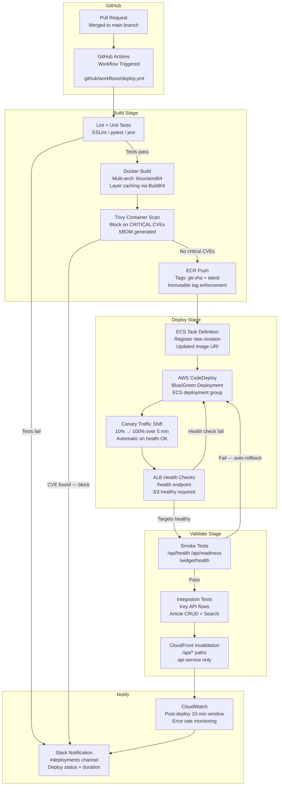

# Knowledge Base Platform — Deployment Diagram

## Overview

This document describes the end-to-end deployment topology for the Knowledge Base Platform hosted on AWS ECS
Fargate. It covers the full infrastructure layout, CI/CD pipeline, container task specifications, operational
runbook for zero-downtime blue/green deployments, rollback procedures, and platform governance policies.

---

## 1. Infrastructure Deployment Diagram

The diagram below shows all AWS services, their network placement across three Availability Zones, and the
request path from end users through to backing data stores. AWS WAF inspection is applied at both the
CloudFront edge layer and the Application Load Balancer.

```mermaid
flowchart TD
    subgraph INTERNET["Internet"]
        Users(["End Users"])
        GHA(["GitHub Actions CI/CD"])
    end

    subgraph EDGE["AWS Edge — Global"]
        R53["Route 53
        Hosted Zone + Health Checks"]
        WAF_CF["AWS WAF
        CloudFront Web ACL
        Rate / Geo / SQLi / XSS"]
        CF["CloudFront
        CDN Distribution
        HTTPS-Only + OAC"]
        ACM["ACM
        *.knowledgebase.io
        TLS 1.2 minimum"]
    end

    subgraph VPC["VPC — 10.0.0.0/16 — us-east-1"]
        subgraph PUBLIC["Public Subnets — AZ-1a / AZ-1b / AZ-1c"]
            IGW(["Internet Gateway"])
            NAT_A["NAT Gateway
            AZ-1a  10.0.0.0/24"]
            NAT_B["NAT Gateway
            AZ-1b  10.0.1.0/24"]
            NAT_C["NAT Gateway
            AZ-1c  10.0.2.0/24"]
            WAF_ALB["AWS WAF
            ALB Web ACL"]
            ALB["Application Load Balancer
            HTTPS :443  HTTP→HTTPS redirect
            Multi-AZ"]
        end

        subgraph APP["Private App Subnets — AZ-1a / AZ-1b / AZ-1c — 10.0.10-12.0/24"]
            API["ECS Fargate
            api-service
            4 vCPU / 8 GB RAM"]
            WRK["ECS Fargate
            worker-service
            2 vCPU / 4 GB RAM"]
            WGT["ECS Fargate
            widget-service
            1 vCPU / 2 GB RAM"]
        end

        subgraph DATA["Private Data Subnets — AZ-1a / AZ-1b / AZ-1c — 10.0.20-22.0/24"]
            RDSP[("RDS PostgreSQL 15
            Primary — AZ-1a
            db.r6g.2xlarge")]
            RDSS[("RDS PostgreSQL 15
            Standby — AZ-1b
            Multi-AZ Sync Replica")]
            EC1[("ElastiCache Redis 7
            Shard 1 — AZ-1a
            cache.r6g.large")]
            EC2[("ElastiCache Redis 7
            Shard 2 — AZ-1b
            cache.r6g.large")]
            EC3[("ElastiCache Redis 7
            Shard 3 — AZ-1c
            cache.r6g.large")]
            OS["Amazon OpenSearch 2.x
            3-Node Cluster
            r6g.large.search × 3"]
        end

        subgraph ENDPTS["VPC Endpoints"]
            EP_S3["S3 Gateway Endpoint"]
            EP_SM["Secrets Manager
            Interface Endpoint"]
            EP_ECR["ECR
            Interface Endpoints"]
            EP_CW["CloudWatch
            Interface Endpoint"]
        end
    end

    subgraph STORAGE["AWS Storage — us-east-1"]
        S3A[("S3
        article-attachments
        Private + Versioned")]
        S3W[("S3
        widget-assets
        CloudFront OAC")]
        S3B[("S3
        backups
        Lifecycle → Glacier")]
    end

    ECR["Amazon ECR
    Private Container Registry
    Image Scanning Enabled"]
    SM["AWS Secrets Manager
    DB / API / JWT Secrets
    Auto-Rotation 30 days"]
    CW["CloudWatch
    Logs + Metrics + Alarms
    Dashboards"]
    XR["AWS X-Ray
    Distributed Tracing
    Service Map"]
    SES["Amazon SES
    Email Notifications
    Verified Domain"]

    Users -->|"HTTPS"| R53
    R53 -->|"A / AAAA record"| CF
    WAF_CF -.->|"Inspect and filter"| CF
    ACM -.->|"TLS certificate"| CF
    CF -->|"Origin HTTPS"| ALB
    CF -->|"Static assets"| S3W
    WAF_ALB -.->|"Inspect and filter"| ALB
    ALB -->|"Target Group: api"| API
    ALB -->|"Target Group: widget"| WGT
    API -->|"Async jobs"| WRK
    API -->|"CRUD queries"| RDSP
    API -->|"Cache read/write"| EC1
    API -->|"Cache read/write"| EC2
    API -->|"Cache read/write"| EC3
    API -->|"Full-text search"| OS
    API -->|"Upload and fetch files"| S3A
    WRK -->|"CRUD queries"| RDSP
    WRK -->|"Process attachments"| S3A
    WRK -->|"Send transactional email"| SES
    RDSP -.->|"Synchronous replication"| RDSS
    RDSP -.->|"Automated daily snapshots"| S3B
    API -->|"Fetch secrets"| SM
    WRK -->|"Fetch secrets"| SM
    WGT -->|"Fetch secrets"| SM
    API -->|"Logs and metrics"| CW
    WRK -->|"Logs and metrics"| CW
    WGT -->|"Logs and metrics"| CW
    API -->|"Trace segments"| XR
    WRK -->|"Trace segments"| XR
    ECR -->|"Pull container image"| API
    ECR -->|"Pull container image"| WRK
    ECR -->|"Pull container image"| WGT
    APP -.->|"Outbound via NAT AZ-a"| NAT_A
    APP -.->|"Outbound via NAT AZ-b"| NAT_B
    APP -.->|"Outbound via NAT AZ-c"| NAT_C
    NAT_A --> IGW
    NAT_B --> IGW
    NAT_C --> IGW
    GHA -->|"Push tagged image"| ECR
    S3A <-.->|"Private access"| EP_S3
    SM <-.->|"Private access"| EP_SM
    ECR <-.->|"Private access"| EP_ECR
    CW <-.->|"Private access"| EP_CW
```



---

## 2. CI/CD Pipeline

All production deployments use GitHub Actions for build orchestration. Images are security-scanned with
Trivy before push. ECS deployments use AWS CodeDeploy blue/green strategy with automated rollback on
CloudWatch alarm breach. CloudFront cache is invalidated for the API service after each successful deploy.



---

## 3. ECS Task Definitions

| Service | vCPU | Memory (GB) | Min Tasks | Max Tasks | Scaling Trigger | Health Check Path |
|---|---|---|---|---|---|---|
| api-service | 4 | 8 | 3 | 20 | CPU > 70% or ALB RequestCount > 1,000/min per target | `/api/health` |
| worker-service | 2 | 4 | 2 | 10 | SQS `ApproximateNumberOfMessages` > 500 | `/worker/health` |
| widget-service | 1 | 2 | 2 | 8 | CPU > 70% or ALB RequestCount > 500/min per target | `/widget/health` |

**Platform Version:** `LATEST` (Fargate 1.4.0+)  
**Operating System:** Linux/X86_64  
**Network Mode:** `awsvpc` (each task gets its own ENI)  
**Task Execution Role:** `ecs-kb-task-execution-role` — ECR pull, CloudWatch log stream creation, Secrets Manager read  
**Task Role:** `ecs-kb-api-task-role` — S3 read/write, SES send, X-Ray put trace segments, CloudWatch put metrics  
**Container Registry:** `123456789.dkr.ecr.us-east-1.amazonaws.com/kb-platform/<service>:<git-sha>`  
**Log Driver:** `awslogs` — Log group: `/ecs/kb-platform/<service>` — Retention: 30 days  
**Stop Timeout:** 120 seconds (allows graceful drain of in-flight requests)  
**Deployment Circuit Breaker:** Enabled — rollback if > 50% of new tasks fail within 10 minutes

---

## 4. Blue/Green Deployment Runbook

This runbook covers the standard blue/green deployment procedure using AWS CodeDeploy with ECS. All steps
must be followed in sequence. No step may be skipped without documented approval.

### Prerequisites

- AWS CLI authenticated with `ecs-deploy-role` IAM profile
- CodeDeploy application `kb-platform-<service>` and deployment group `kb-<service>-prod` exist
- New container image has been pushed to ECR with immutable tag verified
- Change freeze calendar checked — no active freeze window (`#change-control` Slack channel)
- Deployment time window: Monday–Friday 09:00–17:00 UTC; outside window requires on-call lead approval

### Deployment Steps

1. **Announce Deployment**  
   Post in `#deployments` Slack: `"Starting deploy: <service> image <git-sha> → production. ETA 20 min."`

2. **Pre-deploy Snapshot (api-service only)**
   ```bash
   aws rds create-db-snapshot \
     --db-instance-identifier kb-platform-prod \
     --db-snapshot-identifier pre-deploy-$(date +%Y%m%d-%H%M) \
     --region us-east-1
   ```

3. **Register New Task Definition Revision**
   ```bash
   aws ecs register-task-definition \
     --cli-input-json file://task-defs/kb-<service>.json \
     --region us-east-1
   ```

4. **Verify Task Definition Registered Correctly**
   ```bash
   aws ecs describe-task-definition \
     --task-definition kb-<service> \
     --query "taskDefinition.{rev:revision,cpu:cpu,mem:memory}" \
     --region us-east-1
   ```

5. **Trigger CodeDeploy Blue/Green Deployment**
   ```bash
   aws deploy create-deployment \
     --application-name kb-platform-<service> \
     --deployment-group-name kb-<service>-prod \
     --deployment-config-name CodeDeployDefault.ECSCanary10Percent5Minutes \
     --revision revisionType=AppSpecContent,content=$(cat appspec-<service>.json | jq -c .) \
     --description "Deploy <git-sha> via GitHub Actions run <run-id>" \
     --region us-east-1
   ```

6. **Monitor Canary Traffic Shift**  
   Watch CloudWatch dashboard `kb-platform-prod`. Confirm `5xx error rate < 0.5%` and
   `P99 latency < 500ms` during the canary phase (10% traffic for 5 minutes).

7. **Monitor Full Traffic Shift**  
   After canary succeeds, CodeDeploy shifts 100% of traffic to new task set. Continue watching
   dashboard for 5 additional minutes.

8. **Run Smoke Tests**
   ```bash
   ./scripts/smoke-test.sh --env prod --service <service> --base-url https://api.knowledgebase.io
   ```

9. **Run Integration Tests**
   ```bash
   ./scripts/integration-test.sh --env prod --suite post-deploy
   ```

10. **Invalidate CloudFront Cache** (api-service deployments only)
    ```bash
    aws cloudfront create-invalidation \
      --distribution-id EXKB1234567890 \
      --paths "/api/*" "/health" \
      --region us-east-1
    ```

11. **Bake Period**  
    Monitor for 30 minutes post-deployment. Watch `kb-api-5xx-rate` and `kb-api-p99-latency` alarms.

12. **Terminate Blue Task Set**  
    CodeDeploy automatically terminates the old (blue) task set after the bake period. Confirm in
    ECS console that only the new (green) task set is running.

13. **Announce Completion**  
    Post in `#deployments`: `"Deploy complete: <service> <git-sha> to production ✅ Duration: <N> min."`

---

## 5. Rollback Procedure

Rollback must be initiated when any of the following conditions are observed post-deployment:

- HTTP 5xx error rate > 1% for more than 2 consecutive minutes
- P99 API latency > 1,000 ms for more than 2 consecutive minutes
- Any CloudWatch alarm in `ALARM` state on the `kb-platform-prod` dashboard
- Smoke or integration tests failing during deployment pipeline
- Manual trigger by on-call engineer or engineering lead

### Automated Rollback (CodeDeploy)

CodeDeploy deployment groups are configured with `AutoRollbackEnabled: true` with triggers on
`DEPLOYMENT_FAILURE` and `DEPLOYMENT_STOP_ON_ALARM`. The following CloudWatch alarms are wired to each
deployment group:

- `kb-api-5xx-error-rate` — threshold: > 1% of ALB requests
- `kb-api-p99-latency` — threshold: P99 > 1,000 ms on ALB target response time
- `kb-worker-dlq-depth` — threshold: Dead Letter Queue depth > 10 messages

### Manual Rollback Steps

1. **Identify Last Stable Task Definition Revision**
   ```bash
   aws ecs list-task-definitions \
     --family-prefix kb-<service> \
     --sort DESC \
     --max-items 5 \
     --region us-east-1
   ```

2. **Force New ECS Service Deployment with Previous Revision**
   ```bash
   aws ecs update-service \
     --cluster kb-platform-prod \
     --service kb-<service>-svc \
     --task-definition kb-<service>:<previous-revision-number> \
     --force-new-deployment \
     --region us-east-1
   ```

3. **Wait for Rollback Completion**
   ```bash
   aws ecs wait services-stable \
     --cluster kb-platform-prod \
     --services kb-<service>-svc \
     --region us-east-1
   ```

4. **Verify Service Health**
   ```bash
   ./scripts/smoke-test.sh --env prod --service <service>
   ```

5. **Restore Pre-Deploy Snapshot if Data Corruption Suspected**  
   Coordinate with DB Admin. Restore from the pre-deploy RDS snapshot created in Step 2 of the
   deployment runbook. This action requires VP Engineering approval.

6. **Create Incident Ticket**  
   Open a Jira ticket in the `INFRA` project with deployment timeline, error evidence, root cause
   hypothesis, and immediate remediation actions taken.

7. **Announce Rollback in `#deployments`**  
   `"ROLLBACK complete: <service> rolled back to revision <N> at <timestamp>. Incident ticket: INFRA-<N>."`

---

## 6. Operational Policy Addendum

### 6.1 Content Governance Policies
**Policy Owner:** Head of Content Operations  
**Effective Date:** 2024-01-01 | **Review Cycle:** Annual

**Content Creation Standards**  
All articles must include: title (max 100 characters), summary (max 160 characters), body content (minimum
200 words for publication), at least one category tag, author attribution, and a publication date. Articles
that do not meet these metadata requirements are blocked from publication by the CMS validation layer.
All article body content must be authored in Markdown and rendered server-side — no raw HTML is permitted
in article bodies to prevent XSS vulnerabilities.

**Review and Approval Workflow**  
Articles authored by Contributor-level users are placed in a pending-review queue and require approval from
at least one Editor before publication. Editor-level users may self-publish but are subject to weekly
content audits by the Content Operations team. Administrator-level users have immediate publish authority
with no review gate; all admin publications are logged with elevated audit priority. Emergency publications
bypassing standard review require written sign-off from the Content Operations Manager and are recorded in
the `article_audit_log` table as `emergency_publish` events.

**Content Freshness and Accuracy**  
Articles that have not been reviewed or updated in 12 months are automatically tagged `needs-review` and
surfaced in the Content Audit Dashboard. The `worker-service` runs a weekly link-scanner job that checks
all outbound hyperlinks; articles with broken links are downgraded to draft state and the attributed
author is notified via SES email. Factual corrections must be tracked in the article version history table
with a visible correction note rendered above the article body for reader transparency.

**Prohibited Content**  
Personally identifiable information (PII) must not appear in article bodies, titles, tags, or metadata.
The CMS validation layer runs a PII-detection scan on all content before save. Content providing legal,
medical, or financial advice requires a compliance category tag and Legal department sign-off before
publication. External hyperlinks are validated against a blocklist maintained in the `kb_blocked_domains`
database table, which is updated weekly by the Security team.

**Archival and Deletion Policy**  
Articles transitioned to `archived` status remain accessible via their canonical URL but are excluded from
all search indexes and recommendation feeds. Permanent deletion requires Content Operations Manager
approval; the deleted article's slug is reserved in the `kb_reserved_slugs` table for 90 days to prevent
broken external links. All article revisions and audit records are retained in S3 (Glacier tier after 90
days) for a minimum of 7 years to satisfy compliance requirements.

### 6.2 Reader Data Privacy Policies

**Policy Owner:** Data Protection Officer  
**Effective Date:** 2024-01-01 | **Review Cycle:** Annual — aligned with GDPR, CCPA, and applicable
regional data protection regulations

**Data Collection Minimization**  
The platform collects only the data necessary for service delivery. Collected data includes: IP address
(anonymized to /24 prefix after 24 hours), session identifiers (non-persistent, ephemeral), search query
strings (stored in aggregated form only — never linked to individual sessions after 1 hour), article view
events (aggregated analytics only), and explicit feedback submissions (star rating plus optional free-text
comment). No reader account is required to access published articles. Authenticated sessions are used
exclusively for personalization features (bookmarks, reading history) which require explicit opt-in.

**Cookie and Tracking Policy**  
Session management uses one essential cookie (`session_id`, HttpOnly, Secure, SameSite=Strict, 24h TTL)
and one functional preference cookie (`theme_pref`, 365d TTL). No advertising, analytics, or third-party
tracking cookies are placed. No third-party tracking pixels, beacon scripts, or fingerprinting scripts are
loaded on any platform page.

**Data Retention**  
Session data in ElastiCache Redis expires via TTL at 24 hours with no persistent copy. Aggregated
analytics are stored in RDS PostgreSQL and retained for 24 months then purged by a scheduled
`worker-service` job. Feedback submissions are retained for 36 months. All backup archives containing
personal data are encrypted at rest (AES-256 via KMS CMK) and follow the backup retention schedule.

**Data Subject Rights**  
Readers may exercise the following rights via the `/api/v1/privacy` endpoint suite: right of access
(data export delivered within 30 days), right of rectification (handled via support ticket), right of
erasure (deletion job initiated within 5 business days, confirmation email via SES), and right to
restriction of processing (account suspended within 24 hours of request). Data portability export is
provided in JSON format. All data subject requests are logged in `kb_privacy_requests` with status
tracking.

**Breach Notification**  
In the event of a confirmed data breach affecting reader data, the DPO must be notified within 1 hour of
discovery. Regulatory notification to relevant supervisory authorities must occur within 72 hours of
confirmed breach. Affected readers must be individually notified within 7 days if the breach poses high
risk to their rights and freedoms. The Security Incident Response Plan (SIRP) defines full breach response
procedures.

### 6.3 AI Usage Policies

**Policy Owner:** Chief Technology Officer  
**Effective Date:** 2024-01-01 | **Review Cycle:** Semi-annual

**AI Features in Production Scope**  
Semantic search and article ranking powered by Amazon OpenSearch vector k-NN with text embeddings.
AI-assisted content recommendations (related articles, next-best-article) served by the Smart
Recommendation Engine microservice. Automated content quality scoring (readability index, completeness
score, SEO signal) run as a `worker-service` background job. AI-generated article summaries are an
opt-in Editor feature backed by a third-party LLM API accessed via a private VPC-endpoint-proxied
integration.

**Human Oversight Requirements**  
No AI system on the platform has authority to publish, modify, archive, or delete any content
autonomously. All AI-generated content (summaries, suggestions, rewrite proposals) is presented to human
Editors as advisory inputs clearly labeled `AI-Suggested` in the CMS UI. AI content quality scores are
advisory only and do not gate publication. AI-driven search ranking changes require a controlled A/B test
with a minimum of 10,000 user sessions before full rollout, with results reviewed by the Product and
Engineering leads.

**Model Governance**  
Every ML model in production must be registered in the Model Registry (internal Confluence page) with:
model name and version, training data description and lineage, bias evaluation methodology and results,
performance metrics (precision, recall, NDCG for ranking), and the deployment date and approving
engineer. Model updates to production require sign-off from the CTO and Lead ML Engineer. Models showing
accuracy degradation exceeding 10% versus their baseline are automatically flagged for retraining via a
CloudWatch metric alarm and must be retrained or rolled back within 14 days.

**Third-Party LLM API Governance**  
Third-party LLM API integrations must be assessed by the DPO and Security team before integration.
Reader PII, proprietary unpublished article content, and internal business data must not be sent to
external LLM APIs without explicit DPO approval and a signed Data Processing Agreement. LLM API calls are
routed through a controlled proxy service that strips any metadata fields containing user identifiers
before forwarding requests.

**Transparency and Labeling**  
Articles containing AI-assisted content display a visible `AI-Assisted` badge. AI-powered recommendations
are labeled "Suggested for you" with a user-accessible link to the AI Recommendation Policy page.
The platform's AI usage practices are published in the annual Transparency Report on the company website.

### 6.4 System Availability Policies

**Policy Owner:** VP of Engineering  
**Effective Date:** 2024-01-01 | **Review Cycle:** Quarterly

**Service Level Objectives (SLOs)**

| Endpoint | Availability Target | P99 Latency Target | Measurement Window |
|---|---|---|---|
| Article Read API | 99.9% (≤ 43.8 min downtime/month) | ≤ 300 ms | Rolling 30 days |
| Search API | 99.9% | ≤ 500 ms | Rolling 30 days |
| CMS Write API | 99.5% (≤ 3.65 hr downtime/month) | ≤ 800 ms | Rolling 30 days |
| Widget Embed (CloudFront) | 99.95% | ≤ 100 ms (edge-served) | Rolling 30 days |

**Scheduled Maintenance Windows**  
Maintenance windows are Sundays 02:00–06:00 UTC. Maintenance must be announced in the `#status` Slack
channel and posted on the external status page (status.knowledgebase.io) at least 48 hours in advance.
RDS minor version upgrades and OS patching for ECS host infrastructure are scheduled automatically within
this window. Planned maintenance duration is excluded from SLO calculations.

**Incident Response**  
Incidents are classified as P1 (full platform outage), P2 (partial degradation affecting > 10% of users),
or P3 (minor degradation). P1 incidents trigger a PagerDuty alert to the on-call engineer within 5
minutes via CloudWatch Alarm → SNS → PagerDuty. P1 SLAs: acknowledge within 15 minutes, post initial
update to status page within 30 minutes, target resolution within 4 hours. P2 SLAs: acknowledge within
30 minutes, resolution target 8 hours. Post-Incident Reviews (PIR) are mandatory for all P1 and P2
incidents and must be completed within 5 business days.

**Capacity Management**  
ECS auto-scaling maintains average CPU below 70% across each service fleet. Monthly capacity reviews
assess projected growth against current scaling limits. When projected 90-day demand exceeds 80% of
current maximum task count, a scaling limit increase request is submitted. RDS storage auto-scaling is
enabled up to 1 TB maximum. CloudFront and ALB are managed services with effectively unlimited capacity.

**Disaster Recovery Commitments**  
RPO (Recovery Point Objective): 1 hour. RTO (Recovery Time Objective): 4 hours. DR failover to us-west-2
is tested via tabletop exercise quarterly and via active failover drill semi-annually. Drill results and
any identified gaps are documented in `infrastructure/dr-runbook.md` and remediated before the next
scheduled drill.
