# Knowledge Base Platform — Network Infrastructure

## Overview

This document specifies the complete network infrastructure for the Knowledge Base Platform on AWS,
including VPC design with subnet layout, security group rules, NACLs, DNS architecture, TLS configuration,
DDoS protection, bandwidth targets, and network governance policies. All networking follows AWS best
practices for defense-in-depth using layered security controls at the VPC, subnet, and host levels.

---

## 1. VPC Architecture Diagram

The VPC uses a three-tier subnet model (public, private-app, private-data) replicated across three
Availability Zones in us-east-1. All data plane traffic between ECS tasks and backing services flows
entirely within private subnets without traversing the internet. Outbound internet access from private
subnets uses a dedicated NAT Gateway per AZ to eliminate cross-AZ NAT traffic charges and provide AZ
fault isolation. AWS-service traffic (S3, ECR, Secrets Manager, CloudWatch) flows via VPC Endpoints
without leaving the AWS network.

```mermaid
flowchart TD
    subgraph INTERNET["Internet"]
        IGW(["Internet Gateway
        us-east-1"])
        USERS(["End Users / External Traffic"])
        CF(["CloudFront CDN
        Origin Request to ALB"])
    end

    subgraph VPC["VPC — 10.0.0.0/16 — us-east-1 — 3 Availability Zones"]

        subgraph PUB_AZA["Public Subnet — AZ-1a — 10.0.0.0/24"]
            NAT_A["NAT Gateway
            Elastic IP: EIP-AZ-a
            Outbound for AZ-1a private subnets"]
            ALB_A(["ALB Node — AZ-1a
            Inbound: HTTPS :443
            WAF ACL attached"])
        end

        subgraph PUB_AZB["Public Subnet — AZ-1b — 10.0.1.0/24"]
            NAT_B["NAT Gateway
            Elastic IP: EIP-AZ-b
            Outbound for AZ-1b private subnets"]
            ALB_B(["ALB Node — AZ-1b
            Cross-zone load balancing"])
        end

        subgraph PUB_AZC["Public Subnet — AZ-1c — 10.0.2.0/24"]
            NAT_C["NAT Gateway
            Elastic IP: EIP-AZ-c
            Outbound for AZ-1c private subnets"]
            ALB_C(["ALB Node — AZ-1c
            Sticky sessions disabled"])
        end

        subgraph APP_AZA["Private App Subnet — AZ-1a — 10.0.10.0/24"]
            ECS_API_A["ECS Fargate Task
            api-service
            ENI: 10.0.10.x"]
            ECS_WRK_A["ECS Fargate Task
            worker-service
            ENI: 10.0.10.x"]
            ECS_WGT_A["ECS Fargate Task
            widget-service
            ENI: 10.0.10.x"]
        end

        subgraph APP_AZB["Private App Subnet — AZ-1b — 10.0.11.0/24"]
            ECS_API_B["ECS Fargate Task
            api-service
            ENI: 10.0.11.x"]
            ECS_WRK_B["ECS Fargate Task
            worker-service
            ENI: 10.0.11.x"]
        end

        subgraph APP_AZC["Private App Subnet — AZ-1c — 10.0.12.0/24"]
            ECS_API_C["ECS Fargate Task
            api-service
            ENI: 10.0.12.x"]
            ECS_WGT_C["ECS Fargate Task
            widget-service
            ENI: 10.0.12.x"]
        end

        subgraph DATA_AZA["Private Data Subnet — AZ-1a — 10.0.20.0/24"]
            RDS_PRI[("RDS PostgreSQL 15
            Primary Instance
            10.0.20.x")]
            EC_SH1[("ElastiCache Redis
            Shard 1 Primary
            10.0.20.x")]
            OS_N1["OpenSearch Node 1
            Master-eligible
            10.0.20.x"]
        end

        subgraph DATA_AZB["Private Data Subnet — AZ-1b — 10.0.21.0/24"]
            RDS_STB[("RDS PostgreSQL 15
            Standby Multi-AZ
            10.0.21.x")]
            EC_SH2[("ElastiCache Redis
            Shard 2 Primary
            10.0.21.x")]
            OS_N2["OpenSearch Node 2
            Data + Master
            10.0.21.x"]
        end

        subgraph DATA_AZC["Private Data Subnet — AZ-1c — 10.0.22.0/24"]
            EC_SH3[("ElastiCache Redis
            Shard 3 Primary
            10.0.22.x")]
            OS_N3["OpenSearch Node 3
            Data + Master
            10.0.22.x"]
        end

        subgraph ENDPOINTS["VPC Endpoints — Interface and Gateway"]
            EP_S3["S3 Gateway Endpoint
            10.0.0.0/16 → S3 prefix list
            No data transfer cost"]
            EP_SM["Secrets Manager
            Interface Endpoint
            Private DNS: secretsmanager.us-east-1.amazonaws.com"]
            EP_ECR_API["ECR API
            Interface Endpoint
            Private DNS: api.ecr.us-east-1.amazonaws.com"]
            EP_ECR_DKR["ECR Docker
            Interface Endpoint
            Private DNS: *.dkr.ecr.us-east-1.amazonaws.com"]
            EP_CW_LOGS["CloudWatch Logs
            Interface Endpoint
            Private DNS: logs.us-east-1.amazonaws.com"]
            EP_CW_MON["CloudWatch Monitoring
            Interface Endpoint
            Private DNS: monitoring.us-east-1.amazonaws.com"]
            EP_XR["X-Ray
            Interface Endpoint
            Private DNS: xray.us-east-1.amazonaws.com"]
            EP_SES["SES SMTP
            Interface Endpoint
            Private DNS: email-smtp.us-east-1.amazonaws.com"]
        end
    end

    USERS -->|"HTTPS 443"| CF
    CF -->|"Origin request HTTPS"| IGW
    IGW --> ALB_A & ALB_B & ALB_C
    ALB_A & ALB_B & ALB_C -->|"HTTP 8080 to ECS SG"| ECS_API_A & ECS_API_B & ECS_API_C
    ALB_A & ALB_B & ALB_C -->|"HTTP 8090 to ECS SG"| ECS_WGT_A & ECS_WGT_C
    ECS_API_A -->|"TCP 5432"| RDS_PRI
    ECS_API_B -->|"TCP 5432"| RDS_PRI
    ECS_API_C -->|"TCP 5432"| RDS_PRI
    ECS_API_A & ECS_API_B & ECS_API_C -->|"TCP 6379"| EC_SH1 & EC_SH2 & EC_SH3
    ECS_API_A & ECS_API_B & ECS_API_C -->|"HTTPS 443"| OS_N1 & OS_N2 & OS_N3
    ECS_WRK_A & ECS_WRK_B -->|"TCP 5432"| RDS_PRI
    ECS_API_A -.->|"Egress outbound"| NAT_A
    ECS_API_B -.->|"Egress outbound"| NAT_B
    ECS_API_C -.->|"Egress outbound"| NAT_C
    NAT_A & NAT_B & NAT_C --> IGW
    RDS_PRI -.->|"Sync replication"| RDS_STB
    ECS_API_A & ECS_WRK_A -->|"Via endpoint"| EP_S3 & EP_SM & EP_ECR_API & EP_ECR_DKR & EP_CW_LOGS & EP_XR
```

---

## 2. Security Group Rules

All security groups follow a deny-by-default model. Only the minimum required ingress and egress rules
are defined. Security groups are referenced by ID (not CIDR) for intra-VPC rules to ensure rules
automatically track IP changes as tasks are replaced.

### ALB Security Group (`sg-kb-alb`)

| Direction | Protocol | Port | Source / Destination | Description |
|---|---|---|---|---|
| Inbound | TCP | 443 | 0.0.0.0/0, ::/0 | HTTPS from internet (CloudFront + direct) |
| Inbound | TCP | 80 | 0.0.0.0/0, ::/0 | HTTP — redirect to HTTPS (ALB redirect rule) |
| Outbound | TCP | 8080 | sg-kb-ecs | Forward to api-service and worker-service containers |
| Outbound | TCP | 8090 | sg-kb-ecs | Forward to widget-service containers |

### ECS Fargate Security Group (`sg-kb-ecs`)

| Direction | Protocol | Port | Source / Destination | Description |
|---|---|---|---|---|
| Inbound | TCP | 8080 | sg-kb-alb | HTTP from ALB (api-service) |
| Inbound | TCP | 8090 | sg-kb-alb | HTTP from ALB (widget-service) |
| Outbound | TCP | 5432 | sg-kb-rds | PostgreSQL to RDS primary and replicas |
| Outbound | TCP | 6379 | sg-kb-elasticache | Redis to ElastiCache cluster |
| Outbound | TCP | 443 | sg-kb-opensearch | HTTPS to OpenSearch |
| Outbound | TCP | 443 | pl-68a54001 (S3 prefix list) | HTTPS to S3 via Gateway Endpoint |
| Outbound | TCP | 443 | pl-63a5400a (DynamoDB prefix list) | HTTPS to DynamoDB (Terraform state lock) |
| Outbound | TCP | 443 | sg-kb-vpc-endpoints | HTTPS to all Interface Endpoints (ECR, SM, CW, X-Ray, SES) |
| Outbound | TCP | 587 | sg-kb-vpc-endpoints | SMTP TLS to SES Interface Endpoint |

### RDS Security Group (`sg-kb-rds`)

| Direction | Protocol | Port | Source / Destination | Description |
|---|---|---|---|---|
| Inbound | TCP | 5432 | sg-kb-ecs | PostgreSQL from ECS tasks only |
| Inbound | TCP | 5432 | sg-kb-bastion | PostgreSQL from bastion host (emergency access) |
| Outbound | — | All | None | No egress rules (RDS needs no outbound) |

### ElastiCache Security Group (`sg-kb-elasticache`)

| Direction | Protocol | Port | Source / Destination | Description |
|---|---|---|---|---|
| Inbound | TCP | 6379 | sg-kb-ecs | Redis from ECS tasks only |
| Outbound | — | All | None | No egress rules |

### OpenSearch Security Group (`sg-kb-opensearch`)

| Direction | Protocol | Port | Source / Destination | Description |
|---|---|---|---|---|
| Inbound | TCP | 443 | sg-kb-ecs | HTTPS REST API from ECS tasks |
| Inbound | TCP | 9200 | sg-kb-ecs | OpenSearch native HTTP from ECS tasks |
| Inbound | TCP | 9300 | sg-kb-opensearch | Inter-node transport (self-referencing rule) |
| Outbound | TCP | 9300 | sg-kb-opensearch | Inter-node transport (cluster communication) |

### VPC Endpoints Security Group (`sg-kb-vpc-endpoints`)

| Direction | Protocol | Port | Source / Destination | Description |
|---|---|---|---|---|
| Inbound | TCP | 443 | sg-kb-ecs | HTTPS from ECS tasks to all Interface Endpoints |
| Inbound | TCP | 587 | sg-kb-ecs | SMTP TLS from ECS tasks to SES endpoint |
| Outbound | TCP | 443 | 0.0.0.0/0 | Outbound to AWS service APIs |

### Bastion Host Security Group (`sg-kb-bastion`) — Emergency Use Only

| Direction | Protocol | Port | Source / Destination | Description |
|---|---|---|---|---|
| Inbound | TCP | 22 | Corporate VPN CIDR only | SSH — restricted to VPN egress IPs |
| Outbound | TCP | 5432 | sg-kb-rds | PostgreSQL for emergency DB access |
| Outbound | TCP | 443 | 0.0.0.0/0 | HTTPS for tooling and updates |

---

## 3. Network Access Control Lists (NACLs)

NACLs provide a stateless subnet-level defense layer. They complement security groups but are not the
primary security control. All NACLs use an explicit `DENY ALL` rule at the bottom (rule 32767).

### Public Subnet NACL (`nacl-kb-public`)

| Rule # | Direction | Protocol | Port Range | Source / Destination | Action |
|---|---|---|---|---|---|
| 100 | Inbound | TCP | 443 | 0.0.0.0/0 | ALLOW |
| 110 | Inbound | TCP | 80 | 0.0.0.0/0 | ALLOW |
| 120 | Inbound | TCP | 1024–65535 | 10.0.10.0/22 | ALLOW (ephemeral from private app) |
| 130 | Inbound | TCP | 1024–65535 | 0.0.0.0/0 | ALLOW (ephemeral return traffic) |
| 200 | Outbound | TCP | 443 | 0.0.0.0/0 | ALLOW |
| 210 | Outbound | TCP | 80 | 0.0.0.0/0 | ALLOW |
| 220 | Outbound | TCP | 8080 | 10.0.10.0/22 | ALLOW (to ECS app subnets) |
| 230 | Outbound | TCP | 8090 | 10.0.10.0/22 | ALLOW (to widget-service) |
| 240 | Outbound | TCP | 1024–65535 | 0.0.0.0/0 | ALLOW (ephemeral return) |
| 32767 | Both | All | All | 0.0.0.0/0 | DENY |

### Private App Subnet NACL (`nacl-kb-private-app`)

| Rule # | Direction | Protocol | Port Range | Source / Destination | Action |
|---|---|---|---|---|---|
| 100 | Inbound | TCP | 8080 | 10.0.0.0/22 | ALLOW (from public subnets — ALB) |
| 110 | Inbound | TCP | 8090 | 10.0.0.0/22 | ALLOW (from public subnets — ALB) |
| 120 | Inbound | TCP | 1024–65535 | 10.0.20.0/22 | ALLOW (ephemeral from data subnets) |
| 130 | Inbound | TCP | 1024–65535 | 0.0.0.0/0 | ALLOW (ephemeral return from internet via NAT) |
| 200 | Outbound | TCP | 5432 | 10.0.20.0/22 | ALLOW (to RDS in data subnets) |
| 210 | Outbound | TCP | 6379 | 10.0.20.0/22 | ALLOW (to ElastiCache in data subnets) |
| 220 | Outbound | TCP | 443 | 10.0.20.0/22 | ALLOW (to OpenSearch in data subnets) |
| 230 | Outbound | TCP | 443 | 0.0.0.0/0 | ALLOW (to internet via NAT — ECR, SES, etc.) |
| 240 | Outbound | TCP | 1024–65535 | 10.0.0.0/22 | ALLOW (ephemeral return to public subnets) |
| 32767 | Both | All | All | 0.0.0.0/0 | DENY |

### Private Data Subnet NACL (`nacl-kb-private-data`)

| Rule # | Direction | Protocol | Port Range | Source / Destination | Action |
|---|---|---|---|---|---|
| 100 | Inbound | TCP | 5432 | 10.0.10.0/22 | ALLOW (PostgreSQL from app subnets) |
| 110 | Inbound | TCP | 6379 | 10.0.10.0/22 | ALLOW (Redis from app subnets) |
| 120 | Inbound | TCP | 443 | 10.0.10.0/22 | ALLOW (OpenSearch HTTPS from app subnets) |
| 130 | Inbound | TCP | 9200 | 10.0.10.0/22 | ALLOW (OpenSearch HTTP from app subnets) |
| 140 | Inbound | TCP | 9300 | 10.0.20.0/22 | ALLOW (OpenSearch inter-node from data subnets) |
| 200 | Outbound | TCP | 1024–65535 | 10.0.10.0/22 | ALLOW (ephemeral return to app subnets) |
| 210 | Outbound | TCP | 9300 | 10.0.20.0/22 | ALLOW (OpenSearch inter-node to data subnets) |
| 32767 | Both | All | All | 0.0.0.0/0 | DENY |

---

## 4. DNS Architecture

### Route 53 Hosted Zone

**Zone Name:** `knowledgebase.io` (public hosted zone)  
**Zone ID:** `Z1KBHEXAMPLEZID`  
**Name Servers:** AWS-assigned NS records (4 name servers for redundancy)  
**Registrar:** Managed externally; NS records delegated to Route 53

### DNS Records

| Record Name | Type | Routing Policy | Value / Target | TTL | Health Check |
|---|---|---|---|---|---|
| `knowledgebase.io` | A | Simple | CloudFront distribution domain (alias) | Alias | No |
| `www.knowledgebase.io` | CNAME | Simple | `knowledgebase.io` | 300 s | No |
| `api.knowledgebase.io` | A | Failover (Primary) | CloudFront distribution domain (alias) | Alias | `hc-api-primary` |
| `api.knowledgebase.io` | A | Failover (Secondary) | us-west-2 ALB DNS (alias) | Alias | No |
| `widget.knowledgebase.io` | A | Simple | CloudFront distribution domain (alias) | Alias | No |
| `status.knowledgebase.io` | A | Simple | Status page CloudFront distribution (alias) | Alias | No |
| `mail.knowledgebase.io` | MX | Simple | SES inbound SMTP endpoint | 300 s | No |
| `_dmarc.knowledgebase.io` | TXT | Simple | `v=DMARC1; p=quarantine; rua=mailto:dmarc@knowledgebase.io` | 3600 s | No |
| `knowledgebase.io` | TXT | Simple | SPF: `v=spf1 include:amazonses.com -all` | 3600 s | No |

### Route 53 Health Checks

**Health Check: `hc-api-primary`**
- Protocol: HTTPS
- Endpoint: `api.knowledgebase.io/health`
- Port: 443
- Request interval: 10 seconds
- Failure threshold: 3 consecutive failures
- Regions: us-east-1, eu-west-1, ap-northeast-1 (multi-region health check)
- Alarm: CloudWatch alarm `kb-primary-health-failed` triggered on `HealthCheckStatus < 1`
- Action: SNS topic → Lambda → DR failover procedure initiation + PagerDuty P1 alert

**Health Check: `hc-api-dr`** (used during DR failover to confirm secondary is healthy)
- Protocol: HTTPS
- Endpoint: DR ALB DNS `/health`
- Port: 443
- Request interval: 30 seconds

### Private DNS (Route 53 Resolver)

- Private hosted zone `internal.knowledgebase.io` associated with the VPC
- Internal DNS records for service discovery:
  - `api.internal.knowledgebase.io` → ALB internal listener (HTTP 8080) for service-to-service calls
  - `rds.internal.knowledgebase.io` → RDS primary endpoint CNAME (simplifies secret rotation)
  - `redis.internal.knowledgebase.io` → ElastiCache cluster configuration endpoint CNAME
  - `opensearch.internal.knowledgebase.io` → OpenSearch domain endpoint CNAME

---

## 5. TLS / SSL Configuration

### ACM Certificate Setup

- **Certificate Type:** AWS Certificate Manager (ACM) public certificate
- **Domain Coverage:** `knowledgebase.io`, `*.knowledgebase.io` (single wildcard SAN certificate)
- **Validation Method:** DNS validation via Route 53 CNAME records (automatic renewal)
- **Certificate Region:** Deployed in us-east-1 for ALB; additionally deployed in us-east-1 for
  CloudFront (CloudFront requires ACM certificates in us-east-1 regardless of distribution region)
- **Auto-Renewal:** ACM manages automatic renewal 60 days before expiration

### CloudFront TLS Policy

- **Security Policy:** `TLSv1.2_2021`
- **Supported Protocols:** TLS 1.2, TLS 1.3
- **Deprecated Protocols Blocked:** SSLv3, TLS 1.0, TLS 1.1
- **Supported Cipher Suites (TLS 1.2):**
  - `TLS_AES_128_GCM_SHA256` (TLS 1.3)
  - `TLS_AES_256_GCM_SHA384` (TLS 1.3)
  - `ECDHE-RSA-AES128-GCM-SHA256`
  - `ECDHE-RSA-AES256-GCM-SHA384`
- **HTTP to HTTPS Redirect:** Enforced at CloudFront viewer request level (301 redirect)

### ALB TLS Policy

- **Security Policy:** `ELBSecurityPolicy-TLS13-1-2-2021-06`
- **Supported Protocols:** TLS 1.2, TLS 1.3
- **HTTP Listener:** Port 80 — `redirect` action to HTTPS (301 permanent redirect)
- **HTTPS Listener:** Port 443 — forward to target groups

### HTTP Security Headers

All responses from the api-service and widget-service include the following security headers enforced
by CloudFront response headers policy (`kb-security-headers-policy`):

| Header | Value |
|---|---|
| `Strict-Transport-Security` | `max-age=31536000; includeSubDomains; preload` |
| `X-Content-Type-Options` | `nosniff` |
| `X-Frame-Options` | `DENY` |
| `X-XSS-Protection` | `1; mode=block` |
| `Referrer-Policy` | `strict-origin-when-cross-origin` |
| `Content-Security-Policy` | `default-src 'self'; script-src 'self' 'nonce-{nonce}'; style-src 'self' 'unsafe-inline'; img-src 'self' data: https://cdn.knowledgebase.io` |
| `Permissions-Policy` | `geolocation=(), microphone=(), camera=()` |

---

## 6. DDoS Protection

### AWS Shield Standard

AWS Shield Standard is automatically included at no additional cost for all AWS resources. It provides
protection against common network-layer (Layer 3) and transport-layer (Layer 4) DDoS attacks including
SYN floods, UDP reflection, and volumetric attacks targeting CloudFront, Route 53, ALB, and NAT Gateways.

### AWS WAF Rules

WAF is deployed on both the CloudFront distribution and the ALB with the following rule configuration
(evaluated in priority order):

| Priority | Rule Name | Rule Type | Action | Description |
|---|---|---|---|---|
| 1 | `kb-ip-blocklist` | IP Set | Block | Manual blocklist of known malicious IPs; updated by Security team |
| 2 | `kb-rate-limit-per-ip` | Rate-based | Block + 5-min captcha | Block source IPs exceeding 10,000 requests per 5-minute window |
| 3 | `kb-rate-limit-search` | Rate-based (URL scoped) | Block | Block source IPs exceeding 200 requests to `/api/search` per 1-minute window |
| 4 | `AWSManagedRulesCommonRuleSet` | Managed Rule Group | Count / Block | OWASP Top 10 — XSS, SQLi, path traversal, command injection |
| 5 | `AWSManagedRulesSQLiRuleSet` | Managed Rule Group | Block | Additional SQL injection patterns |
| 6 | `AWSManagedRulesKnownBadInputsRuleSet` | Managed Rule Group | Block | Known bad user agents, Log4j exploit patterns, Spring4Shell |
| 7 | `AWSManagedRulesBotControlRuleSet` | Managed Rule Group | Count | Detect and label bots; allow verified crawlers (Googlebot, Bingbot) |
| 8 | `kb-geo-restriction` | Geo Match | Block | Configurable country blocklist; empty by default; activated on demand |
| 9 | `kb-size-constraint` | Size Constraint | Block | Block requests with body > 10 MB (prevents large-payload attacks on API) |
| Default | — | — | Allow | Allow all traffic not matched by above rules |

### WAF Logging and Alerting

- WAF logs are sampled and sent to CloudWatch Logs (`/aws/waf/kb-platform-cf` and `/kb-platform-alb`).
- CloudWatch Metric Filter on `terminatingRuleId = kb-rate-limit-per-ip` with alarm:
  `kb-waf-rate-limit-triggers` — threshold: > 50 blocks per 5 minutes → Slack Security alert.
- Blocked request counts are visualized on the CloudWatch `kb-security` dashboard.

### Network-Level DDoS Mitigations

- **Route 53:** Inherently DDoS-resilient (anycast network, distributed globally).
- **CloudFront:** Acts as a traffic absorber; distributes attack traffic across the CloudFront edge
  network before it reaches the origin ALB. WAF rules filter malicious requests at the edge.
- **NAT Gateways:** Managed by AWS with built-in DDoS protection. No inbound connections accepted.
- **VPC Flow Logs:** All REJECT events monitored. A spike in REJECT events triggers the
  `kb-vpc-reject-spike` CloudWatch alarm (threshold: > 500 REJECT events per minute).

---

## 7. Network Bandwidth and Latency Targets

### Bandwidth Targets

| Traffic Path | Expected Average Throughput | Peak Throughput | Notes |
|---|---|---|---|
| Users → CloudFront | 500 Mbps | 2 Gbps | CDN absorbs burst capacity automatically |
| CloudFront → ALB (origin) | 100 Mbps | 500 Mbps | Cache-hit ratio target > 80% reduces origin load |
| ALB → ECS Fargate (per service) | 50 Mbps | 200 Mbps | Per-ENI bandwidth scales with task vCPU |
| ECS → RDS (PostgreSQL) | 20 Mbps | 100 Mbps | Within VPC — no NAT cost, low latency |
| ECS → ElastiCache (Redis) | 50 Mbps | 200 Mbps | Within VPC — sub-millisecond RTT expected |
| ECS → OpenSearch | 10 Mbps | 50 Mbps | Search query + index update traffic |
| ECS → S3 (via Gateway Endpoint) | 100 Mbps | 500 Mbps | No NAT cost — direct S3 access via endpoint |
| ECS → Internet (via NAT) | 20 Mbps | 100 Mbps | ECR image pulls, SES, external API calls |

### Latency Targets

| Traffic Path | P50 Target | P99 Target | Measurement Point |
|---|---|---|---|
| DNS resolution (Route 53) | < 5 ms | < 20 ms | Client resolver |
| CloudFront edge response (cached) | < 20 ms | < 50 ms | CloudFront edge POP |
| CloudFront → ALB round-trip | < 10 ms | < 30 ms | CloudFront origin latency metric |
| ALB → ECS task | < 2 ms | < 5 ms | ALB target response time |
| ECS → RDS (query round-trip) | < 5 ms | < 20 ms | Application-level instrumentation (X-Ray) |
| ECS → ElastiCache (cache hit) | < 1 ms | < 5 ms | Application-level instrumentation |
| ECS → OpenSearch (search query) | < 20 ms | < 100 ms | OpenSearch `_search` API latency |
| End-to-end API response (P99) | < 200 ms | < 500 ms | ALB `TargetResponseTime` CloudWatch metric |
| End-to-end API response (cached) | < 50 ms | < 150 ms | Cache-hit path only |

### ECS Fargate Network Bandwidth by Task Size

ECS Fargate task network bandwidth is proportional to the number of vCPUs allocated:

| Task vCPU | Baseline Bandwidth | Burst Bandwidth |
|---|---|---|
| 1 vCPU | Up to 5 Gbps | Up to 10 Gbps |
| 2 vCPU | Up to 5 Gbps | Up to 10 Gbps |
| 4 vCPU | Up to 5 Gbps | Up to 10 Gbps |

All ECS tasks in this platform use Elastic Network Adapter (ENA) with network performance monitoring
enabled. The `kb-ecs-network-saturated` CloudWatch alarm fires when `NetworkPacketsOut` on any task
exceeds 80% of observed baseline for 5 minutes.

---

## 8. Operational Policy Addendum

### 8.1 Content Governance Policies

Network-level controls directly support content governance objectives. The VPC Gateway Endpoint for S3
ensures all article attachments and media uploads from ECS tasks travel over the private AWS network
without internet exposure, protecting in-transit article content from interception. S3 bucket policies
restrict `s3:PutObject` access to the `article-attachments` bucket exclusively from the ECS task IAM
roles, preventing unauthorized content injection from outside the platform. The WAF size constraint
rule blocks uploads exceeding 10 MB directly at the edge, enforcing the platform's attachment size
policy without requiring application-layer validation as the sole control. CloudFront Origin Access
Control for the `widget-assets` bucket ensures widget assets are served exclusively through the CDN
and cannot be accessed or hotlinked directly from S3, maintaining content delivery integrity and
preventing unauthorized distribution of platform assets.

All article media content delivered via CloudFront is served over HTTPS with the platform's security
headers policy applied universally, including `X-Frame-Options: DENY` to prevent article content from
being embedded in unauthorized third-party iframes, and `Content-Security-Policy` headers that restrict
script execution to trusted origins. These headers are enforced at the CloudFront response headers
policy level and cannot be overridden by the origin application, providing a robust infrastructure-level
content integrity guarantee independent of application correctness.

### 8.2 Reader Data Privacy Policies

The network architecture implements privacy-by-design principles. Reader IP addresses are processed
exclusively within the VPC private network path: the ALB access log captures the original client IP
(forwarded by CloudFront in the `X-Forwarded-For` header), but the api-service middleware anonymizes
the IP to a /24 prefix before writing any log entry to CloudWatch Logs. No full IP address is stored
in any persistent log group or database. VPC Flow Logs capture traffic metadata but do not capture
payload content; Flow Log retention is limited to 30 days to minimize unnecessary retention of
network metadata. All inter-service traffic carrying reader session data (between ECS tasks and RDS or
ElastiCache) travels exclusively within private data subnets, never crossing public subnet boundaries
or traversing NAT Gateways. ElastiCache in-transit encryption is enabled, ensuring reader session
tokens in Redis are encrypted between the application and the cache cluster.

Route 53 DNS query logging is not enabled for the public hosted zone to avoid logging reader query
patterns that could be linked to geographic location. CloudFront access logs are not forwarded to
third-party analytics services; all access log analysis is performed within the AWS account using
CloudWatch Logs Insights queries on the internal log pipeline.

### 8.3 AI Usage Policies

Network infrastructure enforces key AI governance boundaries. The ECS task IAM roles and security
group egress rules are designed to prevent ECS tasks from making direct outbound connections to
third-party LLM API endpoints without passing through the controlled LLM proxy service. The LLM proxy
service runs as a separate ECS Fargate task in the private app subnet with its own security group
(`sg-kb-llm-proxy`) that has a specific egress rule allowing HTTPS to the approved third-party LLM
API CIDR range only. All other ECS task security groups are denied egress to the LLM API endpoint
range, enforcing the policy that reader data and content must be routed through the proxy (which strips
PII metadata) before reaching external AI APIs.

OpenSearch k-NN vector search traffic (used for semantic article recommendations) is fully contained
within the private data subnet and never leaves the VPC. Vector embeddings stored in OpenSearch are
not accessible from outside the VPC; the OpenSearch Security Group restricts all inbound connections
to `sg-kb-ecs` only. This ensures that AI model inputs (article embeddings) are treated as internal
proprietary data with the same protection level as the raw article content.

### 8.4 System Availability Policies

The network topology is designed to ensure no single point of failure can cause a full platform outage.
Each Availability Zone contains a complete stack: public subnet with NAT Gateway, private app subnet
with ECS task capacity, and private data subnet with a shard of each data store. The loss of any
single AZ results in degraded capacity (reduced task count, one shard reduced to replica-only) but
not a service outage, as the ALB, ECS scheduler, RDS Multi-AZ, and ElastiCache cluster mode all
handle AZ failures automatically.

NAT Gateway availability is critical for ECS tasks to reach ECR (image pulls on task startup) and
external APIs. Each AZ has its own NAT Gateway; route tables for private app subnets in each AZ
route `0.0.0.0/0` to the NAT Gateway in the same AZ. If a NAT Gateway fails, only tasks in that
AZ lose outbound internet access; tasks in the other two AZs are unaffected. The platform's
VPC Endpoints for ECR eliminate NAT dependency for container image pulls, which is the most
availability-critical outbound path. The `kb-nat-gateway-error-count` CloudWatch alarm (threshold:
> 0 errors per 5 minutes) triggers an immediate Slack alert to the infrastructure team.

DNS TTL configuration balances availability and failover speed. Route 53 alias records for CloudFront
use AWS-managed TTLs (60 seconds for failover routing records). The Route 53 health check polls every
10 seconds; with a failure threshold of 3 consecutive failures, DNS failover initiates within 30
seconds of an outage. Client DNS TTLs for `api.knowledgebase.io` are set to 60 seconds to ensure
rapid client convergence to the DR endpoint during failover.
