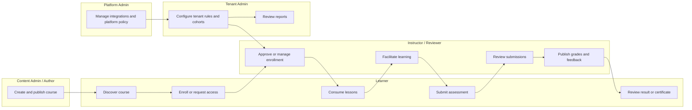

# BPMN Swimlane Diagram - Learning Management System

## Swimlane Interpretation

- Learner-facing actions stay streamlined while staff workflows manage publication, grading, and operational policy.
- Tenant configuration governs enrollment, deadlines, and reporting visibility.
- Platform administration controls cross-tenant integrations and system-level compliance features.

## Implementation Details: Swimlane SLAs

| Swimlane | Blocking action | SLA target | Escalation owner |
|---|---|---|---|
| Instructor/Reviewer | Grade publication | < 24h standard, < 4h priority | Academic ops lead |
| Content Admin | Publish approval fix | < 2 business days | Content governance |
| Tenant Admin | Cohort policy correction | < 8h | Tenant success |

### Handoff quality requirements
- Every inter-lane handoff emits a traceable event.
- Blocking handoffs surface pending status to learner dashboard.
