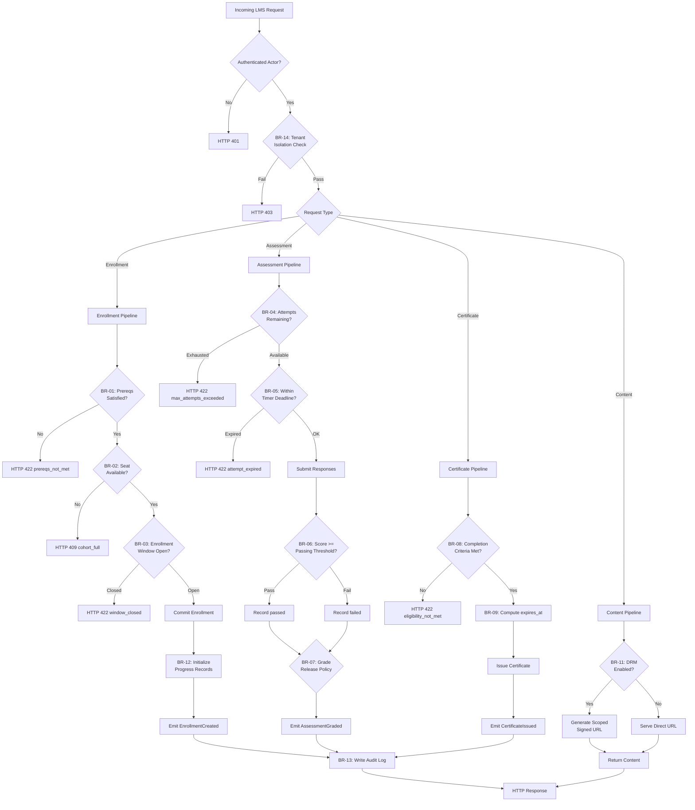

# Business Rules — Learning Management System

**Version:** 1.0  
**Status:** Approved  
**Last Updated:** 2025-01-15  

---

## Table of Contents

1. [Overview](#1-overview)
2. [Rule Evaluation Pipeline](#2-rule-evaluation-pipeline)
3. [Enforceable Rules](#3-enforceable-rules)
4. [Exception and Override Handling](#4-exception-and-override-handling)
5. [Traceability Table](#5-traceability-table)

---

## 1. Overview

This document defines the enforceable business rules governing the Learning Management System. These rules are platform-level invariants — they apply across all tenants and cannot be overridden by individual course or cohort configuration unless explicitly noted. Rules are evaluated at specific pipeline stages (enrollment, assessment, grading, certificate issuance) and are enforced by designated services.

---

## 2. Rule Evaluation Pipeline



---

## 3. Enforceable Rules

---

### BR-01 — Enrollment Prerequisite Enforcement

**Category:** Enrollment  
**Enforcer:** Enrollment Service  

A learner MUST have a `completed` or `passed` enrollment record for every course listed in the target course version's `prerequisites` array before a new enrollment is created. Prerequisite checks are evaluated at enrollment time; runtime prerequisite revocation does not retroactively invalidate an active enrollment.

**Rule Logic:**
```
ALLOW enrollment if:
  FOR EACH prereq_course_id IN course_version.prerequisites:
    EXISTS enrollment WHERE
      learner_id = :learner_id
      AND course_id = prereq_course_id
      AND status IN ('completed', 'passed')
      AND tenant_id = :tenant_id
DENY with HTTP 422 (code: PREREQUISITE_NOT_MET) otherwise
```

**Exceptions:** Instructors and tenant admins may bypass prerequisite checks by supplying a signed `prerequisite_waiver` in the enrollment request payload; the waiver is recorded in the audit log with the approver's identity.

---

### BR-02 — Seat Limit Enforcement

**Category:** Enrollment  
**Enforcer:** Enrollment Service  

A cohort with a non-null `seat_limit` MUST NOT accept new enrollments when the count of active enrollments (`status IN ('active','pending','paused')`) equals or exceeds `seat_limit`. The count is checked inside a serialized transaction with a row-level lock on the cohort record to prevent race conditions under concurrent enrollment.

**Rule Logic:**
```
ALLOW enrollment if:
  cohort.seat_limit IS NULL
  OR (
    SELECT COUNT(*) FROM enrollments
    WHERE cohort_id = :cohort_id
      AND status IN ('active', 'pending', 'paused')
      AND tenant_id = :tenant_id
    FOR UPDATE
  ) < cohort.seat_limit
DENY with HTTP 409 (code: COHORT_FULL) otherwise
```

**Exceptions:** Tenant admins may override the seat limit by including `force_enroll: true` in the admin enrollment API call. The resulting audit log entry carries `seat_limit_override: true`.

---

### BR-03 — Enrollment Window Enforcement

**Category:** Enrollment  
**Enforcer:** Enrollment Service  

Enrollments are only accepted when `NOW()` falls within `[cohort.starts_at − enrollment_advance_days, cohort.ends_at]`. The `enrollment_advance_days` is a cohort-level configuration (default: 7 days). Enrollments in cohorts with `enrollment_policy = 'self-paced'` bypass date-window checks when the parent course `status = 'published'`.

**Rule Logic:**
```
ALLOW enrollment if:
  cohort.enrollment_policy = 'self-paced'
  OR (
    NOW() >= (cohort.starts_at - INTERVAL cohort.enrollment_advance_days DAYS)
    AND NOW() <= cohort.ends_at
  )
DENY with HTTP 422 (code: ENROLLMENT_WINDOW_CLOSED) otherwise
```

**Exceptions:** Tenant admins may manually enroll learners outside the window via the admin override API; the request must include a non-empty `reason` string.

---

### BR-04 — Assessment Attempt Limit

**Category:** Assessment  
**Enforcer:** Assessment Service  

A learner MUST NOT be permitted to start a new attempt when their count of non-abandoned attempts equals or exceeds `assessment.max_attempts`. Attempts with `status = 'abandoned'` do not count against the limit. When `max_attempts IS NULL`, unlimited attempts are allowed.

**Rule Logic:**
```
ALLOW new attempt if:
  assessment.max_attempts IS NULL
  OR (
    SELECT COUNT(*) FROM assessment_attempts
    WHERE assessment_id = :assessment_id
      AND enrollment_id  = :enrollment_id
      AND status        != 'abandoned'
      AND tenant_id      = :tenant_id
  ) < assessment.max_attempts
DENY with HTTP 422 (code: MAX_ATTEMPTS_EXCEEDED) otherwise
```

**Exceptions:** Instructors may grant a single-use attempt extension by creating an `AttemptExtension` record linked to the enrollment and assessment, which increments the effective limit by 1 for that learner only.

---

### BR-05 — Assessment Timer Enforcement

**Category:** Assessment  
**Enforcer:** Assessment Service / Timer Worker  

For assessments with a non-null `time_limit_minutes`, the platform MUST record `started_at` when the attempt is opened, compute a `deadline`, reject late submissions, and auto-submit the attempt at the deadline via a scheduled job regardless of learner action.

**Rule Logic:**
```
ON attempt creation (time_limit_minutes IS NOT NULL):
  attempt.started_at = NOW()
  deadline = attempt.started_at + INTERVAL assessment.time_limit_minutes MINUTES
  schedule_job(
    type    : 'auto_submit_attempt',
    run_at  : deadline,
    payload : { attempt_id: attempt.id }
  )

ON answer submission:
  IF NOW() > attempt.started_at + INTERVAL assessment.time_limit_minutes MINUTES:
    DENY with HTTP 422 (code: ATTEMPT_EXPIRED)
```

**Exceptions:** An `accessibility_accommodation` record with `timer_extension_minutes` may be applied by an instructor before the attempt starts; the effective deadline is recomputed using the extended duration and the scheduled job is rescheduled.

---

### BR-06 — Passing Score Threshold

**Category:** Grading  
**Enforcer:** Grading Service  

An attempt is marked `passed` if and only if `score >= assessment.passing_score`. Auto-submitted attempts (BR-05) are graded against the same threshold. `passing_score` is expressed as a percentage 0–100. When `passing_score IS NULL`, all submitted attempts are marked `passed`.

**Rule Logic:**
```
ON grading:
  IF assessment.passing_score IS NULL:
    attempt.status = 'passed'
  ELSE IF attempt.score >= assessment.passing_score:
    attempt.status = 'passed'
  ELSE:
    attempt.status = 'failed'
```

**Exceptions:** Instructors may issue a grading override (governed by BR-13) to change `failed` → `passed` with a documented reason. The override updates `attempt.status` but preserves the original machine-graded `score` to maintain an auditable record.

---

### BR-07 — Grade Release Policy

**Category:** Grading  
**Enforcer:** Grading Service  

The visibility of a graded attempt to the learner is controlled by the cohort's `grade_release_policy`:

| Policy Value | Visibility Rule |
|---|---|
| `immediate` | Score and pass/fail visible to learner immediately upon grading |
| `delayed` | Score hidden until `cohort.grade_release_at` timestamp has passed |
| `after_all_reviewed` | Score hidden until every attempt in the cohort for that assessment has `status != 'submitted'` |

**Rule Logic:**
```
ALLOW learner to view grade if:
  grade_release_policy = 'immediate'
  OR (grade_release_policy = 'delayed'
      AND NOW() >= cohort.grade_release_at)
  OR (grade_release_policy = 'after_all_reviewed'
      AND NOT EXISTS (
        SELECT 1 FROM assessment_attempts
        WHERE assessment_id = :assessment_id
          AND cohort_id     = :cohort_id
          AND status        = 'submitted'
      ))
DENY with HTTP 403 (code: GRADE_NOT_RELEASED) otherwise
```

**Exceptions:** Instructors and tenant admins can view grades regardless of release policy.

---

### BR-08 — Certificate Eligibility Evaluation

**Category:** Certification  
**Enforcer:** Certificate Service  

A certificate MUST NOT be issued unless all of the following conditions are satisfied for the enrollment:

1. All lessons where `is_mandatory = true` have `progress_record.status = 'completed'`.
2. All assessments where `is_mandatory = true` have at least one attempt with `status = 'passed'`.
3. If `cohort.min_attendance_percent` is set, the learner's attendance ratio meets or exceeds it.
4. `enrollment.status = 'completed'`.

**Rule Logic:**
```
ALLOW certificate issuance if:
  enrollment.status = 'completed'
  AND NOT EXISTS (
    SELECT 1 FROM lessons l
    JOIN modules m          ON m.id = l.module_id
    JOIN course_versions cv ON cv.id = m.course_version_id
    LEFT JOIN progress_records pr
      ON pr.lesson_id = l.id AND pr.enrollment_id = :enrollment_id
    WHERE cv.id = enrollment.course_version_id
      AND l.is_mandatory = true
      AND (pr.status IS NULL OR pr.status != 'completed')
  )
  AND NOT EXISTS (
    SELECT 1 FROM assessments a
    JOIN modules m ON m.id = a.module_id
    LEFT JOIN assessment_attempts aa
      ON aa.assessment_id = a.id
     AND aa.enrollment_id = :enrollment_id
     AND aa.status        = 'passed'
    WHERE m.course_version_id = enrollment.course_version_id
      AND a.is_mandatory = true
      AND aa.id IS NULL
  )
  AND (
    cohort.min_attendance_percent IS NULL
    OR learner_attendance_ratio >= cohort.min_attendance_percent
  )
DENY with HTTP 422 (code: CERTIFICATE_ELIGIBILITY_NOT_MET) otherwise
```

**Exceptions:** Tenant admins may issue a certificate override for exceptional circumstances. The override is recorded as a grading override audit entry under BR-13 with the approver's identity and reason.

---

### BR-09 — Certificate Expiry

**Category:** Certification  
**Enforcer:** Certificate Service / Verification API  

Certificates may carry an expiry via `course.certificate_ttl_days`. When set, `expires_at = issued_at + INTERVAL certificate_ttl_days DAYS`. Any verification request against an expired certificate MUST return `status: expired`, not `status: valid`. Expired certificates are NOT automatically renewed; a new course completion is required.

**Rule Logic:**
```
ON certificate verification (public endpoint):
  IF certificate.revoked_at IS NOT NULL:
    RETURN { status: 'revoked', revoked_at: certificate.revoked_at }
  ELSE IF certificate.expires_at IS NOT NULL
       AND NOW() > certificate.expires_at:
    RETURN { status: 'expired', expired_at: certificate.expires_at }
  ELSE:
    RETURN { status: 'valid', issued_at: certificate.issued_at }
```

**Exceptions:** Tenant admins may extend `expires_at` via the admin API. All extensions are written to the audit log with the old and new expiry values.

---

### BR-10 — Course Version Pinning

**Category:** Content Integrity  
**Enforcer:** Enrollment Service / Content Service  

When a learner is enrolled, they are pinned to the `course_version_id` that is `state = 'published'` at the moment of enrollment. Subsequent course version publications do NOT change a learner's pinned version. All content delivery, progress tracking, and assessment grading MUST reference the learner's pinned `course_version_id`, not the latest published version.

**Rule Logic:**
```
ON enrollment creation:
  enrollment.course_version_id = (
    SELECT id FROM course_versions
    WHERE course_id   = :course_id
      AND state       = 'published'
      AND tenant_id   = :tenant_id
    ORDER BY published_at DESC
    LIMIT 1
  )

All subsequent queries for an enrolled learner:
  ... WHERE course_version_id = enrollment.course_version_id
```

**Exceptions:** An admin-initiated "version migration" may re-pin a learner to a newer version. Progress mapping follows the course's `content_migration_map`. Re-pinning emits an audit log entry capturing both the old and new version IDs and the migration job reference.

---

### BR-11 — Content DRM and Signed URL Policy

**Category:** Content Security  
**Enforcer:** Content Delivery Service  

Lesson assets with `drm_enabled = true` MUST NOT be served via unauthenticated permanent URLs. All access MUST go through a scoped signed URL that: (1) expires within `content_url_ttl_seconds` (default: 3600, maximum: 86400); (2) is scoped to the requesting `learner_id` and `enrollment_id`; (3) is signed with HMAC-SHA256 using a tenant-specific secret; and (4) is invalidated after first use when `single_use_drm = true`.

**Rule Logic:**
```
ON content access request:
  IF lesson.drm_enabled = true:
    VERIFY signed_url.learner_id    = :requesting_learner_id
       AND signed_url.enrollment_id = :enrollment_id
       AND signed_url.expires_at    > NOW()
       AND (NOT lesson.single_use_drm OR NOT signed_url.used)
    IF valid:
      IF lesson.single_use_drm: mark signed_url.used = true
      serve content stream
    ELSE:
      DENY with HTTP 403 (code: DRM_URL_INVALID)
```

**Exceptions:** Instructors and tenant admins may obtain admin-scoped signed URLs via the admin content API, governed by a separate TTL policy.

---

### BR-12 — Progress Monotonicity

**Category:** Progress Tracking  
**Enforcer:** Progress Service  

`progress_record.percent_complete` MUST NOT decrease through normal learner activity. The system silently discards progress update events where `new_percent < current_percent`. Decreasing progress is only permitted via an explicit admin reset action, which requires an audit log entry and emits a `ProgressReset` domain event.

**Rule Logic:**
```
ON progress update:
  current = SELECT percent_complete FROM progress_records
            WHERE id = :record_id AND tenant_id = :tenant_id

  IF :new_percent < current.percent_complete:
    IF actor.role IN ('tenant_admin', 'platform_admin'):
      UPDATE percent_complete = :new_percent
      INSERT audit_log (action: 'PROGRESS_RESET', before: current, after: :new_percent, ...)
      EMIT ProgressReset event
    ELSE:
      DISCARD update silently; return HTTP 200 with current state
  ELSE:
    UPDATE percent_complete = :new_percent
```

**Exceptions:** Automatic progress recalculation after a course version re-pin (BR-10) may decrease `percent_complete` if the new version contains more content. This is logged as a `VersionMigrationProgressAdjustment` event, not a `PROGRESS_RESET`.

---

### BR-13 — Grading Override Audit Requirement

**Category:** Compliance  
**Enforcer:** Grading Service / Audit Service  

Any manual modification to `assessment_attempt.score`, `assessment_attempt.status`, or `progress_record.status` by an instructor or admin MUST be recorded in `audit_logs` with: `actor_id` (the overriding user), `reason` (non-empty, minimum 10 characters), `before_state` (full JSON snapshot before change), `after_state` (full JSON snapshot after change), and `occurred_at` (server-side timestamp only — client-supplied timestamps are rejected).

**Rule Logic:**
```
ON grade or progress override:
  IF reason IS NULL OR LENGTH(TRIM(reason)) < 10:
    DENY with HTTP 422 (code: OVERRIDE_REASON_REQUIRED)

  BEGIN TRANSACTION:
    UPDATE assessment_attempts | progress_records SET ...
    INSERT INTO audit_logs (
      tenant_id, actor_id, action, resource_type, resource_id,
      before_state, after_state, reason, occurred_at
    ) VALUES (..., NOW())
  IF audit_log INSERT fails:
    ROLLBACK entire transaction
  COMMIT
```

**Exceptions:** System-generated bulk re-grades use `actor_id = system_user_id` and `reason = 'bulk_regrade:job_id:{job_id}'`. The 10-character minimum is waived for system actors.

---

### BR-14 — Tenant Data Isolation

**Category:** Tenancy  
**Enforcer:** All Services  

Every database query, cache read, and search index lookup MUST be scoped to the authenticated request's `tenant_id`. No cross-tenant data leakage is permitted, including in aggregate analytics queries. PostgreSQL row-level security (RLS) policies are enforced at the database layer as a mandatory secondary defense.

**Rule Logic:**
```
Application-layer (primary):
  ALL queries MUST include: WHERE tenant_id = :authenticated_tenant_id

Database-layer RLS (secondary, on every tenant-scoped table):
  CREATE POLICY tenant_isolation ON <table>
    AS PERMISSIVE FOR ALL
    USING (tenant_id = current_setting('app.current_tenant_id')::uuid);
```

**Violation Response:** HTTP 403. Any attempt to reference a resource ID belonging to a different tenant is logged as a `CrossTenantAccessAttempt` security event and triggers an immediate alert to the platform security team.

---

### BR-15 — Completion Rule Consistency

**Category:** Integrity  
**Enforcer:** Completion Service  

The identical completion evaluation logic MUST be used in all three contexts: (1) real-time UI progress display, (2) enrollment status transitions to `completed`, and (3) certificate eligibility checks (BR-08). The single canonical implementation is the `CompletionEvaluator` module — inline re-implementations in other services are prohibited and rejected in code review.

**Rule Logic:**
```
// Single canonical completion evaluator — imported by all consumers
function evaluateCompletion(enrollment_id, course_version_id, tenant_id): CompletionResult
  mandatory_lessons_done   = checkMandatoryLessons(enrollment_id, course_version_id, tenant_id)
  mandatory_assessments_ok = checkMandatoryAssessments(enrollment_id, course_version_id, tenant_id)
  attendance_ok            = checkAttendance(enrollment_id, tenant_id)
  is_complete              = mandatory_lessons_done AND mandatory_assessments_ok AND attendance_ok
  RETURN CompletionResult(is_complete, missing=[...unmet criteria])

// Consumers:
//   ProgressService   → UI percentage + completion badge
//   EnrollmentService → enrollment.status = 'completed' transition
//   CertificateService → certificate eligibility gate (BR-08)
```

**Exceptions:** Analytics pipelines may use read-replica snapshots with eventual consistency, but authoritative completion determinations for certificate issuance always invoke the canonical evaluator against the primary database replica.

---

## 4. Exception and Override Handling

All exceptions to the above rules MUST follow this protocol:

1. **Authorization**: Only users with `instructor` or `tenant_admin` role may invoke override endpoints. Platform-level rules (BR-14, BR-15) can only be overridden by `platform_admin`.
2. **Audit Trail**: Every override MUST produce an `audit_log` entry as specified in BR-13. There are no silent overrides.
3. **Bounded Scope**: Override effects are bounded — seat limit overrides expire with the cohort lifecycle, prerequisite waivers expire with the enrollment, and timer extensions are single-use per attempt.
4. **Abuse Detection**: If an override pattern is detected more than 10 times within a rolling 30-day window for the same rule within the same tenant, the platform emits an `OverrideAbuseAlert` event to the tenant admin and the platform compliance team.
5. **Rollback Requirement**: Overrides to completed or graded records (score changes, certificate overrides) for cohorts with more than 100 active learners require a `rollback_plan` field describing how the change can be undone.

---

## 5. Traceability Table

| Rule ID | Rule Name | Category | Enforcer Service | Related Entities | Override Allowed |
|---------|-----------|----------|-----------------|-----------------|-----------------|
| BR-01 | Enrollment Prerequisite Enforcement | Enrollment | Enrollment Service | enrollments, courses, course_versions | Yes — instructor/admin with waiver |
| BR-02 | Seat Limit Enforcement | Enrollment | Enrollment Service | cohorts, enrollments | Yes — tenant_admin |
| BR-03 | Enrollment Window Enforcement | Enrollment | Enrollment Service | cohorts, enrollments | Yes — tenant_admin with reason |
| BR-04 | Assessment Attempt Limit | Assessment | Assessment Service | assessment_attempts | Yes — instructor (AttemptExtension) |
| BR-05 | Assessment Timer Enforcement | Assessment | Assessment Service, Timer Worker | assessment_attempts | Yes — accessibility_accommodation |
| BR-06 | Passing Score Threshold | Grading | Grading Service | assessment_attempts | Yes — instructor (BR-13 required) |
| BR-07 | Grade Release Policy | Grading | Grading Service | cohorts, assessment_attempts | No — instructors can view always |
| BR-08 | Certificate Eligibility Evaluation | Certification | Certificate Service | certificates, progress_records, assessment_attempts | Yes — tenant_admin override |
| BR-09 | Certificate Expiry | Certification | Certificate Service, Verification API | certificates | Yes — tenant_admin (expiry extension) |
| BR-10 | Course Version Pinning | Content Integrity | Enrollment Service, Content Service | enrollments, course_versions | Yes — admin version migration |
| BR-11 | Content DRM and Signed URL Policy | Content Security | Content Delivery Service | lessons, content assets | Yes — admin-scoped signed URLs |
| BR-12 | Progress Monotonicity | Progress Tracking | Progress Service | progress_records | Yes — admin reset (audit required) |
| BR-13 | Grading Override Audit Requirement | Compliance | Grading Service, Audit Service | audit_logs, assessment_attempts | No |
| BR-14 | Tenant Data Isolation | Tenancy | All Services | All tenant-scoped tables | No |
| BR-15 | Completion Rule Consistency | Integrity | Completion Service | progress_records, enrollments, certificates | No |
