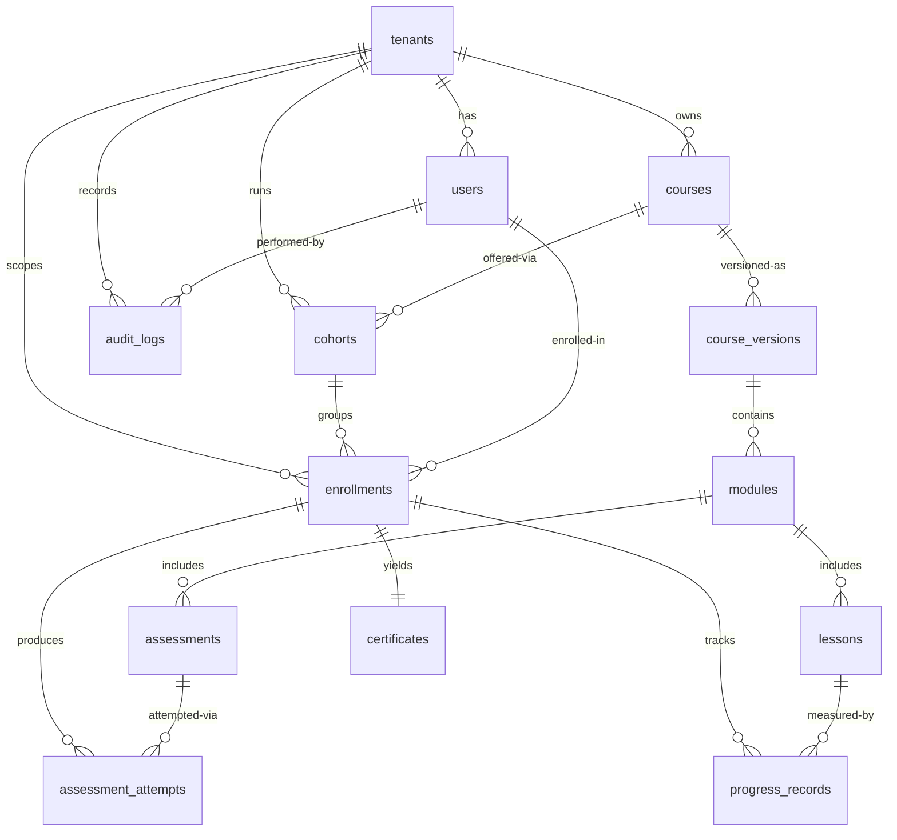

# Data Dictionary — Learning Management System

**Version:** 1.0  
**Status:** Approved  
**Last Updated:** 2025-01-15  

---

## Table of Contents

1. [Overview](#1-overview)
2. [Core Entities](#2-core-entities)
3. [Canonical Relationship Diagram](#3-canonical-relationship-diagram)
4. [Index Definitions](#4-index-definitions)
5. [Foreign Key Relationships](#5-foreign-key-relationships)
6. [Data Quality Controls](#6-data-quality-controls)
7. [Data Classification](#7-data-classification)
8. [Retention Policies](#8-retention-policies)

---

## Overview

This data dictionary is the canonical reference for the Learning Management System database schema. It defines all core entities, their fields, relationships, constraints, and data governance controls. All teams (backend, frontend, analytics, operations) must treat this document as the authoritative source for entity semantics and field-level contracts.

---

## Core Entities

---

### Entity: `tenants`

Top-level organizational boundary. All data is partitioned by `tenant_id`.

| Column | Type | Nullable | Constraints |
|--------|------|----------|-------------|
| id | uuid | NOT NULL | PRIMARY KEY, DEFAULT gen_random_uuid() |
| name | varchar(255) | NOT NULL | |
| slug | varchar(100) | NOT NULL | UNIQUE globally |
| status | varchar(20) | NOT NULL | CHECK (status IN ('trial','active','suspended','churned')), DEFAULT 'trial' |
| region | varchar(50) | NOT NULL | CHECK (region IN ('us-east-1','eu-west-1','ap-southeast-1','ap-northeast-1')) |
| plan | varchar(50) | NOT NULL | CHECK (plan IN ('free','starter','professional','enterprise')), DEFAULT 'free' |
| branding_config | jsonb | NULL | Logo URL, primary color, custom domain |
| created_at | timestamptz | NOT NULL | DEFAULT NOW() |
| updated_at | timestamptz | NOT NULL | DEFAULT NOW() |
| deleted_at | timestamptz | NULL | Soft delete; NULL means active |

---

### Entity: `users`

All human principals operating within a tenant. Role determines permission boundaries.

| Column | Type | Nullable | Constraints |
|--------|------|----------|-------------|
| id | uuid | NOT NULL | PRIMARY KEY, DEFAULT gen_random_uuid() |
| tenant_id | uuid | NOT NULL | FK → tenants(id) |
| email | varchar(320) | NOT NULL | UNIQUE per tenant: UNIQUE (tenant_id, email) |
| full_name | varchar(255) | NOT NULL | |
| role | varchar(50) | NOT NULL | CHECK (role IN ('learner','instructor','tenant_admin','platform_admin')) |
| status | varchar(20) | NOT NULL | CHECK (status IN ('active','suspended','deactivated')), DEFAULT 'active' |
| external_id | varchar(255) | NULL | SSO / external IdP reference; UNIQUE (tenant_id, external_id) |
| last_active_at | timestamptz | NULL | Updated on each authenticated API call |
| created_at | timestamptz | NOT NULL | DEFAULT NOW() |
| updated_at | timestamptz | NOT NULL | DEFAULT NOW() |

---

### Entity: `courses`

Top-level catalog entry for a course. Does not contain versioned content; see `course_versions`.

| Column | Type | Nullable | Constraints |
|--------|------|----------|-------------|
| id | uuid | NOT NULL | PRIMARY KEY, DEFAULT gen_random_uuid() |
| tenant_id | uuid | NOT NULL | FK → tenants(id) |
| title | varchar(512) | NOT NULL | |
| slug | varchar(255) | NOT NULL | UNIQUE per tenant: UNIQUE (tenant_id, slug) |
| description | text | NULL | |
| category | varchar(100) | NULL | |
| tags | text[] | NOT NULL | DEFAULT '{}' |
| difficulty | varchar(20) | NULL | CHECK (difficulty IN ('beginner','intermediate','advanced')) |
| estimated_hours | numeric(6,2) | NULL | CHECK (estimated_hours > 0) |
| certificate_ttl_days | integer | NULL | NULL = certificates do not expire (BR-09) |
| status | varchar(20) | NOT NULL | CHECK (status IN ('draft','published','archived')), DEFAULT 'draft' |
| created_by | uuid | NOT NULL | FK → users(id) |
| created_at | timestamptz | NOT NULL | DEFAULT NOW() |
| updated_at | timestamptz | NOT NULL | DEFAULT NOW() |

---

### Entity: `course_versions`

A versioned, immutable snapshot of course content. Enrolled learners are pinned to a specific version (BR-10).

| Column | Type | Nullable | Constraints |
|--------|------|----------|-------------|
| id | uuid | NOT NULL | PRIMARY KEY, DEFAULT gen_random_uuid() |
| course_id | uuid | NOT NULL | FK → courses(id) |
| tenant_id | uuid | NOT NULL | FK → tenants(id) |
| version_number | integer | NOT NULL | Monotonically increasing per course; CHECK (version_number >= 1) |
| state | varchar(20) | NOT NULL | CHECK (state IN ('draft','published','archived')), DEFAULT 'draft' |
| content_checksum | varchar(64) | NULL | SHA-256 of serialized content tree; populated on publish |
| published_at | timestamptz | NULL | Set when state transitions to 'published' |
| archived_at | timestamptz | NULL | Set when state transitions to 'archived' |
| created_by | uuid | NOT NULL | FK → users(id) |
| created_at | timestamptz | NOT NULL | DEFAULT NOW() |

**Constraints:** UNIQUE (course_id, version_number)

---

### Entity: `modules`

A logical grouping of lessons within a course version. Ordered by `sequence`.

| Column | Type | Nullable | Constraints |
|--------|------|----------|-------------|
| id | uuid | NOT NULL | PRIMARY KEY, DEFAULT gen_random_uuid() |
| course_version_id | uuid | NOT NULL | FK → course_versions(id) ON DELETE CASCADE |
| title | varchar(512) | NOT NULL | |
| description | text | NULL | |
| sequence | integer | NOT NULL | CHECK (sequence >= 1) |
| is_mandatory | boolean | NOT NULL | DEFAULT true |
| created_at | timestamptz | NOT NULL | DEFAULT NOW() |

**Constraints:** UNIQUE (course_version_id, sequence)

---

### Entity: `lessons`

An individual content unit within a module.

| Column | Type | Nullable | Constraints |
|--------|------|----------|-------------|
| id | uuid | NOT NULL | PRIMARY KEY, DEFAULT gen_random_uuid() |
| module_id | uuid | NOT NULL | FK → modules(id) ON DELETE CASCADE |
| title | varchar(512) | NOT NULL | |
| lesson_type | varchar(50) | NOT NULL | CHECK (lesson_type IN ('video','document','scorm','interactive','live_session')) |
| duration_minutes | integer | NULL | CHECK (duration_minutes > 0) |
| is_mandatory | boolean | NOT NULL | DEFAULT true |
| completion_threshold | numeric(5,2) | NOT NULL | 0–100; percent of content consumed to mark complete; DEFAULT 100.0 |
| content_url | text | NULL | Raw storage path; MUST be served via signed URL when drm_enabled (BR-11) |
| drm_enabled | boolean | NOT NULL | DEFAULT false |
| created_at | timestamptz | NOT NULL | DEFAULT NOW() |

---

### Entity: `assessments`

A graded evaluation attached to a module. Governs attempt limits, timing, and pass threshold.

| Column | Type | Nullable | Constraints |
|--------|------|----------|-------------|
| id | uuid | NOT NULL | PRIMARY KEY, DEFAULT gen_random_uuid() |
| module_id | uuid | NOT NULL | FK → modules(id) ON DELETE CASCADE |
| tenant_id | uuid | NOT NULL | FK → tenants(id) |
| title | varchar(512) | NOT NULL | |
| assessment_type | varchar(50) | NOT NULL | CHECK (assessment_type IN ('quiz','assignment','peer_review','exam')) |
| max_attempts | integer | NULL | NULL = unlimited; CHECK (max_attempts > 0) |
| passing_score | numeric(5,2) | NULL | 0–100; NULL = always pass (BR-06) |
| time_limit_minutes | integer | NULL | NULL = untimed; CHECK (time_limit_minutes > 0) |
| is_mandatory | boolean | NOT NULL | DEFAULT true |
| rubric_id | uuid | NULL | FK → rubrics(id); for peer_review and assignment types |
| created_at | timestamptz | NOT NULL | DEFAULT NOW() |

---

### Entity: `cohorts`

A scheduled offering of a course with a defined learner group, instructor, and enrollment rules.

| Column | Type | Nullable | Constraints |
|--------|------|----------|-------------|
| id | uuid | NOT NULL | PRIMARY KEY, DEFAULT gen_random_uuid() |
| course_id | uuid | NOT NULL | FK → courses(id) |
| tenant_id | uuid | NOT NULL | FK → tenants(id) |
| name | varchar(255) | NOT NULL | |
| instructor_id | uuid | NULL | FK → users(id); NULL for self-paced cohorts |
| starts_at | timestamptz | NOT NULL | |
| ends_at | timestamptz | NOT NULL | CHECK (ends_at > starts_at) |
| seat_limit | integer | NULL | NULL = unlimited; CHECK (seat_limit > 0) |
| enrollment_advance_days | integer | NOT NULL | Days before starts_at that enrollment opens; DEFAULT 7 |
| enrollment_policy | varchar(30) | NOT NULL | CHECK (enrollment_policy IN ('open','invite-only','self-paced')), DEFAULT 'open' |
| grade_release_policy | varchar(30) | NOT NULL | CHECK (grade_release_policy IN ('immediate','delayed','after_all_reviewed')), DEFAULT 'immediate' |
| grade_release_at | timestamptz | NULL | Required when grade_release_policy = 'delayed' |
| min_attendance_percent | numeric(5,2) | NULL | 0–100; when set, gates certificate eligibility (BR-08) |
| status | varchar(20) | NOT NULL | CHECK (status IN ('draft','active','completed','cancelled')), DEFAULT 'draft' |
| created_at | timestamptz | NOT NULL | DEFAULT NOW() |

---

### Entity: `enrollments`

The binding between a learner, a pinned course version, and a cohort.

| Column | Type | Nullable | Constraints |
|--------|------|----------|-------------|
| id | uuid | NOT NULL | PRIMARY KEY, DEFAULT gen_random_uuid() |
| learner_id | uuid | NOT NULL | FK → users(id) |
| course_version_id | uuid | NOT NULL | FK → course_versions(id) |
| cohort_id | uuid | NULL | FK → cohorts(id); NULL for ungrouped self-paced |
| tenant_id | uuid | NOT NULL | FK → tenants(id) |
| status | varchar(30) | NOT NULL | CHECK (status IN ('pending','active','paused','completed','expired','withdrawn')), DEFAULT 'pending' |
| enrolled_at | timestamptz | NOT NULL | DEFAULT NOW() |
| expires_at | timestamptz | NULL | Access expiry for time-limited enrollments |
| completed_at | timestamptz | NULL | Set when status transitions to 'completed' |
| enrolled_by | uuid | NOT NULL | FK → users(id); equals learner_id for self-enrollment |
| created_at | timestamptz | NOT NULL | DEFAULT NOW() |

**Constraints:** UNIQUE (learner_id, course_version_id, cohort_id) — prevents duplicate enrollments.

---

### Entity: `assessment_attempts`

Records each individual attempt by a learner on an assessment.

| Column | Type | Nullable | Constraints |
|--------|------|----------|-------------|
| id | uuid | NOT NULL | PRIMARY KEY, DEFAULT gen_random_uuid() |
| assessment_id | uuid | NOT NULL | FK → assessments(id) |
| enrollment_id | uuid | NOT NULL | FK → enrollments(id) ON DELETE CASCADE |
| learner_id | uuid | NOT NULL | FK → users(id) |
| tenant_id | uuid | NOT NULL | FK → tenants(id) |
| attempt_number | integer | NOT NULL | CHECK (attempt_number >= 1) |
| status | varchar(20) | NOT NULL | CHECK (status IN ('in_progress','submitted','passed','failed','abandoned','expired')) |
| score | numeric(6,3) | NULL | 0–100; NULL until graded |
| started_at | timestamptz | NOT NULL | DEFAULT NOW() |
| submitted_at | timestamptz | NULL | Set on manual or auto-submit (BR-05) |
| graded_at | timestamptz | NULL | Set when score is assigned |
| graded_by | uuid | NULL | FK → users(id); NULL for auto-graded attempts |

**Constraints:** UNIQUE (assessment_id, enrollment_id, attempt_number)

---

### Entity: `progress_records`

Tracks per-lesson completion state for each enrolled learner. `percent_complete` is monotonically non-decreasing except via admin reset (BR-12).

| Column | Type | Nullable | Constraints |
|--------|------|----------|-------------|
| id | uuid | NOT NULL | PRIMARY KEY, DEFAULT gen_random_uuid() |
| enrollment_id | uuid | NOT NULL | FK → enrollments(id) ON DELETE CASCADE |
| lesson_id | uuid | NOT NULL | FK → lessons(id) |
| learner_id | uuid | NOT NULL | FK → users(id) |
| tenant_id | uuid | NOT NULL | FK → tenants(id) |
| status | varchar(20) | NOT NULL | CHECK (status IN ('not_started','in_progress','completed')), DEFAULT 'not_started' |
| percent_complete | numeric(5,2) | NOT NULL | CHECK (percent_complete BETWEEN 0 AND 100), DEFAULT 0 |
| time_spent_seconds | integer | NOT NULL | CHECK (time_spent_seconds >= 0), DEFAULT 0 |
| last_event_at | timestamptz | NULL | Timestamp of last learner interaction with this lesson |
| created_at | timestamptz | NOT NULL | DEFAULT NOW() |

**Constraints:** UNIQUE (enrollment_id, lesson_id)

---

### Entity: `certificates`

Issued upon successful completion of a course enrollment. One certificate per enrollment.

| Column | Type | Nullable | Constraints |
|--------|------|----------|-------------|
| id | uuid | NOT NULL | PRIMARY KEY, DEFAULT gen_random_uuid() |
| enrollment_id | uuid | NOT NULL | FK → enrollments(id); UNIQUE — one certificate per enrollment |
| learner_id | uuid | NOT NULL | FK → users(id) |
| tenant_id | uuid | NOT NULL | FK → tenants(id) |
| course_id | uuid | NOT NULL | FK → courses(id) |
| serial_number | varchar(128) | NOT NULL | UNIQUE globally; tenant-prefixed alphanumeric identifier |
| issued_at | timestamptz | NOT NULL | DEFAULT NOW() |
| expires_at | timestamptz | NULL | NULL = does not expire; computed from course.certificate_ttl_days (BR-09) |
| revoked_at | timestamptz | NULL | NULL = not revoked |
| verification_url | text | NOT NULL | Public URL for third-party certificate verification |

---

### Entity: `audit_logs`

Append-only record of all state-changing operations. No `UPDATE` or `DELETE` privilege is granted to application roles on this table.

| Column | Type | Nullable | Constraints |
|--------|------|----------|-------------|
| id | uuid | NOT NULL | PRIMARY KEY, DEFAULT gen_random_uuid() |
| tenant_id | uuid | NOT NULL | FK → tenants(id) |
| actor_id | uuid | NOT NULL | FK → users(id); system actions use a dedicated system user |
| action | varchar(100) | NOT NULL | e.g., 'ENROLLMENT_CREATED', 'GRADE_OVERRIDDEN', 'PROGRESS_RESET' |
| resource_type | varchar(100) | NOT NULL | e.g., 'enrollment', 'assessment_attempt', 'certificate' |
| resource_id | uuid | NOT NULL | ID of the affected resource |
| before_state | jsonb | NULL | Full record snapshot before change; NULL for create actions |
| after_state | jsonb | NULL | Full record snapshot after change; NULL for delete actions |
| reason | text | NULL | Required for overrides (BR-13); minimum 10 characters for override actions |
| ip_address | inet | NULL | Source IP of the originating request |
| occurred_at | timestamptz | NOT NULL | DEFAULT NOW(); server-side only — client-supplied values rejected |

---

## Canonical Relationship Diagram



---

## Index Definitions

```sql
-- tenants
CREATE UNIQUE INDEX idx_tenants_slug ON tenants(slug);

-- users
CREATE UNIQUE INDEX idx_users_tenant_email    ON users(tenant_id, email);
CREATE UNIQUE INDEX idx_users_tenant_ext_id   ON users(tenant_id, external_id) WHERE external_id IS NOT NULL;
CREATE INDEX        idx_users_tenant_role      ON users(tenant_id, role);
CREATE INDEX        idx_users_last_active      ON users(last_active_at) WHERE status = 'active';

-- courses
CREATE UNIQUE INDEX idx_courses_tenant_slug   ON courses(tenant_id, slug);
CREATE INDEX        idx_courses_tenant_status ON courses(tenant_id, status);

-- course_versions
CREATE UNIQUE INDEX idx_cv_course_version     ON course_versions(course_id, version_number);
CREATE INDEX        idx_cv_course_state       ON course_versions(course_id, state);

-- modules
CREATE UNIQUE INDEX idx_modules_cv_sequence   ON modules(course_version_id, sequence);

-- cohorts
CREATE INDEX        idx_cohorts_course_tenant ON cohorts(course_id, tenant_id, status);
CREATE INDEX        idx_cohorts_active_window ON cohorts(starts_at, ends_at) WHERE status = 'active';

-- enrollments
CREATE UNIQUE INDEX idx_enrollments_learner_cv_cohort ON enrollments(learner_id, course_version_id, cohort_id);
CREATE INDEX        idx_enrollments_tenant_status     ON enrollments(tenant_id, status);
CREATE INDEX        idx_enrollments_learner           ON enrollments(learner_id, tenant_id);

-- assessment_attempts
CREATE UNIQUE INDEX idx_attempts_assessment_enrollment_num
    ON assessment_attempts(assessment_id, enrollment_id, attempt_number);
CREATE INDEX        idx_attempts_enrollment   ON assessment_attempts(enrollment_id, tenant_id);
CREATE INDEX        idx_attempts_status       ON assessment_attempts(tenant_id, status) WHERE status = 'in_progress';

-- progress_records
CREATE UNIQUE INDEX idx_progress_enrollment_lesson ON progress_records(enrollment_id, lesson_id);
CREATE INDEX        idx_progress_enrollment        ON progress_records(enrollment_id, tenant_id);

-- certificates
CREATE UNIQUE INDEX idx_certs_enrollment    ON certificates(enrollment_id);
CREATE UNIQUE INDEX idx_certs_serial        ON certificates(serial_number);
CREATE INDEX        idx_certs_learner       ON certificates(learner_id, tenant_id);

-- audit_logs
CREATE INDEX idx_audit_tenant_resource ON audit_logs(tenant_id, resource_type, resource_id);
CREATE INDEX idx_audit_actor_time      ON audit_logs(actor_id, occurred_at);
CREATE INDEX idx_audit_occurred        ON audit_logs(occurred_at);
```

---

## Foreign Key Relationships

| Child Table | Child Column | Parent Table | Parent Column | On Delete |
|-------------|-------------|--------------|--------------|-----------|
| users | tenant_id | tenants | id | RESTRICT |
| courses | tenant_id | tenants | id | RESTRICT |
| courses | created_by | users | id | RESTRICT |
| course_versions | course_id | courses | id | RESTRICT |
| course_versions | tenant_id | tenants | id | RESTRICT |
| course_versions | created_by | users | id | RESTRICT |
| modules | course_version_id | course_versions | id | CASCADE |
| lessons | module_id | modules | id | CASCADE |
| assessments | module_id | modules | id | CASCADE |
| assessments | tenant_id | tenants | id | RESTRICT |
| cohorts | course_id | courses | id | RESTRICT |
| cohorts | tenant_id | tenants | id | RESTRICT |
| cohorts | instructor_id | users | id | SET NULL |
| enrollments | learner_id | users | id | RESTRICT |
| enrollments | course_version_id | course_versions | id | RESTRICT |
| enrollments | cohort_id | cohorts | id | SET NULL |
| enrollments | tenant_id | tenants | id | RESTRICT |
| enrollments | enrolled_by | users | id | RESTRICT |
| assessment_attempts | assessment_id | assessments | id | RESTRICT |
| assessment_attempts | enrollment_id | enrollments | id | CASCADE |
| assessment_attempts | learner_id | users | id | RESTRICT |
| assessment_attempts | tenant_id | tenants | id | RESTRICT |
| assessment_attempts | graded_by | users | id | SET NULL |
| progress_records | enrollment_id | enrollments | id | CASCADE |
| progress_records | lesson_id | lessons | id | RESTRICT |
| progress_records | learner_id | users | id | RESTRICT |
| progress_records | tenant_id | tenants | id | RESTRICT |
| certificates | enrollment_id | enrollments | id | RESTRICT |
| certificates | learner_id | users | id | RESTRICT |
| certificates | tenant_id | tenants | id | RESTRICT |
| certificates | course_id | courses | id | RESTRICT |
| audit_logs | tenant_id | tenants | id | RESTRICT |
| audit_logs | actor_id | users | id | RESTRICT |

---

## Data Quality Controls

1. **Required-field validation**: All NOT NULL constraints are enforced at the database layer in addition to application-layer validation. Application validation is first-line; DB constraints are the safety net.
2. **Controlled vocabularies**: All `status`, `role`, `state`, `type`, and `policy` fields use `CHECK` constraints with explicit allowed values. Unknown values are rejected at the database; no silent coercion.
3. **Tenant scope enforcement**: Row-level security (RLS) policies are enabled on all tables with a `tenant_id` column, providing a mandatory secondary enforcement layer beyond application-level filtering (BR-14).
4. **Progress monotonicity**: A database trigger on `progress_records` enforces the monotonicity invariant from BR-12 as a DB-layer safety net, supplementing the application-layer check.
5. **Duplicate prevention**: UNIQUE constraints on natural keys prevent duplicate enrollments `(learner_id, course_version_id, cohort_id)`, duplicate attempt numbers `(assessment_id, enrollment_id, attempt_number)`, duplicate module sequences `(course_version_id, sequence)`, and duplicate version numbers `(course_id, version_number)`.
6. **Referential integrity**: All foreign keys default to `RESTRICT` on delete to prevent orphaned records. `CASCADE` is applied only to structurally dependent children (modules, lessons, assessments cascade from their parent container).
7. **Audit immutability**: The `audit_logs` table is owned by a dedicated database role. The application role is granted only `INSERT` and `SELECT`. No `UPDATE` or `DELETE` privilege exists for the application role.
8. **Temporal consistency**: `ends_at > starts_at` is enforced via CHECK on `cohorts`; the `expires_at > issued_at` relationship on `certificates` is enforced at the application layer before insert.
9. **Completion rule consistency**: The `CompletionEvaluator` module is the single source of truth for completion logic across the UI, enrollment transitions, and certificate issuance (BR-15). No inline re-implementations are permitted.

---

## Data Classification

| Table | Column | Classification | Notes |
|-------|--------|----------------|-------|
| users | email | PII | Encrypted at rest; masked in logs and exports |
| users | full_name | PII | Masked in export APIs unless explicit consent granted |
| users | external_id | PII | SSO identifier; restricted access |
| users | last_active_at | Internal | Behavioral signal; not shared with third parties |
| tenants | branding_config | Internal | May contain logo URLs, color palettes, custom domains |
| tenants | plan | Internal | Commercial sensitivity; restricted to billing roles |
| assessment_attempts | score | Internal | Restricted to the learner, their instructor, and admins |
| certificates | serial_number | Public | Used for third-party certificate verification |
| certificates | verification_url | Public | Publicly accessible; no authentication required |
| audit_logs | before_state / after_state | Restricted | May contain PII field snapshots; access restricted to compliance roles |
| audit_logs | ip_address | PII | Subject to regional data residency requirements |
| progress_records | percent_complete | Internal | Learner-visible; not shared with third parties without consent |
| courses | description | Public | Visible in public course catalog |
| course_versions | content_checksum | Internal | Used for integrity verification; not exposed to learners |

---

## Retention Policies

| Table | Online Retention | Archive Tier | Hard Delete |
|-------|-----------------|--------------|-------------|
| tenants | Indefinite while active | 7 years post-churn | Never (regulatory anchor record) |
| users | Indefinite while active | 3 years post-deactivation | On verified GDPR erasure request |
| courses | Indefinite while published | 5 years post-archive | Manual platform admin action |
| course_versions | Indefinite while active enrollments exist | 5 years post-archival | Manual platform admin action |
| cohorts | Indefinite while active | 5 years post-completion | Manual platform admin action |
| enrollments | Enrollment duration + 2 years online | 5 years post-completion | On verified GDPR erasure request |
| assessment_attempts | Enrollment duration + 2 years online | 5 years | On verified GDPR erasure request |
| progress_records | Enrollment duration + 2 years online | 5 years | On verified GDPR erasure request |
| certificates | Indefinite (permanent credential record) | N/A | On GDPR erasure: revoke and anonymize; do not delete |
| audit_logs | 1 year online | 6 years in immutable archive tier | Never — compliance minimum is 7 years total |
