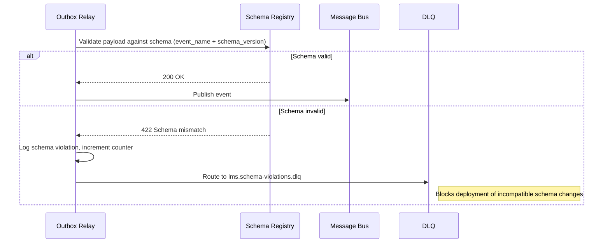

# Event Catalog

This catalog defines stable event contracts for the **Learning Management System** to support event-driven integrations, auditability, and analytics across all learning management workflows. Every team producing or consuming LMS events must treat this document as the authoritative source of truth.

---

## Contract Conventions

### Naming Pattern

All events follow the pattern `lms.<aggregate>.<action>.v<major>`:

- **`lms`** — top-level domain prefix, constant across all LMS services.
- **`<aggregate>`** — the bounded-context entity the event belongs to (e.g., `enrollment`, `course`, `certificate`).
- **`<action>`** — past-tense verb describing what happened (e.g., `created`, `submitted`, `revoked`).
- **`v<major>`** — integer major version; incremented only on breaking schema changes.

### Required Envelope Fields

Every event envelope **must** carry these fields regardless of payload content:

| Field | Type | Description |
|---|---|---|
| `event_id` | `string (uuid)` | Globally unique event identifier for idempotency deduplication. |
| `event_name` | `string` | Fully-qualified event name (e.g., `lms.enrollment.created.v1`). |
| `schema_version` | `string` | Semantic version of the payload schema (e.g., `"1.2.0"`). |
| `occurred_at` | `string (ISO 8601)` | Timestamp when the domain action occurred, in UTC. |
| `published_at` | `string (ISO 8601)` | Timestamp when the outbox relay published to the bus. |
| `producer` | `string` | Originating service name (e.g., `enrollment-service`). |
| `tenant_id` | `string` | Tenant identifier for multi-tenant isolation. |
| `correlation_id` | `string (uuid)` | Traces a chain of related commands/events across services. |
| `causation_id` | `string (uuid)` | ID of the command or event that caused this event. |
| `aggregate_id` | `string` | ID of the root aggregate this event belongs to. |
| `aggregate_type` | `string` | Type name of the aggregate (e.g., `Enrollment`, `Course`). |

### Delivery Semantics

- **At-least-once delivery.** Consumers must be idempotent, keyed on `event_id`.
- **Per-aggregate ordering.** Events for the same `aggregate_id` are delivered in commit order. No cross-aggregate ordering guarantee.
- **Partition key.** Message bus partitioning uses `aggregate_id` to preserve per-aggregate order.

### Schema Versioning Strategy

| Change Type | Action |
|---|---|
| Add optional field | Bump minor in `schema_version`; no new event name required. |
| Rename or remove field | Bump `v<major>` in event name; run old and new versions in parallel for one deprecation cycle (minimum 60 days). |
| Add required field | Treat as breaking; follow major version bump process. |
| Change field type | Treat as breaking; follow major version bump process. |

Consumers must be built to **ignore unknown fields** to remain compatible with minor additions. Schema contracts are validated at publish time against a central Schema Registry.

### Retry Policy

| Tier | Max Retries | Backoff | DLQ Threshold |
|---|---|---|---|
| Tier 1 (critical) | 10 | Exponential 1 s → 5 min cap | After retry 10 |
| Tier 2 (standard) | 5 | Exponential 2 s → 10 min cap | After retry 5 |
| Tier 3 (analytics) | 3 | Fixed 30 s | After retry 3 |

### Dead Letter Queue (DLQ) Handling

- All failed events land in the service-specific DLQ topic: `lms.<service>.dlq`.
- DLQ messages retain the original envelope plus appended `dlq_reason`, `dlq_attempt_count`, and `dlq_first_failed_at` fields.
- On-call engineers must acknowledge and triage DLQ entries within **15 minutes** for Tier 1 events.
- Replay is performed via the `event-replay-cli` tooling, which re-publishes DLQ messages to the original topic with a `replayed: true` flag to prevent duplicate side-effects in idempotent handlers.
- Poison messages that fail after replay are quarantined and require a code fix before re-ingestion.

---

## Domain Events

### Summary Table

| # | Event Name | Trigger | Tier | Aggregate |
|---|---|---|---|---|
| 1 | `lms.enrollment.created.v1` | Learner enrolled in a course | 1 | Enrollment |
| 2 | `lms.enrollment.completed.v1` | Enrollment reached completed status | 1 | Enrollment |
| 3 | `lms.enrollment.expired.v1` | Enrollment passed its access window | 1 | Enrollment |
| 4 | `lms.lesson.completed.v1` | Learner completed a lesson | 2 | Lesson |
| 5 | `lms.assessment.attempt_started.v1` | Learner started an assessment attempt | 2 | Attempt |
| 6 | `lms.assessment.submitted.v1` | Learner submitted an assessment attempt | 1 | Attempt |
| 7 | `lms.grade.posted.v1` | Grade published to learner record | 1 | Grade |
| 8 | `lms.grade.override_applied.v1` | Instructor manually overrode a grade | 1 | Grade |
| 9 | `lms.course.published.v1` | Course version published and made available | 2 | Course |
| 10 | `lms.course.archived.v1` | Course version archived and removed from catalog | 2 | Course |
| 11 | `lms.certificate.issued.v1` | Certificate generated for a learner | 1 | Certificate |
| 12 | `lms.certificate.revoked.v1` | Certificate revoked by authorized staff | 1 | Certificate |
| 13 | `lms.progress.updated.v1` | Learner overall progress percentage updated | 2 | Progress |
| 14 | `lms.cohort.enrollment_opened.v1` | Cohort enrollment window opened | 2 | Cohort |

### Event Payload Schemas

---

#### 1. `lms.enrollment.created.v1`

**Trigger:** A learner is successfully enrolled in a course, either by self-enrollment or staff action.  
**Consumers:** `notification-service`, `progress-service`, `analytics-service`, `billing-service`

```json
{
  "enrollment_id": "enr_01J1ABCDEF",
  "learner_id": "usr_2001",
  "course_id": "course_44",
  "course_version": "3",
  "cohort_id": "cohort_2026_spring",
  "enrolled_by": "usr_admin_7",
  "enrollment_type": "self | admin | bulk_import",
  "seat_type": "paid | free | trial | scholarship",
  "access_starts_at": "2026-01-15T00:00:00Z",
  "access_expires_at": "2026-07-15T00:00:00Z",
  "prerequisites_waived": false
}
```

---

#### 2. `lms.enrollment.completed.v1`

**Trigger:** Enrollment status transitions to `completed` after all required content is finished and passing grades are recorded.  
**Consumers:** `certificate-service`, `notification-service`, `analytics-service`, `reporting-service`

```json
{
  "enrollment_id": "enr_01J1ABCDEF",
  "learner_id": "usr_2001",
  "course_id": "course_44",
  "cohort_id": "cohort_2026_spring",
  "completed_at": "2026-04-10T14:22:00Z",
  "final_grade": 87.5,
  "grade_band": "B",
  "total_time_spent_seconds": 54000,
  "certificate_eligible": true
}
```

---

#### 3. `lms.enrollment.expired.v1`

**Trigger:** The enrollment `access_expires_at` timestamp is crossed with status still not `completed`.  
**Consumers:** `notification-service`, `analytics-service`, `billing-service`

```json
{
  "enrollment_id": "enr_01J1ABCDEF",
  "learner_id": "usr_2001",
  "course_id": "course_44",
  "cohort_id": "cohort_2026_spring",
  "expired_at": "2026-07-15T00:00:00Z",
  "progress_at_expiry_pct": 62.0,
  "last_active_at": "2026-06-30T09:11:00Z",
  "extension_eligible": true
}
```

---

#### 4. `lms.lesson.completed.v1`

**Trigger:** A learner marks a lesson as complete or the system auto-completes it based on view duration.  
**Consumers:** `progress-service`, `analytics-service`, `gamification-service`

```json
{
  "lesson_completion_id": "lc_09XYZPQRST",
  "lesson_id": "lesson_900",
  "module_id": "mod_210",
  "course_id": "course_44",
  "enrollment_id": "enr_01J1ABCDEF",
  "learner_id": "usr_2001",
  "completed_at": "2026-03-23T10:00:00Z",
  "time_spent_seconds": 720,
  "completion_method": "manual | auto_duration | quiz_pass"
}
```

---

#### 5. `lms.assessment.attempt_started.v1`

**Trigger:** A learner initiates an assessment attempt; the timer begins.  
**Consumers:** `analytics-service`, `proctoring-service`, `notification-service`

```json
{
  "attempt_id": "att_77MNOPQRST",
  "assessment_id": "asmt_320",
  "enrollment_id": "enr_01J1ABCDEF",
  "learner_id": "usr_2001",
  "course_id": "course_44",
  "attempt_number": 2,
  "max_attempts_allowed": 3,
  "timer_duration_seconds": 3600,
  "started_at": "2026-03-25T09:00:00Z",
  "deadline_at": "2026-03-25T10:00:00Z",
  "proctoring_enabled": true
}
```

---

#### 6. `lms.assessment.submitted.v1`

**Trigger:** A learner submits an assessment attempt for grading.  
**Consumers:** `grading-service`, `analytics-service`, `notification-service`

```json
{
  "attempt_id": "att_77MNOPQRST",
  "assessment_id": "asmt_320",
  "enrollment_id": "enr_01J1ABCDEF",
  "learner_id": "usr_2001",
  "submitted_at": "2026-03-25T09:47:00Z",
  "time_taken_seconds": 2820,
  "auto_submitted": false,
  "answer_count": 40,
  "grading_type": "auto | manual | hybrid"
}
```

---

#### 7. `lms.grade.posted.v1`

**Trigger:** A grade record is published to the learner's gradebook after auto-grading or manual review.  
**Consumers:** `enrollment-service`, `notification-service`, `reporting-service`, `analytics-service`

```json
{
  "grade_id": "grd_55ABCDE",
  "attempt_id": "att_77MNOPQRST",
  "assessment_id": "asmt_320",
  "enrollment_id": "enr_01J1ABCDEF",
  "learner_id": "usr_2001",
  "raw_score": 85.0,
  "max_score": 100.0,
  "percentage": 85.0,
  "grade_band": "B",
  "passing": true,
  "graded_by": "auto | usr_instructor_12",
  "graded_at": "2026-03-25T11:00:00Z",
  "visible_to_learner": true,
  "released_at": "2026-03-25T11:00:00Z"
}
```

---

#### 8. `lms.grade.override_applied.v1`

**Trigger:** An instructor or admin manually overrides a previously posted grade.  
**Consumers:** `audit-service`, `notification-service`, `reporting-service`

```json
{
  "override_id": "govr_991ZXYWV",
  "grade_id": "grd_55ABCDE",
  "attempt_id": "att_77MNOPQRST",
  "enrollment_id": "enr_01J1ABCDEF",
  "learner_id": "usr_2001",
  "previous_score": 85.0,
  "new_score": 92.0,
  "override_reason": "Manual review corrected auto-grading error on Q7",
  "overridden_by": "usr_instructor_12",
  "overridden_at": "2026-03-26T08:30:00Z",
  "requires_approval": false,
  "approved_by": null
}
```

---

#### 9. `lms.course.published.v1`

**Trigger:** A course version is approved and published to the learner catalog.  
**Consumers:** `catalog-service`, `notification-service`, `search-service`, `analytics-service`

```json
{
  "course_id": "course_44",
  "version": "4",
  "title": "Introduction to Machine Learning",
  "slug": "intro-to-ml",
  "published_by": "usr_author_3",
  "published_at": "2026-01-01T00:00:00Z",
  "previous_version": "3",
  "change_summary": "Added Module 6: Transformers",
  "enrollment_open": true,
  "catalog_visible": true
}
```

---

#### 10. `lms.course.archived.v1`

**Trigger:** A course version is archived and removed from the active learner catalog.  
**Consumers:** `catalog-service`, `enrollment-service`, `notification-service`, `search-service`

```json
{
  "course_id": "course_44",
  "version": "3",
  "archived_by": "usr_admin_7",
  "archived_at": "2026-01-01T00:00:00Z",
  "archive_reason": "superseded_by_new_version | content_retired | compliance",
  "active_enrollments_affected": 42,
  "migration_target_course_id": "course_44",
  "migration_target_version": "4"
}
```

---

#### 11. `lms.certificate.issued.v1`

**Trigger:** A certificate is generated for a learner after successful course completion.  
**Consumers:** `notification-service`, `analytics-service`, `verification-service`, `external-credential-service`

```json
{
  "certificate_id": "cert_ABCD1234",
  "serial_number": "LMS-2026-0042-ABCD",
  "enrollment_id": "enr_01J1ABCDEF",
  "learner_id": "usr_2001",
  "course_id": "course_44",
  "course_version": "4",
  "issued_at": "2026-04-11T08:00:00Z",
  "expires_at": null,
  "issuer": "lms-certificate-service",
  "verification_url": "https://verify.lms.example.com/cert/LMS-2026-0042-ABCD",
  "pdf_url": "https://cdn.lms.example.com/certificates/cert_ABCD1234.pdf"
}
```

---

#### 12. `lms.certificate.revoked.v1`

**Trigger:** An authorized staff member revokes a previously issued certificate.  
**Consumers:** `notification-service`, `audit-service`, `verification-service`, `external-credential-service`

```json
{
  "certificate_id": "cert_ABCD1234",
  "serial_number": "LMS-2026-0042-ABCD",
  "learner_id": "usr_2001",
  "course_id": "course_44",
  "revoked_by": "usr_admin_7",
  "revoked_at": "2026-05-01T10:00:00Z",
  "revocation_reason": "academic_integrity_violation | data_correction | learner_request",
  "revocation_notes": "Academic integrity policy violation confirmed."
}
```

---

#### 13. `lms.progress.updated.v1`

**Trigger:** A learner's aggregate progress percentage for an enrollment is recalculated after a lesson or assessment event.  
**Consumers:** `notification-service`, `analytics-service`, `gamification-service`

```json
{
  "progress_id": "prog_44XYZ",
  "enrollment_id": "enr_01J1ABCDEF",
  "learner_id": "usr_2001",
  "course_id": "course_44",
  "overall_progress_pct": 75.0,
  "previous_progress_pct": 68.0,
  "lessons_completed": 15,
  "lessons_total": 20,
  "assessments_passed": 3,
  "assessments_total": 4,
  "updated_at": "2026-03-23T10:01:00Z"
}
```

---

#### 14. `lms.cohort.enrollment_opened.v1`

**Trigger:** A cohort's enrollment window is opened by staff or by automated scheduling.  
**Consumers:** `notification-service`, `analytics-service`, `catalog-service`, `marketing-service`

```json
{
  "cohort_id": "cohort_2026_spring",
  "course_id": "course_44",
  "cohort_name": "Spring 2026",
  "opened_by": "usr_admin_7",
  "opened_at": "2026-01-01T00:00:00Z",
  "enrollment_closes_at": "2026-02-01T23:59:59Z",
  "seat_limit": 200,
  "seats_available": 200,
  "waitlist_enabled": true
}
```

---

## Publish and Consumption Sequence

### Outbox Pattern — End-to-End Flow

The LMS uses the **transactional outbox pattern** to guarantee that a state change persisted to the database and its corresponding domain event always travel together, eliminating dual-write failures.

```mermaid
sequenceDiagram
    participant Client as API Client
    participant SVC as Command Service
    participant DB as Postgres (main + outbox)
    participant Relay as Outbox Relay (CDC / polling)
    participant Bus as Message Bus (Kafka / SQS)
    participant C1 as Notification Service
    participant C2 as Analytics Service
    participant DLQ as Dead Letter Queue

    Client->>SVC: POST /enrollments (Idempotency-Key: idk_xyz)
    SVC->>DB: BEGIN TRANSACTION
    SVC->>DB: INSERT INTO enrollments (status=active)
    SVC->>DB: INSERT INTO outbox_events (event_name, payload, status=pending)
    SVC->>DB: COMMIT TRANSACTION
    SVC-->>Client: 201 Created { enrollment_id }

    loop Outbox Relay (every 500 ms or CDC trigger)
        Relay->>DB: SELECT * FROM outbox_events WHERE status=pending LIMIT 100
        DB-->>Relay: [event rows]
        Relay->>Bus: Publish event batch (partitioned by aggregate_id)
        Relay->>DB: UPDATE outbox_events SET status=published
    end

    Bus-->>C1: Deliver lms.enrollment.created.v1
    C1->>C1: Idempotency check (event_id already processed?)
    alt Not yet processed
        C1->>C1: Send welcome email / push notification
        C1->>Bus: ACK
    else Already processed
        C1->>Bus: ACK (no-op)
    end

    Bus-->>C2: Deliver lms.enrollment.created.v1
    C2->>C2: Upsert analytics record
    C2->>Bus: ACK

    note over Bus,DLQ: Consumer failure path
    Bus-->>C1: Redeliver after retry backoff
    alt Retry limit exceeded
        Bus->>DLQ: Move to lms.notification.dlq
        note right of DLQ: On-call alert; manual triage within 15 min (Tier 1)
    end
```

### Schema Registry Validation Flow



---

## Operational SLOs

| SLO | Target | Measurement |
|---|---|---|
| Tier 1 commit-to-publish latency P95 | ≤ 5 seconds | Outbox `committed_at` → Bus `published_at` |
| Tier 2 commit-to-publish latency P95 | ≤ 30 seconds | Outbox `committed_at` → Bus `published_at` |
| Tier 3 commit-to-publish latency P95 | ≤ 5 minutes | Outbox `committed_at` → Bus `published_at` |
| Consumer end-to-end processing P95 | ≤ 10 seconds (Tier 1) | Bus `published_at` → Consumer `processed_at` |
| DLQ triage acknowledgement (Tier 1) | ≤ 15 minutes | DLQ entry created → on-call ack |
| DLQ triage acknowledgement (Tier 2/3) | ≤ 2 hours | DLQ entry created → on-call ack |
| Outbox relay availability | ≥ 99.9% | Monthly uptime of relay process |
| Schema registry availability | ≥ 99.95% | Monthly uptime |
| Event loss rate | 0% (zero tolerance) | DLQ + audit reconciliation |

### Alerting Thresholds

- **P99 commit-to-publish > 10 s** for Tier 1 events → PagerDuty page.
- **DLQ depth > 0** for Tier 1 topics → PagerDuty page.
- **DLQ depth > 10** for any topic → Slack alert + ticket.
- **Schema validation failure rate > 0.1%** → Deployment gate blocks.
- **Outbox relay lag > 1,000 rows** → PagerDuty page.

### Observability Instrumentation

Producers emit the following metrics:

| Metric | Labels |
|---|---|
| `lms.outbox.publish_latency_ms` | `event_name`, `tier` |
| `lms.outbox.pending_rows` | `service` |
| `lms.outbox.failed_publishes_total` | `event_name`, `reason` |

Consumers emit:

| Metric | Labels |
|---|---|
| `lms.consumer.processing_latency_ms` | `event_name`, `consumer_service` |
| `lms.consumer.dlq_entries_total` | `event_name`, `consumer_service` |
| `lms.consumer.duplicate_events_total` | `event_name`, `consumer_service` |
