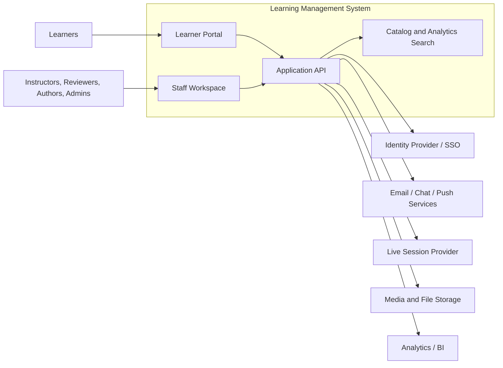

# System Context Diagram - Learning Management System

## Context Notes

- Learners primarily interact through the catalog, course player, assessment, and account workflows.
- Staff use dedicated operational surfaces for authoring, grading, cohort management, and reporting.
- The LMS integrates with identity, media storage, live-session tooling, notifications, and analytics platforms.

## Implementation Details: External Contract Boundaries

### Integration expectations
- IdP calls are synchronous and must fail closed for privileged actions.
- Notification and analytics integrations are asynchronous with durable outbox + replay.
- Live-session and media providers require timeout policies and fallback UX states.

### Context risk checklist
- Data classification label per external boundary.
- Allowed failure modes and user-visible message catalog.
- Provider SLA assumptions and escalation owner.
