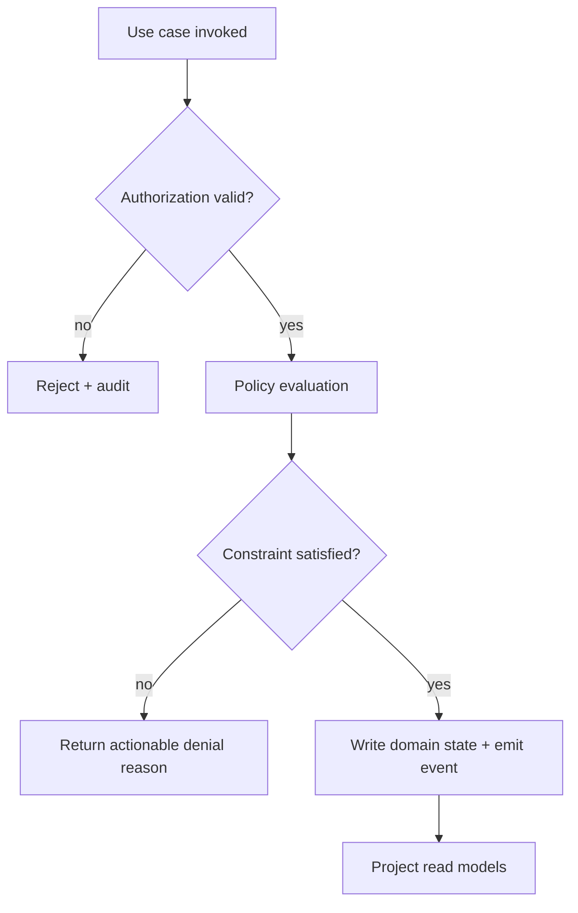

# Use Case Diagram - Learning Management System

## Implementation Details: Use-Case Realization

### Actor-to-service responsibility mapping
- **Learner** operations map to enrollment, lesson player, assessment, and progress endpoints with tenant guard checks.
- **Instructor/Reviewer** operations map to review queues, rubric workflows, moderation overrides, and feedback publication.
- **Tenant admin** operations map to policy configuration, cohort management, and reporting exports.

