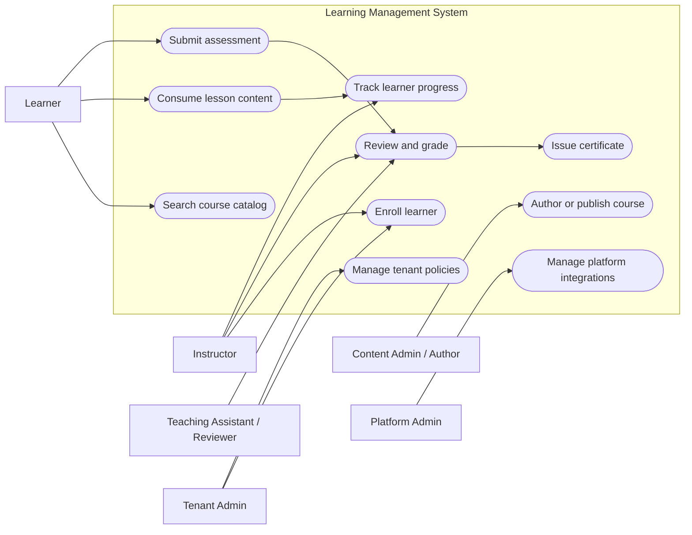

# Use Case Diagram - Learning Management System

```mermaid
flowchart LR
    learner[Learner]
    instructor[Instructor]
    reviewer[Teaching Assistant / Reviewer]
    author[Content Admin / Author]
    tenantAdmin[Tenant Admin]
    platformAdmin[Platform Admin]

    subgraph system[Learning Management System]
        uc1([Search course catalog])
        uc2([Enroll learner])
        uc3([Consume lesson content])
        uc4([Submit assessment])
        uc5([Review and grade])
        uc6([Author or publish course])
        uc7([Track learner progress])
        uc8([Issue certificate])
        uc9([Manage tenant policies])
        uc10([Manage platform integrations])
    end

    learner --> uc1
    learner --> uc3
    learner --> uc4
    instructor --> uc2
    instructor --> uc5
    instructor --> uc7
    reviewer --> uc5
    author --> uc6
    tenantAdmin --> uc2
    tenantAdmin --> uc9
    platformAdmin --> uc10
    uc3 --> uc7
    uc4 --> uc5
    uc5 --> uc8
```
