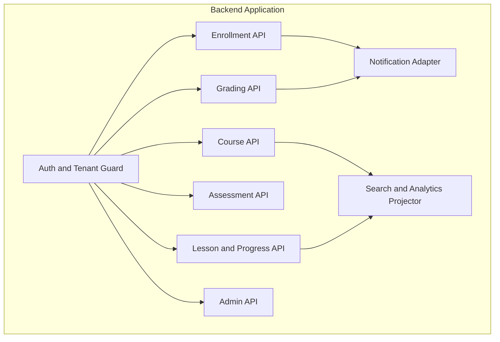

# C4 Component Diagram - Learning Management System

```mermaid
flowchart TB
    subgraph backend[Backend Application]
        auth[Auth and Tenant Guard]
        courseApi[Course API]
        enrollmentApi[Enrollment API]
        lessonApi[Lesson and Progress API]
        assessmentApi[Assessment API]
        gradingApi[Grading API]
        adminApi[Admin API]
        projector[Search and Analytics Projector]
        notifier[Notification Adapter]
    end

    auth --> courseApi
    auth --> enrollmentApi
    auth --> lessonApi
    auth --> assessmentApi
    auth --> gradingApi
    auth --> adminApi
    enrollmentApi --> notifier
    gradingApi --> notifier
    courseApi --> projector
    lessonApi --> projector
```
