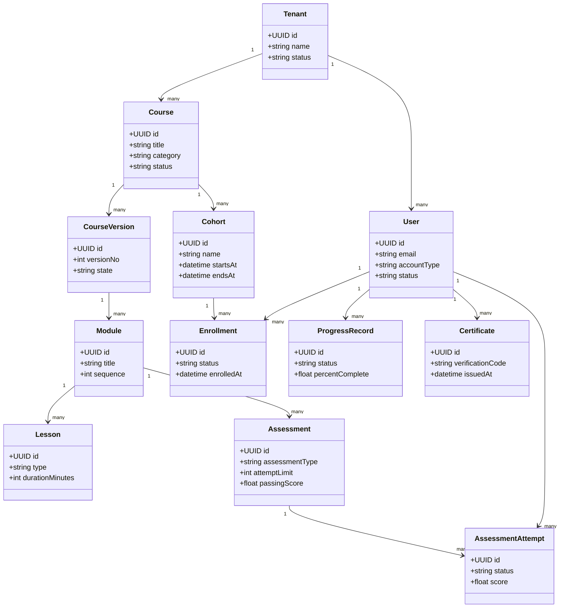

# Class Diagram - Learning Management System

## Implementation Details: Domain Object Constraints

- Value objects: `Score`, `Progress`, `TimeWindow`, `PolicyOutcome`.
- Entities enforce invariants at construction (no invalid empty tenant scope, no negative max points).
- Domain services perform policy evaluation without side effects.
