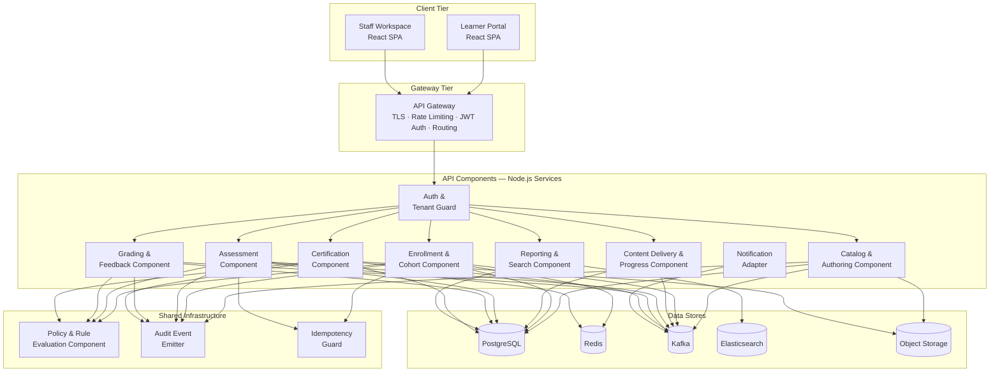
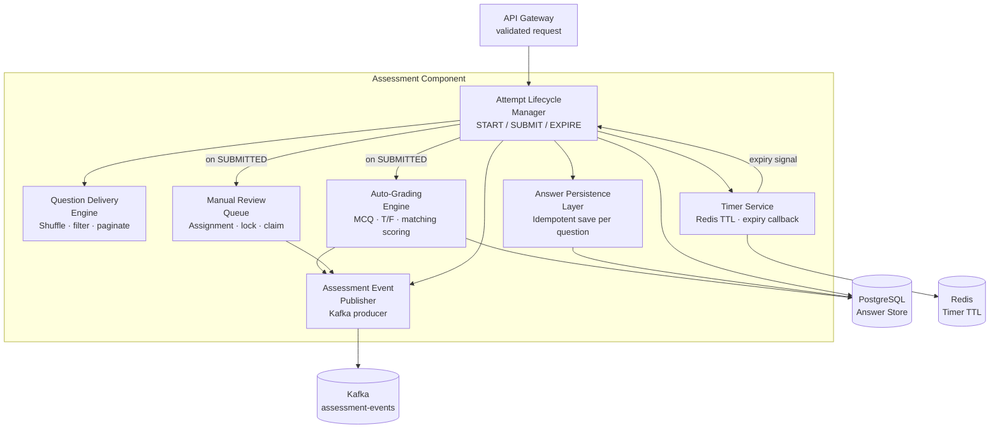
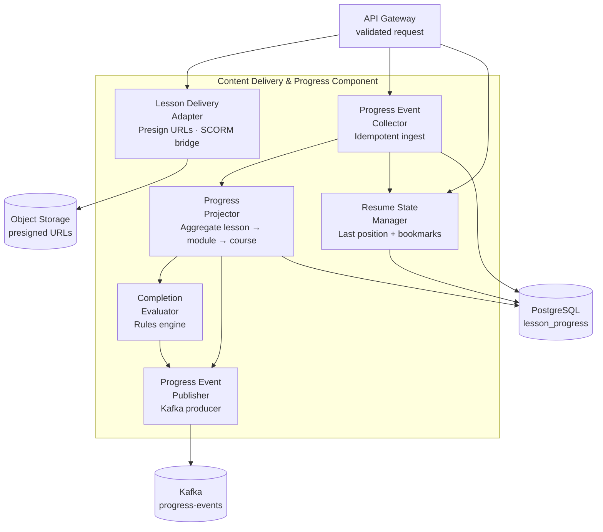

# Component Diagram - Learning Management System

This document describes the LMS component architecture at three levels: the top-level API component map, the Assessment component internals, and the Progress Tracking component internals. Component interface contracts and observability requirements are also defined.

---

## 1. Top-Level Component Diagram

Shows all major components within the API tier and their relationships to each other, to data stores, and to the async event bus.

---

## 2. Assessment Component Internals

Zooms into the `Assessment Component` to show its sub-components and how they interact to handle attempt lifecycle, question delivery, timer management, and grading dispatch.

### Assessment Sub-Component Responsibilities

| Sub-Component | Responsibility | Key Operations |
|---|---|---|
| Attempt Lifecycle Manager | Enforces state transitions (`IN_PROGRESS → SUBMITTED → GRADED`); validates attempt limits | `startAttempt()`, `submitAttempt()`, `expireAttempt()` |
| Question Delivery Engine | Fetches and optionally shuffles question set; applies per-learner randomisation seed | `getQuestions(attemptId, seed)` |
| Timer Service | Creates Redis TTL on attempt start; fires expiry callback; cancels on submission | `startTimer()`, `cancelTimer()`, `onExpiry()` |
| Answer Persistence Layer | Idempotent upsert of `AnswerArtifact` rows; rejects writes on expired attempts | `saveAnswer(attemptId, questionId, value)` |
| Auto-Grading Engine | Scores objective questions against answer key; computes weighted total | `score(question, artifact)`, `aggregate(scores[])` |
| Manual Review Queue | Assigns attempts to reviewers; implements claim/lock pattern | `enqueue(attemptId)`, `claim(reviewerId)`, `release(reviewerId)` |
| Assessment Event Publisher | Kafka producer wrapper; guarantees `acks=all`, idempotent producer | `publish(eventType, payload)` |

---

## 3. Progress Tracking Component Internals

Zooms into the `Content Delivery & Progress Component` to show its sub-components for event collection, progress projection, and completion evaluation.

### Progress Tracking Sub-Component Responsibilities

| Sub-Component | Responsibility | Key Operations |
|---|---|---|
| Lesson Delivery Adapter | Generates presigned content URLs; bridges SCORM completion signals | `getContentUrl(lessonId, enrollmentId)`, `onScormComplete(enrollmentId, lessonId)` |
| Progress Event Collector | Idempotent ingest of lesson completion events; prevents double-counting | `recordCompletion(enrollmentId, lessonId, progressSeconds)` |
| Progress Projector | Aggregates `LessonProgress` rows into `ProgressRecord`; recalculates percentages | `recalculate(enrollmentId)`, `getProgressSummary(enrollmentId)` |
| Completion Evaluator | Evaluates `ProgressRecord` against `CompletionRule`; returns `bool` + unmet criteria | `evaluate(enrollmentId, courseVersionId)`, `unmetCriteria(enrollmentId)` |
| Resume State Manager | Tracks last-watched second per lesson; stores bookmarks | `updatePosition(enrollmentId, lessonId, seconds)`, `getResumePosition(enrollmentId, lessonId)` |
| Progress Event Publisher | Kafka producer; publishes `PROGRESS_UPDATED` and `COMPLETION_ACHIEVED` events | `publish(eventType, payload)` |

---

## 4. Component Interface Contracts

| Component | Exported Interface | Input | Output | Error Codes |
|---|---|---|---|---|
| Auth & Tenant Guard | `authenticate(token)` | JWT bearer token | `{userId, tenantId, roles[], exp}` | `AUTH_401_INVALID_TOKEN`, `AUTH_403_TENANT_MISMATCH` |
| Catalog & Authoring | `getCourse(id, tenantId)` | `courseId`, `tenantId` | `Course` aggregate | `COURSE_404_NOT_FOUND`, `COURSE_403_TENANT_SCOPE` |
| Enrollment & Cohort | `createEnrollment(req)` | `EnrollmentRequest` | `Enrollment` | `ENROLL_409_SEAT_LIMIT`, `ENROLL_422_WINDOW_CLOSED`, `ENROLL_422_PREREQ_NOT_MET` |
| Assessment | `startAttempt(req)` | `AttemptStartRequest` | `AssessmentAttempt` + questions | `ATTEMPT_422_LIMIT_EXCEEDED`, `ATTEMPT_422_WINDOW_CLOSED` |
| Assessment | `submitAttempt(req)` | `AttemptSubmitRequest` | `{status, score?}` | `ATTEMPT_422_EXPIRED`, `ATTEMPT_409_ALREADY_SUBMITTED` |
| Grading & Feedback | `releaseGrade(req)` | `GradeReleaseRequest` | `GradeRecord` | `GRADE_409_LOCKED`, `GRADE_422_INCOMPLETE_RUBRIC` |
| Certification | `issueCertificate(enrollmentId)` | `enrollmentId` | `Certificate` | `CERT_422_CRITERIA_NOT_MET`, `CERT_409_ALREADY_ISSUED` |
| Reporting & Search | `searchCatalog(query)` | `CatalogSearchQuery` | `{results[], total, facets{}}` | `SEARCH_503_INDEX_UNAVAILABLE` |
| Policy Component | `evaluate(request)` | `PolicyEvaluationRequest` | `PolicyOutcome` | Never throws — returns `DENIED` with reason |
| Idempotency Guard | `check(key, tenantId)` | `idempotencyKey`, `tenantId` | `{exists: bool, cachedResponse?}` | `IDEMPOTENCY_503_CACHE_UNAVAILABLE` (fail open) |

---

## 5. Component Health Check and Observability Requirements

| Component | Health Check Endpoint | Key Metrics | Alert Thresholds | Runbook |
|---|---|---|---|---|
| API Gateway | `GET /healthz` | Request rate, p95 latency, 5xx rate, auth failures | p95 > 200ms; 5xx > 0.1% | Gateway incident triage |
| Auth & Tenant Guard | Internal liveness probe | Token validation latency, cache hit rate, IDP call failures | IDP failures > 5/min | IDP failover guide |
| Catalog & Authoring | `GET /internal/health` | DB query time, S3 write errors | DB p95 > 100ms; S3 errors > 0 | DB replica failover |
| Enrollment & Cohort | `GET /internal/health` | Enrollment rate, seat lock contention, Redis hit rate | Lock contention > 10%; Redis miss > 20% | Seat counter reset guide |
| Assessment | `GET /internal/health` | Active attempts, timer accuracy, answer save latency | Timer drift > 5s; save p95 > 200ms | Timer service recovery |
| Grading & Feedback | `GET /internal/health` | Queue depth, avg review time, grade release rate | Queue depth > 500; stale items > 48h | Grading queue drain |
| Certification | `GET /internal/health` | Pending certs, PDF generation failures, S3 write errors | Pending > 50; failures > 0 | Certificate retry runbook |
| Reporting & Search | `GET /internal/health` | ES query latency, index staleness, projection lag | ES p95 > 1s; lag > 5min | ES index rebuild guide |
| Kafka (all consumers) | Consumer group lag metric | Consumer lag per partition, DLQ message count | Lag > 10,000 messages; DLQ > 0 | DLQ replay guide |
