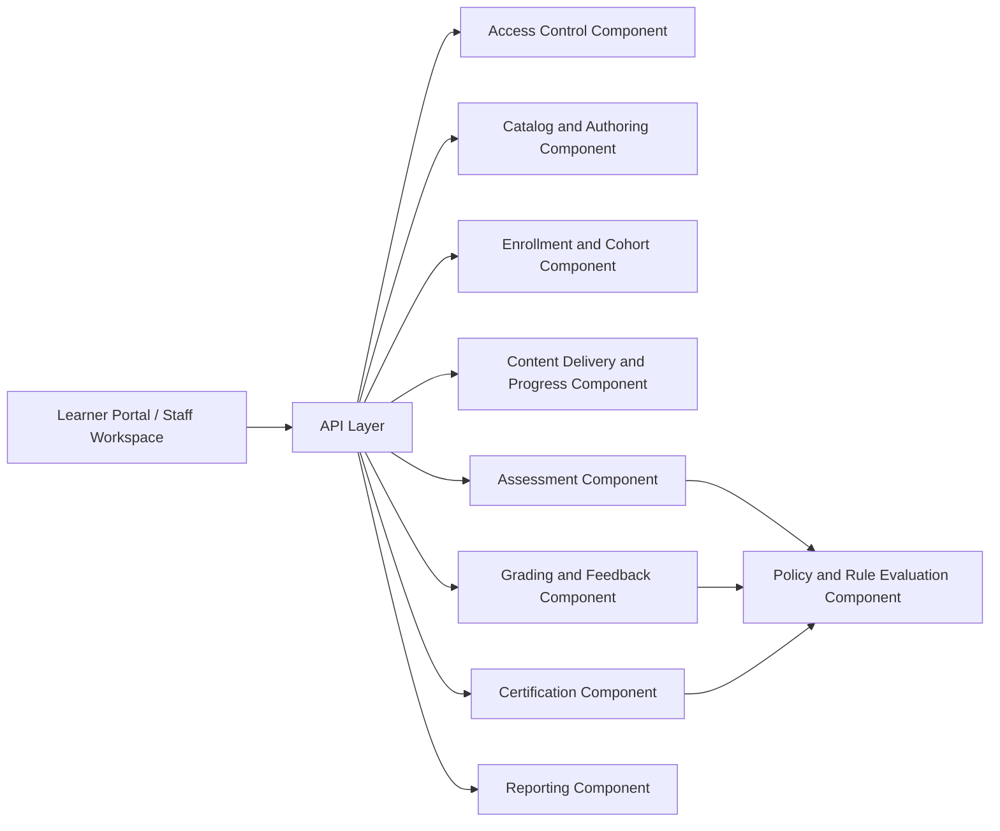

# Component Diagram - Learning Management System

## Component Responsibilities

| Component | Responsibility |
|-----------|----------------|
| Access Control | Authentication, tenant scoping, RBAC |
| Catalog and Authoring | Courses, versions, lessons, metadata, publication |
| Enrollment and Cohort | Learner assignment, schedules, access windows |
| Content Delivery and Progress | Lesson rendering state, checkpoints, completion tracking |
| Assessment | Attempts, submissions, timers, question delivery |
| Grading and Feedback | Rubrics, reviewer workflows, overrides |
| Certification | Completion evaluation and credential issuance |
| Reporting | Dashboards, exports, engagement summaries |

## Implementation Details: Component Interaction Rules

- Commands and queries remain separated to simplify replay and projection rebuild.
- Cross-component calls must use versioned contracts and fallback behavior.
- Side-effecting components must emit audit and metric events.
