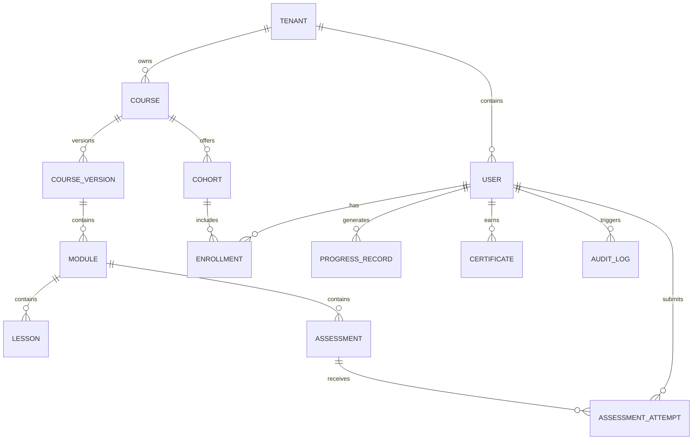

# ERD and Database Schema - Learning Management System

## Table Notes

| Table | Notes |
|-------|-------|
| tenants | Tenant lifecycle, branding, and configuration scope |
| users | Learners and staff within tenant isolation boundaries |
| courses | Top-level course entities |
| course_versions | Stable published or draft snapshots |
| modules | Ordered course sections |
| lessons | Content units and resources |
| cohorts | Schedule and audience grouping |
| enrollments | Learner participation records |
| assessments | Assessment definitions and settings |
| assessment_attempts | Learner attempt history |
| progress_records | Lesson- or content-level completion data |
| certificates | Completion credentials |
| audit_logs | Immutable system and workflow history |
