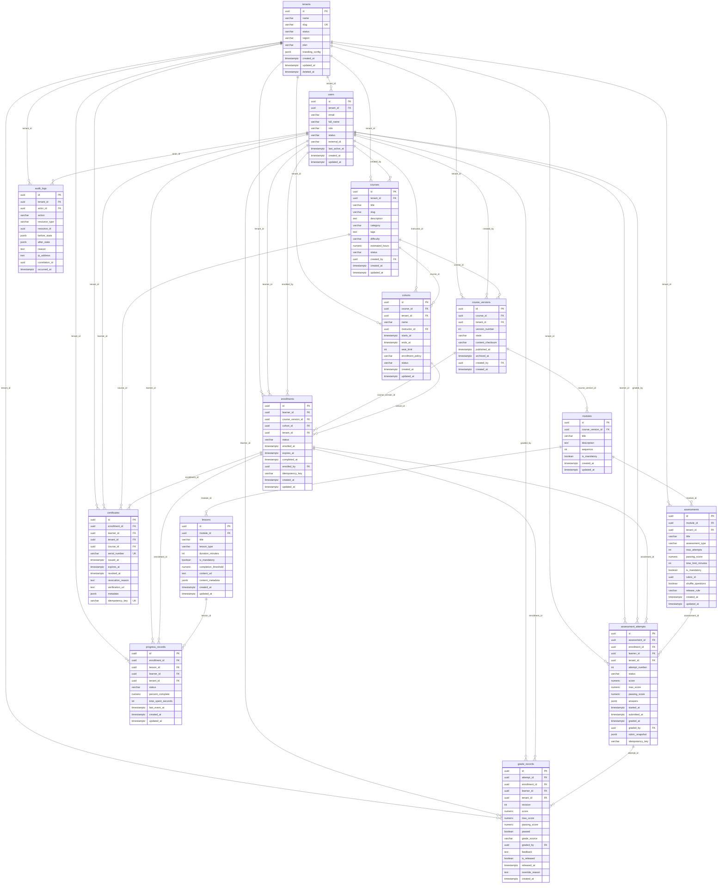

# ERD and Database Schema — Learning Management System

> Version: 1.0 | Status: Approved | Last Updated: 2025

---

## 1. Entity-Relationship Diagram



---

## 2. Table Definitions

### 2.1 tenants

| Column | Type | Nullable | Default | Constraints |
|--------|------|----------|---------|-------------|
| id | UUID | NOT NULL | gen_random_uuid() | PRIMARY KEY |
| name | VARCHAR(255) | NOT NULL | — | — |
| slug | VARCHAR(100) | NOT NULL | — | UNIQUE |
| status | VARCHAR(20) | NOT NULL | 'active' | CHECK (status IN ('active','suspended','deleted')) |
| region | VARCHAR(50) | NOT NULL | — | — |
| plan | VARCHAR(50) | NOT NULL | — | CHECK (plan IN ('starter','growth','enterprise')) |
| branding_config | JSONB | NULL | '{}' | — |
| created_at | TIMESTAMPTZ | NOT NULL | NOW() | — |
| updated_at | TIMESTAMPTZ | NOT NULL | NOW() | — |
| deleted_at | TIMESTAMPTZ | NULL | — | — |

### 2.2 users

| Column | Type | Nullable | Default | Constraints |
|--------|------|----------|---------|-------------|
| id | UUID | NOT NULL | gen_random_uuid() | PRIMARY KEY |
| tenant_id | UUID | NOT NULL | — | FK → tenants(id) ON DELETE CASCADE |
| email | VARCHAR(255) | NOT NULL | — | — |
| full_name | VARCHAR(255) | NOT NULL | — | — |
| role | VARCHAR(50) | NOT NULL | — | CHECK (role IN ('learner','instructor','reviewer','content_admin','tenant_admin','platform_admin')) |
| status | VARCHAR(20) | NOT NULL | 'active' | CHECK (status IN ('active','suspended','deactivated')) |
| external_id | VARCHAR(255) | NULL | — | — |
| last_active_at | TIMESTAMPTZ | NULL | — | — |
| created_at | TIMESTAMPTZ | NOT NULL | NOW() | — |
| updated_at | TIMESTAMPTZ | NOT NULL | NOW() | — |
| _(composite)_ | — | — | — | UNIQUE (tenant_id, email) |

### 2.3 courses

| Column | Type | Nullable | Default | Constraints |
|--------|------|----------|---------|-------------|
| id | UUID | NOT NULL | gen_random_uuid() | PRIMARY KEY |
| tenant_id | UUID | NOT NULL | — | FK → tenants(id) ON DELETE CASCADE |
| title | VARCHAR(500) | NOT NULL | — | — |
| slug | VARCHAR(200) | NOT NULL | — | — |
| description | TEXT | NULL | — | — |
| category | VARCHAR(100) | NULL | — | — |
| tags | TEXT[] | NULL | '{}' | — |
| difficulty | VARCHAR(20) | NULL | — | CHECK (difficulty IN ('beginner','intermediate','advanced','expert')) |
| estimated_hours | NUMERIC(6,2) | NULL | — | CHECK (estimated_hours >= 0) |
| status | VARCHAR(20) | NOT NULL | 'draft' | CHECK (status IN ('draft','published','archived')) |
| created_by | UUID | NOT NULL | — | FK → users(id) ON DELETE RESTRICT |
| created_at | TIMESTAMPTZ | NOT NULL | NOW() | — |
| updated_at | TIMESTAMPTZ | NOT NULL | NOW() | — |
| _(composite)_ | — | — | — | UNIQUE (tenant_id, slug) |

### 2.4 course_versions

| Column | Type | Nullable | Default | Constraints |
|--------|------|----------|---------|-------------|
| id | UUID | NOT NULL | gen_random_uuid() | PRIMARY KEY |
| course_id | UUID | NOT NULL | — | FK → courses(id) ON DELETE CASCADE |
| tenant_id | UUID | NOT NULL | — | FK → tenants(id) |
| version_number | INTEGER | NOT NULL | — | CHECK (version_number > 0) |
| state | VARCHAR(20) | NOT NULL | 'draft' | CHECK (state IN ('draft','in_review','published','archived')) |
| content_checksum | VARCHAR(64) | NULL | — | — |
| published_at | TIMESTAMPTZ | NULL | — | — |
| archived_at | TIMESTAMPTZ | NULL | — | — |
| created_by | UUID | NOT NULL | — | FK → users(id) ON DELETE RESTRICT |
| created_at | TIMESTAMPTZ | NOT NULL | NOW() | — |
| _(composite)_ | — | — | — | UNIQUE (course_id, version_number) |

### 2.5 modules

| Column | Type | Nullable | Default | Constraints |
|--------|------|----------|---------|-------------|
| id | UUID | NOT NULL | gen_random_uuid() | PRIMARY KEY |
| course_version_id | UUID | NOT NULL | — | FK → course_versions(id) ON DELETE CASCADE |
| title | VARCHAR(500) | NOT NULL | — | — |
| description | TEXT | NULL | — | — |
| sequence | INTEGER | NOT NULL | — | CHECK (sequence >= 0) |
| is_mandatory | BOOLEAN | NOT NULL | true | — |
| created_at | TIMESTAMPTZ | NOT NULL | NOW() | — |
| updated_at | TIMESTAMPTZ | NOT NULL | NOW() | — |

### 2.6 lessons

| Column | Type | Nullable | Default | Constraints |
|--------|------|----------|---------|-------------|
| id | UUID | NOT NULL | gen_random_uuid() | PRIMARY KEY |
| module_id | UUID | NOT NULL | — | FK → modules(id) ON DELETE CASCADE |
| title | VARCHAR(500) | NOT NULL | — | — |
| lesson_type | VARCHAR(50) | NOT NULL | — | CHECK (lesson_type IN ('video','document','article','live_session','scorm','assignment')) |
| duration_minutes | INTEGER | NULL | — | CHECK (duration_minutes > 0) |
| is_mandatory | BOOLEAN | NOT NULL | true | — |
| completion_threshold | NUMERIC(5,2) | NOT NULL | 80.0 | CHECK (completion_threshold BETWEEN 0 AND 100) |
| content_url | TEXT | NULL | — | — |
| content_metadata | JSONB | NULL | '{}' | — |
| created_at | TIMESTAMPTZ | NOT NULL | NOW() | — |
| updated_at | TIMESTAMPTZ | NOT NULL | NOW() | — |

### 2.7 assessments

| Column | Type | Nullable | Default | Constraints |
|--------|------|----------|---------|-------------|
| id | UUID | NOT NULL | gen_random_uuid() | PRIMARY KEY |
| module_id | UUID | NOT NULL | — | FK → modules(id) ON DELETE CASCADE |
| tenant_id | UUID | NOT NULL | — | FK → tenants(id) |
| title | VARCHAR(500) | NOT NULL | — | — |
| assessment_type | VARCHAR(50) | NOT NULL | — | CHECK (assessment_type IN ('quiz','exam','assignment','survey')) |
| max_attempts | INTEGER | NOT NULL | 3 | CHECK (max_attempts > 0) |
| passing_score | NUMERIC(5,2) | NOT NULL | 70.0 | CHECK (passing_score BETWEEN 0 AND 100) |
| time_limit_minutes | INTEGER | NULL | — | CHECK (time_limit_minutes > 0) |
| is_mandatory | BOOLEAN | NOT NULL | true | — |
| rubric_id | UUID | NULL | — | — |
| shuffle_questions | BOOLEAN | NOT NULL | false | — |
| release_rule | VARCHAR(30) | NOT NULL | 'immediate' | CHECK (release_rule IN ('immediate','after_due_date','manual')) |
| created_at | TIMESTAMPTZ | NOT NULL | NOW() | — |
| updated_at | TIMESTAMPTZ | NOT NULL | NOW() | — |

### 2.8 cohorts

| Column | Type | Nullable | Default | Constraints |
|--------|------|----------|---------|-------------|
| id | UUID | NOT NULL | gen_random_uuid() | PRIMARY KEY |
| course_id | UUID | NOT NULL | — | FK → courses(id) ON DELETE RESTRICT |
| tenant_id | UUID | NOT NULL | — | FK → tenants(id) |
| name | VARCHAR(255) | NOT NULL | — | — |
| instructor_id | UUID | NOT NULL | — | FK → users(id) ON DELETE RESTRICT |
| starts_at | TIMESTAMPTZ | NOT NULL | — | — |
| ends_at | TIMESTAMPTZ | NOT NULL | — | CHECK (ends_at > starts_at) |
| seat_limit | INTEGER | NULL | — | CHECK (seat_limit > 0) |
| enrollment_policy | VARCHAR(30) | NOT NULL | 'invite_only' | CHECK (enrollment_policy IN ('open','invite_only','approval_required')) |
| status | VARCHAR(20) | NOT NULL | 'scheduled' | CHECK (status IN ('scheduled','active','completed','cancelled')) |
| created_at | TIMESTAMPTZ | NOT NULL | NOW() | — |
| updated_at | TIMESTAMPTZ | NOT NULL | NOW() | — |

### 2.9 enrollments

| Column | Type | Nullable | Default | Constraints |
|--------|------|----------|---------|-------------|
| id | UUID | NOT NULL | gen_random_uuid() | PRIMARY KEY |
| learner_id | UUID | NOT NULL | — | FK → users(id) ON DELETE RESTRICT |
| course_version_id | UUID | NOT NULL | — | FK → course_versions(id) ON DELETE RESTRICT |
| cohort_id | UUID | NULL | — | FK → cohorts(id) ON DELETE SET NULL |
| tenant_id | UUID | NOT NULL | — | FK → tenants(id) ON DELETE CASCADE |
| status | VARCHAR(30) | NOT NULL | 'invited' | CHECK (status IN ('invited','active','completed','expired','withdrawn','suspended')) |
| enrolled_at | TIMESTAMPTZ | NULL | — | — |
| expires_at | TIMESTAMPTZ | NULL | — | — |
| completed_at | TIMESTAMPTZ | NULL | — | — |
| enrolled_by | UUID | NOT NULL | — | FK → users(id) ON DELETE RESTRICT |
| idempotency_key | VARCHAR(100) | NULL | — | — |
| created_at | TIMESTAMPTZ | NOT NULL | NOW() | — |
| updated_at | TIMESTAMPTZ | NOT NULL | NOW() | — |
| _(composite)_ | — | — | — | UNIQUE (learner_id, course_version_id) |

### 2.10 assessment_attempts

| Column | Type | Nullable | Default | Constraints |
|--------|------|----------|---------|-------------|
| id | UUID | NOT NULL | gen_random_uuid() | PRIMARY KEY |
| assessment_id | UUID | NOT NULL | — | FK → assessments(id) ON DELETE RESTRICT |
| enrollment_id | UUID | NOT NULL | — | FK → enrollments(id) ON DELETE CASCADE |
| learner_id | UUID | NOT NULL | — | FK → users(id) ON DELETE RESTRICT |
| tenant_id | UUID | NOT NULL | — | FK → tenants(id) ON DELETE CASCADE |
| attempt_number | INTEGER | NOT NULL | — | CHECK (attempt_number > 0) |
| status | VARCHAR(20) | NOT NULL | 'in_progress' | CHECK (status IN ('in_progress','submitted','graded','timed_out')) |
| score | NUMERIC(6,2) | NULL | — | — |
| max_score | NUMERIC(6,2) | NULL | — | — |
| passing_score | NUMERIC(6,2) | NULL | — | — |
| answers | JSONB | NULL | '{}' | — |
| started_at | TIMESTAMPTZ | NOT NULL | NOW() | — |
| submitted_at | TIMESTAMPTZ | NULL | — | — |
| graded_at | TIMESTAMPTZ | NULL | — | — |
| graded_by | UUID | NULL | — | FK → users(id) ON DELETE SET NULL |
| rubric_snapshot | JSONB | NULL | — | — |
| idempotency_key | VARCHAR(100) | NULL | — | — |

### 2.11 progress_records

| Column | Type | Nullable | Default | Constraints |
|--------|------|----------|---------|-------------|
| id | UUID | NOT NULL | gen_random_uuid() | PRIMARY KEY |
| enrollment_id | UUID | NOT NULL | — | FK → enrollments(id) ON DELETE CASCADE |
| lesson_id | UUID | NOT NULL | — | FK → lessons(id) ON DELETE RESTRICT |
| learner_id | UUID | NOT NULL | — | FK → users(id) ON DELETE RESTRICT |
| tenant_id | UUID | NOT NULL | — | FK → tenants(id) ON DELETE CASCADE |
| status | VARCHAR(20) | NOT NULL | 'not_started' | CHECK (status IN ('not_started','in_progress','completed')) |
| percent_complete | NUMERIC(5,2) | NOT NULL | 0 | CHECK (percent_complete BETWEEN 0 AND 100) |
| time_spent_seconds | INTEGER | NOT NULL | 0 | CHECK (time_spent_seconds >= 0) |
| last_event_at | TIMESTAMPTZ | NULL | — | — |
| created_at | TIMESTAMPTZ | NOT NULL | NOW() | — |
| updated_at | TIMESTAMPTZ | NOT NULL | NOW() | — |
| _(composite)_ | — | — | — | UNIQUE (enrollment_id, lesson_id) |

### 2.12 grade_records

| Column | Type | Nullable | Default | Constraints |
|--------|------|----------|---------|-------------|
| id | UUID | NOT NULL | gen_random_uuid() | PRIMARY KEY |
| attempt_id | UUID | NOT NULL | — | FK → assessment_attempts(id) ON DELETE RESTRICT |
| enrollment_id | UUID | NOT NULL | — | FK → enrollments(id) ON DELETE RESTRICT |
| learner_id | UUID | NOT NULL | — | FK → users(id) ON DELETE RESTRICT |
| tenant_id | UUID | NOT NULL | — | FK → tenants(id) ON DELETE CASCADE |
| revision | INTEGER | NOT NULL | 1 | CHECK (revision > 0) |
| score | NUMERIC(6,2) | NOT NULL | — | — |
| max_score | NUMERIC(6,2) | NOT NULL | — | CHECK (max_score > 0) |
| passing_score | NUMERIC(6,2) | NOT NULL | — | — |
| passed | BOOLEAN | NOT NULL | — | — |
| grade_source | VARCHAR(20) | NOT NULL | — | CHECK (grade_source IN ('auto','manual','override')) |
| graded_by | UUID | NULL | — | FK → users(id) ON DELETE SET NULL |
| feedback | TEXT | NULL | — | — |
| is_released | BOOLEAN | NOT NULL | false | — |
| released_at | TIMESTAMPTZ | NULL | — | — |
| override_reason | TEXT | NULL | — | — |
| created_at | TIMESTAMPTZ | NOT NULL | NOW() | — |

### 2.13 certificates

| Column | Type | Nullable | Default | Constraints |
|--------|------|----------|---------|-------------|
| id | UUID | NOT NULL | gen_random_uuid() | PRIMARY KEY |
| enrollment_id | UUID | NOT NULL | — | FK → enrollments(id) ON DELETE RESTRICT |
| learner_id | UUID | NOT NULL | — | FK → users(id) ON DELETE RESTRICT |
| tenant_id | UUID | NOT NULL | — | FK → tenants(id) ON DELETE CASCADE |
| course_id | UUID | NOT NULL | — | FK → courses(id) ON DELETE RESTRICT |
| serial_number | VARCHAR(100) | NOT NULL | — | UNIQUE |
| issued_at | TIMESTAMPTZ | NOT NULL | NOW() | — |
| expires_at | TIMESTAMPTZ | NULL | — | CHECK (expires_at > issued_at) |
| revoked_at | TIMESTAMPTZ | NULL | — | — |
| revocation_reason | TEXT | NULL | — | — |
| verification_url | TEXT | NOT NULL | — | — |
| metadata | JSONB | NULL | '{}' | — |
| idempotency_key | VARCHAR(100) | NULL | — | UNIQUE |

### 2.14 audit_logs

| Column | Type | Nullable | Default | Constraints |
|--------|------|----------|---------|-------------|
| id | UUID | NOT NULL | gen_random_uuid() | PRIMARY KEY |
| tenant_id | UUID | NOT NULL | — | FK → tenants(id) ON DELETE CASCADE |
| actor_id | UUID | NOT NULL | — | FK → users(id) ON DELETE RESTRICT |
| action | VARCHAR(100) | NOT NULL | — | — |
| resource_type | VARCHAR(100) | NOT NULL | — | — |
| resource_id | UUID | NOT NULL | — | — |
| before_state | JSONB | NULL | — | — |
| after_state | JSONB | NULL | — | — |
| reason | TEXT | NULL | — | — |
| ip_address | INET | NULL | — | — |
| correlation_id | UUID | NULL | — | — |
| occurred_at | TIMESTAMPTZ | NOT NULL | NOW() | — |

---

## 3. Foreign Key Relationships

| Referencing Table | Column | Referenced Table | Column | On Delete |
|-------------------|--------|------------------|--------|-----------|
| users | tenant_id | tenants | id | CASCADE |
| courses | tenant_id | tenants | id | CASCADE |
| courses | created_by | users | id | RESTRICT |
| course_versions | course_id | courses | id | CASCADE |
| course_versions | tenant_id | tenants | id | CASCADE |
| course_versions | created_by | users | id | RESTRICT |
| modules | course_version_id | course_versions | id | CASCADE |
| lessons | module_id | modules | id | CASCADE |
| assessments | module_id | modules | id | CASCADE |
| assessments | tenant_id | tenants | id | CASCADE |
| cohorts | course_id | courses | id | RESTRICT |
| cohorts | tenant_id | tenants | id | CASCADE |
| cohorts | instructor_id | users | id | RESTRICT |
| enrollments | learner_id | users | id | RESTRICT |
| enrollments | course_version_id | course_versions | id | RESTRICT |
| enrollments | cohort_id | cohorts | id | SET NULL |
| enrollments | tenant_id | tenants | id | CASCADE |
| enrollments | enrolled_by | users | id | RESTRICT |
| assessment_attempts | assessment_id | assessments | id | RESTRICT |
| assessment_attempts | enrollment_id | enrollments | id | CASCADE |
| assessment_attempts | learner_id | users | id | RESTRICT |
| assessment_attempts | tenant_id | tenants | id | CASCADE |
| assessment_attempts | graded_by | users | id | SET NULL |
| progress_records | enrollment_id | enrollments | id | CASCADE |
| progress_records | lesson_id | lessons | id | RESTRICT |
| progress_records | learner_id | users | id | RESTRICT |
| progress_records | tenant_id | tenants | id | CASCADE |
| grade_records | attempt_id | assessment_attempts | id | RESTRICT |
| grade_records | enrollment_id | enrollments | id | RESTRICT |
| grade_records | learner_id | users | id | RESTRICT |
| grade_records | tenant_id | tenants | id | CASCADE |
| grade_records | graded_by | users | id | SET NULL |
| certificates | enrollment_id | enrollments | id | RESTRICT |
| certificates | learner_id | users | id | RESTRICT |
| certificates | tenant_id | tenants | id | CASCADE |
| certificates | course_id | courses | id | RESTRICT |
| audit_logs | tenant_id | tenants | id | CASCADE |
| audit_logs | actor_id | users | id | RESTRICT |

---

## 4. Index Definitions

### tenants
```sql
CREATE UNIQUE INDEX uidx_tenants_slug ON tenants(slug);
CREATE INDEX idx_tenants_status ON tenants(status) WHERE deleted_at IS NULL;
CREATE INDEX idx_tenants_region_plan ON tenants(region, plan);
```

### users
```sql
CREATE UNIQUE INDEX uidx_users_tenant_email ON users(tenant_id, email);
CREATE INDEX idx_users_tenant_role ON users(tenant_id, role);
CREATE INDEX idx_users_tenant_status ON users(tenant_id, status) WHERE status = 'active';
CREATE INDEX idx_users_external_id ON users(tenant_id, external_id) WHERE external_id IS NOT NULL;
CREATE INDEX idx_users_last_active ON users(tenant_id, last_active_at DESC NULLS LAST);
```

### courses
```sql
CREATE UNIQUE INDEX uidx_courses_tenant_slug ON courses(tenant_id, slug);
CREATE INDEX idx_courses_tenant_status ON courses(tenant_id, status);
CREATE INDEX idx_courses_category ON courses(tenant_id, category) WHERE category IS NOT NULL;
CREATE INDEX idx_courses_created_by ON courses(tenant_id, created_by);
CREATE INDEX idx_courses_tags ON courses USING GIN(tags);
```

### course_versions
```sql
CREATE UNIQUE INDEX uidx_course_versions_course_num ON course_versions(course_id, version_number);
CREATE INDEX idx_course_versions_state ON course_versions(course_id, state);
CREATE INDEX idx_course_versions_tenant_state ON course_versions(tenant_id, state);
CREATE INDEX idx_course_versions_published ON course_versions(published_at DESC NULLS LAST) WHERE state = 'published';
```

### modules
```sql
CREATE INDEX idx_modules_course_version_seq ON modules(course_version_id, sequence);
CREATE INDEX idx_modules_mandatory ON modules(course_version_id, is_mandatory);
CREATE INDEX idx_modules_course_version ON modules(course_version_id);
```

### lessons
```sql
CREATE INDEX idx_lessons_module ON lessons(module_id);
CREATE INDEX idx_lessons_type ON lessons(module_id, lesson_type);
CREATE INDEX idx_lessons_mandatory ON lessons(module_id, is_mandatory);
```

### assessments
```sql
CREATE INDEX idx_assessments_module ON assessments(module_id);
CREATE INDEX idx_assessments_tenant_type ON assessments(tenant_id, assessment_type);
CREATE INDEX idx_assessments_mandatory ON assessments(module_id, is_mandatory);
CREATE INDEX idx_assessments_release_rule ON assessments(module_id, release_rule);
```

### cohorts
```sql
CREATE INDEX idx_cohorts_course_status ON cohorts(course_id, status);
CREATE INDEX idx_cohorts_tenant_status ON cohorts(tenant_id, status);
CREATE INDEX idx_cohorts_instructor ON cohorts(instructor_id);
CREATE INDEX idx_cohorts_schedule ON cohorts(tenant_id, starts_at, ends_at);
```

### enrollments
```sql
CREATE UNIQUE INDEX uidx_enrollments_learner_version ON enrollments(learner_id, course_version_id);
CREATE INDEX idx_enrollments_learner_tenant ON enrollments(learner_id, tenant_id);
CREATE INDEX idx_enrollments_cohort ON enrollments(cohort_id) WHERE cohort_id IS NOT NULL;
CREATE INDEX idx_enrollments_tenant_status ON enrollments(tenant_id, status);
CREATE INDEX idx_enrollments_expires ON enrollments(expires_at) WHERE status = 'active' AND expires_at IS NOT NULL;
CREATE INDEX idx_enrollments_idempotency ON enrollments(idempotency_key) WHERE idempotency_key IS NOT NULL;
```

### assessment_attempts
```sql
CREATE INDEX idx_attempts_enrollment ON assessment_attempts(enrollment_id, assessment_id);
CREATE INDEX idx_attempts_learner_tenant ON assessment_attempts(learner_id, tenant_id);
CREATE INDEX idx_attempts_assessment_status ON assessment_attempts(assessment_id, status);
CREATE INDEX idx_attempts_tenant_submitted ON assessment_attempts(tenant_id, submitted_at DESC NULLS LAST) WHERE status = 'submitted';
CREATE INDEX idx_attempts_idempotency ON assessment_attempts(idempotency_key) WHERE idempotency_key IS NOT NULL;
```

### progress_records
```sql
CREATE UNIQUE INDEX uidx_progress_enrollment_lesson ON progress_records(enrollment_id, lesson_id);
CREATE INDEX idx_progress_learner_tenant ON progress_records(learner_id, tenant_id);
CREATE INDEX idx_progress_tenant_status ON progress_records(tenant_id, status);
CREATE INDEX idx_progress_last_event ON progress_records(tenant_id, last_event_at DESC NULLS LAST);
CREATE INDEX idx_progress_enrollment_status ON progress_records(enrollment_id, status);
```

### grade_records
```sql
CREATE INDEX idx_grades_attempt ON grade_records(attempt_id);
CREATE INDEX idx_grades_enrollment ON grade_records(enrollment_id);
CREATE INDEX idx_grades_learner_tenant ON grade_records(learner_id, tenant_id);
CREATE INDEX idx_grades_tenant_released ON grade_records(tenant_id, is_released, released_at);
CREATE INDEX idx_grades_revision ON grade_records(attempt_id, revision DESC);
```

### certificates
```sql
CREATE UNIQUE INDEX uidx_certificates_serial ON certificates(serial_number);
CREATE UNIQUE INDEX uidx_certificates_idempotency ON certificates(idempotency_key) WHERE idempotency_key IS NOT NULL;
CREATE INDEX idx_certificates_enrollment ON certificates(enrollment_id);
CREATE INDEX idx_certificates_learner_tenant ON certificates(learner_id, tenant_id);
CREATE INDEX idx_certificates_course ON certificates(course_id, issued_at DESC);
CREATE INDEX idx_certificates_revoked ON certificates(tenant_id, revoked_at) WHERE revoked_at IS NOT NULL;
```

### audit_logs
```sql
CREATE INDEX idx_audit_tenant_occurred ON audit_logs(tenant_id, occurred_at DESC);
CREATE INDEX idx_audit_actor ON audit_logs(actor_id, occurred_at DESC);
CREATE INDEX idx_audit_resource ON audit_logs(tenant_id, resource_type, resource_id);
CREATE INDEX idx_audit_correlation ON audit_logs(correlation_id) WHERE correlation_id IS NOT NULL;
CREATE INDEX idx_audit_action ON audit_logs(tenant_id, action, occurred_at DESC);
```

---

## 5. Partitioning Strategy

### progress_records — Range by `created_at` (Quarterly)

`progress_records` is expected to be the highest-volume table (billions of rows at scale). Partition by `created_at` using quarterly ranges, created automatically by `pg_partman` 30 days before each quarter starts.

```sql
CREATE TABLE progress_records (
    id UUID NOT NULL DEFAULT gen_random_uuid(),
    enrollment_id UUID NOT NULL,
    lesson_id UUID NOT NULL,
    learner_id UUID NOT NULL,
    tenant_id UUID NOT NULL,
    status VARCHAR(20) NOT NULL DEFAULT 'not_started',
    percent_complete NUMERIC(5,2) NOT NULL DEFAULT 0,
    time_spent_seconds INTEGER NOT NULL DEFAULT 0,
    last_event_at TIMESTAMPTZ,
    created_at TIMESTAMPTZ NOT NULL DEFAULT NOW(),
    updated_at TIMESTAMPTZ NOT NULL DEFAULT NOW()
) PARTITION BY RANGE (created_at);

CREATE TABLE progress_records_2025_q1 PARTITION OF progress_records
    FOR VALUES FROM ('2025-01-01') TO ('2025-04-01');

CREATE TABLE progress_records_2025_q2 PARTITION OF progress_records
    FOR VALUES FROM ('2025-04-01') TO ('2025-07-01');

-- All indexes created per-partition by pg_partman maintenance job.
```

### audit_logs — Range by `occurred_at` (Monthly)

Audit logs are append-only and never updated. Each monthly partition is detached after the hot-retention window (12 months) and exported to cold object storage (S3 Glacier / GCS Archive).

```sql
CREATE TABLE audit_logs (
    id UUID NOT NULL DEFAULT gen_random_uuid(),
    tenant_id UUID NOT NULL,
    actor_id UUID NOT NULL,
    action VARCHAR(100) NOT NULL,
    resource_type VARCHAR(100) NOT NULL,
    resource_id UUID NOT NULL,
    before_state JSONB,
    after_state JSONB,
    reason TEXT,
    ip_address INET,
    correlation_id UUID,
    occurred_at TIMESTAMPTZ NOT NULL DEFAULT NOW()
) PARTITION BY RANGE (occurred_at);

CREATE TABLE audit_logs_2025_01 PARTITION OF audit_logs
    FOR VALUES FROM ('2025-01-01') TO ('2025-02-01');

-- pg_partman premake=3 creates three months ahead; retention job detaches partitions older than 12 months.
```

---

## 6. Archival Policy

| Table | Hot Retention | Archive Trigger | Archive Target | Deletion |
|-------|--------------|-----------------|----------------|----------|
| tenants | Indefinite | `deleted_at IS NOT NULL` | Cold JSONB export | 7 years after deletion |
| users | Indefinite | Deactivated > 2 years | Anonymised snapshot | Purge PII; retain id mapping |
| courses | Indefinite | `status = 'archived'` > 1 year | Compressed export | Never deleted |
| course_versions | Indefinite | `state = 'archived'` > 2 years | Cold storage | Never deleted |
| modules | With course_version | Parent archived | Cascade with version | Cascade |
| lessons | With module | Parent archived | Cascade with version | Cascade |
| assessments | With module | Parent archived | Cascade with version | Cascade |
| cohorts | 3 years post-end | `ends_at < NOW() - 3 years` | Compressed export | 7 years |
| enrollments | 5 years | `completed_at < NOW() - 5 years` | Compliance archive | 7 years |
| assessment_attempts | 5 years | `submitted_at < NOW() - 5 years` | Compliance archive | 7 years |
| progress_records | 2 years (partitioned) | Partition boundary reached | Detach + cold store | 5 years |
| grade_records | 7 years | `created_at < NOW() - 7 years` | Compliance archive | Regulatory requirement |
| certificates | Indefinite | `revoked_at IS NOT NULL` > 5 years | Cold store | Never deleted |
| audit_logs | 12 months hot (partitioned) | Monthly partition detach | Cold object storage | 7 years |

---

## 7. Replication Notes

- **Primary/Replica topology:** One primary writer per region; two synchronous streaming replicas for HA; one asynchronous cross-region replica for disaster recovery.
- **Replication slot naming:** `lms_{region}_{index}` — e.g., `lms_us_east_01`, `lms_us_east_02`, `lms_eu_west_dr`.
- **Logical replication:** `grade_records`, `certificates`, and `audit_logs` streamed to the analytics warehouse (BigQuery / Snowflake) via Debezium CDC pipeline; publication named `lms_analytics_pub`.
- **Read routing:** `SELECT` queries for course catalog, learner dashboards, and certificate verification route to the nearest replica. All `INSERT` / `UPDATE` / `DELETE` route to the primary writer.
- **Lag alerting:** Replica lag > 5 s triggers P2 alert; > 30 s triggers P1 and automatic removal of the lagging replica from the load-balancer pool until lag recovers.
- **Partition maintenance schedule:** `pg_partman` maintenance function runs every Sunday at 02:00 UTC to create next-quarter partitions and detach expired monthly `audit_logs` partitions for archival.
- **Backup schedule:** Continuous WAL archiving to S3; full base backup daily at 01:00 UTC; retention 30 days for dailies, 12 months for weekly snapshots.
