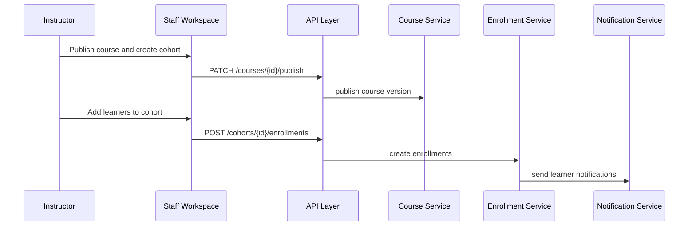
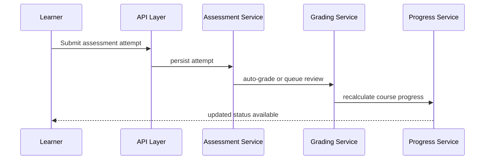

# Sequence Diagram - Learning Management System

```mermaid
sequenceDiagram
    participant Instructor as Instructor
    participant UI as Staff Workspace
    participant API as API Layer
    participant Course as Course Service
    participant Enrollment as Enrollment Service
    participant Notify as Notification Service

    Instructor->>UI: Publish course and create cohort
    UI->>API: PATCH /courses/{id}/publish
    API->>Course: publish course version
    Instructor->>UI: Add learners to cohort
    UI->>API: POST /cohorts/{id}/enrollments
    API->>Enrollment: create enrollments
    Enrollment->>Notify: send learner notifications
```

## Submission to Grade Sequence

```mermaid
sequenceDiagram
    participant Learner as Learner
    participant API as API Layer
    participant Assess as Assessment Service
    participant Grade as Grading Service
    participant Progress as Progress Service

    Learner->>API: Submit assessment attempt
    API->>Assess: persist attempt
    Assess->>Grade: auto-grade or queue review
    Grade->>Progress: recalculate course progress
    Progress-->>Learner: updated status available
```
