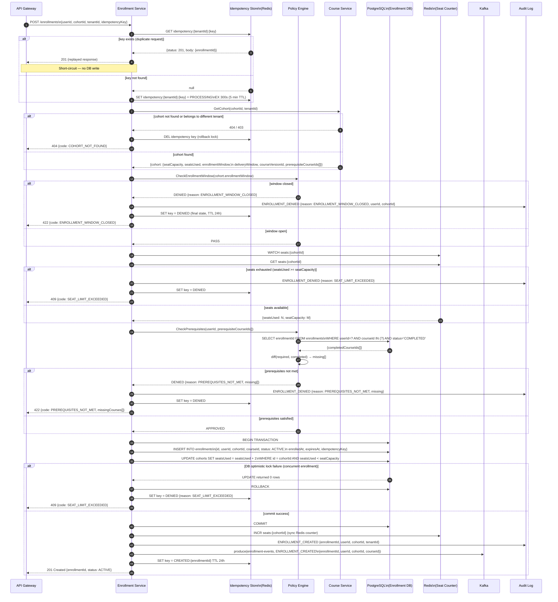
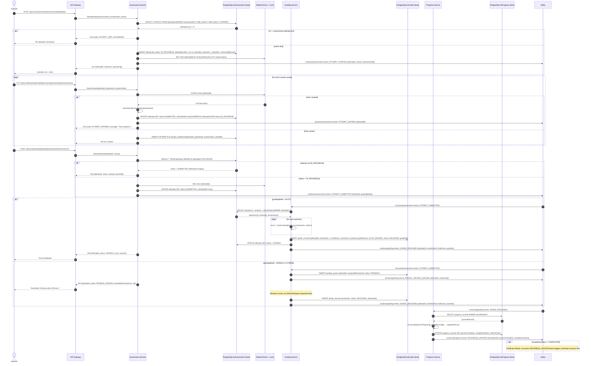

# Sequence Diagram - Learning Management System (Detailed)

This document provides low-level sequence diagrams showing internal service steps, database interactions, retry logic, and error handling for three critical flows.

---

## 1. Enrollment Validation Pipeline

Shows each internal step within the Enrollment Service and Policy Engine, including database reads, cache hits, error classification, and the idempotency key check.



---

## 2. Assessment Attempt Lifecycle

Shows the full lifecycle from start to grade release, including timer management, answer persistence, auto/manual grading branch, database state transitions, and retry on transient failures.



---

## 3. Progress Event Processing Pipeline

Shows the path of a lesson completion event from the client through the API, message queue, worker, and projection — including retry logic and idempotency.

```mermaid
sequenceDiagram
    autonumber
    actor L as Learner
    participant SW as Learner Portal\n(Client)
    participant GW as API Gateway
    participant PRS as Progress Service
    participant DB_P as PostgreSQL\n(Progress Store)
    participant KF as Kafka\n(progress-events)
    participant PW as Projection Worker
    participant ES as Elasticsearch
    participant DLQ as Dead Letter Queue

    %% ── Step 1: Client sends lesson completion event ────────────
    L->>SW: Reach end of lesson / click "Mark Complete"
    SW->>SW: Buffer event (offline-safe)\n{lessonId, enrollmentId, progressSeconds, completedAt}
    SW->>GW: POST /api/v1/enrollments/{enrollmentId}/progress/lessons/{lessonId}\n{progressSeconds, completedAt, clientEventId}

    GW->>PRS: RecordLessonProgress(enrollmentId, lessonId, progressSeconds, eventId)

    %% ── Step 2: Idempotency check ───────────────────────────────
    PRS->>DB_P: SELECT id FROM lesson_progress\nWHERE enrollmentId=? AND lessonId=? AND status=COMPLETED
    alt already completed (idempotent)
        DB_P-->>PRS: {existing record}
        PRS-->>GW: 200 {status: already recorded}
        GW-->>SW: 200
    else first completion
        DB_P-->>PRS: null
        PRS->>DB_P: INSERT lesson_progress\n{enrollmentId, lessonId, status: COMPLETED,\n progressSeconds, completedAt}
        PRS->>DB_P: SELECT COUNT(completed) / COUNT(total)\nFROM lesson_progress JOIN modules ... WHERE enrollmentId=?
        DB_P-->>PRS: {lessonsCompleted, modulesCompleted, percentComplete}
        PRS->>DB_P: UPDATE progress_records\nSET lessonsCompleted, modulesCompleted, percentComplete, lastActivityAt
        PRS->>KF: produce(progress-events)\n{enrollmentId, lessonId, percentComplete,\n completionStatus, tenantId, eventId}
        PRS-->>GW: 204 No Content
        GW-->>SW: 204
        SW-->>L: Lesson marked complete and progress bar updated
    end

    %% ── Step 3: Projection Worker consumes event ────────────────
    KF->>PW: consume(progress-events) {offset, partition}
    PW->>PW: check deduplication store for eventId
    alt eventId already processed
        PW->>KF: commit offset (skip)
        Note over PW: Idempotent — no re-indexing
    else new event
        PW->>ES: POST /_bulk\n[update learner-progress index,\n update enrollment-status index]
        alt ES write success
            ES-->>PW: 200 {items: [{result: updated}]}
            PW->>PW: record eventId as processed
            PW->>KF: commit offset
        else ES write failure (503 / network error)
            ES-->>PW: 503 / timeout
            PW->>PW: retry with exponential backoff\n(attempts: 1, 2, 4, 8, 16 seconds)
            alt retry 1-3 succeeds
                ES-->>PW: 200
                PW->>KF: commit offset
            else all 3 retries exhausted
                PW->>DLQ: produce(dead-letter-queue)\n{originalEvent, error, attempts: 3, failedAt}
                PW->>KF: commit offset (poison pill avoidance)
                Note over DLQ: Ops team receives alert;\nmanual replay after ES recovery
            end
        end
    end

    %% ── Step 4: Completion trigger ──────────────────────────────
    alt completionStatus transitions to COMPLETED
        KF->>PW: progress-events consumed by Certificate Worker
        Note over PW: Triggers separate certificate issuance flow
    end
```

---

## Retry and Error Handling Reference

| Operation | Retry Strategy | Max Attempts | On Exhaustion |
|---|---|---|---|
| Enrollment seat UPDATE (optimistic lock) | Immediate retry | 3 | Return `SEAT_LIMIT_EXCEEDED` |
| Grading Worker — auto-grade | Exponential backoff (1s, 2s, 4s) | 3 | Publish to DLQ; alert on-call |
| Projection Worker — ES index | Exponential backoff (1s, 2s, 4s, 8s, 16s) | 5 | Publish to DLQ; continue consuming |
| Certificate Worker — PDF generation | Linear retry (5s, 5s, 5s) | 3 | Publish to DLQ; alert on-call |
| Notification Worker — email dispatch | Exponential backoff (30s, 60s, 120s) | 5 | Publish to DLQ; learner sees "pending" |
| Progress lesson write | None (idempotent re-try by client) | Client-driven | Client shows "saved offline" |

## Database Interaction Summary

| Service | Tables Written | Tables Read | Transaction Scope |
|---|---|---|---|
| Enrollment Service | `enrollments`, `cohorts.seatsUsed` | `enrollments`, `cohorts`, `completions` | Single transaction (enrollment + seat) |
| Assessment Service | `attempts`, `answer_artifacts` | `attempts`, `assessments`, `questions` | Single transaction per answer save |
| Grading Service | `grade_records`, `grade_criterion_scores` | `attempts`, `answer_artifacts`, `questions`, `rubric_criteria` | Single transaction per grade record |
| Progress Service | `lesson_progress`, `progress_records` | `lesson_progress`, `progress_records`, `modules`, `lessons` | Single transaction per lesson event |
| Certification Service | `certificates` | `progress_records`, `completion_rules`, `certificates` | Single transaction per certificate insert |
