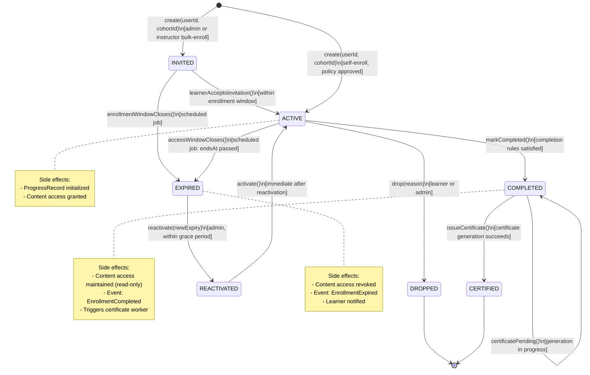

# State Machine Diagram - Learning Management System

This document defines the state machines for the four primary lifecycle entities in the LMS. Each state machine includes a Mermaid diagram, guard conditions, trigger events, and side effects.

---

## 1. CourseVersion Lifecycle

A `CourseVersion` progresses from `DRAFT` through review to `PUBLISHED`, and may be `ARCHIVED` when superseded. Only one version per course may be in `PUBLISHED` state at any time.

```mermaid
stateDiagram-v2
    [*] --> DRAFT : create(courseId, authorId)

    DRAFT --> IN_REVIEW : submitForReview()\n[has ≥1 module with ≥1 lesson]
    DRAFT --> DRAFT : updateContent()\n[state stays DRAFT]

    IN_REVIEW --> PUBLISHED : publish()\n[reviewer approved,\nno active published version\nOR prior version archived first]
    IN_REVIEW --> DRAFT : requestRevision(reason)\n[reviewer requests changes]

    PUBLISHED --> ARCHIVED : archive()\n[admin or system,\nno active cohorts on this version]
    PUBLISHED --> IN_REVIEW : createPatch(authorId)\n[creates new DRAFT child;\nthis version stays PUBLISHED\nuntil new version publishes]

    ARCHIVED --> [*]

    note right of DRAFT
        Side effects:
        - Catalog search not indexed
        - No enrollments allowed
    end note

    note right of IN_REVIEW
        Side effects:
        - Reviewer notification sent
        - Author cannot edit content
    end note

    note right of PUBLISHED
        Side effects:
        - Catalog search indexed
        - New enrollments allowed
        - Event: CourseVersionPublished
    end note

    note right of ARCHIVED
        Side effects:
        - Catalog search de-indexed
        - New enrollments blocked
        - Event: CourseVersionArchived
    end note
```

### CourseVersion Transition Table

| From State | To State | Trigger Event | Guard Conditions | Side Effects |
|---|---|---|---|---|
| — | `DRAFT` | `createVersion(courseId, authorId)` | Course must exist and be `ACTIVE` | Audit log: `VERSION_DRAFT_CREATED` |
| `DRAFT` | `IN_REVIEW` | `submitForReview()` | At least 1 module with at least 1 lesson; `CompletionRule` must be attached | Reviewer notified; author write-lock applied; audit log |
| `IN_REVIEW` | `DRAFT` | `requestRevision(reason)` | Reviewer role required | Write-lock removed; author notified; audit log |
| `IN_REVIEW` | `PUBLISHED` | `publish()` | No other `PUBLISHED` version (or prior archived atomically); reviewer approval recorded | Catalog indexed; `CourseVersionPublished` event; audit log |
| `PUBLISHED` | `ARCHIVED` | `archive()` | No active cohorts using this version; admin role required | Catalog de-indexed; new enrollments blocked; `CourseVersionArchived` event; audit log |
| `ARCHIVED` | — | — | Terminal state | No further transitions allowed |

---

## 2. Enrollment Lifecycle

An `Enrollment` moves from creation through active learning to completion, dropping, or expiry. Reactivation is allowed from `EXPIRED` only.

### Enrollment Transition Table

| From State | To State | Trigger Event | Guard Conditions | Side Effects |
|---|---|---|---|---|
| — | `INVITED` | `createInvitedEnrollment()` | Admin/instructor role; seat available; enrollment window open | Seat reserved; invitation email sent; audit log |
| — | `ACTIVE` | `createEnrollment()` | Policy approved (seat, window, prerequisites); idempotency key unique | `ProgressRecord` created; `EnrollmentCreated` event; seat counter incremented; audit log |
| `INVITED` | `ACTIVE` | `acceptInvitation()` | Within enrollment window | Content access granted; audit log |
| `INVITED` | `EXPIRED` | `enrollmentWindowCloses()` | Scheduled job; window `closesAt < now()` | Invitation cancelled; seat released; audit log |
| `ACTIVE` | `COMPLETED` | `markCompleted()` | All `CompletionRule` criteria satisfied; no open appeals | `EnrollmentCompleted` event; certificate worker triggered; audit log |
| `ACTIVE` | `DROPPED` | `drop(reason)` | Learner or admin; enrollment is `ACTIVE` | Seat released; `EnrollmentDropped` event; learner notified; audit log |
| `ACTIVE` | `EXPIRED` | `accessWindowCloses()` | Scheduled job; `expiresAt < now()` | Content access revoked; `EnrollmentExpired` event; learner notified; audit log |
| `EXPIRED` | `REACTIVATED` | `reactivate(newExpiry)` | Admin role; within configurable grace period | New `expiresAt` set; audit log |
| `REACTIVATED` | `ACTIVE` | `activate()` | Immediately follows reactivation | Content access restored; learner notified; audit log |
| `COMPLETED` | `CERTIFIED` | `issueCertificate()` | Certificate PDF stored successfully; `verificationCode` unique | `CertificateIssued` event; learner notified; audit log |

---

## 3. AssessmentAttempt Lifecycle

An `AssessmentAttempt` moves from creation through answer collection to grading. The timer can force a transition from `IN_PROGRESS` to `SUBMITTED`.

```mermaid
stateDiagram-v2
    [*] --> IN_PROGRESS : startAttempt(assessmentId, userId)\n[attemptCount < attemptLimit,\nenrollment ACTIVE,\nassessment window open]

    IN_PROGRESS --> SUBMITTED : submit(submittedAt)\n[learner-initiated]
    IN_PROGRESS --> SUBMITTED : timerExpired()\n[auto-submit with saved answers]

    SUBMITTED --> GRADED : autoGrade()\n[gradingMode = AUTO]
    SUBMITTED --> PENDING_REVIEW : enqueueManualReview()\n[gradingMode = MANUAL or HYBRID]

    PENDING_REVIEW --> GRADED : releaseGrade(reviewerId)\n[reviewer completes rubric scoring]

    GRADED --> GRADED : overrideGrade(supervisorId)\n[new revision appended;\nstatus remains GRADED]

    GRADED --> [*]

    note right of IN_PROGRESS
        Side effects:
        - Timer set in Redis (TTL)
        - Event: AttemptStarted
        - Questions delivered to learner
    end note

    note right of SUBMITTED
        Side effects:
        - Timer cancelled
        - Event: AttemptSubmitted
        - Grading pipeline triggered
    end note

    note right of PENDING_REVIEW
        Side effects:
        - Reviewer notified
        - Attempt locked for editing
        - Event: ManualReviewQueued
    end note

    note right of GRADED
        Side effects:
        - GradeRecord written (RELEASED)
        - Event: GradeReleased
        - Progress Service triggered
        - Learner notified of score
    end note
```

### AssessmentAttempt Transition Table

| From State | To State | Trigger Event | Guard Conditions | Side Effects |
|---|---|---|---|---|
| — | `IN_PROGRESS` | `startAttempt()` | `attemptCount < attemptLimit`; enrollment `ACTIVE`; assessment window open; no other `IN_PROGRESS` attempt for same assessment | Timer created in Redis; `AttemptStarted` event; audit log |
| `IN_PROGRESS` | `SUBMITTED` | `submit()` | Attempt status is `IN_PROGRESS`; timer not expired | Timer cancelled; `AttemptSubmitted` event; audit log |
| `IN_PROGRESS` | `SUBMITTED` | `timerExpired()` | Redis TTL fires; attempt still `IN_PROGRESS` | Saved answers auto-submitted; `AttemptExpired` event; audit log |
| `SUBMITTED` | `GRADED` | `autoGrade()` | `gradingMode = AUTO`; all questions are auto-gradable | `GradeRecord` inserted (status `RELEASED`); `GradeReleased` event; audit log |
| `SUBMITTED` | `PENDING_REVIEW` | `enqueueManualReview()` | `gradingMode = MANUAL` or `HYBRID` | Reviewer notified; attempt locked; `ManualReviewQueued` event; audit log |
| `PENDING_REVIEW` | `GRADED` | `releaseGrade(reviewerId)` | Reviewer role; all rubric criteria scored; `GradeRecord` in `DRAFT` status | `GradeRecord` updated to `RELEASED`; `GradeReleased` event; learner notified; audit log |
| `GRADED` | `GRADED` | `overrideGrade()` | Supervisor role; existing grade is `RELEASED` | New `GradeRecord` revision appended; `GradeOverridden` event; learner notified; audit log |

---

## 4. Certificate Lifecycle

A `Certificate` is issued after enrollment completion and may be revoked by an admin or expired by a scheduled job.

```mermaid
stateDiagram-v2
    [*] --> PENDING : initiateIssuance(enrollmentId)\n[completion rules satisfied,\nno existing ISSUED certificate]

    PENDING --> ISSUED : generate()\n[PDF stored in object storage,\nverificationCode written to DB]

    PENDING --> PENDING : retryGeneration()\n[PDF generation failed,\nretry attempt ≤ 3]

    PENDING --> [*] : generationFailed()\n[all retries exhausted —\nDLQ alert raised]

    ISSUED --> EXPIRED : expire()\n[scheduled job: expiresAt < now()\nOR credential standard requires renewal]

    ISSUED --> REVOKED : revoke(reason, revokedBy)\n[admin: misconduct, data error,\nor credential integrity breach]

    EXPIRED --> ISSUED : renew(newExpiry)\n[admin-initiated renewal;\nnew certificate record created]

    REVOKED --> [*]

    note right of PENDING
        Side effects:
        - Certificate record written (status: PENDING)
        - PDF generation queued
        - Retry counter initialized
    end note

    note right of ISSUED
        Side effects:
        - Event: CertificateIssued
        - Learner notified (email + in-app)
        - Badge assertion sent to platform
        - Analytics event emitted
    end note

    note right of REVOKED
        Side effects:
        - Event: CertificateRevoked
        - Learner notified
        - Badge platform notified (revocation assertion)
        - Verification endpoint returns REVOKED
        - Terminal — no further transitions
    end note
```

### Certificate Transition Table

| From State | To State | Trigger Event | Guard Conditions | Side Effects |
|---|---|---|---|---|
| — | `PENDING` | `initiateIssuance()` | `EnrollmentCompleted` event received; completion rules verified; no existing `ISSUED` cert for this enrollment | `Certificate` row inserted; PDF generation queued; audit log |
| `PENDING` | `ISSUED` | `generate()` | PDF stored in object storage; `verificationCode` unique; `Certificate` row not yet `ISSUED` | `CertificateIssued` event; learner notified; badge assertion sent; analytics emitted; audit log |
| `PENDING` | `PENDING` | `retryGeneration()` | Retry count ≤ 3; previous attempt failed | Retry counter incremented; audit log |
| `PENDING` | — | `generationFailed()` | Retry count > 3 | DLQ alert raised; ops team notified; audit log; certificate stuck in `PENDING` until manual intervention |
| `ISSUED` | `EXPIRED` | `expire()` | Scheduled job; `expiresAt < now()` | `CertificateExpired` event; learner notified; verification endpoint returns `EXPIRED`; audit log |
| `ISSUED` | `REVOKED` | `revoke(reason, by)` | Admin role; valid revocation reason provided | `CertificateRevoked` event; badge revocation assertion sent; learner notified; audit log |
| `EXPIRED` | `ISSUED` | `renew(newExpiry)` | Admin role; learner still meets completion criteria | New `Certificate` record created (previous marked `EXPIRED`); `CertificateIssued` event for new record; audit log |
| `REVOKED` | — | — | Terminal state | No further transitions permitted |
