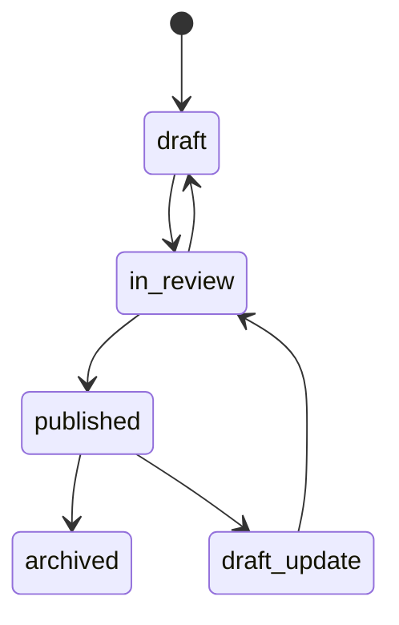
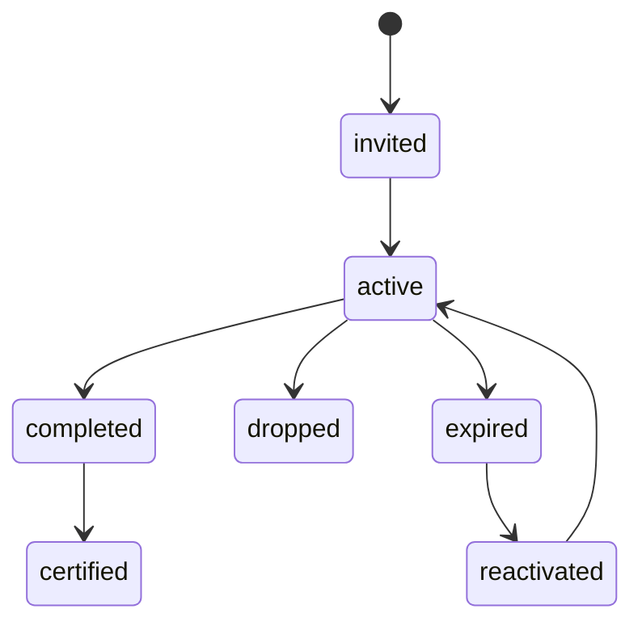

# State Machine Diagram - Learning Management System

## Course Version Lifecycle

## Enrollment Lifecycle

## Implementation Details: State Transition Rules

- Every transition defines guard condition, side effects, and emitted events.
- Illegal transitions are rejected with auditable reason codes.
- Terminal states (`archived`, `revoked`) must block further write transitions.
