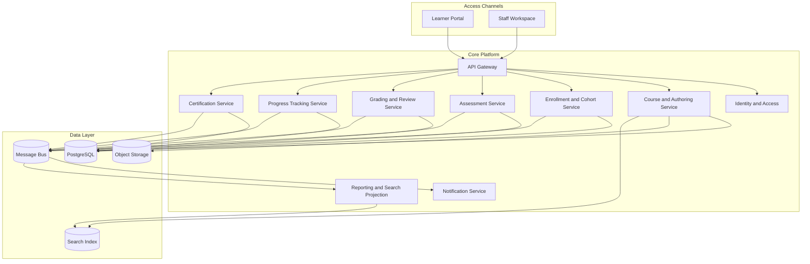

# Architecture Diagram - Learning Management System

## Responsibilities

| Component | Responsibility |
|-----------|----------------|
| Course and Authoring Service | Course definitions, versions, modules, lessons, publishing |
| Enrollment and Cohort Service | Learner enrollment, seat rules, cohorts, schedules |
| Assessment Service | Attempts, timers, submissions, auto-grading triggers |
| Grading and Review Service | Manual review, rubric scoring, feedback, overrides |
| Progress Tracking Service | Lesson completion, resume state, engagement signals |
| Certification Service | Completion evaluation and certificate issuance |
| Reporting and Search Projection | Catalog discovery, dashboards, analytics summaries |

## Implementation Details: Service Boundaries

### Boundary decisions
- Grading service owns score calculation and moderation outcomes; no other service mutates final grade records.
- Progress service owns derived completion percentages and status projections.
- Certificate service only consumes completion decisions and integrity verdicts.

### Failure containment
- Integration adapters isolate provider outages from core learning workflows.
- Read models are eventually consistent; transactional correctness remains in system-of-record services.
