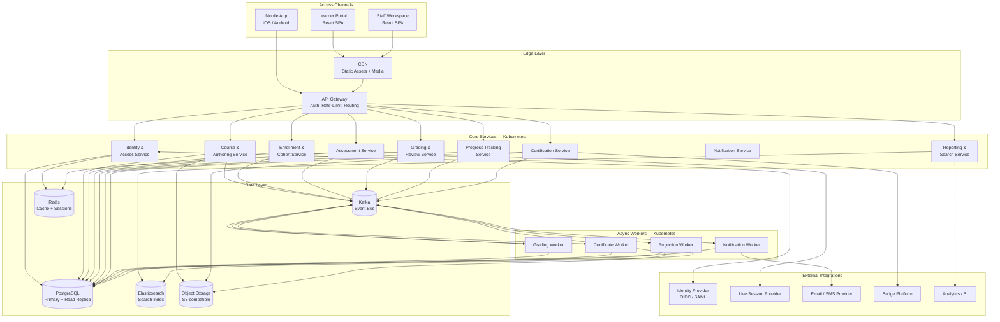
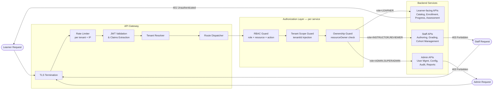
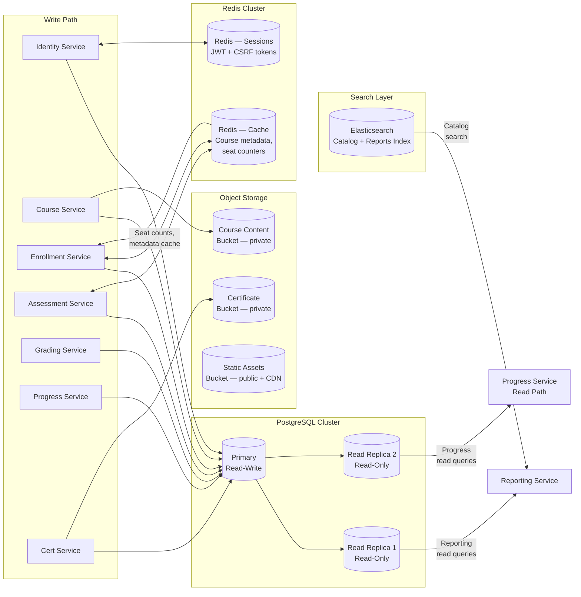
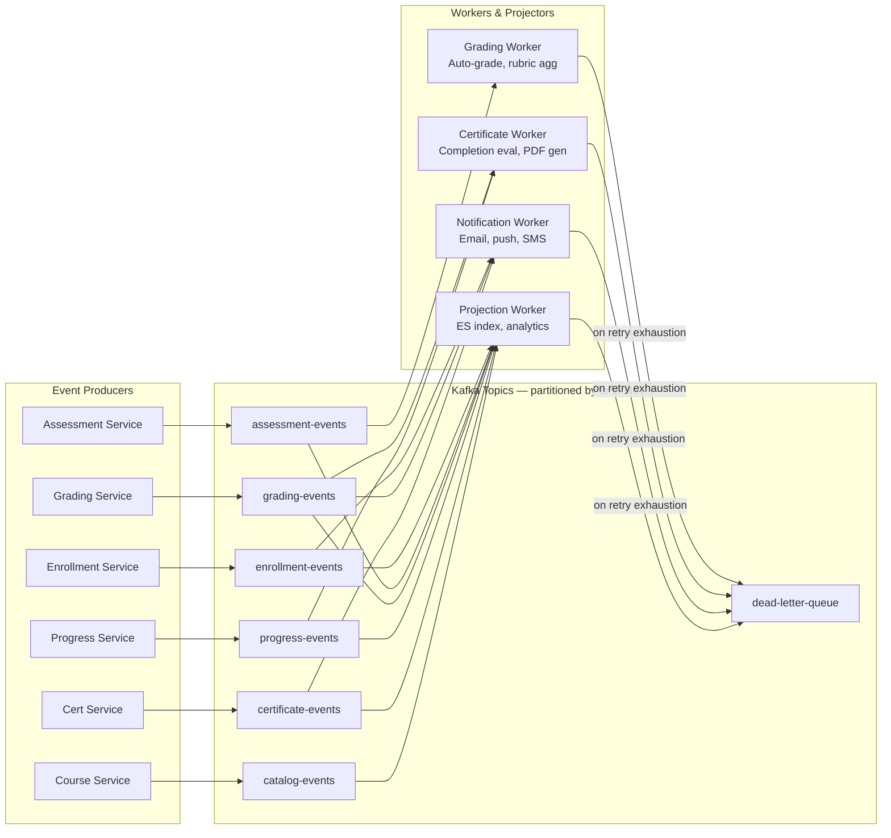
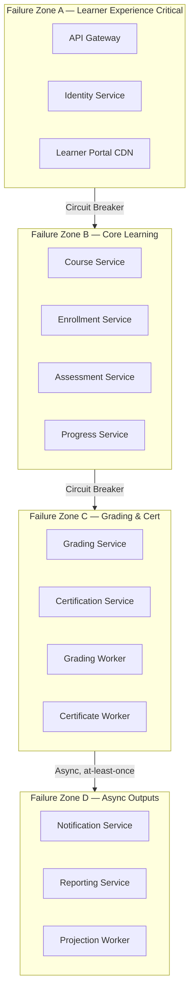

# Architecture Diagram - Learning Management System

This document describes the production architecture of the LMS across five views: the overall system architecture, request routing, data persistence, async event processing, and failure containment. Non-functional targets (SLOs/SLAs) and component responsibilities are also defined.

---

## 1. Overall System Architecture

---

## 2. Request Routing Diagram

Shows how learner vs. staff vs. admin requests are authenticated, authorized, and routed to the appropriate service.

---

## 3. Data Persistence Layer

Shows the read/write topology including replicas, caches, and which services access which stores.

---

## 4. Async Event Processing Pipeline

Shows the Kafka-based event pipeline from domain service producers to worker consumers and read-model projectors.

---

## 5. Component Responsibility Matrix

| Component | Reads From | Writes To | Emits Events | Consumes Events |
|---|---|---|---|---|
| Identity Service | User/Tenant Store, Redis (sessions) | User/Tenant Store, Redis | — | — |
| Course Service | Course Store, Object Storage | Course Store, Object Storage | `catalog-events` | — |
| Enrollment Service | Enrollment Store, Redis (seats) | Enrollment Store | `enrollment-events` | `catalog-events` (seat validation) |
| Assessment Service | Assessment Store, Redis (timers) | Assessment Store | `assessment-events` | `catalog-events` |
| Grading Service | Assessment Store | Assessment Store | `grading-events` | `assessment-events` |
| Progress Service | Progress Store | Progress Store | `progress-events` | `grading-events`, `assessment-events` |
| Certification Service | Progress Store, Cert Store | Cert Store, Object Storage | `certificate-events` | `progress-events`, `grading-events` |
| Notification Service | — | Notification log | — | `enrollment-events`, `grading-events`, `certificate-events` |
| Reporting Service | Read Replica, Elasticsearch | Elasticsearch | — | All event topics (projector) |

---

## 6. SLO / SLA per Component

| Component | Availability SLO | p95 Latency | p99 Latency | Error Rate Budget | RTO | RPO |
|---|---|---|---|---|---|---|
| API Gateway | 99.99% | < 50 ms | < 100 ms | < 0.01% | 1 min | 0 |
| Identity Service | 99.99% | < 100 ms | < 200 ms | < 0.01% | 2 min | 0 |
| Course Service | 99.9% | < 300 ms | < 600 ms | < 0.1% | 5 min | 1 min |
| Enrollment Service | 99.9% | < 500 ms | < 1 s | < 0.1% | 5 min | 1 min |
| Assessment Service | 99.9% | < 700 ms | < 1.5 s | < 0.1% | 5 min | 30 s |
| Grading Service | 99.5% | < 2 s (sync) | < 5 s | < 0.5% | 10 min | 1 min |
| Progress Service | 99.5% | < 400 ms | < 800 ms | < 0.5% | 5 min | 30 s |
| Certification Service | 99.5% | < 10 s (async) | < 30 s | < 0.5% | 15 min | 1 min |
| Notification Service | 99.0% | < 30 s (async) | < 120 s | < 1% | 30 min | 5 min |
| Reporting Service | 99.0% | < 1 s (queries) | < 3 s | < 1% | 30 min | 15 min |
| Kafka Event Bus | 99.9% | < 10 ms (publish) | < 50 ms | < 0.01% | 5 min | 0 |
| PostgreSQL Primary | 99.99% | < 10 ms (OLTP) | < 50 ms | < 0.001% | 1 min | 0 |

---

## 7. Failure Containment Boundaries

| Zone | Components | Isolation Mechanism | Degraded Mode |
|---|---|---|---|
| A — Learner Experience | API Gateway, Identity, CDN | Redundant multi-AZ, health checks | Serve cached static assets; reject auth requests gracefully |
| B — Core Learning | Course, Enrollment, Assessment, Progress | Circuit breaker on inter-service calls | Read-only catalog; queue enrollment writes |
| C — Grading & Cert | Grading, Certification, Workers | Async queue buffers; retry with backoff | Submissions accepted; grading delayed; learners notified |
| D — Async Outputs | Notification, Reporting, Projection | At-least-once Kafka; dead-letter queues | Notifications delayed; dashboards stale; no data loss |
