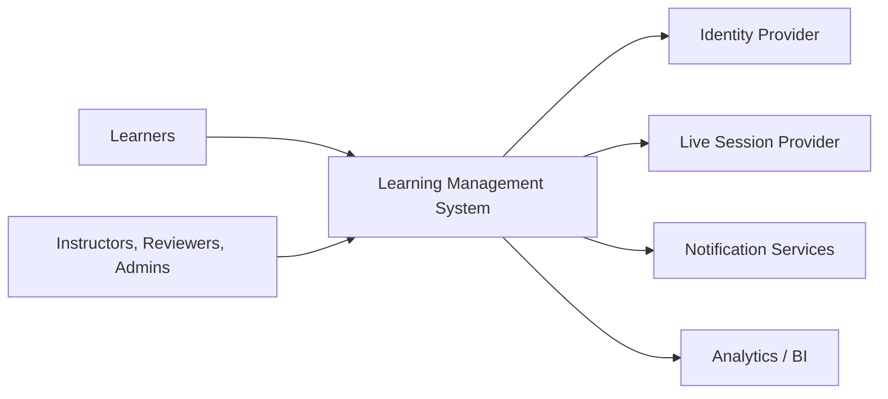
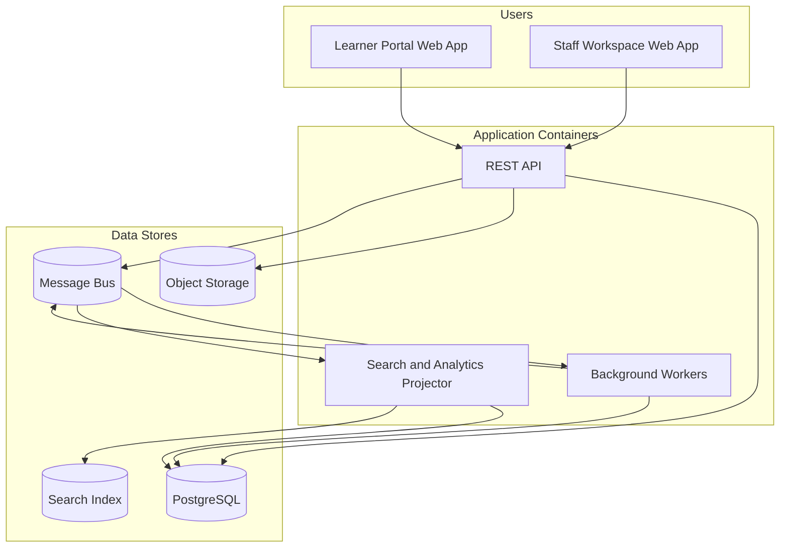

# C4 Context and Container Diagrams - Learning Management System

## C4 Context

```mermaid
flowchart LR
    learners[Learners]
    staff[Instructors, Reviewers, Admins]
    idp[Identity Provider]
    live[Live Session Provider]
    notify[Notification Services]
    analytics[Analytics / BI]

    system[Learning Management System]

    learners --> system
    staff --> system
    system --> idp
    system --> live
    system --> notify
    system --> analytics
```

## C4 Container

```mermaid
flowchart TB
    subgraph users[Users]
        learnerWeb[Learner Portal Web App]
        staffWeb[Staff Workspace Web App]
    end

    subgraph app[Application Containers]
        api[REST API]
        workers[Background Workers]
        projector[Search and Analytics Projector]
    end

    subgraph stores[Data Stores]
        db[(PostgreSQL)]
        idx[(Search Index)]
        queue[(Message Bus)]
        blob[(Object Storage)]
    end

    learnerWeb --> api
    staffWeb --> api
    api --> db
    api --> blob
    api --> queue
    workers --> db
    workers --> queue
    projector --> db
    projector --> idx
    queue --> workers
    queue --> projector
```
