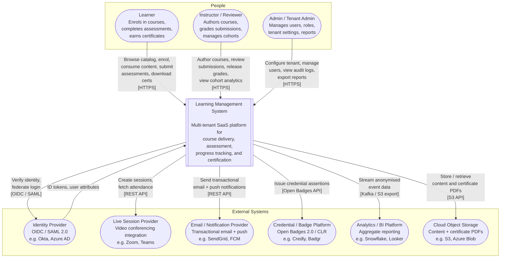
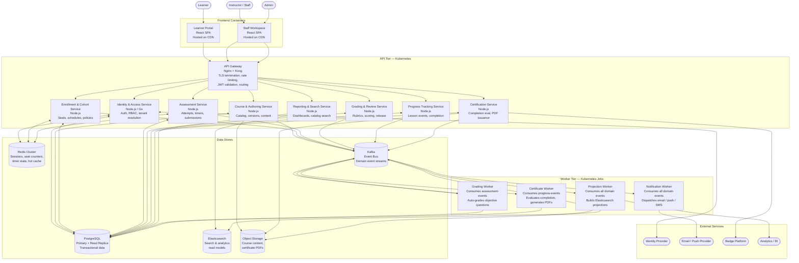

# C4 Context and Container Diagrams - Learning Management System

This document presents the C4 architecture model at the Context level (who uses the system and what it depends on) and the Container level (what the deployable units are and how they communicate).

---

## C4 Level 1 — System Context Diagram

Shows the LMS as a single system and all external actors and systems that interact with it.

---

## C4 Level 2 — Container Diagram

Decomposes the LMS into its deployable containers and shows the key communication paths between them.

---

## Container Responsibility Table

| Container | Technology | Responsibility | Scales By |
|---|---|---|---|
| Learner Portal | React SPA, CDN | Course discovery, enrollment, content consumption, assessment, certificates | CDN edge nodes |
| Staff Workspace | React SPA, CDN | Course authoring, cohort management, grading, analytics | CDN edge nodes |
| API Gateway | Nginx + Kong | TLS termination, JWT validation, rate limiting, request routing | Horizontal (stateless) |
| Identity & Access Service | Node.js | User auth, OIDC federation, RBAC enforcement, tenant scoping | Horizontal (stateless) |
| Course & Authoring Service | Node.js | Course CRUD, version lifecycle, module/lesson management, content upload | Horizontal (stateless) |
| Enrollment & Cohort Service | Node.js | Seat reservation, policy evaluation, cohort scheduling, access windows | Horizontal (stateless) |
| Assessment Service | Node.js | Attempt lifecycle, question delivery, timer management, submission handling | Horizontal (stateless) |
| Grading & Review Service | Node.js | Rubric scoring, draft/release workflow, grade override, reviewer assignment | Horizontal (stateless) |
| Progress Tracking Service | Node.js | Lesson completion events, progress aggregation, resume state | Horizontal (stateless) |
| Certification Service | Node.js | Completion rule evaluation, certificate generation and storage | Horizontal (stateless) |
| Reporting & Search Service | Node.js | Catalog search, learner/staff dashboards, exports | Horizontal (stateless) |
| Grading Worker | Node.js Job | Async auto-grading from `assessment-events` topic | Queue depth |
| Certificate Worker | Node.js Job | Async completion checks and PDF generation | Queue depth |
| Notification Worker | Node.js Job | Dispatches email/push/SMS from all domain event topics | Queue depth |
| Projection Worker | Node.js Job | Builds and updates Elasticsearch search and analytics indices | Queue depth |
| PostgreSQL | PostgreSQL 15 | Authoritative transactional store for all domain aggregates | Read replicas |
| Redis Cluster | Redis 7 | JWT session cache, seat counters, timer state, hot metadata cache | Cluster sharding |
| Kafka | Apache Kafka 3 | Ordered, durable, partitioned domain event streams | Partition count |
| Elasticsearch | Elasticsearch 8 | Full-text catalog search, aggregated reporting read models | Index sharding |
| Object Storage | S3-compatible | Binary content (lesson media, certificate PDFs, exports) | Unlimited |

---

## Container-to-Container Communication

| Source Container | Target Container | Protocol | Sync / Async | Data Exchanged | Auth Method |
|---|---|---|---|---|---|
| API Gateway | Identity Service | HTTP/2 (gRPC) | Sync | JWT claims, tenant context | mTLS |
| API Gateway | All domain services | HTTP/1.1 REST | Sync | Validated HTTP requests | mTLS + forwarded JWT |
| Identity Service | Identity Provider | OIDC / SAML | Sync | Auth codes, ID tokens | Client credentials + TLS |
| Course Service | Object Storage | S3 API (HTTPS) | Sync | Content upload / presigned URLs | IAM role / service account |
| Enrollment Service | Redis | Redis protocol | Sync | Seat counter reads/writes | Password + TLS |
| Assessment Service | Redis | Redis protocol | Sync | Timer state, attempt locks | Password + TLS |
| All domain services | Kafka | Kafka protocol | Async (produce) | Domain event messages | SASL/SCRAM + TLS |
| Grading Worker | Kafka | Kafka protocol | Async (consume) | `assessment-events` | SASL/SCRAM + TLS |
| Certificate Worker | Kafka | Kafka protocol | Async (consume) | `progress-events`, `grading-events` | SASL/SCRAM + TLS |
| Notification Worker | Kafka | Kafka protocol | Async (consume) | All domain event topics | SASL/SCRAM + TLS |
| Notification Worker | Email/Push Provider | HTTPS REST | Async | Notification payloads | API key |
| Projection Worker | Kafka | Kafka protocol | Async (consume) | All domain event topics | SASL/SCRAM + TLS |
| Projection Worker | Elasticsearch | HTTPS REST | Sync (bulk index) | Projected read-model documents | API key + TLS |
| Certification Service | Badge Platform | HTTPS REST | Sync | Open Badge assertions | API key |
| Reporting Service | Elasticsearch | HTTPS REST | Sync | Search / aggregation queries | API key + TLS |
| Projection Worker | Analytics / BI | Kafka / S3 export | Async | Anonymised event streams | IAM role |

---

## External Dependency Table

| External System | Purpose | Protocol | Criticality | Failure Mode | Circuit Breaker |
|---|---|---|---|---|---|
| Identity Provider (OIDC/SAML) | User authentication, SSO federation | OIDC / SAML 2.0 over HTTPS | **Critical** | Fall back to local auth if configured; else deny login | Yes — 30 s open window |
| Email / Push Provider | Transactional notifications | HTTPS REST | **High** | Queue notification, retry for 24 h; learner sees pending state | Yes — 60 s open window |
| Live Session Provider | Scheduled live sessions | HTTPS REST | **Medium** | Display join-link fallback message; flag session as degraded | Yes — 30 s open window |
| Credential / Badge Platform | Issue verifiable credentials | HTTPS REST (Open Badges) | **Low** | Certificate still issued internally; badge issuance retried async | Yes — 60 s open window |
| Analytics / BI Platform | Aggregate reporting beyond LMS | Kafka / S3 export | **Low** | Export buffered in S3; no learner-facing impact | No — async buffer |
| Cloud Object Storage | Lesson content + certificate PDFs | S3 API (HTTPS) | **Critical** | Content delivery degraded; certificate issuance retried | Yes — 15 s open window |
