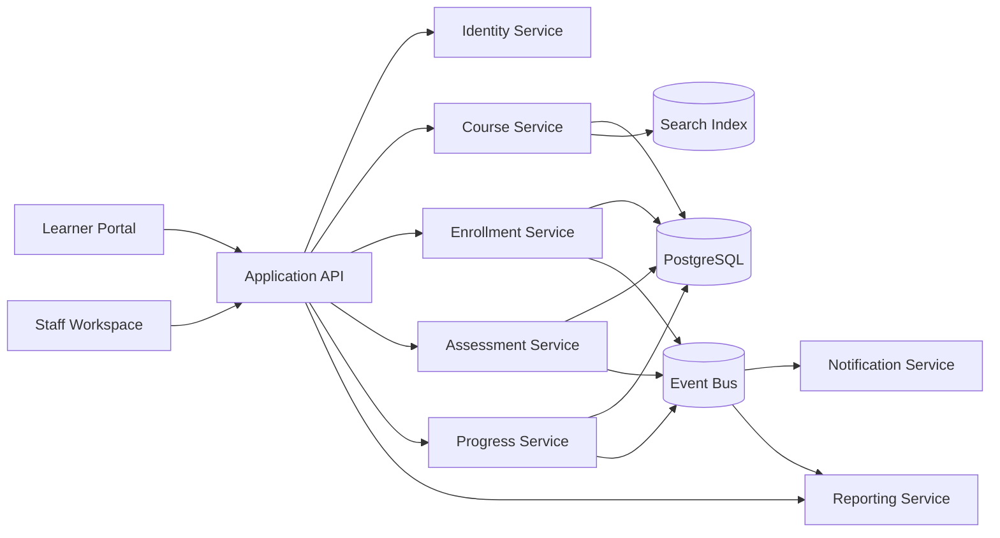

# Data Flow Diagram - Learning Management System

## Data Flow Notes

1. Catalog and authoring data flows from the transactional store into the search layer for learner discovery.
2. Progress, assessment, and enrollment events feed reporting and notification workflows asynchronously.
3. Learner-facing status views should prefer authoritative transactional data where freshness is critical.

## Implementation Details: Dataflow Security Controls

### Flow classification
- Mark each edge as `sync`, `async`, or `batch`.
- Mark each edge with data class and retention obligation.

### Mandatory controls
- AuthZ re-check before serving sensitive read models.
- PII minimization for analytics/event payloads.
