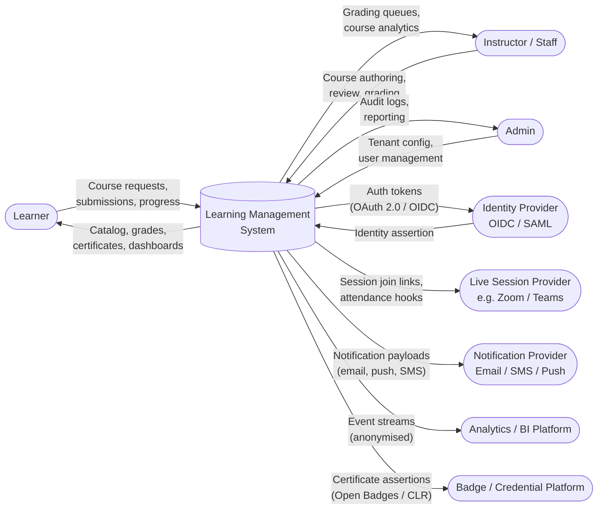
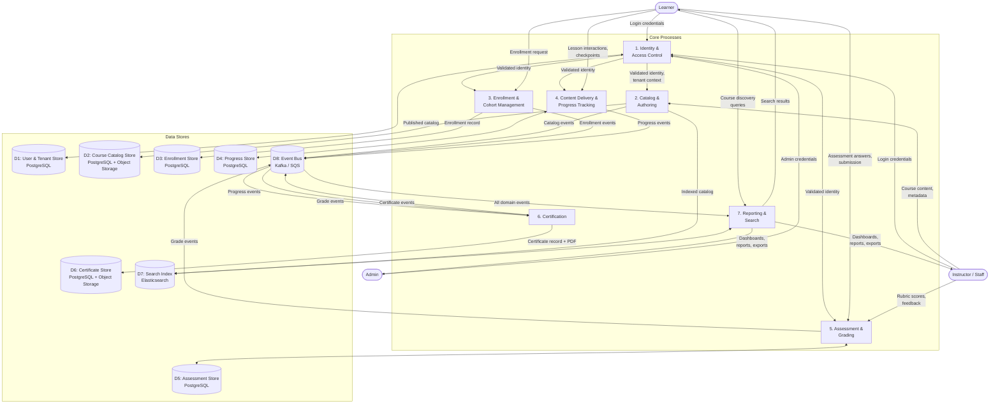
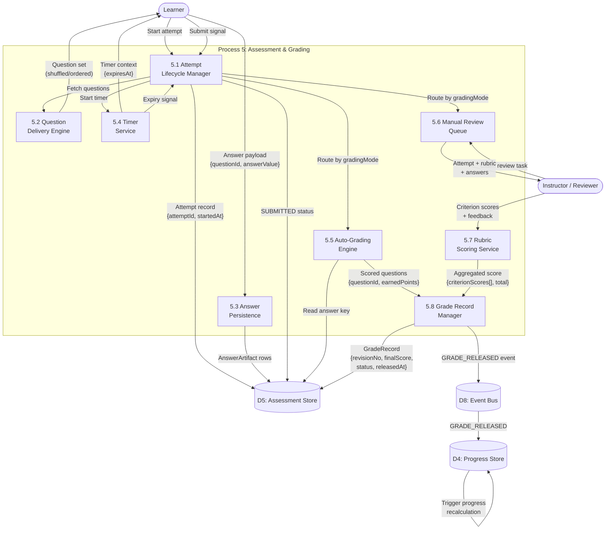

# Data Flow Diagram - Learning Management System

This document describes data flows at three levels of abstraction: the system context (Level 0), the main internal processes (Level 1), and the assessment and grading sub-process in detail (Level 2). Security classifications and data store descriptions are also provided.

---

## Level-0 DFD — Context Diagram

Shows the LMS as a single process interacting with external entities. No internal structure is visible at this level.

---

## Level-1 DFD — Main Processes

Decomposes the LMS into its seven primary processing nodes and shows the data flows between them and the data stores.

---

## Level-2 DFD — Assessment and Grading Sub-Process

Zooms into Process 5 (Assessment & Grading) to show its internal data flows in detail.

---

## Data Flow Security Classification

| Data Flow | Classification | Transport Encryption | Auth Requirement | PII Present | Retention |
|---|---|---|---|---|---|
| Learner login credentials → Identity | **RESTRICTED** | TLS 1.3 | None (pre-auth) | Yes (email) | Not stored |
| JWT → API services | **CONFIDENTIAL** | TLS 1.3 | Bearer token | Yes (userId) | Token TTL only |
| Course content → Object Storage | **INTERNAL** | TLS 1.3 | Service-to-service mTLS | No | Course lifetime |
| Answer artifacts → Assessment Store | **CONFIDENTIAL** | TLS 1.3 | User-scoped JWT | Yes (learner answers) | 7 years |
| Grade records → Progress Store | **CONFIDENTIAL** | TLS 1.3 | Service-to-service mTLS | Yes (score, userId) | 7 years |
| Events → Event Bus | **INTERNAL** | TLS 1.3 | Service credentials | Pseudonymised | 90 days |
| Events → Analytics / BI | **INTERNAL** | TLS 1.3 | Service credentials | Anonymised | 3 years |
| Certificate PDF → Object Storage | **CONFIDENTIAL** | TLS 1.3 | Service-to-service mTLS | Yes (learner name) | Permanent |
| Certificate assertions → Badge Platforms | **PUBLIC** | TLS 1.3 | API key | Learner-consented | Permanent |
| Audit logs → Audit Store | **RESTRICTED** | TLS 1.3 | Privileged service only | Yes | 7 years |
| Anonymised events → BI | **PUBLIC** | TLS 1.3 | API key | No | 3 years |

---

## Data Store Descriptions

| Store ID | Name | Technology | Consistency Model | Primary Owner | Description |
|---|---|---|---|---|---|
| D1 | User & Tenant Store | PostgreSQL | Strong (ACID) | Identity Service | User accounts, role assignments, tenant configuration, audit subjects |
| D2 | Course Catalog Store | PostgreSQL + S3-compatible | Strong (metadata), eventual (blobs) | Course Service | Course/version/module/lesson metadata; lesson content blobs in object storage |
| D3 | Enrollment Store | PostgreSQL | Strong (ACID) | Enrollment Service | Enrollment records, cohort seat counters (optimistic locking), idempotency keys |
| D4 | Progress Store | PostgreSQL | Strong writes, eventual reads | Progress Service | `LessonProgress` rows, `ProgressRecord` summaries; updated on grade/lesson events |
| D5 | Assessment Store | PostgreSQL | Strong (ACID) | Assessment + Grading Services | Attempts, answer artifacts, grade records, rubric definitions, answer keys |
| D6 | Certificate Store | PostgreSQL + S3-compatible | Strong (metadata), eventual (PDFs) | Certification Service | Certificate records, verification codes, PDF object URLs |
| D7 | Search Index | Elasticsearch | Eventual | Reporting Service | Catalog search, learner-facing course discovery, staff reporting projections |
| D8 | Event Bus | Kafka / AWS SQS+SNS | At-least-once delivery | Platform-wide | Domain events; partitioned by `tenantId`; consumers maintain idempotency |
