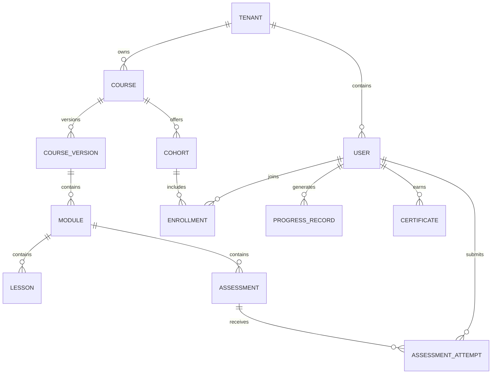
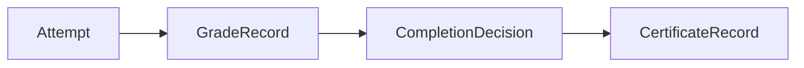

# Domain Model - Learning Management System

## Core Domain Areas

| Domain Area | Key Concepts |
|-------------|--------------|
| Identity and Tenancy | Tenant, User, RoleAssignment, Audience |
| Catalog and Authoring | Course, CourseVersion, Module, Lesson, Resource |
| Delivery and Access | Cohort, Enrollment, LiveSession, AccessWindow |
| Assessment and Grading | Assessment, Attempt, SubmissionArtifact, GradeRecord, Rubric |
| Progress and Certification | ProgressRecord, CompletionRule, Certificate |
| Operations | Notification, AuditLog, AnalyticsSnapshot |

## Relationship Summary
- A **tenant** owns users, courses, cohorts, reporting scope, and administrative policies.
- A **course** can have many versions, modules, lessons, assessments, cohorts, and certificates.
- A **learner** can hold many enrollments, progress records, attempts, grades, and certificates.
- **Completion rules** depend on course structure, assessment outcomes, and optional attendance requirements.

## Implementation Details: Aggregate Consistency Rules

- `Enrollment` and `Attempt` aggregates must not be updated from projection services.
- `GradeRecord` is append-only by revision; overrides create new revision entries.
- `CertificateRecord` transitions require completed + integrity-cleared invariant checks.

