# Domain Model - Learning Management System

This document defines the full domain model for the LMS: entity relationships, bounded contexts, aggregate roots, value objects, domain services, invariants, and domain events.

---

## Entity Relationship Diagram

```mermaid
erDiagram
    TENANT {
        uuid id PK
        string name
        string slug
        string status
        jsonb settings
        timestamp createdAt
    }
    USER {
        uuid id PK
        uuid tenantId FK
        string email
        string displayName
        string accountType
        string status
        timestamp lastLoginAt
    }
    ROLE_ASSIGNMENT {
        uuid id PK
        uuid userId FK
        uuid tenantId FK
        string role
        uuid scopeId
        string scopeType
        timestamp assignedAt
    }
    COURSE {
        uuid id PK
        uuid tenantId FK
        string title
        string slug
        string category
        string status
        uuid activeVersionId FK
    }
    COURSE_VERSION {
        uuid id PK
        uuid courseId FK
        int versionNo
        string state
        uuid authorId FK
        timestamp publishedAt
        timestamp archivedAt
    }
    COMPLETION_RULE {
        uuid id PK
        uuid courseVersionId FK
        float minPassingScore
        boolean requireAllModules
        int minAttendancePercent
        jsonb requiredAssessmentIds
    }
    MODULE {
        uuid id PK
        uuid courseVersionId FK
        string title
        int sequence
        boolean isRequired
    }
    LESSON {
        uuid id PK
        uuid moduleId FK
        string title
        string type
        int durationMinutes
        int sequence
        string contentUrl
    }
    ASSESSMENT {
        uuid id PK
        uuid moduleId FK
        uuid courseVersionId FK
        string assessmentType
        int attemptLimit
        int timeLimitMinutes
        float maxScore
        float passingScore
        string gradingMode
    }
    QUESTION {
        uuid id PK
        uuid assessmentId FK
        string questionType
        float points
        jsonb content
        jsonb correctAnswer
        int sequence
    }
    RUBRIC {
        uuid id PK
        uuid assessmentId FK
        string name
    }
    RUBRIC_CRITERION {
        uuid id PK
        uuid rubricId FK
        string name
        float maxPoints
        jsonb scoringGuide
    }
    COHORT {
        uuid id PK
        uuid courseId FK
        uuid courseVersionId FK
        string name
        int seatCapacity
        int seatsUsed
        timestamp enrollmentOpensAt
        timestamp enrollmentClosesAt
        timestamp startsAt
        timestamp endsAt
    }
    ENROLLMENT {
        uuid id PK
        uuid userId FK
        uuid cohortId FK
        uuid courseId FK
        string status
        timestamp enrolledAt
        timestamp completedAt
        timestamp expiresAt
        string idempotencyKey
    }
    LESSON_PROGRESS {
        uuid id PK
        uuid enrollmentId FK
        uuid lessonId FK
        string status
        int progressSeconds
        timestamp completedAt
    }
    PROGRESS_RECORD {
        uuid id PK
        uuid enrollmentId FK
        float percentComplete
        int modulesCompleted
        int lessonsCompleted
        string completionStatus
        timestamp lastActivityAt
    }
    ASSESSMENT_ATTEMPT {
        uuid id PK
        uuid assessmentId FK
        uuid enrollmentId FK
        uuid userId FK
        int attemptNumber
        string status
        timestamp startedAt
        timestamp submittedAt
        timestamp expiresAt
    }
    ANSWER_ARTIFACT {
        uuid id PK
        uuid attemptId FK
        uuid questionId FK
        jsonb answerValue
        string answerType
    }
    GRADE_RECORD {
        uuid id PK
        uuid attemptId FK
        int revisionNo
        float finalScore
        float maxScore
        boolean passed
        string gradeSource
        uuid reviewerId FK
        string status
        timestamp gradedAt
        timestamp releasedAt
    }
    GRADE_CRITERION_SCORE {
        uuid id PK
        uuid gradeRecordId FK
        uuid criterionId FK
        float score
        string feedback
    }
    CERTIFICATE {
        uuid id PK
        uuid enrollmentId FK
        uuid userId FK
        uuid courseId FK
        string verificationCode
        string objectUrl
        string status
        timestamp issuedAt
        timestamp expiresAt
        timestamp revokedAt
    }
    AUDIT_LOG {
        uuid id PK
        uuid tenantId FK
        uuid actorId FK
        string eventType
        string resourceType
        uuid resourceId
        jsonb before
        jsonb after
        timestamp occurredAt
    }

    TENANT ||--o{ USER : "has"
    TENANT ||--o{ COURSE : "owns"
    USER ||--o{ ROLE_ASSIGNMENT : "holds"
    COURSE ||--o{ COURSE_VERSION : "versioned as"
    COURSE_VERSION ||--|| COMPLETION_RULE : "governed by"
    COURSE_VERSION ||--o{ MODULE : "structured into"
    MODULE ||--o{ LESSON : "contains"
    MODULE ||--o{ ASSESSMENT : "includes"
    ASSESSMENT ||--o{ QUESTION : "composed of"
    ASSESSMENT ||--o| RUBRIC : "scored by"
    RUBRIC ||--o{ RUBRIC_CRITERION : "has"
    COURSE ||--o{ COHORT : "delivered via"
    COHORT ||--|| COURSE_VERSION : "uses"
    USER ||--o{ ENROLLMENT : "holds"
    COHORT ||--o{ ENROLLMENT : "contains"
    ENROLLMENT ||--o{ LESSON_PROGRESS : "tracks"
    ENROLLMENT ||--|| PROGRESS_RECORD : "summarised by"
    ENROLLMENT ||--o{ ASSESSMENT_ATTEMPT : "generates"
    ASSESSMENT ||--o{ ASSESSMENT_ATTEMPT : "attempted via"
    ASSESSMENT_ATTEMPT ||--o{ ANSWER_ARTIFACT : "captures"
    ASSESSMENT_ATTEMPT ||--o{ GRADE_RECORD : "scored in"
    GRADE_RECORD ||--o{ GRADE_CRITERION_SCORE : "broken down by"
    ENROLLMENT ||--o| CERTIFICATE : "may earn"
    TENANT ||--o{ AUDIT_LOG : "records"
```

---

## Bounded Contexts

| Bounded Context | Core Aggregates | Owns |
|---|---|---|
| **Identity & Tenancy** | `Tenant`, `User` | User accounts, role assignments, tenant settings |
| **Catalog & Authoring** | `Course`, `CourseVersion` | Course structure, modules, lessons, publication lifecycle |
| **Assessment Design** | `Assessment`, `Rubric` | Questions, rubrics, scoring criteria, attempt policies |
| **Cohort & Delivery** | `Cohort`, `Enrollment` | Seat management, delivery schedules, access windows |
| **Learning & Progress** | `LessonProgress`, `ProgressRecord` | Lesson completion events, derived progress summaries |
| **Grading** | `AssessmentAttempt`, `GradeRecord` | Submissions, auto/manual scoring, grade revisions |
| **Certification** | `Certificate` | Completion evaluation, credential issuance and revocation |
| **Operations** | `AuditLog` | Immutable audit trail, compliance records |

---

## Aggregate Roots

| Aggregate Root | Bounded Context | Key Invariants |
|---|---|---|
| `Tenant` | Identity & Tenancy | Slug is globally unique; status transitions are append-only |
| `User` | Identity & Tenancy | Email unique per tenant; cannot delete a user with active enrollments |
| `CourseVersion` | Catalog & Authoring | Only one version may be `PUBLISHED` per course at any time; `ARCHIVED` is terminal |
| `Assessment` | Assessment Design | `passingScore ≤ maxScore`; `attemptLimit ≥ 1`; cannot mutate a published assessment |
| `Enrollment` | Cohort & Delivery | One active enrollment per user per cohort; status transitions forward-only except reactivation |
| `AssessmentAttempt` | Grading | `attemptNumber ≤ assessment.attemptLimit`; submit only if `status = IN_PROGRESS` |
| `GradeRecord` | Grading | Append-only revisions; `finalScore ≤ maxScore`; release requires `status = DRAFT` |
| `Certificate` | Certification | One `ISSUED` certificate per enrollment; verificationCode is globally unique; `REVOKED` is terminal |

---

## Value Objects

| Value Object | Used In | Description |
|---|---|---|
| `Score` | `GradeRecord`, `Assessment` | `{value: float, max: float}`; `0 ≤ value ≤ max` enforced at construction |
| `ProgressPercentage` | `ProgressRecord` | `float` clamped to `[0.0, 100.0]` |
| `TimeWindow` | `Cohort`, `Enrollment` | `{opensAt, closesAt}`; `closesAt > opensAt` enforced |
| `PolicyOutcome` | `Policy Engine` | `{decision: APPROVED|DENIED, reason?: string, missingItems?: []}`; immutable |
| `VerificationCode` | `Certificate` | UUID v4 + HMAC-SHA256 signature; globally unique; immutable after creation |
| `AttemptTimer` | `AssessmentAttempt` | `{startedAt, timeLimitMinutes, expiresAt}`; `expiresAt` computed, not stored separately |
| `ContentLocator` | `Lesson`, `Certificate` | `{storageBackend, objectKey, cdnUrl}`; resolved at request time |

---

## Domain Services

| Domain Service | Responsibility |
|---|---|
| `EnrollmentPolicyEvaluator` | Evaluates prerequisite, seat, and window rules; returns `PolicyOutcome`; read-only, no side effects |
| `CompletionRuleEvaluator` | Checks `ProgressRecord` against `CompletionRule`; returns boolean + unmet criteria list |
| `AutoGradingEngine` | Scores objective questions (MCQ, true/false, fill-in); returns `Score` per question |
| `RubricScoringService` | Aggregates `RubricCriterionScore` records into a `GradeRecord` with weighted total |
| `CertificateIntegrityVerifier` | Validates HMAC on `VerificationCode` for public certificate lookup |
| `SeatReservationService` | Atomically checks and increments `Cohort.seatsUsed`; prevents race conditions |

---

## Domain Events per Aggregate

### Enrollment

| Event | Trigger | Consumers |
|---|---|---|
| `EnrollmentRequested` | `POST /enrollments` called | Policy Engine, Audit Log |
| `EnrollmentCreated` | Enrollment saved with `ACTIVE` status | Notification Service, Analytics, Audit Log |
| `EnrollmentDenied` | Policy evaluation returns `DENIED` | Audit Log, Analytics |
| `EnrollmentDropped` | Learner or admin drops enrollment | Notification Service, Progress Service, Audit Log |
| `EnrollmentExpired` | Scheduled job — access window elapsed | Notification Service, Audit Log |
| `EnrollmentReactivated` | Admin reactivates expired enrollment | Notification Service, Audit Log |
| `EnrollmentCompleted` | Completion rule evaluator confirms all criteria | Certification Service, Analytics, Audit Log |

### AssessmentAttempt

| Event | Trigger | Consumers |
|---|---|---|
| `AttemptStarted` | Learner starts attempt | Timer Service, Audit Log |
| `AttemptSubmitted` | Learner submits or timer fires | Grading Service, Audit Log |
| `AttemptAutoGraded` | Auto-grading engine completes | Progress Service, Notification Service, Audit Log |
| `AttemptPendingReview` | Manual review enqueued | Grading queue, Audit Log |
| `AttemptExpired` | Timer fires before submission | Grading Service (submit as-is), Audit Log |

### GradeRecord

| Event | Trigger | Consumers |
|---|---|---|
| `DraftGradeSaved` | Reviewer saves rubric scores | Audit Log |
| `GradeReleased` | Reviewer or supervisor releases grade | Progress Service, Notification Service, Audit Log |
| `GradeOverridden` | Supervisor overrides released grade | Audit Log, Notification Service |

### Certificate

| Event | Trigger | Consumers |
|---|---|---|
| `CertificateIssued` | Completion verified, PDF stored | Notification Service, Analytics, Badge Platforms, Audit Log |
| `CertificateRevoked` | Admin revokes credential | Notification Service, Audit Log |
| `CertificateExpired` | Scheduled job — expiry date reached | Notification Service, Audit Log |

### CourseVersion

| Event | Trigger | Consumers |
|---|---|---|
| `CourseVersionPublished` | Author publishes after review | Catalog Search Index, Audit Log |
| `CourseVersionArchived` | Admin archives version | Enrollment Service (block new enrollments), Audit Log |
| `CourseVersionDraftCreated` | Author creates new draft from published | Audit Log |
