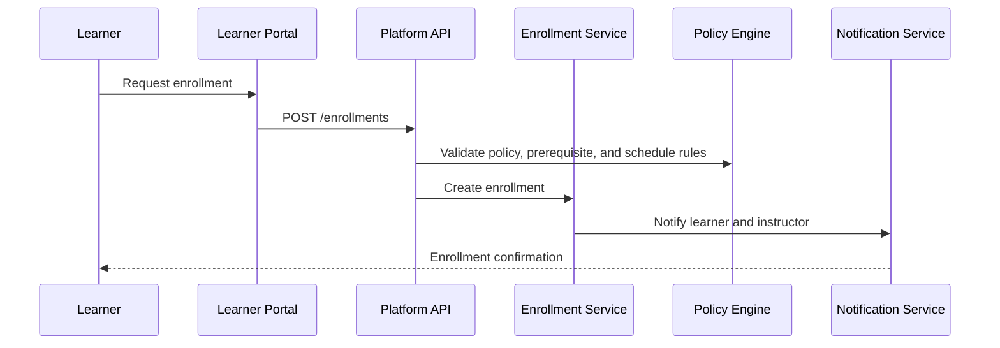
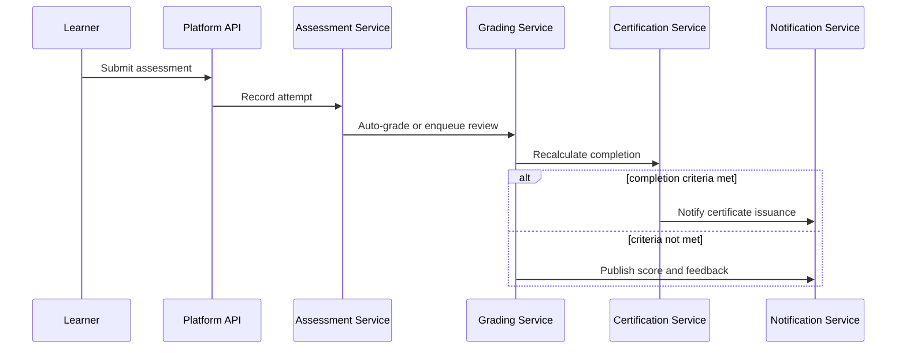

# System Sequence Diagram - Learning Management System

## Enrollment to Learning Sequence

```mermaid
sequenceDiagram
    participant L as Learner
    participant P as Learner Portal
    participant API as Platform API
    participant E as Enrollment Service
    participant Policy as Policy Engine
    participant N as Notification Service

    L->>P: Request enrollment
    P->>API: POST /enrollments
    API->>Policy: Validate policy, prerequisite, and schedule rules
    API->>E: Create enrollment
    E->>N: Notify learner and instructor
    N-->>L: Enrollment confirmation
```

## Assessment to Certificate Sequence

```mermaid
sequenceDiagram
    participant Learner as Learner
    participant API as Platform API
    participant Assess as Assessment Service
    participant Grade as Grading Service
    participant Cert as Certification Service
    participant Notify as Notification Service

    Learner->>API: Submit assessment
    API->>Assess: Record attempt
    Assess->>Grade: Auto-grade or enqueue review
    Grade->>Cert: Recalculate completion
    alt completion criteria met
        Cert->>Notify: Notify certificate issuance
    else criteria not met
        Grade->>Notify: Publish score and feedback
    end
```
