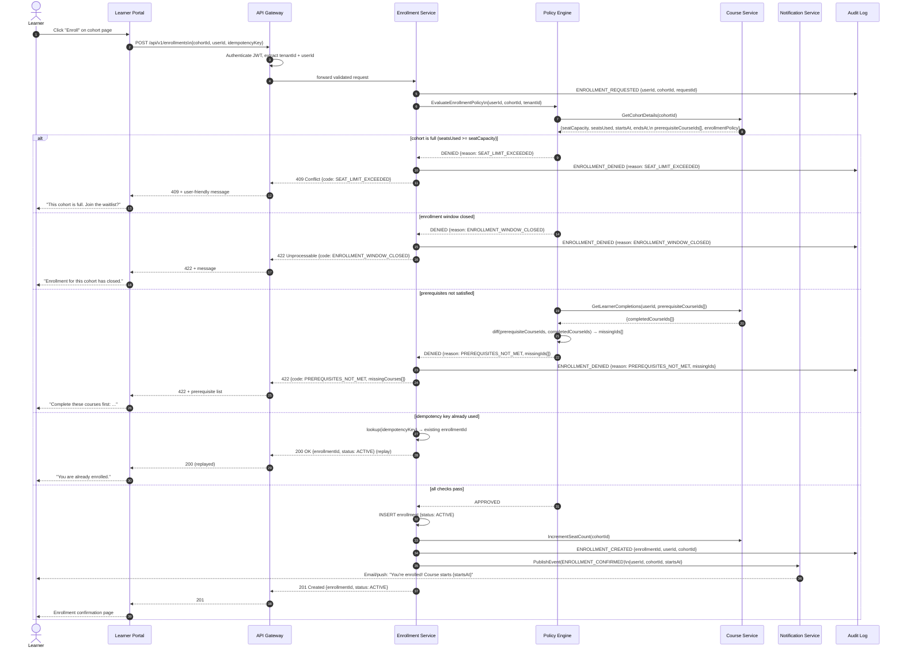
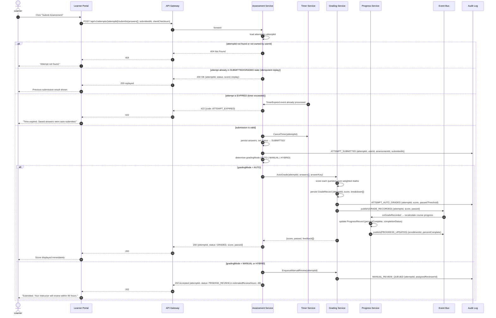
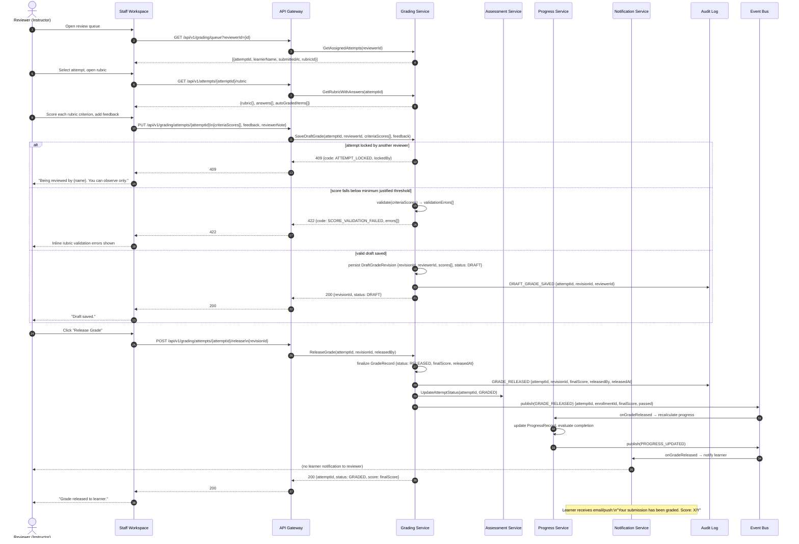

# System Sequence Diagram - Learning Management System

This document captures the four primary cross-service system sequences that span multiple bounded contexts. Each sequence shows all participating services, the happy path, alternative/error paths, and the audit events emitted at each critical step.

---

## 1. Enrollment Creation Flow

Covers policy evaluation, seat validation, prerequisite checking, and confirmation notification. The `Policy Engine` is the authoritative gate; the `Enrollment Service` never writes without a `APPROVED` policy outcome.



---

## 2. Assessment Submission and Auto-Grading Flow

Covers idempotent submission, timer enforcement, answer persistence, auto-grading dispatch, and score publication. The submission endpoint is idempotent on `attemptId`; re-submitting the same `attemptId` replays the last acknowledged response.



---

## 3. Manual Grading and Grade Release Flow

Covers reviewer assignment, rubric scoring, grade override, approval gate, and grade release with full audit trail. All mutations to a `GradeRecord` are append-only revisions; no in-place updates.



---

## 4. Certificate Issuance Flow

Covers completion rule evaluation, certificate generation, secure storage, and learner notification. The `Certification Service` is the sole authority for issuing credentials; it verifies integrity before writing.

```mermaid
sequenceDiagram
    autonumber
    participant EB as Event Bus
    participant CS as Certification Service
    participant PS as Progress Service
    participant CRS as Course Service
    participant OB as Object Storage
    participant NS as Notification Service
    participant AL as Audit Log
    actor L as Learner

    EB->>CS: consume(PROGRESS_UPDATED)\n{enrollmentId, percentComplete, userId, courseId}

    CS->>PS: GetCompletionStatus(enrollmentId)
    PS-->>CS: {percentComplete, requiredItemsComplete[], assessmentsPassed[]}

    CS->>CRS: GetCompletionRules(courseId)
    CRS-->>CS: {minPassingScore, requiredAssessments[], requiredModules[],\n minAttendance, passingThreshold}

    CS->>CS: EvaluateCompletionRules(completionStatus, rules)

    alt completion criteria not yet met
        CS->>AL: COMPLETION_CHECK_FAILED {enrollmentId, unmetCriteria[]}
        Note over CS: No further action; wait for next PROGRESS_UPDATED event
    else learner already has an active certificate for this enrollment
        CS->>AL: CERTIFICATE_ALREADY_EXISTS {enrollmentId, certificateId}
        Note over CS: Idempotent — skip issuance
    else all criteria satisfied
        CS->>CS: generate verificationCode (UUID v4 + HMAC-signed)
        CS->>CS: build certificate payload\n{learnerName, courseName, completedAt,\n issuerName, verificationCode}
        CS->>OB: PUT /certificates/{verificationCode}.pdf\n(signed PDF with QR code)

        alt object storage write fails
            OB-->>CS: 503 Storage Unavailable
            CS->>AL: CERTIFICATE_GENERATION_FAILED {enrollmentId, reason: STORAGE_ERROR}
            CS->>EB: publish(CERTIFICATE_RETRY_REQUESTED) {enrollmentId, retryCount}
            Note over CS: Will retry up to 3 times with exponential backoff
        else PDF stored successfully
            OB-->>CS: 200 {objectUrl, eTag}
            CS->>CS: INSERT CertificateRecord\n{enrollmentId, userId, courseId, verificationCode,\n objectUrl, status: ISSUED, issuedAt}
            CS->>AL: CERTIFICATE_ISSUED {certificateId, enrollmentId, verificationCode, issuedAt}
            CS->>NS: PublishEvent(CERTIFICATE_ISSUED)\n{userId, courseTitle, downloadUrl, verificationCode}
            NS-->>L: Email: "Congratulations! Your certificate is ready.\n[Download] [Share on LinkedIn]"
            CS->>EB: publish(CERTIFICATE_ISSUED) {certificateId, userId, courseId}
            Note over EB: Downstream: analytics, employer integrations,\n badge platforms consume this event
        end
    end
```

---

## Sequence Non-Functional Budgets

| Sequence | Step | Target Latency (p95) | Timeout / Fallback |
|---|---|---|---|
| Enrollment creation | End-to-end (sync) | < 500 ms | Return denial reason with code |
| Enrollment creation | Policy evaluation | < 150 ms | Fail closed (deny) on timeout |
| Assessment submission | Submission ACK | < 700 ms | Accept + async grading queue |
| Assessment submission | Auto-grading | < 5 s | Return `PENDING_GRADE`, poll endpoint |
| Manual grade release | Full flow | < 2 s | Optimistic lock, retry prompt |
| Certificate issuance | PDF generation + storage | < 10 s | Retry queue (max 3 attempts) |
| Certificate issuance | Notification dispatch | < 30 s async | Dead-letter queue + manual retry |

## Idempotency Contract

| Endpoint | Idempotency Key | Behavior on Duplicate |
|---|---|---|
| `POST /enrollments` | `Idempotency-Key` header | Replay last `201` or `409` response |
| `POST /attempts/{id}/submit` | `attemptId` (path param) | Replay last acknowledged response |
| `PUT /grading/attempts/{id}` | `revisionId` in body | Upsert draft revision, no duplicates |
| `POST /grading/attempts/{id}/release` | `revisionId` in body | Idempotent — re-release returns current state |
| Certificate issuance (async) | `enrollmentId` | Skip if certificate already `ISSUED` |

## Audit Events Reference

| Event | Emitted By | Consumed By | Retention |
|---|---|---|---|
| `ENROLLMENT_REQUESTED` | Enrollment Service | Audit Log | 7 years |
| `ENROLLMENT_DENIED` | Enrollment Service | Audit Log, Analytics | 7 years |
| `ENROLLMENT_CREATED` | Enrollment Service | Audit Log, Analytics, Notification | 7 years |
| `ATTEMPT_SUBMITTED` | Assessment Service | Audit Log | 7 years |
| `ATTEMPT_AUTO_GRADED` | Grading Service | Audit Log, Progress Service | 7 years |
| `MANUAL_REVIEW_QUEUED` | Grading Service | Audit Log | 7 years |
| `DRAFT_GRADE_SAVED` | Grading Service | Audit Log | 7 years |
| `GRADE_RELEASED` | Grading Service | Audit Log, Progress, Notification | 7 years |
| `COMPLETION_CHECK_FAILED` | Certification Service | Audit Log | 7 years |
| `CERTIFICATE_ISSUED` | Certification Service | Audit Log, Analytics, Notification | Permanent |
| `CERTIFICATE_GENERATION_FAILED` | Certification Service | Audit Log, Retry Queue | 7 years |
