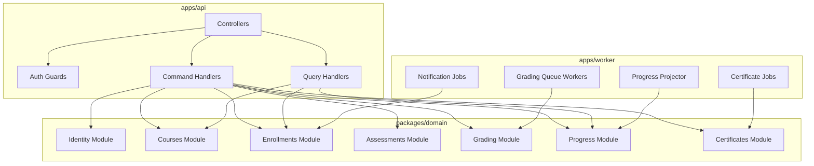

# C4 Code Diagram - Learning Management System

## Implementation Details: Code-Level Module Rules

- Keep command handlers free of read-model dependencies.
- Keep projectors side-effect free except projection writes.
- Cross-module calls go through explicit interfaces, not direct persistence access.
