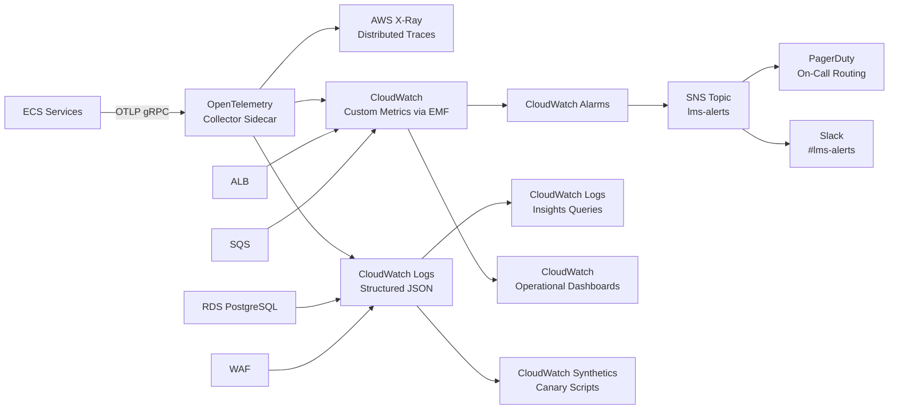

# Cloud Architecture - Learning Management System

## AWS Reference Architecture

```mermaid
flowchart TB
    internet([Internet]) --> cf[CloudFront Distribution\nCDN + WAF + OAC]
    staffVpn([Staff VPN]) --> clientVPN[AWS Client VPN\nEndpoint]

    cf --> s3Static[S3 — Static SPA Hosting\nLearner Portal + Staff Workspace]
    cf --> pubALB[Public ALB\nPublic Subnets]
    clientVPN --> intALB[Internal ALB\nPrivate App Subnets]

    subgraph primary[us-east-1 — Primary Region]
        subgraph aza[AZ us-east-1a]
            api_a[API ECS Fargate\nTasks — AZ-A]
            worker_a[Worker ECS Fargate\nTasks — AZ-A]
            rds_primary[RDS PostgreSQL 15\nPrimary Instance]
            redis_primary[ElastiCache Redis 7\nPrimary Node]
        end
        subgraph azb[AZ us-east-1b]
            api_b[API ECS Fargate\nTasks — AZ-B]
            worker_b[Worker ECS Fargate\nTasks — AZ-B]
            rds_standby[RDS PostgreSQL\nMulti-AZ Standby]
            redis_replica[ElastiCache Redis\nReplica Node]
        end
        subgraph azc[AZ us-east-1c]
            api_c[API ECS Fargate\nTasks — AZ-C]
            opensearch[OpenSearch 2.x\n3-Node Cluster across AZs]
        end

        ecr[ECR\nContainer Registry\n+ Image Scanning]
        sqs[SQS\nStandard + FIFO Queues\n+ Dead-Letter Queues]
        eventBridge[EventBridge\nEvent Bus + Rules]
        secrets[Secrets Manager\nAuto-Rotation]
        acm[ACM\nPublic + Private CA]
        s3Media[S3 Media Bucket\n+ Lifecycle Policies\n+ Versioning]
        ses[SES\nEmail Delivery]
        sns[SNS\nPush + SMS]
        cw[CloudWatch\nMetrics + Logs + Alarms]
        xray[AWS X-Ray\nDistributed Tracing]
        config[AWS Config\nDrift Detection]
        shield[Shield Advanced\nDDoS Protection]
    end

    subgraph dr[us-west-2 — DR Region]
        rds_replica[RDS Cross-Region\nRead Replica]
        s3_crr[S3 Cross-Region\nReplication Bucket]
        secrets_dr[Secrets Manager\nReplica]
    end

    pubALB --> api_a & api_b & api_c
    intALB --> api_a & api_b
    api_a & api_b & api_c --> rds_primary
    api_a & api_b & api_c --> opensearch
    api_a & api_b & api_c --> redis_primary
    api_a & api_b & api_c --> sqs
    api_a & api_b & api_c --> s3Media
    api_a & api_b & api_c --> secrets
    worker_a & worker_b --> rds_primary
    worker_a & worker_b --> sqs
    worker_a & worker_b --> ses
    worker_a & worker_b --> sns
    rds_primary --> rds_standby
    rds_primary --> rds_replica
    redis_primary --> redis_replica
    s3Media --> s3_crr
    secrets --> secrets_dr
```



---

## Service Selection

| Capability | Chosen Service | Rationale | Alternatives Considered |
|------------|----------------|-----------|------------------------|
| Frontend hosting | CloudFront + S3 | Global CDN, versioned atomic deployments, zero server management | Amplify (less control over deployment pipeline), EC2/ECS for SSR (operational overhead not justified) |
| WAF / DDoS | AWS WAF + Shield Advanced | Native ALB/CloudFront integration, managed OWASP rule sets, 24/7 DRT | Cloudflare (vendor lock-in, egress cost), Akamai (higher cost at this scale) |
| API + Worker compute | ECS Fargate | Serverless containers — no node management, per-task IAM roles, spot support for workers | EKS (more powerful but significantly higher operational complexity), Lambda (cold starts unacceptable for stateful API responses > 2 s) |
| Relational database | RDS PostgreSQL 15 Multi-AZ | ACID, JSONB support, Multi-AZ automatic failover, native IAM auth, proven at scale | Aurora PostgreSQL (30–50% higher cost, not justified at current volume), CockroachDB (distributed overhead, team unfamiliarity) |
| Caching | ElastiCache Redis 7 | Sub-millisecond latency, cluster mode for horizontal scale, persistence with AOF | DynamoDB DAX (tightly coupled to DynamoDB), Memcached (no data structures, no persistence) |
| Search / analytics | Amazon OpenSearch 2.x | Full-text search, aggregations, near-real-time indexing, managed service | Self-managed Elasticsearch (operational burden), Algolia (SaaS, data residency and cost concerns at scale) |
| Message queue | SQS Standard + FIFO | Fully managed, dead-letter queues, visibility timeout, at-least-once delivery | RabbitMQ self-managed (operational overhead), Kafka (over-engineered for initial message volume), EventBridge Pipes (less mature at time of selection) |
| Event bus | EventBridge | Native AWS integration, content-based filtering, schema registry, archive + replay | SNS (no filtering rules), Kafka (complex operations) |
| Media / file storage | S3 + CloudFront signed URLs | 99.999999999% durability, lifecycle policies, CRR, OAC for private access | Azure Blob (not on AWS), GCS (cross-cloud complexity) |
| Secrets management | AWS Secrets Manager | Automatic rotation with Lambda, IAM-scoped access, CloudTrail audit, multi-region replication | HashiCorp Vault (self-managed overhead), SSM Parameter Store (no automatic rotation for RDS credentials) |
| Monitoring | CloudWatch + X-Ray + OpenTelemetry | Deep AWS service integration, distributed tracing, no additional agents to manage | Datadog (significant cost at scale), Grafana Cloud (additional setup and integration work) |
| Email delivery | Amazon SES | High deliverability, bounce/complaint handling, cost-effective at volume | SendGrid (higher per-email cost), Postmark (SaaS, data residency concern) |
| Container registry | ECR | Native ECS/Fargate integration, IAM-gated pull, built-in Trivy image scanning | DockerHub (rate limits, authentication complexity), GitHub Container Registry (pull latency from AWS) |

---

## Multi-AZ and Multi-Region Strategy

### Multi-AZ — Primary Region (us-east-1)

| Component | AZ Strategy | Automatic Failover |
|-----------|-------------|-------------------|
| ECS Fargate API | Tasks spread equally across AZ-A, AZ-B, AZ-C via ALB target groups | ALB health checks remove unhealthy AZ target group automatically in < 30 s |
| ECS Fargate Worker | Tasks spread across AZ-A and AZ-B | SQS messages are not AZ-bound; surviving tasks continue consuming |
| RDS PostgreSQL | Multi-AZ — synchronous standby in AZ-B | Automatic failover triggered by RDS in < 60 s; CNAME endpoint updated transparently |
| ElastiCache Redis | Primary in AZ-A, replica in AZ-B, cluster endpoint | Automatic failover in < 30 s; application uses cluster endpoint (no DNS change needed) |
| OpenSearch | 3-node cluster — 1 node per AZ | Automatic shard rebalancing on node failure; quorum maintained with 2 of 3 nodes |
| SQS / EventBridge / S3 | AWS regional services — inherently multi-AZ | No customer action required |

### Multi-Region — DR (us-west-2)

| Objective | RTO | RPO | Mechanism |
|-----------|-----|-----|-----------|
| Database recovery | 30 min | 5 min | RDS cross-region read replica promoted to primary via runbook |
| Media / assets | Immediate | Near-zero (< 15 min replication lag) | S3 CRR (Cross-Region Replication) with RTC (Replication Time Control) |
| DNS cutover | 5 min | N/A | Route 53 health-check-based failover with 60 s TTL |
| Application deployment | 45 min | N/A | ECS task definitions pre-staged in DR region; deployment via runbook |
| Secrets availability | Immediate | N/A | Secrets Manager multi-region replication |
| Full service restoration | < 2 hours | 5 min | Documented DR activation runbook; tested quarterly |

---

## Auto-Scaling Configuration

| Service | Min | Max | Scale-Out Metric | Scale-Out Threshold | Scale-In Cooldown |
|---------|-----|-----|-----------------|--------------------|--------------------|
| API ECS Service | 4 | 12 | ALB `RequestCountPerTarget` | > 1 000 req/min per task for 2 min | 300 s |
| API ECS Service | 4 | 12 | ECS CPU utilization | > 70% for 2 min | 300 s |
| API ECS Service | 4 | 12 | ECS Memory utilization | > 80% for 2 min | 300 s |
| Worker ECS Service | 2 | 8 | SQS `ApproximateNumberOfMessagesVisible` | > 100 messages | 120 s |
| Worker ECS Service | 2 | 8 | ECS CPU utilization | > 75% for 2 min | 120 s |
| OpenSearch | 3 | 6 | JVM heap utilization | > 75% | Manual node addition via Terraform |
| RDS Read Replica (Aurora) | 0 | 2 | Aurora reader CPU | > 70% | 300 s |
| ElastiCache Redis | 1 replica | 3 replicas | ElastiCache `EngineCPUUtilization` | > 80% | 600 s |

---

## Cost Optimization Strategies

| Strategy | Affected Services | Expected Saving |
|----------|-------------------|----------------|
| Fargate Spot for non-critical workers | Worker ECS tasks (notification, progress-event queues) | 40–70% compute cost reduction on Spot-eligible tasks |
| Fargate Spot not applied to | Grading queue workers (critical, cannot tolerate interruption) | Stable pricing for SLA-critical workloads |
| S3 Intelligent-Tiering | Media bucket objects > 128 KB | 30–40% storage cost reduction by auto-tiering infrequently accessed objects |
| CloudFront caching for read-heavy API | Course catalog, published course content endpoints | Reduce origin request count by 60–80%; lower Fargate invocation cost |
| RDS Reserved Instances | RDS PostgreSQL primary + standby (1-year reserved) | 30–40% vs on-demand RDS pricing |
| OpenSearch UltraWarm for old indices | Indices older than 30 days (analytics history) | 90% index storage cost reduction vs hot storage |
| SQS batch receive | All worker consumers use `MaxNumberOfMessages: 10` per `ReceiveMessage` call | Reduce SQS API call count by up to 10× |
| CloudWatch log retention policy | Application logs: 30 days; audit/compliance logs: 1 year | Prevent unbounded CloudWatch Logs storage growth |
| S3 Glacier lifecycle | Media original uploads — transition to Glacier Instant Retrieval after 1 year | 70–80% S3 storage cost for cold archival assets |
| ECR image lifecycle policy | Keep only last 10 tagged images per repository | Prevent ECR storage accumulation during active development |

---

## Backup and Recovery Architecture

| Data Store | Backup Mechanism | Frequency | Retention | RTO | RPO | Restore Test |
|------------|------------------|-----------|-----------|-----|-----|--------------|
| RDS PostgreSQL | Automated snapshots + continuous WAL shipping | Daily full + continuous | 35 days | 30 min | 5 min | Quarterly restore drill |
| ElastiCache Redis | Redis AOF persistence + automatic daily snapshots | Daily snapshot | 7 days | 10 min | 1 hour (last snapshot) | Quarterly |
| OpenSearch | Automated index snapshots to S3 | Hourly | 14 days | 45 min | 1 hour | Quarterly |
| S3 Media Bucket | S3 Versioning + CRR to us-west-2 with RTC | Continuous (CRR < 15 min) | 90-day version retention | Immediate | < 15 min | Quarterly |
| Secrets Manager | Multi-region replication to us-west-2 | Continuous | N/A (live replica) | Immediate | Near-zero | Quarterly rotation drill |
| Audit log archive | S3 Glacier Instant Retrieval (via log export) | Daily CloudWatch Logs export | 7 years | 4 hours | 24 hours | Annual compliance review |

Backup restore tests are executed quarterly using the documented [DR Runbook]. All test results — including actual restore times vs RTO targets — are recorded in the operational evidence log. Failures to meet RTO/RPO targets trigger a corrective action item with a 30-day remediation deadline.

---

## CDN Configuration for Media Delivery

```mermaid
flowchart LR
    learner([Learner Browser]) --> cfMedia[CloudFront Distribution\nmedia.lms.example.com]
    cfMedia --> lambdaEdge[Lambda@Edge\nViewer-Request — Token Validation]
    lambdaEdge -- Token valid --> originShield[CloudFront Origin Shield\nRegional cache us-east-1]
    lambdaEdge -- Token invalid --> reject[403 Forbidden]
    originShield --> s3oac[S3 Origin\nlms-media-prod\nOAC — not public]
```

| Parameter | Configuration |
|-----------|--------------|
| Distribution domain | `media.lms.example.com` — separate from API distribution |
| Origin | S3 bucket with OAC (Origin Access Control); bucket policy denies all direct public access |
| Signed URL validity | 1 hour; signed by API service using CloudFront key pair stored in Secrets Manager |
| Lambda@Edge | Viewer-request function validates the signed URL token before forwarding to origin |
| Cache TTL — HLS video segments | 1 hour (`Cache-Control: max-age=3600`) |
| Cache TTL — images / thumbnails | 24 hours (`Cache-Control: max-age=86400`) |
| Cache TTL — PDF / documents | 1 hour (enrolled-only content; short TTL to respect access revocation) |
| Geo-restriction | Configurable per distribution; defaults to unrestricted |
| Compression | Gzip + Brotli enabled for non-binary content types |
| Price class | `PriceClass_100` (North America + Europe) by default; expandable to `PriceClass_All` if global learner base grows |
| Origin Shield | Enabled in us-east-1 to reduce S3 origin load for popular video content |

---

## Secret Management

All application secrets are stored in AWS Secrets Manager. No secrets are stored in source code, committed `.env` files, Docker image layers, or ECS task definition environment variables in plaintext.

| Secret | Rotation Policy | Consuming IAM Roles |
|--------|----------------|---------------------|
| RDS master credentials | Automatic — every 30 days via Lambda rotator | Migration task role only |
| RDS application user credentials | Automatic — every 30 days via Lambda rotator | API task role + Worker task role |
| Redis auth token | Manual — every 90 days (requires rolling restart) | API task role + Worker task role |
| JWT signing key (HMAC-SHA256) | Manual — every 90 days; dual-key overlap period for zero-downtime rotation | API task role only |
| CloudFront key pair (media signing) | Manual — every 90 days | API task role only |
| SES SMTP credentials | Automatic — every 30 days | Worker task role only |
| Third-party IdP client secret | Manual — on credential expiry from IdP | API task role only |
| OpenSearch master credentials | Manual — every 90 days | API task role + ops tooling role |

Each ECS task definition references secrets by ARN using the `secrets` field. Secrets are injected as environment variables at task start. The ECS task IAM role is granted `secretsmanager:GetSecretValue` scoped only to the ARNs it requires — no wildcard permissions.

---

## Monitoring and Observability Stack



### Observability Signals

| Signal Type | Collection Method | Retention | Key Use Cases |
|-------------|------------------|-----------|---------------|
| Application metrics | CloudWatch EMF (Embedded Metrics Format) via OTLP | 15 months | API latency percentiles, error rates, queue depth, enrollment throughput |
| Distributed traces | AWS X-Ray via OpenTelemetry SDK | 30 days | Slow request diagnosis, N+1 query detection, cross-service dependency mapping |
| Structured application logs | CloudWatch Logs (JSON) | 30 days for app logs; 1 year for audit logs | Error investigation, audit trail, tenant-scoped query analysis |
| Infrastructure metrics | CloudWatch native (ECS, RDS, Redis, OpenSearch, ALB) | 15 months | Resource utilization, capacity planning, autoscaling triggers |
| Synthetic monitoring | CloudWatch Synthetics canary scripts | 30 days | Learner login flow, course catalog load, assessment submission — run every 5 min |

### SLO Targets and Error Budgets

| Service | Availability SLO | P99 Latency SLO | Monthly Error Budget |
|---------|-----------------|----------------|----------------------|
| Learner-facing API | 99.9% | < 500 ms | 43.2 minutes downtime |
| Staff / Admin API | 99.5% | < 1 000 ms | 3.6 hours downtime |
| Media delivery (CDN) | 99.95% | < 200 ms | 21.6 minutes downtime |
| Background workers | 99.5% | N/A (async SLA: < 5 min queue time) | 3.6 hours processing delay |

SLO burn rate alarms fire at 2× and 5× budget consumption rates, following the Google SRE multi-window alerting model.

