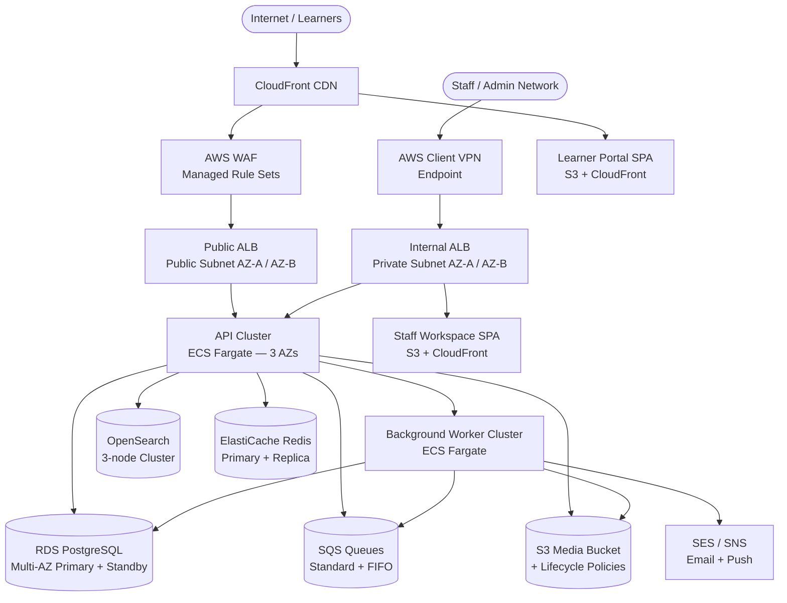
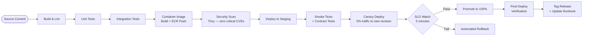
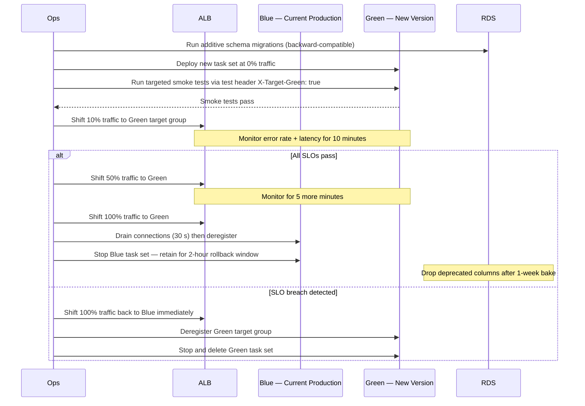

# Deployment Diagram - Learning Management System

## Deployment Topology



---

## Environment Tiers

| Environment | Purpose | Scale | Data Policy | Deployment Trigger |
|-------------|---------|-------|-------------|-------------------|
| **Production** | Live learner traffic, contractual SLAs | Full replica count, multi-AZ, multi-region DR | Real PII — encrypted at rest and in transit, strict 7-year retention for grading records | Canary on every merge to `main`; blue-green for major releases |
| **Staging** | Pre-release validation, load and contract testing | 50% of production replica count, single-AZ | Anonymized production snapshot refreshed every Sunday night | Every merge to `release/*` branch |
| **Development** | Feature development, integration testing | Minimal (1 replica per service), shared cluster | Synthetic seed data only — no PII | Continuous on every commit to `feature/*` branch |
| **DR** | Disaster recovery readiness validation | Production parity | Restored from latest production backup | Quarterly failover drill + on-demand during incidents |

---

## Container / Pod Deployment Specifications

### API Service (ECS Fargate)

| Parameter | Value |
|-----------|-------|
| Base image | `node:20-alpine` |
| Replicas — production | 4 minimum / 12 maximum |
| Replicas — staging | 2 minimum / 6 maximum |
| CPU allocation | 512 CPU units (0.5 vCPU) request; 1024 limit |
| Memory allocation | 512 MiB request; 1024 MiB limit |
| Exposed port | 3000 (HTTP) |
| Liveness check path | `GET /health/live` |
| Readiness check path | `GET /health/ready` |
| Graceful shutdown | 30 s drain — `SIGTERM` → drain ALB connections → exit |
| IAM task role | `lms-api-task-role` — Secrets Manager + SQS + S3 + OpenSearch |

### Worker Service (ECS Fargate)

| Parameter | Value |
|-----------|-------|
| Base image | `node:20-alpine` |
| Replicas — production | 2 minimum / 8 maximum |
| Replicas — staging | 1 minimum / 4 maximum |
| CPU allocation | 256 CPU units request; 512 limit |
| Memory allocation | 256 MiB request; 512 MiB limit |
| Scale-out trigger | SQS `ApproximateNumberOfMessagesVisible` > 100 |
| Scale-in cooldown | 120 s |
| Graceful shutdown | 60 s — finish in-flight job before exit |
| IAM task role | `lms-worker-task-role` — SQS + S3 + SES + SNS + RDS |

### Frontend SPAs (S3 + CloudFront)

| Parameter | Value |
|-----------|-------|
| Hosting | S3 bucket (not public) + CloudFront OAC |
| Build artifacts | Hashed JS/CSS bundles + `index.html` |
| Cache-Control (hashed assets) | `max-age=31536000, immutable` |
| Cache-Control (`index.html`) | `no-cache, no-store` |
| Deployment | `aws s3 sync` + `aws cloudfront create-invalidation` |

---

## Deployment Pipeline Stages



### Stage Definitions

| Stage | Tool | Pass Criteria | On Failure |
|-------|------|---------------|------------|
| Build & Lint | GitHub Actions + ESLint + `tsc --noEmit` | Zero lint errors, clean TypeScript compile | Block pipeline; notify committer via PR comment |
| Unit Tests | Jest | 100% pass; coverage ≥ 90% on domain packages | Block pipeline; notify committer |
| Integration Tests | Jest + Testcontainers | 100% pass | Block pipeline; notify committer |
| Image Build | Docker multi-stage | Clean build with no `--no-cache` bypass | Block pipeline |
| Security Scan | Trivy | Zero `CRITICAL` CVEs in image | Block pipeline; create security issue |
| Staging Deploy | ECS `update-service` | All tasks healthy within 3 minutes | Block; notify on-call engineer |
| Smoke + Contract Tests | k6 + Pact | P95 API latency < 500 ms; zero Pact contract failures | Block; notify on-call engineer |
| Canary 5% | ECS traffic shifting | Error rate < 0.5%; P99 < 1000 ms for 5 min | Automated rollback; PagerDuty alert |
| Promote 100% | ECS | All health checks pass | Automated rollback; PagerDuty critical alert |

---

## Rollback Strategy

### Automated Canary Rollback Triggers

Canary traffic is automatically rolled back when **any** of the following thresholds are breached during the 5-minute observation window:

| Metric | Breach Threshold | Source |
|--------|-----------------|--------|
| HTTP 5xx error rate | > 0.5% of canary-routed requests | CloudWatch — ALB `HTTPCode_Target_5XX_Count` |
| API P99 latency | > 1000 ms sustained for 2 minutes | CloudWatch — ALB `TargetResponseTime` |
| Worker dead-letter queue depth | Increases by > 50 messages | SQS `ApproximateNumberOfMessagesNotVisible` on DLQ |
| ECS health check failures | Any replica fails `/health/live` on 2 consecutive checks | ECS service health — task replacement triggered |
| OpenSearch error rate | Write rejection rate > 5% | OpenSearch CloudWatch metrics |

When a trigger fires:

1. ECS shifts 100% of traffic back to the stable (previous) task definition within 60 seconds.
2. CloudWatch alarm publishes to SNS → PagerDuty incident opened at `P2` severity.
3. The canary task set is deregistered and stopped within 2 minutes.
4. The deployment is marked failed in the release tracking system with the triggering metric recorded.

### Manual Rollback Steps

```bash
# 1. List current and previous task definition revisions
aws ecs describe-services \
  --cluster lms-prod \
  --services lms-api \
  --query 'services[0].deployments[*].[taskDefinition,status,runningCount]' \
  --output table

# 2. Force redeploy with the last known-good task definition
aws ecs update-service \
  --cluster lms-prod \
  --service lms-api \
  --task-definition lms-api:<PREVIOUS_REVISION> \
  --force-new-deployment

# 3. Wait for rollback to converge (typically 2-3 minutes)
aws ecs wait services-stable \
  --cluster lms-prod \
  --services lms-api

# 4. Confirm all tasks are running the correct revision
aws ecs list-tasks --cluster lms-prod --service-name lms-api | \
  xargs -I{} aws ecs describe-tasks --cluster lms-prod --tasks {} \
  --query 'tasks[*].[taskArn,taskDefinitionArn]' --output table

# 5. Verify application health
curl -sf https://api.lms.example.com/health/ready | jq .
```

---

## Health Check and Readiness Probe Definitions

### API Service

**ECS health check configuration:**

```json
{
  "healthCheck": {
    "command": ["CMD-SHELL", "curl -sf http://localhost:3000/health/live || exit 1"],
    "interval": 15,
    "timeout": 5,
    "retries": 3,
    "startPeriod": 30
  }
}
```

**Liveness probe** (`GET /health/live`): Returns `200 OK` if the Node.js process is running and the event loop is not stalled.

**Readiness probe** (`GET /health/ready`): Returns `200 OK` only when all dependencies are reachable:

```json
{
  "status": "ok",
  "dependencies": {
    "db": "ok",
    "redis": "ok",
    "sqs": "ok"
  }
}
```

Returns `503 Service Unavailable` with a JSON body identifying the degraded dependency when any check fails:

```json
{
  "status": "degraded",
  "dependencies": {
    "db": "ok",
    "redis": "timeout",
    "sqs": "ok"
  }
}
```

### Worker Service

**ECS health check configuration:**

```json
{
  "healthCheck": {
    "command": ["CMD-SHELL", "node /app/dist/health.js || exit 1"],
    "interval": 30,
    "timeout": 10,
    "retries": 3,
    "startPeriod": 60
  }
}
```

Worker liveness verifies that each SQS consumer polled successfully within the last 5 minutes. If the queue has been empty for 5 minutes the check returns healthy without requiring a received message.

---

## Blue-Green Deployment Process (Major Releases)

Blue-green is used for releases involving breaking API changes, large schema migrations, or major dependency upgrades.



### Blue-Green Checklist

- [ ] Schema migrations applied and verified against both Blue and Green versions.
- [ ] Green smoke tests pass via direct target-group access (bypass ALB routing).
- [ ] Feature flags isolate all new behavior behind a flag until 100% cutover.
- [ ] CloudWatch dashboard open on second screen; on-call engineer is standing by.
- [ ] Rollback window defined and communicated to stakeholders (default: 2 hours post 100% cutover).
- [ ] Maintenance page prepared for emergency if both Blue and Green are degraded.

---

## Database Migration Deployment Procedure

All schema changes are versioned and applied using TypeORM migrations. Migrations run as a dedicated ECS task before the new application version receives traffic.

### Migration Rules

| Rule | Rationale |
|------|-----------|
| Every migration must be backward-compatible with the previous application version | Enables zero-downtime rolling deploys — old version runs while migration is applied |
| New columns must use `DEFAULT NULL` or an explicit safe default | Prevents full-table rewrite lock on PostgreSQL for large tables |
| Column removal: deprecate first, drop after two deployment cycles | Prevents the running version from failing with a missing-column error |
| Index creation must use `CREATE INDEX CONCURRENTLY` | Non-blocking on PostgreSQL — table remains writable during index build |
| Column/table renames are forbidden; use add-copy-drop cycle instead | Rename is a breaking change; old version references original name |
| Each migration file is immutable once merged to `main` | Prevents history divergence between environments |

### Migration Deployment Steps

```bash
# 1. Run the migration task before deploying the new application version
aws ecs run-task \
  --cluster lms-prod \
  --task-definition lms-migration \
  --overrides '{"containerOverrides":[{"name":"migration","command":["npm","run","migration:run"]}]}' \
  --launch-type FARGATE \
  --network-configuration "awsvpcConfiguration={subnets=[subnet-xxx],securityGroups=[sg-xxx]}"

# 2. Wait for the migration task to complete and verify exit code 0
aws ecs wait tasks-stopped --cluster lms-prod --tasks <TASK_ARN>
aws ecs describe-tasks --cluster lms-prod --tasks <TASK_ARN> \
  --query 'tasks[0].containers[0].exitCode'

# 3. Verify migration state matches expected version
# (Run inside migration task or via a read-only DB connection)
SELECT version, name, executed_at FROM typeorm_migrations ORDER BY executed_at DESC LIMIT 5;

# 4. Proceed with application deployment only after exit code 0
# If migration fails, do not deploy the new application version
# Revert the migration then fix and re-deploy
```

The migration ECS task role has access only to the RDS credentials secret and the migration-specific DB user. It does not have access to SQS, S3, or application secrets.

