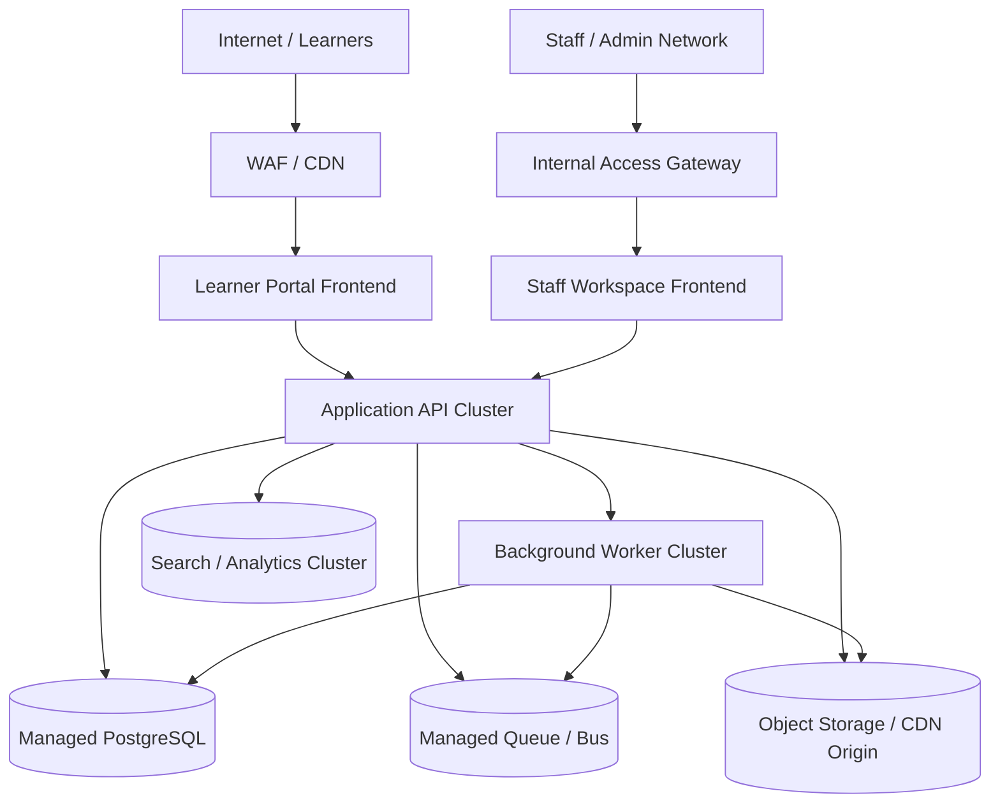

# Deployment Diagram - Learning Management System

## Deployment Notes

- Learner and staff experiences should be separated at the edge but can share the same core backend platform.
- Background workers handle notifications, progress aggregation, grading queues, certificate issuance, and projection updates.
- Media content and downloadable learning assets should use object storage plus CDN distribution.

## Implementation Details: Deployment Runbook

### Rollout strategy
- API and worker clusters deploy independently with canary + automatic rollback on SLO breach.
- Drain queue consumers before worker replacement to avoid duplicate job execution.

### Environment parity requirements
- Staging mirrors production queue topology and scaling policy.
- DR environment validates restore for transcript, grades, and certificate evidence.
