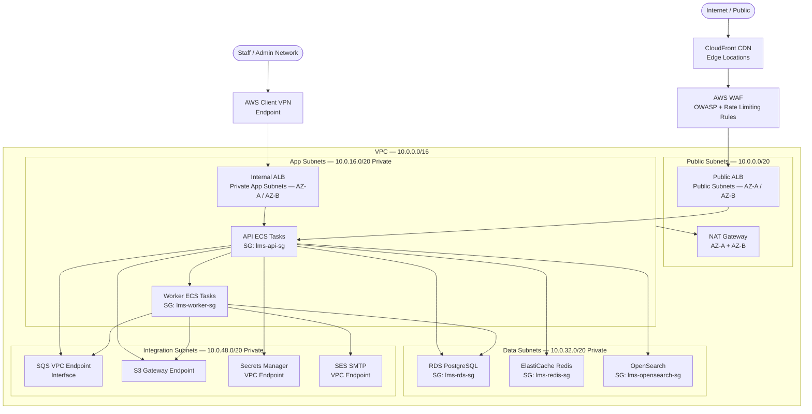
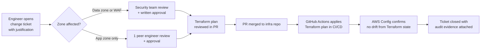

# Network Infrastructure - Learning Management System

## Network Zone Diagram

---

## Zone Security Policy Table

### Public Edge Zone

| Direction | Source | Destination | Protocol / Port | Action | Notes |
|-----------|--------|-------------|-----------------|--------|-------|
| Ingress | `0.0.0.0/0` | CloudFront | TCP 443 | Allow | HTTPS only |
| Ingress | `0.0.0.0/0` | CloudFront | TCP 80 | Redirect 301 | Force HTTPS |
| Egress | CloudFront | Public ALB | TCP 443 | Allow | Origin fetch |
| Egress | CloudFront | Any (other) | All | Deny | Default deny |

### Application Zone — `lms-api-sg`

| Direction | Source | Destination | Protocol / Port | Action | Notes |
|-----------|--------|-------------|-----------------|--------|-------|
| Ingress | `lms-alb-sg` | `lms-api-sg` | TCP 3000 | Allow | ALB to API containers |
| Ingress | `lms-worker-sg` | `lms-api-sg` | TCP 3001 | Allow | Internal gRPC health callback |
| Egress | `lms-api-sg` | `lms-rds-sg` | TCP 5432 | Allow | PostgreSQL |
| Egress | `lms-api-sg` | `lms-redis-sg` | TCP 6379 | Allow | ElastiCache Redis |
| Egress | `lms-api-sg` | `lms-opensearch-sg` | TCP 443 | Allow | HTTPS to OpenSearch |
| Egress | `lms-api-sg` | VPC Endpoints | TCP 443 | Allow | SQS, S3, Secrets Manager |
| Egress | `lms-api-sg` | `0.0.0.0/0` | All other | Deny | Default deny |

### Worker Zone — `lms-worker-sg`

| Direction | Source | Destination | Protocol / Port | Action | Notes |
|-----------|--------|-------------|-----------------|--------|-------|
| Ingress | `lms-api-sg` | `lms-worker-sg` | TCP 3001 | Allow | Internal callback |
| Egress | `lms-worker-sg` | `lms-rds-sg` | TCP 5432 | Allow | PostgreSQL writes |
| Egress | `lms-worker-sg` | VPC Endpoints | TCP 443 | Allow | SQS, S3, SES |
| Egress | `lms-worker-sg` | `0.0.0.0/0` (via NAT) | TCP 443 | Allow | Third-party providers (IdP, live session) |
| Egress | `lms-worker-sg` | All other | All | Deny | Default deny |

### Data Zone — `lms-rds-sg`, `lms-redis-sg`, `lms-opensearch-sg`

| Direction | Source | Destination | Protocol / Port | Action | Notes |
|-----------|--------|-------------|-----------------|--------|-------|
| Ingress | `lms-api-sg` | `lms-rds-sg` | TCP 5432 | Allow | API read/write |
| Ingress | `lms-worker-sg` | `lms-rds-sg` | TCP 5432 | Allow | Worker read/write |
| Ingress | `lms-migration-sg` | `lms-rds-sg` | TCP 5432 | Allow | Migration task only |
| Ingress | `lms-api-sg` | `lms-redis-sg` | TCP 6379 | Allow | Session + cache |
| Ingress | `lms-api-sg` | `lms-opensearch-sg` | TCP 443 | Allow | Search + analytics |
| Egress | Data zone SGs | Any | All | Deny | No outbound from data tier |

---

## WAF Rule Categories

AWS WAF is attached to the CloudFront distribution and independently to the Public ALB as a defense-in-depth layer.

### OWASP Top 10 Mitigations

| Rule Group | Threats Covered | Action |
|------------|----------------|--------|
| `AWSManagedRulesCommonRuleSet` | SQLi, XSS, RFI, LFI, command injection, SSRF patterns | Block |
| `AWSManagedRulesSQLiRuleSet` | Advanced SQL injection patterns across URI, body, headers | Block |
| `AWSManagedRulesKnownBadInputsRuleSet` | Log4Shell, Spring4Shell, path traversal sequences | Block |
| `AWSManagedRulesAmazonIpReputationList` | Botnets, anonymization IPs, threat-intelligence feeds | Block |
| `AWSManagedRulesAnonymousIpList` | Tor exit nodes, VPN providers, hosting ranges | Count (review weekly) |
| Custom: Request body size | Body > 10 MB blocked; exception for `POST /api/uploads` (50 MB) | Block |
| Custom: HTTP method allow-list | Only `GET`, `POST`, `PUT`, `PATCH`, `DELETE`, `OPTIONS` | Block |
| Custom: Content-Type enforcement | All `POST`/`PUT`/`PATCH` must include `application/json` unless multipart | Block |

### Rate Limiting Rules

| Rule Name | Limit | Window | Scope | Block Duration |
|-----------|-------|--------|-------|----------------|
| Global API rate limit | 2 000 requests | 5 minutes per IP | All `/api/*` | 5 minutes |
| Authentication rate limit | 20 requests | 5 minutes per IP | `/api/auth/*` | 15 minutes |
| Upload rate limit | 10 requests | 1 minute per IP | `/api/uploads/*` | 5 minutes |
| Assessment submission | 30 requests | 10 minutes per IP | `/api/assessments/*/submit` | 10 minutes |
| Admin bulk operations | 5 requests | 1 minute per IP | `/api/admin/*/bulk` | 10 minutes |

### Geo-Blocking

- All geographic regions permitted by default.
- Country-level blocks are applied when required by data residency contracts or legal obligations.
- Geo-block rules require documented approval from the legal team and are reviewed quarterly.
- Geo-block changes are implemented through Terraform; no manual WAF console edits permitted.

---

## TLS / mTLS Configuration

### External TLS — Client to Load Balancer

| Requirement | Value |
|-------------|-------|
| Minimum TLS version | TLS 1.2 |
| Preferred TLS version | TLS 1.3 |
| ALB security policy | `ELBSecurityPolicy-TLS13-1-2-2021-06` |
| CloudFront security policy | `TLSv1.2_2021` |
| Certificate management | AWS Certificate Manager (ACM) — auto-renewed 60 days before expiry |
| HSTS | `Strict-Transport-Security: max-age=31536000; includeSubDomains; preload` |
| HSTS preload | Domain submitted to HSTS preload list |
| HTTP redirect | Enforced at both CloudFront and ALB listener level; no plaintext traffic reaches origin |

### Internal mTLS — Service to Service

| Requirement | Value |
|-------------|-------|
| Protocol | Mutual TLS (mTLS) for sensitive service-to-service paths |
| Certificate authority | AWS Private CA (ACM PCA) — dedicated subordinate CA per environment |
| Certificate validity | 90 days; automated rotation via ECS task restart + cert-manager |
| Scope | API → OpenSearch (HTTPS with client cert), API → RDS (`sslmode=verify-full`) |
| Verification | Both client and server certificates are verified on each connection |
| Certificate rotation alert | CloudWatch alarm fires 14 days before expiry |

---

## DDoS Protection Strategy

| Layer | Mechanism | Details |
|-------|-----------|---------|
| Network — L3/L4 | AWS Shield Standard | Active on all AWS resources automatically; no configuration required |
| Application — L7 | AWS Shield Advanced | Enabled on CloudFront, Public ALB, and Elastic IPs; 24/7 AWS DRT access |
| Edge absorption | CloudFront global PoPs | Volumetric attacks absorbed at edge before reaching origin |
| Origin protection | Public ALB not directly reachable from internet | ALB security group restricts ingress to CloudFront managed prefix list only |
| Rate-based blocking | WAF rate-limit rules | IP-level rate limiting triggers before volumetric attack saturates origin |
| Traffic scrubbing | Shield Advanced automatic mitigation | AWS automatically applies traffic scrubbing on detected volumetric attacks |

### DDoS Alarm Thresholds

| Metric | Threshold | Destination |
|--------|-----------|-------------|
| `DDoSDetected` = 1 | Any positive value | PagerDuty critical + Slack `#lms-security` |
| `DDoSAttackBitsPerSecond` | > 100 Mbps | PagerDuty critical |
| `DDoSAttackRequestsPerSecond` | > 10 000 RPS | PagerDuty critical |
| ALB 5xx error rate spike | > 5% in 2 minutes | PagerDuty alert + Slack `#lms-ops` |

---

## Private Endpoint Configurations

All AWS service calls from application and worker subnets use VPC endpoints to prevent traffic traversing the public internet.

| AWS Service | Endpoint Type | DNS Name | Security Group |
|-------------|--------------|----------|----------------|
| Amazon S3 | Gateway Endpoint | Via route table (no DNS override) | N/A — policy-based |
| Amazon SQS | Interface (PrivateLink) | `sqs.us-east-1.vpce.amazonaws.com` | `lms-vpce-sg` |
| AWS Secrets Manager | Interface (PrivateLink) | `secretsmanager.us-east-1.vpce.amazonaws.com` | `lms-vpce-sg` |
| Amazon SES (SMTP) | Interface (PrivateLink) | `email-smtp.us-east-1.vpce.amazonaws.com` | `lms-vpce-sg` |
| Amazon ECR API | Interface (PrivateLink) | `ecr.api.us-east-1.vpce.amazonaws.com` | `lms-vpce-sg` |
| Amazon ECR Docker | Interface (PrivateLink) | `*.dkr.ecr.us-east-1.vpce.amazonaws.com` | `lms-vpce-sg` |
| Amazon CloudWatch Logs | Interface (PrivateLink) | `logs.us-east-1.vpce.amazonaws.com` | `lms-vpce-sg` |
| AWS Systems Manager | Interface (PrivateLink) | `ssm.us-east-1.vpce.amazonaws.com` | `lms-vpce-sg` |

NAT Gateway is retained for outbound access to third-party providers (IdP, live session vendor, external analytics). All NAT egress traffic is logged via VPC Flow Logs and reviewed for unexpected destinations monthly.

---

## Network Monitoring and Alerting

| Signal | Source | Threshold | Response |
|--------|--------|-----------|---------|
| VPC Flow Log rejects — unexpected port | CloudWatch Logs Insights | > 50 reject events per minute on data subnet | SNS → Security team Slack |
| Cross-AZ data transfer spike | CloudWatch — NAT Gateway | > 5 GB/hour (unexpected) | SNS → Ops team |
| ALB 5xx error rate | ALB CloudWatch metrics | > 1% over 5 minutes | PagerDuty alert |
| ALB request count drop (brownout) | ALB CloudWatch metrics | < 20% of rolling 7-day average | PagerDuty alert |
| Security group rule change | AWS Config rule `restricted-sg-changes` | Any modification to `lms-rds-sg` or `lms-redis-sg` | SNS → Security team + auto-create change ticket |
| Failed mTLS handshakes | ALB access logs | > 50 per minute | CloudWatch alarm → Ops |
| WAF block rate spike | WAF CloudWatch metrics | > 500 blocks per minute | CloudWatch alarm → Security team |
| DDoS event | Shield Advanced | Any detection | PagerDuty critical |

VPC Flow Logs are retained for 90 days in CloudWatch Logs and archived to S3 Glacier Instant Retrieval for 1 year. Every flow log record includes source IP, destination IP, port, protocol, bytes, packets, action, and the VPC endpoint ID where applicable.

---

## Firewall Rule Change Management

All changes to security groups, WAF rules, and network ACLs are implemented exclusively through Terraform. Manual console changes are prohibited and detected automatically.

### Change Approval Matrix

| Rule Scope | Approvers Required | Standard Lead Time | Emergency Process |
|------------|-------------------|-------------------|-------------------|
| Data zone ingress / egress | Security team lead + Engineering lead | 3 business days | On-call security override; post-review within 24 h |
| App zone ingress / egress | 1 peer engineer | 1 business day | On-call engineer approval via PR; post-review within 24 h |
| WAF rule add / modify | Security team lead | 2 business days | On-call security override; post-review within 24 h |
| WAF managed rule disable | Security team lead + VP Engineering | 5 business days | Not available — escalate to VP Engineering |
| New resource in public subnet | Architecture review board | 1 week | Not available |

AWS Config rule `REQUIRED_TAGS` and custom `PROHIBITED_OPEN_SG` Lambda rules run continuously. Any unapproved change triggers a non-compliance alarm and is automatically reverted by the Config remediation action within 15 minutes.

