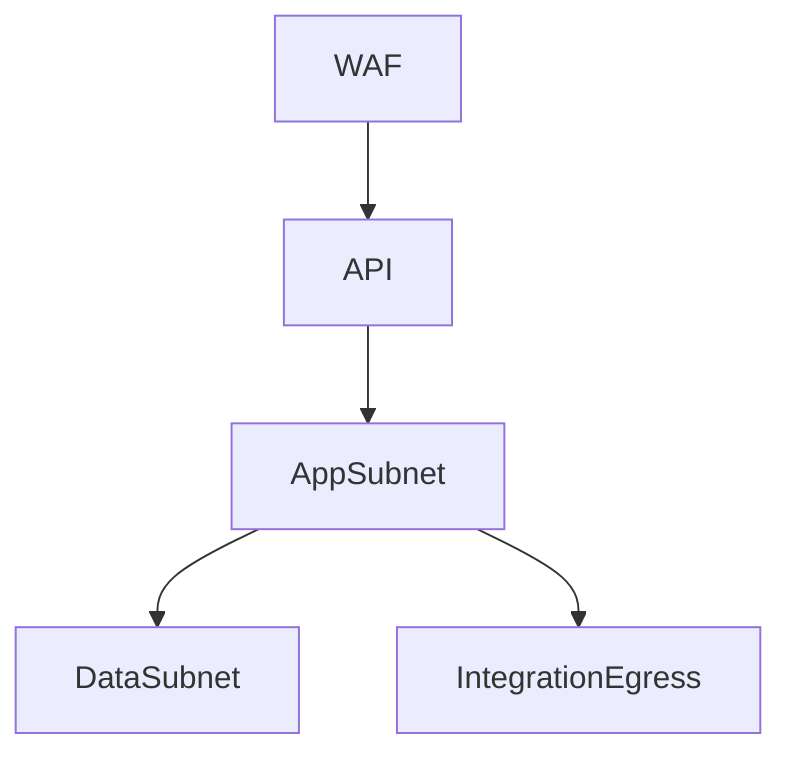

# Network Infrastructure - Learning Management System

## Network Zones

| Zone | Purpose | Key Controls |
|------|---------|--------------|
| Public Edge | Learner access to portal and media delivery | TLS termination, WAF, rate limiting |
| Staff Access | Instructor/admin operational access | SSO, zero-trust gateway or private access |
| Application Zone | API and background workers | Private subnets, service identity, secrets management |
| Data Zone | Database, search, queue, object storage | No public access, encryption, restricted paths |
| Integration Zone | Identity, notifications, live session, analytics | Outbound allow-list, credential rotation |

## Traffic Principles

- Learner traffic enters only through the public edge.
- Staff and admin access should traverse explicit access controls and stronger session requirements.
- Search and analytics outputs must not bypass application-level authorization for protected learner data.
- Media delivery should be tokenized or scoped when content is not public.

## Implementation Details: Network Control Plan

### Traffic and policy controls
- East-west traffic uses service identity and mTLS.
- Egress policies are allow-list based for IdP, email, live session, and analytics providers.

### Verification checklist
- No direct public access to data subnet resources.
- Access logs retained with tenant and request correlation identifiers.
