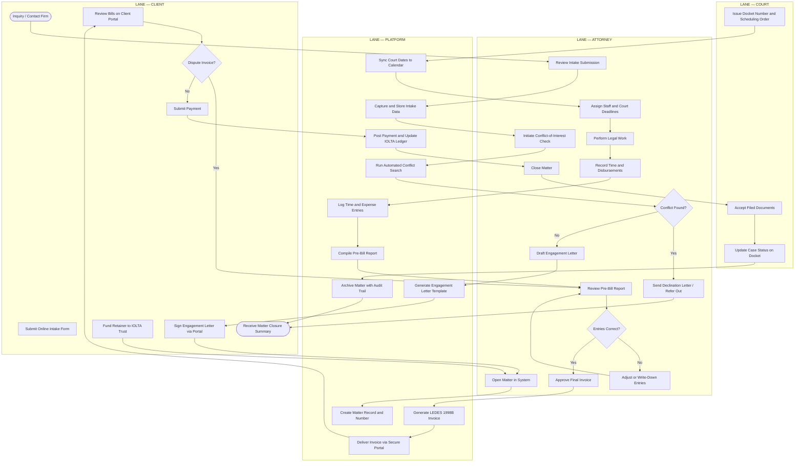
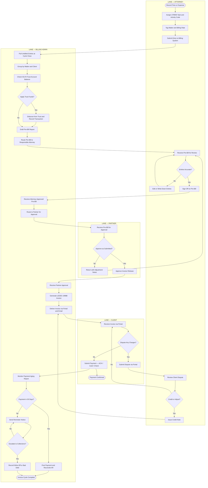
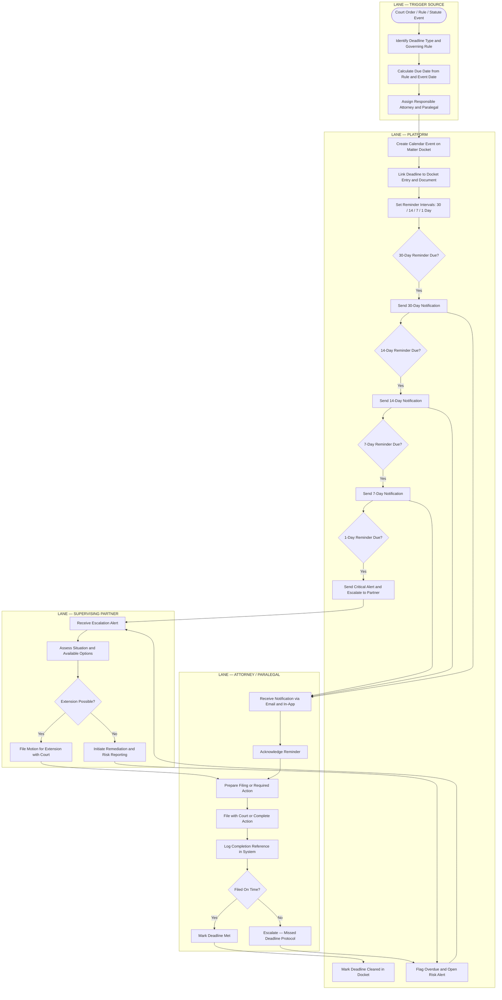

# Activity Diagrams — Legal Case Management System

This document contains three activity diagrams modelling the primary operational workflows
of a law firm SaaS platform. Each diagram uses swim-lane–style notation via `subgraph`
blocks to assign activities to their responsible actor or system component. Arrows between
lanes represent handoffs, triggers, or data flows.

The three workflows covered are:

- **Case Lifecycle** — from first client contact to matter archival
- **Billing Workflow** — from time entry to payment reconciliation
- **Court Deadline Management** — from deadline identification to timely completion

---

## Case Lifecycle Activity Diagram

The case lifecycle spans from a prospective client's first contact with the firm through
final matter archival. It crosses four swim lanes:

- **Client** — initiates contact, signs documents, funds the retainer, reviews invoices,
  and receives the closure summary.
- **Attorney** — evaluates the intake, runs the conflict-of-interest check, drafts the
  engagement letter, performs legal work, approves billing, and closes the matter.
- **Platform** — automates conflict searches, generates document templates, manages matter
  records, syncs court calendars, and maintains the audit trail.
- **Court** — issues scheduling orders and docket numbers that feed the calendar.

Two hard gates govern the entire lifecycle. First, the **conflict-of-interest check**
(required under ABA Model Rule 1.7) must pass before any attorney-client relationship is
formed. Second, the **engagement letter** must be fully executed before any billable work
commences. Until both gates are cleared, no time entries are permitted against the matter.

Key compliance notes:

- Conflict check results must be logged regardless of outcome.
- Retainer funds are deposited to the IOLTA trust account, not the operating account.
- The matter may only transition to `Closed` after all open invoices are resolved.
- Archival preserves all records immutably for the firm's document-retention period.

---

## Billing Workflow Activity Diagram

The billing workflow translates attorney time and expense records into legally compliant,
client-ready invoices and reconciled payments. Key design principles:

- **UTBMS codes** are applied at time entry, not at invoicing, ensuring clean LEDES output.
- **Pre-bill review** by the responsible attorney occurs before any figure is shown to the
  partner or client. This is the primary write-down gate.
- **Partner approval** acts as a second quality gate, required for all invoices before
  external delivery.
- **IOLTA deduction** happens at invoice generation time, not at payment receipt, to keep
  trust ledger balances accurate.
- **Disputed invoices** re-enter the attorney review loop — revenue is not recognized until
  the dispute is resolved.

The four lanes are **Attorney**, **Billing Admin**, **Partner**, and **Client**.

Performance benchmarks typically tracked in this workflow:

- Days from billing-cycle close to invoice delivery (target: ≤ 5 business days)
- Pre-bill write-down rate by attorney and practice group
- Days sales outstanding (DSO) by client segment
- Write-off rate as a percentage of billed fees

---

## Court Deadline Management Activity Diagram

Missed court deadlines are among the leading causes of legal malpractice claims. This
workflow models how the platform captures deadline triggers, calculates due dates,
delivers escalating notifications, and confirms timely completion.

Deadline types covered include:

- **Statute of limitations** — computed from the date of injury or accrual
- **Discovery cutoffs** — calculated from scheduling order issue date
- **Motion practice deadlines** — computed from filing or service date
- **Trial dates** — fixed calendar entries
- **Appeal windows** — computed from judgment entry date

The escalation ladder is intentional: unacknowledged reminders at the 7-day and
1-day marks surface automatically to the supervising partner, who can authorize an
extension motion or activate the firm's missed-deadline protocol. The system never
silently drops a critical deadline.

The four lanes are **Trigger Source**, **Platform**, **Attorney/Paralegal**, and
**Supervising Partner**.

Compliance notes:

- All deadline entries include the rule or statute that generated them.
- Completion must be confirmed by the responsible attorney, not auto-cleared by the system.
- Missed deadlines trigger a mandatory risk management log entry.
- Reminder intervals are configurable per deadline type and jurisdiction.

---

## Summary

| Diagram | Primary Actor | Critical Gate | Compliance Anchor |
|---|---|---|---|
| Case Lifecycle | Attorney | Conflict check + engagement letter | ABA Model Rules 1.7, 1.15 |
| Billing Workflow | Billing Admin | Partner invoice approval | LEDES/UTBMS billing standards |
| Court Deadline Management | Platform | 1-day escalation to partner | ABA Model Rule 1.3 (Diligence) |

The three diagrams together cover the entire revenue cycle of a litigation or transactional
matter: intake and onboarding, active-phase time capture and billing, and the parallel
docket management track that governs court-facing obligations. All platform automation is
designed to augment attorney judgment, not replace the human approval gates required by
professional responsibility rules.
