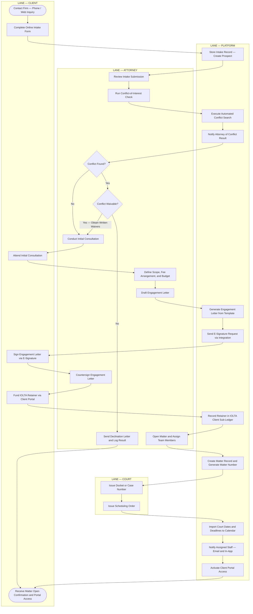
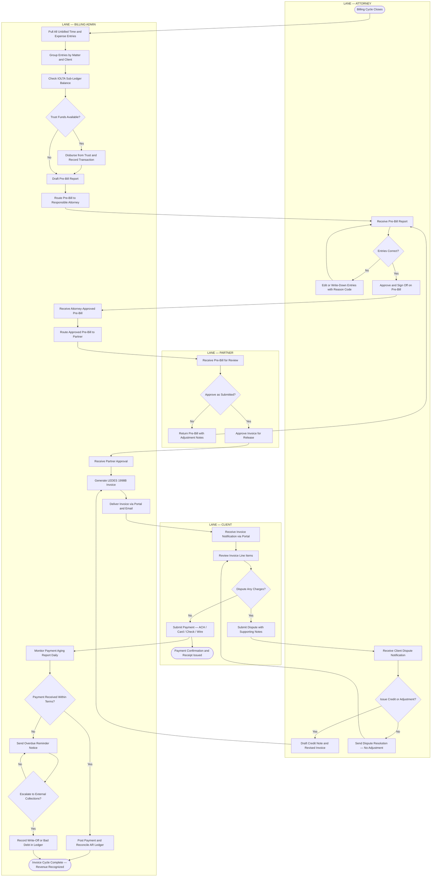
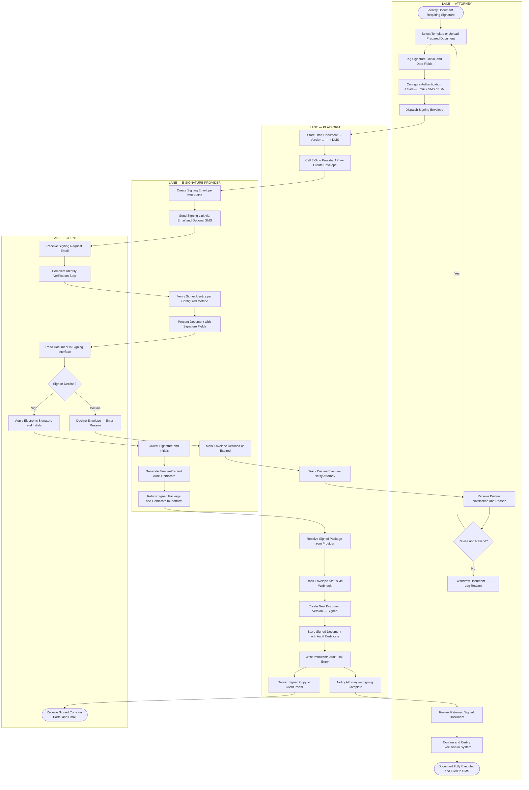

# BPMN Swimlane Diagrams — Legal Case Management System

This document models three core business processes using BPMN-inspired swimlane notation
rendered with Mermaid `flowchart` diagrams. Each lane represents a participant (human
actor, organizational role, or system component), and cross-lane arrows represent
handoffs, triggers, or data exchanges.

Notation conventions used throughout:

- `([text])` — Start or end event (rounded stadium shape)
- `[text]` — Task or activity (rectangle)
- `{text}` — Gateway / decision point (diamond)
- Arrows between lanes — message flows or sequence flows crossing organizational boundaries

The three processes documented are:

- **Case Opening Process** — Lanes: Client, Attorney, Platform, Court
- **Invoice Approval and Delivery Process** — Lanes: Attorney, Billing Admin, Partner, Client
- **Document E-Signature Workflow** — Lanes: Attorney, E-Signature Provider, Client, Platform

---

## Case Opening Process

### Process Narrative

The case opening process converts an unvetted prospect into a formally engaged client
with an active, billable matter record. It involves four participants:

- **Client** — Initiates interest, completes the intake form, attends consultation,
  signs the engagement letter, and funds the retainer.
- **Attorney** — Reviews the intake, conducts the ethical conflict screen, scopes the
  engagement, drafts the engagement letter, and opens the matter.
- **Platform** — Stores intake data, automates the conflict search, generates document
  templates, creates system records, and notifies relevant staff.
- **Court** — Issues docket numbers and scheduling orders that feed the matter calendar
  when a litigation matter is opened.

**Critical decision points:**

1. **Conflict-of-Interest Gateway** — The single most consequential gate. A conflict
   finding terminates the process immediately. The declination must be logged for ethics
   record-keeping (ABA Model Rule 1.10). If the conflict is waivable and all parties
   consent in writing, the attorney may proceed after obtaining written waivers; this
   sub-process is not shown here but is triggered from the conflict-found branch.

2. **Engagement Letter Execution** — A second hard gate. Until the client countersigns and
   the retainer is funded, the platform blocks timekeeper access to the matter. This
   prevents unauthorized pre-engagement billing.

**Integration touchpoints:**

| System | Action |
|---|---|
| Conflict-check database | Queried against all firm contacts, adverse parties, and former clients |
| DocuSign / E-signature | Sends engagement letter for electronic signature |
| IOLTA ledger | Records initial retainer deposit against client sub-ledger |
| Court e-filing system | Retrieves docket number and scheduling order when case is already filed |

### BPMN Swimlane Diagram

---

## Invoice Approval and Delivery Process

### Process Narrative

The invoice lifecycle requires coordinated collaboration among the billing attorney,
billing administration, the supervising partner, and the client. The process enforces a
two-stage human approval (attorney → partner) before any invoice is released externally,
protecting the firm from billing errors, unsupported write-downs, and client dissatisfaction.

**Participants:**

- **Attorney** — Reviews pre-bill line items, approves or adjusts time and expense entries,
  and handles any client disputes post-delivery.
- **Billing Admin** — Runs the billing cycle, applies trust funds, drafts the pre-bill,
  routes for approvals, generates the LEDES invoice, delivers it, and monitors collections.
- **Partner** — Final approver before external delivery. May return the pre-bill with
  adjustment notes, which sends it back to the attorney review loop.
- **Client** — Receives and pays the invoice or raises disputes via the portal.

**Critical decision points:**

1. **Attorney Pre-Bill Review** — The attorney can edit narrative, write down hours, or
   flag no-charge entries. All write-downs are logged with the initiating user and reason.

2. **Partner Approval Gate** — Required for all invoices. Partners may lower rates,
   write off entire entries, or hold the invoice pending resolution of a client concern.

3. **Trust Fund Application** — Before drafting the pre-bill, billing admin checks the
   client's IOLTA sub-ledger. Available trust funds are applied to reduce the net invoice
   amount. The corresponding trust disbursement is recorded immediately.

4. **Client Dispute Loop** — A disputed invoice returns to the attorney, not directly to
   billing. This ensures that adjustments are attorney-supervised, as required by
   professional responsibility rules governing fee disputes.

**Process performance indicators:**

| Metric | Target |
|---|---|
| Billing cycle close to invoice delivery | ≤ 5 business days |
| Pre-bill write-down rate | Monitored by practice group |
| Days sales outstanding (DSO) | ≤ 45 days |
| Invoice dispute rate | < 3% of invoices |

### BPMN Swimlane Diagram

---

## Document E-Signature Workflow

### Process Narrative

Legal documents requiring client signatures — engagement letters, settlement agreements,
retainer amendments, and authorization forms — must be executed via a secure,
court-admissible e-signature process. The workflow integrates with a third-party
e-signature provider (modeled generically; the platform supports DocuSign, Adobe Sign,
and similar providers).

**Participants:**

- **Attorney** — Selects or uploads the document, configures signature fields and
  authentication requirements, dispatches the envelope, and certifies the final signed
  copy in the system.
- **E-Signature Provider** — Creates the envelope, delivers the signing link, verifies
  the signer's identity, collects the e-signature, generates the audit certificate, and
  returns the signed package to the platform.
- **Client** — Receives the signing request, completes identity verification, reviews the
  document, and either applies their electronic signature or declines with a stated reason.
- **Platform** — Stores the draft document, initiates the e-sign integration, tracks
  envelope status, versions the document on receipt of the signed copy, stores the final
  signed document with its audit certificate, and writes an audit trail entry.

**Critical decision points:**

1. **Authentication Level Selection** — The attorney configures authentication strength
   at dispatch time. Email verification is the minimum; SMS OTP and knowledge-based
   authentication (KBA) are available for high-value or high-risk documents.

2. **Sign or Decline Gateway** — If the client declines, the envelope is not re-sent
   automatically. The attorney receives a notification and must decide whether to revise
   the document and re-initiate, or withdraw it entirely. This prevents re-send loops that
   could obscure a genuine client objection.

3. **Version Control on Completion** — The platform creates a new, immutable document
   version for the signed copy. The unsigned draft is preserved in version history but
   flagged as superseded.

**Compliance and security requirements:**

| Requirement | Implementation |
|---|---|
| Tamper evidence | SHA-256 hash stored with signed document; provider audit certificate attached |
| Signer identity | Email verification minimum; KBA or SMS OTP for engagement letters and settlements |
| Audit trail | Immutable log entry written on every status transition of the envelope |
| Document storage | Signed copy stored in matter DMS with privilege and confidentiality flags |
| Access control | Only matter team members and the signing client can access the signed document |

### BPMN Swimlane Diagram

---

## Process Comparison Summary

| Process | Lanes | Key Human Gate | Primary Compliance Concern |
|---|---|---|---|
| Case Opening | Client, Attorney, Platform, Court | Conflict-of-interest check | ABA Model Rules 1.7, 1.10 |
| Invoice Approval and Delivery | Attorney, Billing Admin, Partner, Client | Partner pre-delivery approval | Fee reasonableness — ABA Model Rule 1.5 |
| Document E-Signature | Attorney, E-Sign Provider, Client, Platform | Decline review before re-send | ESIGN Act / UETA enforceability |

All three processes converge on the same platform audit trail, ensuring a complete and
immutable record of every cross-lane handoff for compliance reporting, malpractice defence,
and bar audit purposes.
