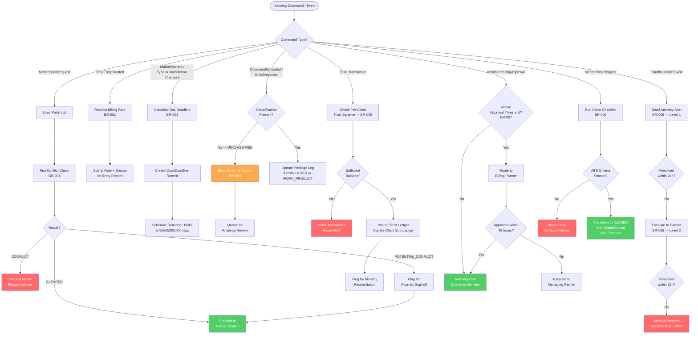

# Business Rules — Legal Case Management System

Business rules encode the non-negotiable constraints, compliance obligations, and operational
policies that govern every action in the system. Violations must be blocked, logged, and — where
applicable — escalated. All rules listed here are enforceable at the application layer; no rule
may be silently bypassed.

---

## Enforceable Rules

### BR-001 — Conflict Check Required Before Matter Opening

| Field               | Detail |
|---------------------|--------|
| **Rule ID**         | BR-001 |
| **Name**            | Conflict Check Required Before Matter Opening |
| **Trigger**         | `MatterOpenRequest` submitted by any user |
| **Condition**       | A new matter may not transition to `OPEN` status until a conflict-of-interest check has been completed with a `CLEARED` result for all named parties (client, adverse parties, related entities, and disclosed witnesses) |
| **Action**          | Block matter creation; surface a `ConflictCheckPending` banner; auto-create a `ConflictCheckTask` assigned to the responsible attorney; send email notification to intake coordinator |
| **Priority**        | Critical — blocks downstream workflow |
| **Override Authority** | Managing Partner only, with mandatory written justification captured in the audit log; override creates a `ConflictWaiver` record linked to the matter |
| **Audit Requirement** | Every conflict-check run — including party list, search timestamp, result, and reviewer identity — must be persisted; waivers must be countersigned and retained for the life of the matter plus seven years |

**Detail:** The system must search all existing matters, clients, adverse parties, and firm employees against the submitted party list using fuzzy-match (Levenshtein distance ≤ 2) plus exact match on tax ID / bar number. Results are classified as `CLEARED`, `POTENTIAL_CONFLICT`, or `CONFLICT`. Only `CLEARED` permits automatic progression. `POTENTIAL_CONFLICT` requires attorney sign-off. `CONFLICT` requires a waiver from the Managing Partner or matter reassignment.

---

### BR-002 — Billing Rate Hierarchy

| Field               | Detail |
|---------------------|--------|
| **Rule ID**         | BR-002 |
| **Name**            | Billing Rate Hierarchy |
| **Trigger**         | `TimeEntryCreated` or `ExpenseEntryCreated` event |
| **Condition**       | Rate must be resolved by walking a priority hierarchy; the first matching level wins |
| **Action**          | Resolve and stamp the applicable rate on the entry at creation time; store both resolved rate and source level in the entry record |
| **Priority**        | High |
| **Override Authority** | Billing Partner may manually override the resolved rate; override is flagged and requires a reason code |
| **Audit Requirement** | Rate source level, resolved amount, and any manual override (with actor and reason) recorded on every time entry |

**Rate Hierarchy (highest priority first):**

1. **Matter-level override** — a rate explicitly set on the matter for a specific timekeeper
2. **Client-level override** — a negotiated rate agreement on the client record for a timekeeper role
3. **Timekeeper role default** — standard rates by role: Partner, Senior Associate, Associate, Paralegal, Law Clerk
4. **Firm default** — the firm-wide fallback rate for the timekeeper's role as defined in the Rate Schedule

Rates are version-controlled with effective dates. A time entry always uses the rate that was active on the `workDate`, not the billing date.

---

### BR-003 — Statute of Limitations Tracking

| Field               | Detail |
|---------------------|--------|
| **Rule ID**         | BR-003 |
| **Name**            | Statute of Limitations Tracking |
| **Trigger**         | Matter opened; matter type or jurisdiction modified; new jurisdiction added to matter |
| **Condition**       | Every active matter with a litigable matter type must have at least one statute-of-limitations deadline calculated and stored |
| **Action**          | Auto-calculate deadline using `SoLMatrix[matterType][jurisdiction]`; create a `CourtDeadline` record of type `STATUTE_OF_LIMITATIONS`; schedule escalation reminders at 90, 60, 30, 14, and 7 days before expiry |
| **Priority**        | Critical |
| **Override Authority** | Responsible Attorney may extend or correct the SoL date with a mandatory citation of the legal basis; change is audited and triggers re-notification |
| **Audit Requirement** | All calculated, manually adjusted, and tolled SoL dates logged with actor, timestamp, and cited basis |

**Supported Matter Types and Default Periods (illustrative):**

| Matter Type | Default SoL (years) | Notes |
|-------------|---------------------|-------|
| Personal Injury | 2–3 | Jurisdiction-specific |
| Contract Dispute | 4–6 | Written vs oral distinction |
| Medical Malpractice | 2–3 | Discovery rule may apply |
| Employment Discrimination | 0.5–3 | EEOC charge deadline separate |
| Real Property | 5–10 | Varies by claim type |

Tolling events (minority, disability, fraudulent concealment) must be recorded and cause automatic recalculation.

---

### BR-004 — Attorney-Client Privilege Classification

| Field               | Detail |
|---------------------|--------|
| **Rule ID**         | BR-004 |
| **Name**            | Attorney-Client Privilege Classification |
| **Trigger**         | `DocumentUploaded`, `DocumentVersionCreated`, `EmailImported` |
| **Condition**       | Every document and email in the system must carry an explicit privilege classification before it is accessible outside the matter team |
| **Action**          | Block external sharing and discovery export of any document with `classification = UNCLASSIFIED`; auto-generate privilege log entries for documents tagged `PRIVILEGED` or `WORK_PRODUCT`; include in privilege log: document ID, date, author, recipients, subject matter description, privilege basis |
| **Priority**        | High |
| **Override Authority** | Responsible Attorney may downgrade a privilege classification (e.g., voluntary waiver); downgrade is irreversible and creates a permanent audit entry |
| **Audit Requirement** | Every classification event, access attempt, sharing action, and privilege log export must be logged with actor and timestamp |

**Classification Taxonomy:**

- `PRIVILEGED` — attorney-client communication protected under Evid. Rule 501
- `WORK_PRODUCT` — prepared in anticipation of litigation (FRCP 26(b)(3))
- `CONFIDENTIAL` — sensitive but not privileged; restricted to matter team
- `PUBLIC` — non-sensitive; may be shared with client via portal
- `UNCLASSIFIED` — newly ingested; access blocked pending classification

The privilege log is auto-generated in standard format and can be exported as CSV or PDF for production in discovery.

---

### BR-005 — IOLTA Trust Accounting Compliance

| Field               | Detail |
|---------------------|--------|
| **Rule ID**         | BR-005 |
| **Name**            | IOLTA Trust Accounting Compliance |
| **Trigger**         | Any trust ledger transaction: deposit, disbursement, transfer, earned-fee transfer |
| **Condition**       | (a) Unearned client funds must never be commingled with firm operating funds. (b) A disbursement from trust must not exceed the client's available trust balance. (c) Earned fees may only be transferred to operating after an invoice is approved and the client consents. (d) Three-way reconciliation (bank statement ↔ trust ledger ↔ client subsidiary ledgers) must be completable at any point in time |
| **Action**          | Block any disbursement that would produce a negative per-client trust balance; block commingling transfers; require reconciliation completion before matter close; generate monthly reconciliation report |
| **Priority**        | Critical — bar discipline and criminal liability risk |
| **Override Authority** | None — trust accounting rules are non-overridable; any exception requires escalation to the firm's ethics counsel |
| **Audit Requirement** | Every trust transaction immutably logged with transaction ID, client ledger reference, amount, resulting balance, actor, and timestamp; reconciliation reports retained permanently |

**Three-Way Reconciliation Check:**

```
Bank Statement Balance
  + Outstanding Deposits
  - Outstanding Checks
= Adjusted Bank Balance

Must equal → Trust Ledger Balance
Must equal → Sum of All Client Subsidiary Ledger Balances
```

---

### BR-006 — Malpractice Deadline Escalation

| Field               | Detail |
|---------------------|--------|
| **Rule ID**         | BR-006 |
| **Name**            | Malpractice Deadline Escalation |
| **Trigger**         | A `CourtDeadline` of type `STATUTE_OF_LIMITATIONS`, `FILING_DEADLINE`, or `RESPONSE_DEADLINE` reaches the 48-hour warning threshold without a `DeadlineCompletionEvent` recorded |
| **Condition**       | Deadline is still open (`status ≠ COMPLETED`) and is less than 48 hours from `dueDateTime` |
| **Action (T−48h)** | Send push notification, email, and in-app alert to the responsible attorney; create a `DeadlineEscalationTask` with `HIGH` priority; update deadline `escalationLevel = ATTORNEY` |
| **Action (T−24h)** | If still open: escalate to the responsible partner; send alerts to partner and practice group head; update `escalationLevel = PARTNER`; create `MalpracticeRiskFlag` on the matter |
| **Action (T−2h)**  | If still open: alert all firm partners and Managing Partner; flag matter as `CRITICAL_RISK`; suspend billing access until resolved |
| **Priority**        | Critical |
| **Override Authority** | Responsible Attorney or Partner may mark escalation as `ACKNOWLEDGED` with a mandatory action plan; acknowledgment does not dismiss the deadline |
| **Audit Requirement** | Each escalation event, notification sent, acknowledgment, and resolution logged with actor and timestamp |

---

### BR-007 — Invoice Approval Workflow

| Field               | Detail |
|---------------------|--------|
| **Rule ID**         | BR-007 |
| **Name**            | Invoice Approval Workflow |
| **Trigger**         | Invoice transitions to `PENDING_APPROVAL` status |
| **Condition**       | Invoice total is compared against the per-matter approval threshold (default: $5,000; configurable per client or matter) |
| **Action (below threshold)** | Auto-approve; transition to `APPROVED`; queue for delivery |
| **Action (above threshold)** | Route to Billing Partner for review; set `approvalDeadline = now + 48h`; block invoice delivery until approved |
| **Action (approval deadline missed)** | Escalate to Managing Partner; log overdue flag |
| **Priority**        | High |
| **Override Authority** | Managing Partner may lower or raise the approval threshold for a specific matter; all threshold changes are audited |
| **Audit Requirement** | Every approval action, rejection with reason, modification, and delivery event logged per invoice |

**LEDES / UTBMS Compliance:** All invoices must include valid UTBMS task codes, activity codes, and expense codes. Invoices failing LEDES 98B format validation are rejected at generation and must be corrected before resubmission.

---

### BR-008 — Matter Close Checklist

| Field               | Detail |
|---------------------|--------|
| **Rule ID**         | BR-008 |
| **Name**            | Matter Close Checklist |
| **Trigger**         | Attorney initiates a `MatterCloseRequest` |
| **Condition**       | All eight close criteria must be satisfied before status transitions to `CLOSED` |
| **Action**          | Run automated checklist; block close if any criterion is unsatisfied; surface per-criterion status with remediation links; upon all criteria passing, transition matter to `CLOSED`, emit `MatterClosed` event, lock all records |
| **Priority**        | High |
| **Override Authority** | Managing Partner may force-close a matter with all unmet criteria documented as exceptions; force-close is flagged in the matter record permanently |
| **Audit Requirement** | Checklist run results, each criterion pass/fail, exception overrides, and final close event logged with actor and timestamp |

**Close Criteria:**

| # | Criterion | Automated Check |
|---|-----------|-----------------|
| 1 | All tasks completed or explicitly waived | `tasks.status NOT IN (OPEN, IN_PROGRESS)` |
| 2 | Trust balance is zero | `trustLedger.clientBalance = 0.00` |
| 3 | Final invoice issued and paid or written off | `invoices.finalInvoice.status IN (PAID, WRITTEN_OFF)` |
| 4 | All documents classified and archived | `documents.classification ≠ UNCLASSIFIED` AND `documents.archived = true` |
| 5 | No open court deadlines | `courtDeadlines.status NOT IN (OPEN, PENDING)` |
| 6 | Conflict check record present | `conflictCheck.result IN (CLEARED, WAIVED)` |
| 7 | Client portal access revoked | `clientPortal.accessStatus = REVOKED` |
| 8 | File retention notice sent to client | `notifications.type = FILE_RETENTION_NOTICE` |

---

## Rule Evaluation Pipeline

All business rules are evaluated by the **Rule Engine Service** before any state-mutating operation
is persisted. The pipeline is synchronous for blocking rules (BR-001, BR-003, BR-005, BR-008) and
asynchronous for notification-only rules (BR-006 partial, BR-007 escalation reminders).



**Pipeline Execution Model:**

| Phase | Description |
|-------|-------------|
| **Pre-condition Check** | Validate that the incoming command carries all required fields; reject with `400 Bad Request` if malformed |
| **Rule Selection** | Map command type to the set of applicable rules; rules are tagged with `appliesTo` command types |
| **Synchronous Evaluation** | Blocking rules (Critical priority) run in-process before the transaction commits |
| **Result Dispatch** | Pass/block decision returned to caller; side effects (notifications, task creation) dispatched via event bus |
| **Async Follow-up** | Non-blocking rules (High/Medium priority) evaluated by background worker from the event bus |
| **Audit Flush** | Rule evaluation results written to the immutable audit log regardless of pass/fail outcome |

---

## Exception and Override Handling

### Override Taxonomy

Not all rules can be overridden. Rules are categorised by their override posture:

| Override Posture | Description | Examples |
|------------------|-------------|---------|
| **Non-Overridable** | System hard-blocks regardless of user role | IOLTA commingling (BR-005), negative trust balance (BR-005) |
| **Restricted Override** | Only Managing Partner; requires written justification | Conflict waiver (BR-001), force-close (BR-008) |
| **Delegated Override** | Responsible Attorney or Billing Partner within defined bounds | SoL date correction with citation (BR-003), rate override with reason code (BR-002) |
| **Threshold Override** | Configurable limits that authorized users may adjust | Invoice approval threshold (BR-007) |

### Override Request Lifecycle

Every override follows a structured lifecycle to maintain defensibility:

1. **Override Requested** — actor selects "Request Override" with a mandatory reason and supporting reference (e.g., client instruction, court order, ethics opinion)
2. **Authority Verified** — system checks that the requesting actor holds the required role; unauthorized requests are silently blocked and logged
3. **Countersignature** (for Restricted overrides) — a second approver at the required authority level must countersign before the override takes effect
4. **Override Applied** — the rule evaluation result is set to `OVERRIDDEN`; the blocked action is permitted to proceed
5. **Audit Written** — immutable record containing: rule ID, original evaluation result, override reason, supporting reference, actor, countersigner, and timestamp
6. **Periodic Review** — overrides older than 30 days without a resolution are surfaced in the Managing Partner's weekly governance report

### Exception Escalation Matrix

| Rule | Escalation Path | Maximum Response Time |
|------|-----------------|-----------------------|
| BR-001 Conflict waiver not actioned | Intake Coordinator → Responsible Attorney → Managing Partner | 4 hours |
| BR-003 SoL deadline unacknowledged | Responsible Attorney → Partner → All Partners | 48 hours before deadline |
| BR-005 Trust imbalance detected | Billing Team → Controller → Managing Partner → Ethics Counsel | Immediate (< 1 hour) |
| BR-006 Court deadline unacknowledged | Responsible Attorney → Partner → All Partners | See escalation tiers in rule |
| BR-008 Forced close without all criteria | Managing Partner must document each exception | At time of force-close |

### Audit Log Schema

Every rule evaluation event — pass, fail, override, or escalation — writes to the immutable `rule_audit_log` table:

```
rule_audit_log {
  auditId          : UUID (PK)
  ruleId           : string          -- e.g. "BR-001"
  entityType       : string          -- "Matter", "Document", "Invoice", etc.
  entityId         : UUID
  evaluationResult : enum            -- PASS | BLOCK | OVERRIDE | ESCALATED
  evaluatedBy      : string          -- "RuleEngine/v2.1" or actor ID
  actorId          : UUID
  overrideActorId  : UUID?
  overrideReason   : string?
  overrideRef      : string?         -- cited authority (court order, ethics opinion)
  evaluatedAt      : timestamp (UTC)
  matterId         : UUID?           -- always populated when applicable
  metadata         : jsonb           -- rule-specific payload snapshot
}
```

Rows in this table are append-only. No UPDATE or DELETE is permitted at the application layer. Retention: life of matter + 7 years minimum; indefinite for trust transactions (BR-005).

### Regulatory Framework References

Rules in this system are informed by, but not limited to, the following:

- **ABA Model Rules of Professional Conduct** — Rules 1.7, 1.8, 1.9 (conflicts); Rule 1.6 (confidentiality); Rule 1.15 (safekeeping of client property / IOLTA)
- **State IOLTA regulations** — jurisdiction-specific requirements layered over ABA Rule 1.15
- **LEDES 98B / UTBMS** — billing format and task code standards for electronic invoice submission
- **FRCP Rule 26(b)(3)** — work product doctrine basis for privilege classification
- **State bar ethics opinions** — jurisdiction-specific overrides stored in `JurisdictionPolicy` table and applied during rule evaluation
